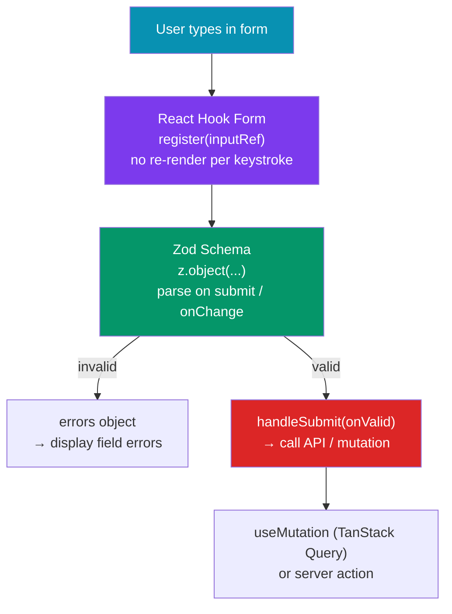

# 📝 React Forms

> [!abstract] TL;DR
> React forms split into **controlled** (React state owns every keystroke — `value` + `onChange` on every input) and **uncontrolled** (the DOM owns values — accessed via refs or `FormData` on submit). **React Hook Form** (RHF) uses uncontrolled inputs by default, registering refs instead of tracking every keystroke, which means zero re-renders per keypress. **Formik** is the older alternative — state-based, simpler API, but re-renders on every change. **Zod** is the schema-validation standard: parse-don't-validate, TypeScript-first, infer types from schemas. RHF + Zod + Shadcn/ui is the current industry stack.

## Intuition — analogy FIRST

**Controlled inputs** are like a live stenographer transcribing every word you say into a document. React knows *every character* in real time — which is powerful but expensive.

**Uncontrolled inputs** (React Hook Form) are like handing someone a blank form and only reading what they wrote when they hand it back. You only "check" the form when you need the values (on submit or on specific validation triggers) — cheaper for performance.

**Zod validation** is like a customs officer with a strict checklist: a package (form data) must match an exact schema. If it doesn't, you get a precise error message for each violation — not a vague "something went wrong."

---

## How It Works



---

## Key Concepts / Details

### Controlled vs Uncontrolled — Core Difference

```tsx
// CONTROLLED — React state drives every input value
function ControlledForm() {
  const [email, setEmail] = useState('');
  const [password, setPassword] = useState('');

  // Every keystroke triggers: setEmail → state update → re-render → new value prop
  return (
    <form onSubmit={e => { e.preventDefault(); console.log({ email, password }); }}>
      <input value={email}    onChange={e => setEmail(e.target.value)} />
      <input value={password} onChange={e => setPassword(e.target.value)} type="password" />
      <button type="submit">Login</button>
    </form>
  );
}

// UNCONTROLLED — DOM owns the value; read on submit
function UncontrolledForm() {
  const emailRef = useRef<HTMLInputElement>(null);

  return (
    <form onSubmit={e => {
      e.preventDefault();
      console.log(emailRef.current?.value);
    }}>
      <input ref={emailRef} defaultValue="" />  {/* defaultValue not value */}
      <button type="submit">Login</button>
    </form>
  );
}
```

### React Hook Form — The Industry Standard

```tsx
import { useForm, SubmitHandler } from 'react-hook-form';
import { zodResolver } from '@hookform/resolvers/zod';
import { z } from 'zod';

// 1. Define schema with Zod
const loginSchema = z.object({
  email: z.string().email('Must be a valid email'),
  password: z.string().min(8, 'Password must be at least 8 characters'),
  rememberMe: z.boolean().default(false),
});

// 2. Infer TypeScript type from schema (single source of truth)
type LoginFormValues = z.infer<typeof loginSchema>;

function LoginForm() {
  const {
    register,            // connect inputs to RHF
    handleSubmit,        // wraps onSubmit with validation
    formState: { errors, isSubmitting, isDirty, isValid },
    reset,               // reset to default values
    watch,               // watch specific field values
    setValue,            // programmatically set a field value
    setError,            // manually set an error (e.g. from API)
  } = useForm<LoginFormValues>({
    resolver: zodResolver(loginSchema),
    defaultValues: { email: '', password: '', rememberMe: false },
    mode: 'onBlur',      // validate on blur (options: onChange | onBlur | onSubmit | all)
  });

  const onSubmit: SubmitHandler<LoginFormValues> = async (data) => {
    try {
      await loginUser(data);
    } catch (error) {
      // Set server-side error on a specific field
      setError('email', { message: 'Email or password is incorrect' });
    }
  };

  return (
    <form onSubmit={handleSubmit(onSubmit)} noValidate>
      <div>
        <label htmlFor="email">Email</label>
        <input id="email" type="email" {...register('email')} />
        {errors.email && <p role="alert">{errors.email.message}</p>}
      </div>

      <div>
        <label htmlFor="password">Password</label>
        <input id="password" type="password" {...register('password')} />
        {errors.password && <p role="alert">{errors.password.message}</p>}
      </div>

      <label>
        <input type="checkbox" {...register('rememberMe')} />
        Remember me
      </label>

      <button type="submit" disabled={isSubmitting || !isValid}>
        {isSubmitting ? 'Logging in…' : 'Log in'}
      </button>
    </form>
  );
}
```

### RHF with Shadcn/ui (Controller pattern for custom inputs)

```tsx
import { useForm, Controller } from 'react-hook-form';
import { zodResolver } from '@hookform/resolvers/zod';
import { Form, FormControl, FormField, FormItem, FormLabel, FormMessage } from '@/components/ui/form';
import { Input } from '@/components/ui/input';
import { Select, SelectContent, SelectItem, SelectTrigger, SelectValue } from '@/components/ui/select';

const profileSchema = z.object({
  username: z.string().min(3).max(20),
  role: z.enum(['admin', 'editor', 'viewer']),
});

function ProfileForm() {
  const form = useForm<z.infer<typeof profileSchema>>({
    resolver: zodResolver(profileSchema),
    defaultValues: { username: '', role: 'viewer' },
  });

  return (
    <Form {...form}>
      <form onSubmit={form.handleSubmit(onSubmit)} className="space-y-4">
        {/* FormField wraps Controller — handles accessible label/error association */}
        <FormField
          control={form.control}
          name="username"
          render={({ field }) => (
            <FormItem>
              <FormLabel>Username</FormLabel>
              <FormControl>
                <Input placeholder="johndoe" {...field} />
              </FormControl>
              <FormMessage />  {/* auto-renders error.message */}
            </FormItem>
          )}
        />

        {/* Custom component that doesn't support native ref — use Controller */}
        <FormField
          control={form.control}
          name="role"
          render={({ field }) => (
            <FormItem>
              <FormLabel>Role</FormLabel>
              <Select onValueChange={field.onChange} defaultValue={field.value}>
                <FormControl>
                  <SelectTrigger><SelectValue /></SelectTrigger>
                </FormControl>
                <SelectContent>
                  <SelectItem value="admin">Admin</SelectItem>
                  <SelectItem value="editor">Editor</SelectItem>
                  <SelectItem value="viewer">Viewer</SelectItem>
                </SelectContent>
              </Select>
              <FormMessage />
            </FormItem>
          )}
        />
      </form>
    </Form>
  );
}
```

### Zod — Schema Validation Patterns

```tsx
import { z } from 'zod';

// Common field validators
const emailField = z.string().email('Invalid email format');
const passwordField = z.string()
  .min(8, 'At least 8 characters')
  .regex(/[A-Z]/, 'Must contain an uppercase letter')
  .regex(/[0-9]/, 'Must contain a number');

// Cross-field validation with refine
const signupSchema = z.object({
  email: emailField,
  password: passwordField,
  confirmPassword: z.string(),
}).refine(
  (data) => data.password === data.confirmPassword,
  { message: 'Passwords do not match', path: ['confirmPassword'] }
);

// Optional fields and transformations
const profileSchema = z.object({
  name: z.string().trim().min(1, 'Required'),
  age: z.coerce.number().int().min(18, 'Must be 18+').optional(),  // coerce: "25" → 25
  website: z.string().url().optional().or(z.literal('')),  // allow empty string
  tags: z.array(z.string()).max(5, 'Max 5 tags'),
});

// Discriminated unions — different fields based on a type discriminant
const notificationSchema = z.discriminatedUnion('type', [
  z.object({ type: z.literal('email'), emailAddress: z.string().email() }),
  z.object({ type: z.literal('sms'), phoneNumber: z.string().regex(/^\+[0-9]+$/) }),
]);
```

### Dynamic Fields with useFieldArray

```tsx
import { useFieldArray } from 'react-hook-form';

const formSchema = z.object({
  items: z.array(z.object({ name: z.string().min(1), quantity: z.coerce.number().positive() }))
    .min(1, 'Add at least one item'),
});

function OrderForm() {
  const { control, register, handleSubmit, formState: { errors } } = useForm<z.infer<typeof formSchema>>({
    resolver: zodResolver(formSchema),
    defaultValues: { items: [{ name: '', quantity: 1 }] },
  });

  const { fields, append, remove } = useFieldArray({ control, name: 'items' });

  return (
    <form onSubmit={handleSubmit(onSubmit)}>
      {fields.map((field, index) => (
        <div key={field.id}>  {/* IMPORTANT: use field.id, not index, as key */}
          <input {...register(`items.${index}.name`)} placeholder="Item name" />
          <input {...register(`items.${index}.quantity`)} type="number" />
          <button type="button" onClick={() => remove(index)}>Remove</button>
        </div>
      ))}
      <button type="button" onClick={() => append({ name: '', quantity: 1 })}>Add item</button>
      <button type="submit">Order</button>
    </form>
  );
}
```

---

## Trade-offs

| Library | Re-renders per keystroke | Validation | Bundle | DX |
|---------|------------------------|-----------|--------|-----|
| React Hook Form | Zero (uncontrolled) | Zod/Yup/built-in | ~10KB | Excellent |
| Formik | One per field change | Yup/Zod | ~15KB | Good |
| Native controlled | One per field | Manual | 0KB | Verbose |
| Server actions (Next.js) | N/A (server-side) | Zod on server | 0KB | Good |

---

## Real-World Notes

- **RHF + Zod + Shadcn Form components is the dominant stack.** It gives type-safe schemas, zero-rerender performance, and accessible UI with minimal boilerplate.
- **`z.infer<typeof schema>`** is the key pattern — define the schema once, get the TypeScript type for free. No duplication between schema and type.
- **`mode: 'onBlur'` vs `mode: 'onChange'`** — `onBlur` (default) validates when the user leaves a field, which is less intrusive. `onChange` validates on every keystroke — good for password strength meters.
- **Use `useFieldArray` for dynamic lists.** Always use `field.id` (RHF-generated stable UUID), never array `index`, as the `key` — React needs stable keys to preserve input state.
- **Set server errors with `setError`** — after a failed API call, map server validation errors to specific form fields using `setError('fieldName', { message })`.

---

## Common Pitfalls

- **Using `index` as `key` in `useFieldArray`** — when items are added/removed mid-list, React re-uses wrong input DOM nodes, causing values to appear in the wrong field.
- **Not using `noValidate` on `<form>`** — browser native validation fires before React's validation and shows inconsistent UI. Add `noValidate` to disable browser validation.
- **Forgetting `z.coerce.number()` for numeric inputs** — all HTML input values are strings. `z.number()` rejects `"25"`; `z.coerce.number()` converts it first.
- **Schema and TypeScript type out of sync** — defining a Zod schema and a separate TypeScript interface separately. Always use `z.infer<>` to derive the type from the schema.

---

## Related Concepts

- [[_MOC_React|↑ Section MOC]]
- [[Hooks_in_React]] — `useRef`, `useState`, `useEffect` underpin RHF's implementation
- [[React_Testing]] — Testing form submission, validation errors, and async submit states
- [[React_Data_Fetching]] — `useMutation` for submitting form data to the server

---

## Review Questions

1. What is the key performance difference between React Hook Form and Formik? Why does RHF have fewer re-renders?
2. What does `z.infer<typeof schema>` do and why does it eliminate duplication?
3. When should you use `Controller` vs `register()` in React Hook Form?
4. How do you handle cross-field validation in Zod (e.g., password confirmation)?
5. Why must `useFieldArray` use `field.id` as the `key` instead of the array index?

---

## Sources

- React Hook Form docs: https://react-hook-form.com
- Zod docs: https://zod.dev
- Shadcn Form component: https://ui.shadcn.com/docs/components/form
- RHF + Zod integration: https://react-hook-form.com/get-started#SchemaValidation

#web-development #react #forms #react-hook-form #zod #validation #formik
