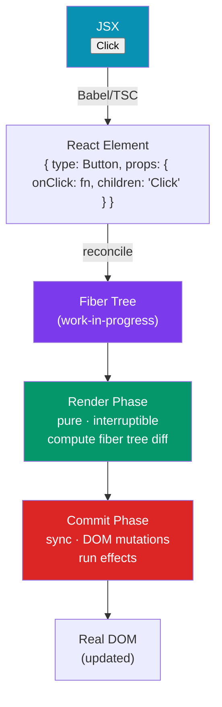

# ⚛️ React Fundamentals

> [!abstract] TL;DR
> React is a declarative UI library: you describe the target UI as a function of state, and React's Fiber reconciler figures out the minimal DOM mutations to reach it. JSX compiles to `React.createElement()` / `jsx()` calls that produce React elements (plain objects). The Fiber reconciler has two phases: **render** (compute what changed — pure, interruptible) and **commit** (apply to DOM — synchronous, with effects). `key` props are how React tracks list item identity across re-renders — wrong keys cause incorrect state re-use.

## Intuition — analogy FIRST

React is like giving a smart renovation contractor a floor plan (your JSX/state) and saying "make the house look like this." You don't specify which walls to move, which paint to reapply, or in what order — you just describe the target. The contractor (Fiber) figures out the minimal changes, executes them efficiently, and handles interruptions gracefully.

The virtual DOM is the contractor's blueprint: they compare the desired plan (your JSX output) against the current plan (previous render), spot the differences, and only apply those differences to the actual house (DOM). You never touch the house directly.

---

## How It Works



---

## Key Concepts / Details

### JSX — Syntactic Sugar

JSX compiles to function calls:

```jsx
// JSX source
const element = <Button variant="primary" onClick={handleClick}>Click me</Button>;

// Compiled (React 17+ automatic transform)
import { jsx as _jsx } from 'react/jsx-runtime';
const element = _jsx(Button, {
  variant: "primary",
  onClick: handleClick,
  children: "Click me"
});

// Before React 17 (classic transform):
// React.createElement(Button, { variant: "primary", onClick: handleClick }, "Click me")
```

```jsx
// JSX rules
// 1. Must have a single root element (or Fragment)
function Component() {
  return (
    <>  {/* React.Fragment — no DOM node rendered */}
      <h1>Title</h1>
      <p>Body</p>
    </>
  );
}

// 2. Closing tag required on void elements
<input type="text" />    // correct
 // correct

// 3. className instead of class
<div className="container">

// 4. JavaScript expressions in {}
<p style={{ color: 'red', fontSize: 16 }}>{ isLoading ? 'Loading...' : 'Done' }</p>

// 5. Event handlers as camelCase
<button onClick={handleClick} onKeyDown={handleKeyDown}>

// 6. Lists need keys (on outermost element of each item)
{items.map(item => <li key={item.id}>{item.name}</li>)}
```

### React Elements — Plain Objects

A React element is just a description — a plain object:

```javascript
const element = {
  type: 'button',
  props: {
    className: 'btn',
    onClick: handleClick,
    children: 'Click'
  },
  key: null,
  ref: null,
  // ... internal fields
};
```

React elements are cheap to create. The Fiber reconciler compares the new tree of elements to the previous one and computes the minimal mutations.

### The Fiber Reconciler — Two Phases

**Render Phase** (pure, interruptible, may run multiple times):
- React traverses the component tree, calling each component function
- Computes the new Fiber tree (the work-in-progress tree)
- Diffs it against the current tree (what's on screen)
- Marks fibers with effects (insert, update, delete)
- Can be interrupted by high-priority updates (concurrent mode)

**Commit Phase** (synchronous, cannot be interrupted, runs once):
- Applies all DOM mutations from the render phase
- Runs layout effects (`useLayoutEffect`) synchronously
- Paints the screen
- Runs passive effects (`useEffect`) after paint

```javascript
// StrictMode deliberately double-invokes render phase functions in dev
// to help find side effects in render
function Component() {
  // This body runs TWICE in development with StrictMode
  // (only once in production)
  console.log('render'); // logs twice in dev
  return <div />;
}
```

### `key` Props — List Reconciliation

`key` is how React identifies which list item is which across re-renders:

```jsx
// WRONG: index as key — breaks when list reorders or items are inserted/deleted
{items.map((item, i) => <ListItem key={i} item={item} />)}

// CORRECT: stable unique identifier
{items.map(item => <ListItem key={item.id} item={item} />)}

// Why it matters:
// - Same key = same component instance = state is preserved
// - Different key = new component instance = state is reset
// - Without key = React uses position (same as index)

// Trick: force re-mount a component to reset its state
<Editor key={documentId} /> // new documentId → new Editor instance, reset state
```

### Component Types

```jsx
// Function component (modern — always use these)
function Welcome({ name, onClose }) {
  return (
    <div>
      <h1>Hello, {name}</h1>
      <button onClick={onClose}>Close</button>
    </div>
  );
}

// Fragments — no DOM wrapper
function Table() {
  return (
    <>
      <tr>...</tr>
      <tr>...</tr>
    </>
  );
}

// Keyed fragments (needed when fragment is in a list)
{items.map(item => (
  <React.Fragment key={item.id}>
    <dt>{item.term}</dt>
    <dd>{item.definition}</dd>
  </React.Fragment>
))}
```

### Rendering and Re-rendering

A React component re-renders when:
1. Its **state** changes (`useState`, `useReducer`)
2. Its **props** change (parent re-renders with new props)
3. **Context** it reads changes
4. `forceUpdate()` is called (class components only)

```jsx
// React batches state updates (React 18+)
// Both updates are applied in ONE re-render
function handleClick() {
  setCount(c => c + 1);  // batched
  setName('Alice');       // batched
  // component re-renders ONCE, not twice
}

// React 18 batches even across async boundaries
async function fetchAndUpdate() {
  const data = await fetch('/api');
  setData(data);  // batched even in async callback (React 18)
  setLoading(false); // same batch
}
```

### Portals

Portals render children into a DOM node outside the component's DOM hierarchy — but React events still bubble through the React tree:

```jsx
import { createPortal } from 'react-dom';

function Modal({ children, onClose }) {
  return createPortal(
    <div className="modal-overlay" onClick={onClose}>
      <div className="modal" onClick={e => e.stopPropagation()}>
        {children}
      </div>
    </div>,
    document.getElementById('modal-root') // mount target
  );
}
```

### Error Boundaries

```jsx
// Must be a class component
class ErrorBoundary extends React.Component {
  state = { hasError: false, error: null };

  static getDerivedStateFromError(error) {
    return { hasError: true, error };
  }

  componentDidCatch(error, info) {
    logToService(error, info.componentStack);
  }

  render() {
    if (this.state.hasError) {
      return this.props.fallback ?? <h1>Something went wrong.</h1>;
    }
    return this.props.children;
  }
}

// Usage
<ErrorBoundary fallback={<ErrorScreen />}>
  <FeatureComponent />
</ErrorBoundary>
```

---

## Real-World Notes

- **React is a library, not a framework.** You bring your own router, state manager, data fetching, and form handling. This is the key difference from Angular.
- **The render phase is pure** — never write to the DOM, start timers, or fire network requests during render. That's what effects are for.
- **`key` resets component state** — deliberately use a new `key` to force a component to re-mount and start fresh (e.g., reset a form when the user selects a different item).
- **StrictMode double-renders help find bugs** — if your component breaks with double rendering, it has side effects in render that you need to move to effects.

---

## Common Pitfalls

- **`index` as a `key` for lists that can reorder, filter, or paginate** — React reuses the wrong component instance, causing visual glitches and incorrect state.
- **Modifying state directly** (`state.items.push(x)`) — React uses referential equality for change detection; mutating an array doesn't change its reference, so the component doesn't re-render.
- **Side effects in the render phase** — fetching data, setting timers, writing to the DOM inside the component function. These belong in `useEffect`.
- **Returning `undefined` from a component** — React components must return a React element, null, or an array. `undefined` causes a runtime error.

---

## Related Concepts

- [[_MOC_React|↑ Section MOC]]
- [[Hooks_in_React]] — The hooks that power state and side effects in function components
- [[TypeScript_with_React]] — Typing the component patterns shown here
- [[React_Performance]] — Understanding re-renders to optimize them

---

## Review Questions

1. What does JSX compile to? Write the `jsx()` call equivalent of `<Button variant="primary">Click</Button>`.
2. Explain the two phases of the Fiber reconciler. Which is interruptible?
3. Why does using `index` as a `key` cause bugs when list items are reordered?
4. Why does `StrictMode` double-invoke your component function in development?
5. What triggers a React component to re-render?

---

## Sources

- React docs: Describing the UI — https://react.dev/learn/describing-the-ui
- React docs: Rendering — https://react.dev/learn/render-and-commit
- Dan Abramov: React as a UI runtime — https://overreacted.io/react-as-a-ui-runtime/

#web-development #react #jsx #fiber #reconciliation
