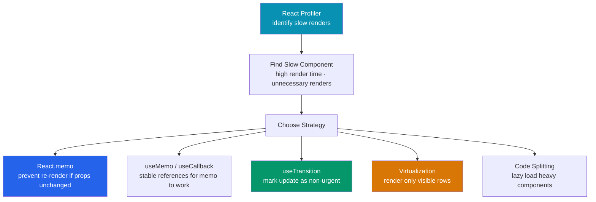

# ⚡ React Performance

> [!abstract] TL;DR
> React performance optimization is about reducing unnecessary work — unnecessary re-renders, unnecessary recalculations, and unnecessary DOM mutations. The workflow: **measure first** with React Profiler before optimizing. `React.memo` prevents re-renders when props haven't changed (requires stable prop references). `useMemo`/`useCallback` provide referential stability for memo to work. `useTransition` keeps input responsive during expensive updates. List virtualization (react-window) renders only visible rows. Track real user experience with Core Web Vitals (LCP, CLS, INP).

## Intuition — analogy FIRST

React performance is like optimizing a restaurant kitchen. The wrong approach is to buy the fastest stove before understanding what's slow. The right approach: watch the kitchen during peak service (profile), identify the actual bottleneck (is it chopping vegetables? plating? waiting for the oven?), then fix that specifically.

`React.memo` is a prep cook memo ("if the order is the same as last time, serve the cached result"). `useMemo`/`useCallback` is ensuring the memo gets the same note format each time (stable references). `useTransition` is separating urgent orders (customer's drink) from non-urgent ones (garnish prep) so the kitchen stays responsive.

---

## How It Works



---

## Key Concepts / Details

### React Profiler — Measure Before Optimizing

```jsx
import { Profiler } from 'react';

function onRender(id, phase, actualDuration, baseDuration, startTime, commitTime) {
  console.log({
    id,              // "UserList"
    phase,           // "mount" or "update"
    actualDuration,  // render time (ms) for this commit — key metric
    baseDuration,    // estimated cost if all children re-rendered
  });
}

<Profiler id="UserList" onRender={onRender}>
  <UserList users={users} />
</Profiler>
```

**React DevTools Profiler** (browser extension):
1. Record a session
2. Click "Flame graph" — each bar is a component render
3. Grey bars = didn't re-render; colored bars = did re-render
4. Click a bar to see why it re-rendered ("props changed: 'onClick'")

### `React.memo` — Skip Re-render

`React.memo` wraps a component and skips re-rendering if all props are shallowly equal (`Object.is`) to previous props:

```jsx
// Without memo: re-renders every time parent re-renders
function ListItem({ item, onDelete }) {
  return <li onClick={() => onDelete(item.id)}>{item.name}</li>;
}

// With memo: only re-renders when item or onDelete reference changes
const ListItem = React.memo(function ListItem({ item, onDelete }) {
  return <li onClick={() => onDelete(item.id)}>{item.name}</li>;
});

// Custom comparison (rare — avoid unless default comparison is too slow)
const ListItem = React.memo(ListItem, (prevProps, nextProps) => {
  return prevProps.item.id === nextProps.item.id; // true = skip re-render
});
```

**memo only works when props have stable references.** If a parent passes `onDelete={() => handleDelete(id)}` (new function every render), memo is bypassed:

```jsx
// Parent — WITHOUT stable references (memo is useless)
function UserList({ users }) {
  return users.map(u => (
    <ListItem
      key={u.id}
      item={u}
      onDelete={() => deleteUser(u.id)} // new function every render!
    />
  ));
}

// Parent — WITH stable references (memo works)
function UserList({ users }) {
  const handleDelete = useCallback((id) => deleteUser(id), []); // stable

  return users.map(u => (
    <ListItem key={u.id} item={u} onDelete={handleDelete} />
  ));
}
```

### `useMemo` — Expensive Computations

```jsx
// Only compute when dependencies actually change
function ProductStats({ products, category }) {
  // BAD: recomputes on every render
  const stats = computeStats(products, category); // 50ms

  // GOOD: recomputes only when products or category changes
  const stats = useMemo(
    () => computeStats(products, category),
    [products, category]
  );

  return <StatsDisplay stats={stats} />;
}

// When NOT to useMemo — it adds overhead for trivial computations
// BAD: wrapping a simple expression
const doubled = useMemo(() => count * 2, [count]); // unnecessary overhead
const doubled = count * 2; // just compute it directly
```

### `useCallback` — Stable Function References

```jsx
function SearchableList({ items }) {
  const [query, setQuery] = useState('');

  // Without useCallback: new fn every render → List re-renders even if items didn't change
  const filterItems = (items, query) => items.filter(...);

  // With useCallback: same reference across renders → List skips re-render
  const filteredItems = useMemo(
    () => items.filter(item => item.name.includes(query)),
    [items, query]
  );

  const handleSelect = useCallback((id) => {
    // ... handle selection
  }, []); // empty deps: function never changes

  return <List items={filteredItems} onSelect={handleSelect} />;
}
```

### `useTransition` — Responsive Inputs

```jsx
import { useState, useTransition, startTransition } from 'react';

function FilteredList({ items }) {
  const [query, setQuery] = useState('');
  const [filtered, setFiltered] = useState(items);
  const [isPending, startTransition] = useTransition();

  const handleInput = (e) => {
    const value = e.target.value;
    setQuery(value); // urgent — update input immediately

    startTransition(() => {
      // Non-urgent — filtering large list, can be interrupted by new keypresses
      setFiltered(items.filter(item => item.name.includes(value)));
    });
  };

  return (
    <>
      <input value={query} onChange={handleInput} />
      {isPending && <span style={{ opacity: 0.5 }}>Filtering...</span>}
      <ul style={{ opacity: isPending ? 0.7 : 1 }}>
        {filtered.map(item => <li key={item.id}>{item.name}</li>)}
      </ul>
    </>
  );
}
```

### List Virtualization — Only Render Visible Rows

For lists with 1000+ items, rendering all DOM nodes is slow:

```jsx
import { FixedSizeList } from 'react-window';

const Row = ({ index, style, data }) => (
  <div style={style}>
    {data[index].name}
  </div>
);

function VirtualList({ items }) {
  return (
    <FixedSizeList
      height={600}      // container height
      itemCount={items.length}
      itemSize={50}     // each row height
      itemData={items}
    >
      {Row}
    </FixedSizeList>
  );
}
// Only renders ~12 rows (600/50) regardless of items.length
```

### Lazy Loading — Code Splitting

```jsx
import { lazy, Suspense } from 'react';

// Lazy-load heavy components — only downloaded when rendered
const HeavyChart = lazy(() => import('./HeavyChart'));
const AdminPanel = lazy(() => import('./AdminPanel'));

function Dashboard() {
  const isAdmin = useAuth().role === 'admin';

  return (
    <div>
      <Suspense fallback={<Spinner />}>
        <HeavyChart data={chartData} />

        {isAdmin && (
          <Suspense fallback={<div>Loading admin panel...</div>}>
            <AdminPanel />
          </Suspense>
        )}
      </Suspense>
    </div>
  );
}
```

### Core Web Vitals — Real User Metrics

| Metric | What | Target | React impact |
|--------|------|--------|-------------|
| **LCP** (Largest Contentful Paint) | Time to render largest visible element | < 2.5s | SSR, priority images, code splitting |
| **CLS** (Cumulative Layout Shift) | Unexpected layout shifts | < 0.1 | Reserve space for images, avoid dynamic content insertion |
| **INP** (Interaction to Next Paint) | Time from input to visual response | < 200ms | `useTransition`, avoid long renders, virtualize lists |

```jsx
// Measure INP with PerformanceObserver
const observer = new PerformanceObserver(list => {
  for (const entry of list.getEntries()) {
    if (entry.interactionId) {
      console.log('INP:', entry.duration);
    }
  }
});
observer.observe({ type: 'event', buffered: true });

// Or use web-vitals library
import { onINP, onLCP, onCLS } from 'web-vitals';
onINP(metric => sendToAnalytics(metric));
```

---

## Real-World Notes

- **Profile before optimizing.** Most re-renders are cheap — React is designed for frequent re-renders. The React Profiler shows which renders are actually expensive.
- **The real cost of `useMemo`/`useCallback`** is not zero. Each hook has overhead (dependency comparison, closure allocation). Memoize when you have a measured problem, not pre-emptively.
- **`useTransition` is primarily for UI responsiveness**, not raw throughput. It doesn't make the computation faster — it makes the input feel faster by deferring the expensive update.
- **Virtualization is a last resort** for lists. Before virtualizing, check if you can paginate, filter, or reduce the list size at the data source.

---

## Common Pitfalls

- **Wrapping everything in `React.memo`** — adds memory and comparison overhead without measured benefit. Profile first.
- **`useMemo` returning the same reference via mutation** — `useMemo(() => { arr.push(x); return arr; }, [arr])` — mutating `arr` while pretending it's the same reference. Always return a new value.
- **Forgetting `memo` on a component while using `useCallback` in its parent** — `useCallback` gives you a stable function, but if the child isn't wrapped in `memo`, it re-renders anyway.
- **`startTransition` for urgent UI updates** — if you mark a text input update as a transition, the input feels laggy. Only use it for expensive background updates.

---

## Related Concepts

- [[_MOC_React|↑ Section MOC]]
- [[Hooks_in_React]] — `useMemo`, `useCallback`, `useTransition` are hooks
- [[React_Fundamentals]] — Understanding re-renders is prerequisite to optimizing them
- [[Next_js]] — SSR/SSG improve Web Vitals at the framework level

---

## Review Questions

1. How do you use React Profiler to find which components are re-rendering unnecessarily?
2. Why does `React.memo` fail to prevent re-renders when a parent passes `onClick={() => handleClick(id)}`? What's the fix?
3. Explain when `useMemo` adds overhead instead of saving it. Give a concrete example.
4. What is the difference between `useTransition` and `useDeferredValue`? When do you use each?
5. Why is list virtualization (react-window) necessary for large lists, and how does it work?

---

## Sources

- React docs: Performance — https://react.dev/reference/react/useMemo#skipping-expensive-recalculations
- React DevTools Profiler — https://react.dev/learn/react-developer-tools
- web-vitals library — https://github.com/GoogleChrome/web-vitals
- web.dev: INP — https://web.dev/articles/inp

#web-development #react #performance #memo #profiler #web-vitals
