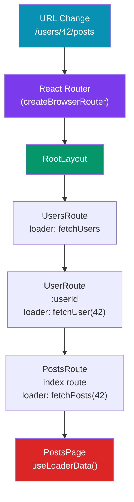

# 🛣️ React Router

> [!abstract] TL;DR
> React Router v6+ uses a nested, declarative route tree where `<Outlet />` renders child routes into parent layouts. Routes can declare `loader` (async data before render) and `action` (form mutations) functions — the Data API that blurs into full-stack patterns. TanStack Router is the type-safe alternative with search-param schemas and first-class TS inference. File-based routing (Remix, TanStack Router, Next.js) generates route configs from the filesystem, trading explicit config for convention.

## Intuition — analogy FIRST

A router is like a post office sorting machine — every incoming URL (parcel) passes through nested sorting rules (route segments) until it lands in the right delivery box (component). Each sorting stage can add context (layout, data) before passing the parcel deeper. `<Outlet />` is literally the hole in each box where the next-level sorter slots in a smaller box.

The Data API (loaders/actions) makes the router the "prefetch co-ordinator": before a page component even mounts, the router has already fetched its data — like a waiter who brings food to the table while you're still reading the menu, not after you close it.

---

## How It Works



---

## Key Concepts / Details

### React Router v6 — Core API

```tsx
import { createBrowserRouter, RouterProvider, Outlet, Link, NavLink } from 'react-router-dom';

// Route tree — nested by object structure
const router = createBrowserRouter([
  {
    path: '/',
    element: <RootLayout />,     // always rendered
    errorElement: <ErrorPage />, // catches errors in subtree
    children: [
      { index: true, element: <HomePage /> },        // matches "/"
      {
        path: 'users',
        element: <UsersLayout />,
        loader: usersLoader,                          // runs before render
        children: [
          { index: true, element: <UsersList /> },   // "/users"
          {
            path: ':userId',
            element: <UserDetail />,
            loader: userLoader,                       // receives { params }
            action: userAction,                       // handles form POST
          },
        ],
      },
      { path: '*', element: <NotFound /> },           // catch-all
    ],
  },
]);

// App entry
function App() {
  return <RouterProvider router={router} />;
}

// Layout component — Outlet renders active child route
function RootLayout() {
  return (
    <div>
      <nav>
        <NavLink to="/" end className={({ isActive }) => isActive ? 'active' : ''}>Home</NavLink>
        <NavLink to="/users">Users</NavLink>
      </nav>
      <main>
        <Outlet />  {/* child route renders here */}
      </main>
    </div>
  );
}
```

### Loaders — Data Before Render

```tsx
// Loader runs BEFORE the component renders — parallel to sibling loaders
export async function userLoader({ params }: LoaderFunctionArgs) {
  const user = await fetchUser(params.userId!);
  if (!user) throw new Response('Not Found', { status: 404 });
  return user; // any serializable value
}

// Component reads loader data — always defined, type-safe with v6.4+
import { useLoaderData } from 'react-router-dom';

function UserDetail() {
  const user = useLoaderData() as User;  // or use typedLoaderData in v7
  return <h1>{user.name}</h1>;
}

// React Router fetches all loaders for a URL in PARALLEL before rendering
// This eliminates request waterfalls (fetch-on-render → render → child fetch)
```

### Actions — Form Mutations

```tsx
// Action handles form submissions (method="post"/"put"/"delete")
export async function userAction({ request, params }: ActionFunctionArgs) {
  const formData = await request.formData();
  const name = formData.get('name') as string;
  await updateUser(params.userId!, { name });
  return redirect('/users'); // or return validation errors
}

// Form component — <Form> replaces <form> and submits to the route action
import { Form, useActionData, useNavigation } from 'react-router-dom';

function EditUser() {
  const errors = useActionData() as Record<string, string> | undefined;
  const navigation = useNavigation();
  const isSubmitting = navigation.state === 'submitting';

  return (
    <Form method="post">
      <input name="name" />
      {errors?.name && <p className="error">{errors.name}</p>}
      <button disabled={isSubmitting}>
        {isSubmitting ? 'Saving…' : 'Save'}
      </button>
    </Form>
  );
}
```

### Programmatic Navigation

```tsx
import { useNavigate, useParams, useSearchParams, useLocation } from 'react-router-dom';

function SearchPage() {
  const navigate = useNavigate();
  const { userId } = useParams();           // route params: /users/:userId
  const [searchParams, setSearchParams] = useSearchParams(); // ?q=react&page=2
  const location = useLocation();           // { pathname, search, hash, state }

  function handleSearch(query: string) {
    setSearchParams({ q: query, page: '1' });
  }

  function goBack() {
    navigate(-1);                           // browser back
  }

  function goToUser(id: string) {
    navigate(`/users/${id}`, { state: { from: location.pathname } });
  }
}
```

### TanStack Router — Type-Safe Alternative

```tsx
import { createRootRoute, createRoute, createRouter, Link } from '@tanstack/react-router';
import { z } from 'zod';

// Root route
const rootRoute = createRootRoute({
  component: () => <div><Outlet /></div>,
});

// Search param schema — fully typed
const usersSearchSchema = z.object({
  page: z.number().default(1),
  q: z.string().optional(),
});

const usersRoute = createRoute({
  getParentRoute: () => rootRoute,
  path: '/users',
  validateSearch: usersSearchSchema,           // typed search params
  loader: () => fetchUsers(),
  component: function UsersPage() {
    const { page, q } = usersRoute.useSearch(); // fully typed, no casting!
    const users = usersRoute.useLoaderData();   // typed return from loader
    return <ul>{users.map(u => <li key={u.id}>{u.name}</li>)}</ul>;
  },
});

const router = createRouter({ routeTree: rootRoute.addChildren([usersRoute]) });

// Typed Link — compile error if path doesn't exist
<Link to="/users" search={{ page: 1 }}>Users</Link>
```

### File-Based Routing Convention

```
// Remix / TanStack Router / Next.js file-based routing
app/routes/
├── _root.tsx            // root layout (always rendered)
├── _index.tsx           // "/"  (index route)
├── users/
│   ├── _layout.tsx      // "/users" layout with <Outlet />
│   ├── index.tsx        // "/users" index
│   └── $userId.tsx      // "/users/:userId" (dynamic segment)
│       └── posts.tsx    // "/users/:userId/posts"
├── about.tsx            // "/about"
└── $.tsx                // splat/catch-all

// TanStack Router file conventions:
// __root.tsx        → root route
// index.tsx         → index route
// about.tsx         → /about
// users.$userId.tsx → /users/:userId (flat file names instead of folders)
```

---

## Trade-offs

| | React Router v6 | TanStack Router | Next.js App Router |
|---|---|---|---|
| Type safety | Manual casting | Full inference | File-based + typed |
| Data loading | Loaders/actions | Loaders | Server Components |
| Search params | String-based | Zod-validated | `useSearchParams` |
| Bundle size | ~50KB | ~45KB | Built-in |
| Learning curve | Moderate | Moderate | Moderate |
| SSR support | With Remix | Limited | First-class |
| Best for | SPAs, Remix apps | Type-safe SPAs | Full-stack Next apps |

---

## Real-World Notes

- **Use loaders to eliminate request waterfalls.** Fetch-on-render (data fetching inside `useEffect`) causes cascading waterfalls. Loaders fetch data in parallel before rendering.
- **`<NavLink>` over `<Link>` for navigation.** `NavLink` gives you `isActive`/`isPending` state for free — no manual `location.pathname` comparison.
- **Protect routes with `loader` redirects, not component guards.** Throwing a `redirect()` in a loader is cleaner than wrapping every protected component in a `<PrivateRoute>`.
- **TanStack Router is the best choice for TypeScript-heavy SPAs** where search-param type safety matters. React Router's ecosystem is larger.

---

## Common Pitfalls

- **Forgetting `<Outlet />` in a layout route** — parent renders but children never appear; the outlet is the plug socket where child routes connect.
- **Using `useEffect` for data fetching instead of loaders** — misses parallel prefetching; the component blanks, then shows a spinner, then data appears (three renders instead of one).
- **Not handling `errorElement`** — unhandled loader errors bubble up to the root and crash the whole app. Add `errorElement` to every major route branch.
- **Relative links in nested routes** — `<Link to="posts">` is relative to the current route; `<Link to="/users/42/posts">` is absolute. Confusion causes broken navigation.

---

## Related Concepts

- [[_MOC_React|↑ Section MOC]]
- [[React_Fundamentals]] — Component model and rendering that routing builds on
- [[Next_js]] — File-based routing built-in with App Router
- [[React_Data_Fetching]] — How loaders interact with server state libraries

---

## Review Questions

1. What is `<Outlet />` and why is it required in layout routes?
2. How do React Router `loader` functions eliminate request waterfalls vs `useEffect` data fetching?
3. What is the difference between a route `loader` (GET) and a route `action` (POST/mutation)?
4. Why does TanStack Router offer better TypeScript DX than React Router v6 for search params?
5. What happens when a `loader` throws a `Response` with status 404?

---

## Sources

- React Router docs: https://reactrouter.com/en/main
- TanStack Router docs: https://tanstack.com/router
- Remix Data Loading: https://remix.run/docs/en/main/guides/data-loading

#web-development #react #routing #react-router #tanstack-router
