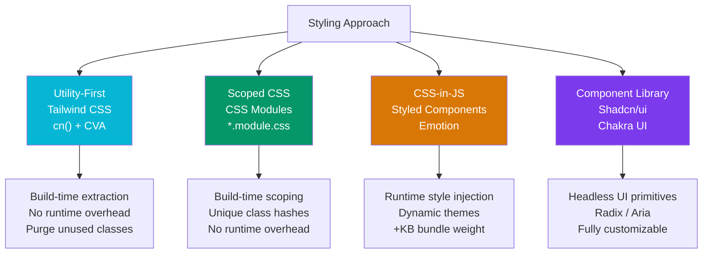

# 🎨 React Styling

> [!abstract] TL;DR
> React styling has four dominant paradigms: **utility-first CSS** (Tailwind — apply classes in JSX, no custom CSS), **CSS Modules** (scoped class names, plain CSS), **CSS-in-JS** (Styled Components / Emotion — styles as JS, runtime injection), and **component libraries** (Shadcn/ui, Chakra UI — pre-built accessible components). `class-variance-authority` (CVA) is the modern pattern for authoring variant-based component APIs on top of Tailwind. The trend is toward **zero-runtime CSS** (Tailwind, CSS Modules, vanilla-extract) away from runtime CSS-in-JS, which adds bundle weight and hydration cost.

## Intuition — analogy FIRST

CSS styling approaches are like different workshop philosophies:

- **Tailwind** — a giant box of pre-cut standard parts. You assemble components from the parts directly, no custom machining. Highly predictable, but your JSX gets verbose.
- **CSS Modules** — your own workshop with named drawers (class names) that only you can access. No naming collisions with other workshops.
- **Styled Components** — custom-ordered parts with the design spec built into the part itself. The part knows its own appearance.
- **Shadcn/ui** — buying prefabricated furniture that you can open up and modify. It ships as source code into your project.

---

## How It Works



---

## Key Concepts / Details

### Tailwind CSS — Utility-First

```tsx
// Raw Tailwind — compose utility classes directly
function Button({ children, variant = 'primary', size = 'md' }) {
  return (
    <button
      className="
        inline-flex items-center justify-center rounded-md font-medium
        transition-colors focus-visible:outline-none focus-visible:ring-2
        disabled:pointer-events-none disabled:opacity-50
        bg-blue-600 text-white hover:bg-blue-700
        px-4 py-2 text-sm
      "
    >
      {children}
    </button>
  );
}

// cn() helper — merges Tailwind classes, resolves conflicts
// from 'clsx' + 'tailwind-merge'
import { clsx, type ClassValue } from 'clsx';
import { twMerge } from 'tailwind-merge';

function cn(...inputs: ClassValue[]) {
  return twMerge(clsx(inputs));
}

// cn() resolves conflicting classes: last one wins
cn('px-4 px-6')              // → 'px-6'
cn('bg-red-500', 'bg-blue-500') // → 'bg-blue-500'

// Dynamic conditional classes
function Alert({ type }: { type: 'success' | 'error' | 'warning' }) {
  return (
    <div className={cn(
      'rounded-lg border p-4',
      type === 'success' && 'border-green-200 bg-green-50 text-green-800',
      type === 'error'   && 'border-red-200 bg-red-50 text-red-800',
      type === 'warning' && 'border-yellow-200 bg-yellow-50 text-yellow-800',
    )}>
      {/* ... */}
    </div>
  );
}
```

### Class Variance Authority (CVA) — Variant APIs

```tsx
import { cva, type VariantProps } from 'class-variance-authority';
import { cn } from '@/lib/utils';

// Define a component's variant API declaratively
const buttonVariants = cva(
  // Base classes (always applied)
  'inline-flex items-center justify-center rounded-md font-medium transition-colors focus-visible:outline-none focus-visible:ring-2 disabled:pointer-events-none disabled:opacity-50',
  {
    variants: {
      variant: {
        default:     'bg-blue-600 text-white hover:bg-blue-700',
        destructive: 'bg-red-600 text-white hover:bg-red-700',
        outline:     'border border-gray-300 bg-white hover:bg-gray-50',
        ghost:       'hover:bg-gray-100',
        link:        'text-blue-600 underline-offset-4 hover:underline',
      },
      size: {
        sm:   'h-8 px-3 text-xs',
        md:   'h-10 px-4 text-sm',
        lg:   'h-12 px-6 text-base',
        icon: 'h-10 w-10',
      },
    },
    defaultVariants: {
      variant: 'default',
      size: 'md',
    },
  }
);

// TypeScript types are inferred from the variant config
interface ButtonProps
  extends React.ButtonHTMLAttributes<HTMLButtonElement>,
    VariantProps<typeof buttonVariants> {
  asChild?: boolean;
}

const Button = React.forwardRef<HTMLButtonElement, ButtonProps>(
  ({ className, variant, size, ...props }, ref) => (
    <button
      ref={ref}
      className={cn(buttonVariants({ variant, size }), className)}
      {...props}
    />
  )
);

// Usage — fully typed, autocomplete on variant values
<Button variant="destructive" size="sm">Delete</Button>
<Button variant="outline">Cancel</Button>
```

### CSS Modules — Scoped Local Classes

```tsx
// Button.module.css
.button {
  display: inline-flex;
  align-items: center;
  border-radius: 0.375rem;
  font-weight: 500;
  transition: background-color 150ms;
}

.primary   { background: #2563eb; color: #fff; }
.secondary { background: #f3f4f6; color: #111; }
.sm { padding: 0.375rem 0.75rem; font-size: 0.875rem; }
.md { padding: 0.5rem 1rem; font-size: 1rem; }

// Button.tsx — class names are locally scoped (hashed at build time)
import styles from './Button.module.css';
import clsx from 'clsx';

interface ButtonProps {
  variant?: 'primary' | 'secondary';
  size?: 'sm' | 'md';
}

function Button({ variant = 'primary', size = 'md', children }: ButtonProps) {
  return (
    <button className={clsx(styles.button, styles[variant], styles[size])}>
      {children}
    </button>
  );
}

// Output class name: "Button_button__xK3mQ Button_primary__9cLp2"
// — unique hash prevents collisions across the entire app
```

### Styled Components — CSS-in-JS

```tsx
import styled, { css, ThemeProvider } from 'styled-components';

// Styled component — creates a real React component
const Button = styled.button<{ $variant?: 'primary' | 'secondary' }>`
  display: inline-flex;
  align-items: center;
  border-radius: 0.375rem;
  font-weight: 500;
  padding: 0.5rem 1rem;
  cursor: pointer;
  transition: background 150ms;

  /* Dynamic styles based on props — $ prefix avoids DOM forwarding */
  ${({ $variant }) =>
    $variant === 'secondary'
      ? css`background: #f3f4f6; color: #111;`
      : css`background: #2563eb; color: #fff;`}

  &:hover {
    opacity: 0.9;
  }
`;

// Global theme with TypeScript
const theme = {
  colors: { primary: '#2563eb', danger: '#dc2626' },
  radii: { sm: '0.25rem', md: '0.375rem' },
};

function App() {
  return (
    <ThemeProvider theme={theme}>
      <Button $variant="primary">Submit</Button>
      <Button $variant="secondary">Cancel</Button>
    </ThemeProvider>
  );
}
```

### Shadcn/ui — Copy-Paste Component Library

```bash
# Initialize Shadcn in a Next.js / Vite project
npx shadcn@latest init

# Add individual components — they are COPIED into your project source
npx shadcn@latest add button
npx shadcn@latest add dialog
npx shadcn@latest add form
```

```tsx
// After adding — source lives in your repo at src/components/ui/button.tsx
// You OWN the code; customize it freely

import { Button } from '@/components/ui/button';
import { Dialog, DialogContent, DialogHeader, DialogTitle } from '@/components/ui/dialog';

function ConfirmDialog({ open, onOpenChange }: { open: boolean; onOpenChange: (o: boolean) => void }) {
  return (
    <Dialog open={open} onOpenChange={onOpenChange}>
      <DialogContent>
        <DialogHeader>
          <DialogTitle>Are you sure?</DialogTitle>
        </DialogHeader>
        <div className="flex gap-2 justify-end">
          <Button variant="outline" onClick={() => onOpenChange(false)}>Cancel</Button>
          <Button variant="destructive">Delete</Button>
        </div>
      </DialogContent>
    </Dialog>
  );
}
```

---

## Trade-offs

| Approach | Runtime Cost | DX | Bundle | Theming | Best For |
|----------|-------------|-----|--------|---------|---------|
| Tailwind + CVA | Zero | Excellent | ~10KB (purged) | CSS vars | Most new projects |
| CSS Modules | Zero | Good | 0 extra | CSS vars | Teams with CSS expertise |
| Styled Components | High (JS + CSS) | Good | +28KB | ThemeProvider | Dynamic themes |
| Emotion | Medium | Good | +15KB | ThemeProvider | CSS-in-JS with less overhead |
| Shadcn/ui | Zero (Tailwind) | Excellent | Per component | CSS vars | Rapid UI development |
| Chakra UI | Medium | Excellent | +60KB | ChakraProvider | Design-system-heavy apps |

---

## Real-World Notes

- **Tailwind + Shadcn/ui is the dominant stack in 2024–2026** for React apps. Shadcn gives you well-built accessible primitives (powered by Radix UI) you can customize.
- **CSS Modules remain an excellent choice** for teams that prefer writing real CSS. Vite and Next.js support them out of the box with zero config.
- **Avoid runtime CSS-in-JS for SSR/RSC apps.** Styled Components and Emotion inject styles at runtime, which conflicts with React Server Components and causes hydration mismatches.
- **CVA is the right way to build variant component APIs.** It generates a type-safe function that maps variant names to class strings, making prop types self-documenting.

---

## Common Pitfalls

- **`twMerge` missing** — using just `clsx` won't resolve conflicting Tailwind classes (e.g., `px-4 px-6` stays as-is); always compose `clsx` + `twMerge` into a `cn()` helper.
- **CSS Modules: importing without `.module.css` extension** — `import styles from './Button.css'` gives a plain string, not a scoped object. The `.module.` extension is what triggers scoping.
- **Styled Components: forgetting `$` prefix on transient props** — `<Button variant="primary">` forwards `variant` to the DOM, causing an unknown-prop warning. Use `$variant` to mark it as styled-component-only.
- **Tailwind class purging removing dynamic classes** — building class names by string concatenation (`'bg-' + color`) prevents purge from detecting the class. Always use complete class names.

---

## Related Concepts

- [[_MOC_React|↑ Section MOC]]
- [[React_Fundamentals]] — Component model that styles attach to
- [[React_Advanced_Patterns]] — `forwardRef`, compound components — patterns used in UI libraries
- [[CSS_Variables_Custom_Properties]] — The theming mechanism under both Tailwind and Shadcn

---

## Review Questions

1. What does `twMerge` do that `clsx` alone cannot? Give an example where only `twMerge` produces the correct output.
2. How does CSS Modules prevent class name collisions across a large project?
3. Why is runtime CSS-in-JS (Styled Components) problematic in React Server Components?
4. What is CVA and why is it preferred over writing variant logic as if/else conditionals?
5. How does Shadcn/ui differ from a traditional component library like Material UI?

---

## Sources

- Tailwind CSS docs: https://tailwindcss.com
- CVA docs: https://cva.style
- Shadcn/ui docs: https://ui.shadcn.com
- Radix UI (primitives under Shadcn): https://www.radix-ui.com

#web-development #react #styling #tailwind #css-modules #shadcn #cva
