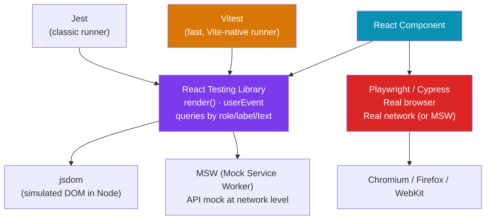

# 🧪 React Testing

> [!abstract] TL;DR
> React testing has three layers: **unit/component tests** (React Testing Library + Jest or Vitest — render a component in jsdom, interact via user-event, assert on accessible queries), **integration tests** (same tools, but testing multiple components + mocked APIs), and **end-to-end tests** (Playwright or Cypress — real browser, real network or MSW intercepts). The guiding principle from RTL's author: *"The more your tests resemble the way your software is used, the more confidence they give you."* Test what users see (text, roles, labels) — not implementation details (state, internals).

## Intuition — analogy FIRST

Testing layers are like quality checks in a car factory:

- **Unit/component tests (RTL + Vitest)** — testing individual parts on the workbench. Does the brake caliper compress correctly in isolation?
- **Integration tests** — assembling subsystems (brakes + wheels + suspension) and testing them together on a test rig. Do they work as a system?
- **E2E tests (Playwright)** — putting the complete car on a test track and driving it. Does the whole vehicle behave correctly from the driver's seat?

React Testing Library's philosophy: test from the *driver's perspective* (what the user sees and interacts with), not by reaching into the engine bay (component internals). The driver doesn't care if state is in `useState` or Zustand — they care if pressing the brake pedal stops the car.

---

## How It Works



---

## Key Concepts / Details

### Setup — Vitest + React Testing Library

```bash
# Vite project setup
npm install -D vitest @vitest/ui jsdom
npm install -D @testing-library/react @testing-library/user-event @testing-library/jest-dom
```

```ts
// vitest.config.ts
import { defineConfig } from 'vitest/config';
import react from '@vitejs/plugin-react';

export default defineConfig({
  plugins: [react()],
  test: {
    environment: 'jsdom',
    globals: true,             // describe/it/expect without import
    setupFiles: ['./src/test-setup.ts'],
  },
});

// src/test-setup.ts
import '@testing-library/jest-dom';  // extends expect with .toBeInTheDocument(), etc.
```

### Core RTL Queries — Find Elements the Accessible Way

```tsx
import { render, screen } from '@testing-library/react';
import userEvent from '@testing-library/user-event';
import { Button } from './Button';

// Query priority (highest confidence → lowest):
// getByRole       — ARIA role (button, heading, textbox, checkbox) — PREFER THIS
// getByLabelText  — form labels
// getByPlaceholderText — input placeholder
// getByText       — visible text
// getByAltText    — image alt
// getByDisplayValue — selected option
// getByTestId     — data-testid (last resort — not user-visible)

test('button calls onClick when clicked', async () => {
  const user = userEvent.setup();  // creates a user instance (preferred over fireEvent)
  const handleClick = vi.fn();

  render(<Button onClick={handleClick}>Submit</Button>);

  const button = screen.getByRole('button', { name: /submit/i });
  expect(button).toBeInTheDocument();
  expect(button).toBeEnabled();

  await user.click(button);

  expect(handleClick).toHaveBeenCalledTimes(1);
});
```

### Testing Component State and Async Behavior

```tsx
import { render, screen, waitFor } from '@testing-library/react';
import userEvent from '@testing-library/user-event';
import { LoginForm } from './LoginForm';

test('shows error message on failed login', async () => {
  const user = userEvent.setup();

  // Mock the API call
  global.fetch = vi.fn().mockResolvedValueOnce({
    ok: false,
    json: () => Promise.resolve({ message: 'Invalid credentials' }),
  });

  render(<LoginForm />);

  await user.type(screen.getByLabelText(/email/i), 'bad@test.com');
  await user.type(screen.getByLabelText(/password/i), 'wrong');
  await user.click(screen.getByRole('button', { name: /sign in/i }));

  // Wait for async state update
  await waitFor(() => {
    expect(screen.getByRole('alert')).toHaveTextContent('Invalid credentials');
  });
});

// Testing loading states
test('shows skeleton while loading', async () => {
  // Don't resolve the promise immediately
  let resolveUser: (v: User) => void;
  global.fetch = vi.fn().mockReturnValueOnce(
    new Promise(res => { resolveUser = () => res({ ok: true, json: () => Promise.resolve({ name: 'Alice' }) }); })
  );

  render(<UserProfile userId="1" />);
  expect(screen.getByTestId('skeleton')).toBeInTheDocument();

  resolveUser!({ name: 'Alice', id: '1' });
  await screen.findByText('Alice');  // findBy* = getBy* + waitFor
});
```

### Mocking APIs with MSW (Mock Service Worker)

```tsx
// src/mocks/handlers.ts
import { http, HttpResponse } from 'msw';

export const handlers = [
  http.get('/api/users/:id', ({ params }) => {
    return HttpResponse.json({ id: params.id, name: 'Alice', email: 'alice@example.com' });
  }),

  http.post('/api/login', async ({ request }) => {
    const { email } = await request.json();
    if (email === 'bad@example.com') {
      return HttpResponse.json({ message: 'Invalid credentials' }, { status: 401 });
    }
    return HttpResponse.json({ token: 'fake-jwt' });
  }),
];

// src/mocks/server.ts
import { setupServer } from 'msw/node';
import { handlers } from './handlers';
export const server = setupServer(...handlers);

// src/test-setup.ts
import { server } from './mocks/server';
beforeAll(() => server.listen());
afterEach(() => server.resetHandlers());
afterAll(() => server.close());

// In a test — override handler for a specific test
import { http, HttpResponse } from 'msw';
test('handles server error', async () => {
  server.use(
    http.get('/api/users/1', () => HttpResponse.json({ message: 'Error' }, { status: 500 }))
  );
  // ... render and assert error state
});
```

### Testing with TanStack Query

```tsx
import { QueryClient, QueryClientProvider } from '@tanstack/react-query';
import { render } from '@testing-library/react';

// Helper wrapper for QueryClient in tests
function createWrapper() {
  const queryClient = new QueryClient({
    defaultOptions: { queries: { retry: false } }, // disable retries in tests
  });
  return ({ children }: { children: React.ReactNode }) => (
    <QueryClientProvider client={queryClient}>{children}</QueryClientProvider>
  );
}

test('UserProfile fetches and displays user data', async () => {
  // MSW intercepts the fetch call
  render(<UserProfile userId="1" />, { wrapper: createWrapper() });
  await screen.findByText('Alice');  // wait for data to load
  expect(screen.getByText('alice@example.com')).toBeInTheDocument();
});
```

### Playwright — End-to-End Testing

```ts
// playwright.config.ts
import { defineConfig } from '@playwright/test';

export default defineConfig({
  testDir: './e2e',
  baseURL: 'http://localhost:5173',
  use: {
    trace: 'on-first-retry',
    screenshot: 'only-on-failure',
  },
  webServer: {
    command: 'npm run dev',
    port: 5173,
    reuseExistingServer: !process.env.CI,
  },
});

// e2e/auth.spec.ts
import { test, expect } from '@playwright/test';

test('user can log in', async ({ page }) => {
  await page.goto('/login');

  await page.getByLabel('Email').fill('alice@example.com');
  await page.getByLabel('Password').fill('secret123');
  await page.getByRole('button', { name: 'Sign in' }).click();

  await expect(page).toHaveURL('/dashboard');
  await expect(page.getByRole('heading', { name: 'Dashboard' })).toBeVisible();
});

test('shows error on invalid credentials', async ({ page }) => {
  await page.goto('/login');
  await page.getByLabel('Email').fill('wrong@example.com');
  await page.getByLabel('Password').fill('wrongpassword');
  await page.getByRole('button', { name: 'Sign in' }).click();

  await expect(page.getByRole('alert')).toContainText('Invalid credentials');
});
```

---

## Trade-offs

| Tool | Speed | Confidence | Setup Cost | Best For |
|------|-------|-----------|-----------|---------|
| Vitest + RTL | Fast (Node) | High | Low | Component behavior |
| Jest + RTL | Moderate (Node) | High | Low | Component behavior (legacy) |
| Playwright | Slow (browser) | Very High | Medium | Critical user flows |
| Cypress | Slow (browser) | Very High | Low | E2E with great DX |
| MSW | N/A | N/A | Low | API mocking in any layer |

---

## Real-World Notes

- **Prefer `getByRole` queries.** They test accessibility automatically — if you can't find by role, your component may not be accessible to screen readers.
- **`userEvent` over `fireEvent`.** `userEvent.click()` simulates real browser events (focus, pointerdown, mousedown, click, etc.); `fireEvent.click()` fires only the click event — misses handlers that attach to pointer events.
- **MSW is the best API mocking strategy.** Mocking `fetch` globally is brittle; MSW intercepts at the service worker/node level and works identically in tests and browser development.
- **Keep E2E tests focused on critical paths.** Login, checkout, key user journeys — not every button. E2E tests are slow and brittle; unit/integration tests cover the long tail.
- **Test files co-located with source.** `Button.tsx` + `Button.test.tsx` in the same folder — easier to find and less likely to drift out of sync.

---

## Common Pitfalls

- **Testing implementation details** — asserting on `component.state.count` or React internals couples tests to code structure. Refactoring breaks tests even if behavior is correct.
- **`act()` warnings** — async state updates outside `waitFor`/`findBy*` cause warnings. Always await state updates: `await waitFor(() => expect(...))` or `await screen.findByText(...)`.
- **Forgetting `retry: false` in QueryClient for tests** — TanStack Query retries failed queries 3 times by default; in tests this causes timeouts. Always set `retry: false`.
- **`data-testid` overuse** — `getByTestId('submit-btn')` tests nothing about accessibility or user experience. Reserve `data-testid` for elements with no semantic role.

---

## Related Concepts

- [[_MOC_React|↑ Section MOC]]
- [[React_Forms]] — Forms are a common test target — validation, submission, error states
- [[React_Data_Fetching]] — MSW mocking patterns for TanStack Query tests
- [[React_Advanced_Patterns]] — Error Boundaries require error simulation in tests

---

## Review Questions

1. What is the difference between `getBy*`, `queryBy*`, and `findBy*` query families in RTL?
2. Why should you prefer `getByRole` over `getByTestId` for most queries?
3. What does MSW intercept and why is it better than mocking `global.fetch`?
4. How do you test a component that fetches data with TanStack Query?
5. What is the difference between `userEvent.click()` and `fireEvent.click()`?

---

## Sources

- React Testing Library docs: https://testing-library.com/docs/react-testing-library/intro
- Vitest docs: https://vitest.dev
- MSW docs: https://mswjs.io
- Playwright docs: https://playwright.dev
- Kent C. Dodds: Testing implementation details — https://kentcdodds.com/blog/testing-implementation-details

#web-development #react #testing #vitest #react-testing-library #playwright #msw
