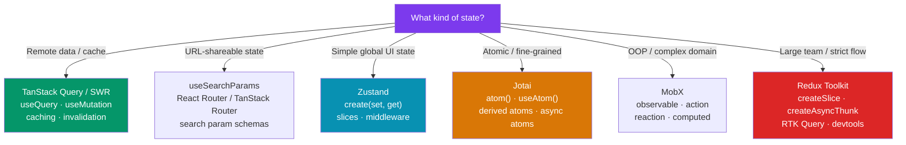

# 🗂️ State Management Alternatives

> [!abstract] TL;DR
> Modern React state management has fractured from Redux-or-nothing into four categories: **local** (`useState`/`useReducer`), **server** (TanStack Query/SWR), **global client** (Zustand, Jotai, MobX), and **URL** (`useSearchParams`). Zustand is a single-store, minimal-API option with a small footprint. Jotai uses a bottom-up atom model — each atom is a unit of state, composed with derived atoms. MobX uses Observable proxies for OOP-style reactive programming. Redux Toolkit remains the choice when you need strict unidirectional data flow, devtools time-travel, and large-team conventions. The first question is always: *is this server state (cached remote data) or client state (UI-only)?*

## Intuition — analogy FIRST

Think of state libraries as different filing systems:

- **useState** — sticky note on your desk. Fast, local, only you can see it.
- **Zustand** — shared whiteboard in the office. Anyone can read or write; one source of truth.
- **Jotai** — a grid of mini-whiteboards (atoms), each dedicated to one topic. Cells that need the same data subscribe to the same mini-board; changing one board only notifies subscribers of *that* board.
- **MobX** — a smart spreadsheet. Change a cell and every formula that depends on it automatically recalculates — you never manually trigger updates.
- **Redux Toolkit** — a formal document management system with strict in-trays, audit logs, and time-travel replay. More overhead, but invaluable at enterprise scale.

---

## How It Works



---

## Key Concepts / Details

### Zustand — Minimal Global Store

```tsx
import { create } from 'zustand';
import { devtools, persist } from 'zustand/middleware';

interface CartStore {
  items: CartItem[];
  total: number;
  addItem: (item: CartItem) => void;
  removeItem: (id: string) => void;
  clear: () => void;
}

// Single call — creates hook + store
const useCartStore = create<CartStore>()(
  devtools(  // Redux DevTools integration
    persist(  // localStorage persistence
      (set, get) => ({
        items: [],
        total: 0,
        addItem: (item) =>
          set((state) => ({
            items: [...state.items, item],
            total: state.total + item.price,
          })),
        removeItem: (id) =>
          set((state) => {
            const items = state.items.filter(i => i.id !== id);
            return { items, total: items.reduce((s, i) => s + i.price, 0) };
          }),
        clear: () => set({ items: [], total: 0 }),
      }),
      { name: 'cart-storage' }
    )
  )
);

// Usage — select only what you need (prevents unnecessary re-renders)
function CartBadge() {
  const count = useCartStore(state => state.items.length); // targeted selector
  return <span>{count}</span>;
}

function CartTotal() {
  const total = useCartStore(state => state.total);
  return <span>${total.toFixed(2)}</span>;
}
```

### Jotai — Atomic State

```tsx
import { atom, useAtom, useAtomValue, useSetAtom } from 'jotai';
import { atomWithStorage } from 'jotai/utils';

// Primitive atoms — smallest unit of state
const countAtom = atom(0);
const nameAtom = atomWithStorage('name', ''); // synced to localStorage

// Derived (read-only) atoms — like computed values
const doubleAtom = atom((get) => get(countAtom) * 2);

// Async atom — suspense-compatible
const userAtom = atom(async (get) => {
  const id = get(selectedIdAtom);
  return fetch(`/api/users/${id}`).then(r => r.json());
});

// Write atom with logic
const incrementAtom = atom(null, (get, set, amount: number) => {
  set(countAtom, get(countAtom) + amount);
});

function Counter() {
  const [count, setCount] = useAtom(countAtom);
  const double = useAtomValue(doubleAtom);          // read-only
  const increment = useSetAtom(incrementAtom);       // write-only (no re-render on read)

  return (
    <div>
      <p>{count} × 2 = {double}</p>
      <button onClick={() => increment(1)}>+1</button>
    </div>
  );
}
```

### MobX — Observable State

```tsx
import { makeObservable, observable, action, computed } from 'mobx';
import { observer } from 'mobx-react-lite';

class TodoStore {
  todos: Todo[] = [];
  filter: 'all' | 'active' | 'done' = 'all';

  constructor() {
    makeObservable(this, {
      todos: observable,
      filter: observable,
      filtered: computed,          // memoized derived value
      addTodo: action,             // must be action to mutate observables
      toggleTodo: action,
    });
  }

  get filtered() {
    if (this.filter === 'all') return this.todos;
    return this.todos.filter(t =>
      this.filter === 'done' ? t.done : !t.done
    );
  }

  addTodo(text: string) {
    this.todos.push({ id: Date.now(), text, done: false }); // DIRECT mutation — MobX handles it
  }

  toggleTodo(id: number) {
    const todo = this.todos.find(t => t.id === id);
    if (todo) todo.done = !todo.done;
  }
}

const store = new TodoStore();

// observer() wraps component — re-renders ONLY when observables it reads change
const TodoList = observer(() => (
  <ul>
    {store.filtered.map(t => (
      <li key={t.id} onClick={() => store.toggleTodo(t.id)}
          style={{ textDecoration: t.done ? 'line-through' : 'none' }}>
        {t.text}
      </li>
    ))}
  </ul>
));
```

### Redux Toolkit — Structured Unidirectional Flow

```tsx
// See State_Management_Redux.md for full RTK coverage
// Key pattern: slice → store → hooks
import { createSlice, configureStore } from '@reduxjs/toolkit';

const counterSlice = createSlice({
  name: 'counter',
  initialState: { value: 0 },
  reducers: {
    increment: (state) => { state.value += 1; },     // Immer mutate-style
    decrement: (state) => { state.value -= 1; },
  },
});

const store = configureStore({ reducer: { counter: counterSlice.reducer } });
```

### Recoil — Facebook's Atom Model (Reference)

```tsx
// Recoil is now in maintenance mode — Jotai is the actively developed successor
import { atom, selector, useRecoilState, useRecoilValue } from 'recoil';

const countState = atom({ key: 'count', default: 0 });
const doubleCount = selector({
  key: 'doubleCount',
  get: ({ get }) => get(countState) * 2,
});
// NOTE: prefer Jotai for new projects — same model, smaller bundle, no key strings
```

---

## Trade-offs

| Library | Bundle | Boilerplate | TypeScript | Devtools | Best For |
|---------|--------|------------|-----------|---------|---------|
| useState/useReducer | 0KB | None | Perfect | React DevTools | Local, component-scoped |
| Zustand | ~1KB | Minimal | Good | Redux DevTools | Simple global state |
| Jotai | ~3KB | Minimal | Excellent | Jotai DevTools | Atomic, fine-grained |
| MobX | ~20KB | Class-heavy | Good | MobX DevTools | OOP domain models |
| Recoil | ~21KB | Moderate | Good | DevTools | (legacy — use Jotai) |
| Redux Toolkit | ~40KB | Moderate | Excellent | Redux DevTools | Large apps, strict flow |
| TanStack Query | ~13KB | Low | Excellent | Query DevTools | Server/remote state |

---

## Real-World Notes

- **First, separate server state from client state.** Most "state management problems" in React are actually caching problems. TanStack Query handles server state (loading, caching, refetching, mutation) better than any global store.
- **Zustand is the default choice for new projects.** Small API, no provider wrapping, works outside React (useful for non-component code), excellent DevTools.
- **Jotai shines in dashboards with many independent reactive values.** Each atom only triggers re-renders in components that subscribe to it — no selector optimization needed.
- **Only reach for Redux Toolkit if** your team is large (>5 engineers touching state), you need strict unidirectional audit trails, or you're on an existing Redux codebase.
- **Avoid "lifting state up" too eagerly** — shared state belongs at the lowest common ancestor, not always a global store.

---

## Common Pitfalls

- **Storing server state in a global store** — managing loading/error/cache/staleness manually is expensive; use TanStack Query instead.
- **Zustand: selecting the whole store** (`useStore()` with no selector) — the component re-renders on every store change. Always select only the slice you need.
- **MobX: mutations outside `action`** — observable mutations outside an action don't batch, trigger multiple re-renders, and throw in strict mode.
- **Jotai: using string keys (Recoil pattern)** — Jotai uses atom object identity, not string keys; passing the wrong atom reference silently reads the wrong value.

---

## Related Concepts

- [[_MOC_React|↑ Section MOC]]
- [[State_Management_Redux]] — Redux Toolkit deep-dive with RTK Query
- [[React_Data_Fetching]] — TanStack Query for server state management
- [[React_Performance]] — Selector optimization and re-render prevention

---

## Review Questions

1. What is the fundamental difference between server state and client state? Which libraries handle each?
2. How does Zustand's selector pattern prevent unnecessary re-renders?
3. In Jotai, what is a derived atom and how does it differ from a primitive atom?
4. Why does MobX require mutations to be wrapped in `action()`?
5. When would you choose Redux Toolkit over Zustand for a new project?

---

## Sources

- Zustand docs: https://zustand-demo.pmnd.rs
- Jotai docs: https://jotai.org
- MobX docs: https://mobx.js.org
- TkDodo: Practical React Query — https://tkdodo.eu/blog/practical-react-query

#web-development #react #state-management #zustand #jotai #mobx #redux
