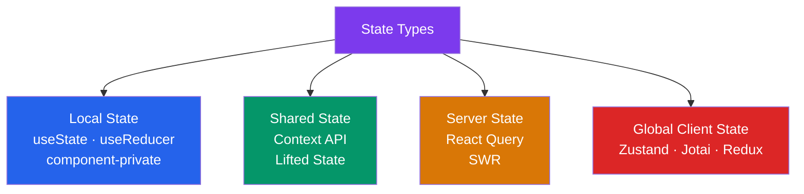

# 🗄️ State Management and Redux

> [!abstract] TL;DR
> State management in React follows a spectrum: local state (`useState`/`useReducer`) → lifted state → Context → external stores (Zustand, Jotai) → full Redux. **Co-locate state** as close to where it's used as possible. Context is good for slow-changing globals (theme, auth user) — use split-context to prevent blanket re-renders. **React Query** manages server state (cache, revalidation, optimistic updates). **Redux Toolkit** (`createSlice`, RTK Query) reduces Redux boilerplate for complex client state that must be auditable.

## Intuition — analogy FIRST

State management is like a city's water supply. Local state (`useState`) is each house's private water tank — fast and independent, but not shared. Context is the neighborhood water tower — everyone connects to it, but if one pipe drains it, everyone's water changes. External stores (Zustand) are individual metered connections to the city main — each component taps in independently, no shared re-render.

Redux is the city's central water authority: every change is logged as an official work order (action), the authority (reducer) applies it to update the master record (store), and any department (component) can audit the full history.

React Query is the city's water monitoring system — it knows when the supply is fresh, when it needs testing (revalidation), and automatically refreshes it on schedule.

---

## How It Works



---

## Key Concepts / Details

### State Co-location Strategy

```
Rule: Put state as close to where it's used as possible.

local state (useState)
  ↓ if sibling needs it
lift to common ancestor
  ↓ if prop-drilling becomes painful (>2 levels)
Context API
  ↓ if re-renders become a performance problem
External store (Zustand/Jotai)
  ↓ if state is complex, auditable, or cross-module
Redux Toolkit
```

### Context API — With Re-render Awareness

Context triggers a re-render for **every consumer** when the provided value changes:

```jsx
// WRONG: single context with multiple fields — any change re-renders all consumers
const AppContext = createContext({ user: null, theme: 'light', cart: [] });

// CORRECT: split context by concern (each updates independently)
const UserContext   = createContext<User | null>(null);
const ThemeContext  = createContext<'light' | 'dark'>('light');
const CartContext   = createContext<CartItem[]>([]);

// Pattern: context value + separate dispatch context
const CartStateContext    = createContext<CartItem[]>([]);
const CartDispatchContext = createContext<React.Dispatch<CartAction>>(() => {});

function CartProvider({ children }) {
  const [cart, dispatch] = useReducer(cartReducer, []);

  return (
    <CartStateContext.Provider value={cart}>
      <CartDispatchContext.Provider value={dispatch}>
        {children}
      </CartDispatchContext.Provider>
    </CartStateContext.Provider>
  );
}

// Components that only dispatch don't re-render when cart state changes
function AddToCartButton({ productId }) {
  const dispatch = useContext(CartDispatchContext); // stable reference
  return <button onClick={() => dispatch({ type: 'ADD', id: productId })}>Add</button>;
}
```

### Zustand — Lightweight External Store

```jsx
import { create } from 'zustand';
import { persist, devtools } from 'zustand/middleware';

// Define store with state and actions
interface CartStore {
  items: CartItem[];
  total: number;
  addItem: (item: CartItem) => void;
  removeItem: (id: string) => void;
  clearCart: () => void;
}

const useCartStore = create<CartStore>()(
  devtools(
    persist(
      (set, get) => ({
        items: [],
        total: 0,

        addItem: (item) => set(state => ({
          items: [...state.items, item],
          total: state.total + item.price
        })),

        removeItem: (id) => set(state => {
          const filtered = state.items.filter(i => i.id !== id);
          return { items: filtered, total: filtered.reduce((s, i) => s + i.price, 0) };
        }),

        clearCart: () => set({ items: [], total: 0 })
      }),
      { name: 'cart-storage' } // persist to localStorage
    )
  )
);

// Usage — subscribe only to the slice you need (prevents unnecessary re-renders)
function CartCount() {
  const count = useCartStore(state => state.items.length); // only re-renders when count changes
  return <span>{count}</span>;
}

function CartTotal() {
  const total = useCartStore(state => state.total);
  return <span>${total}</span>;
}
```

### Redux Toolkit — `createSlice`

```jsx
import { createSlice, PayloadAction, configureStore } from '@reduxjs/toolkit';

// createSlice — generates actions and reducer together
const cartSlice = createSlice({
  name: 'cart',
  initialState: { items: [] as CartItem[], status: 'idle' as const },
  reducers: {
    addItem: (state, action: PayloadAction<CartItem>) => {
      // Immer proxy — mutate state directly (RTK wraps with Immer)
      state.items.push(action.payload);
    },
    removeItem: (state, action: PayloadAction<string>) => {
      state.items = state.items.filter(i => i.id !== action.payload);
    },
    clearCart: (state) => {
      state.items = [];
    }
  }
});

export const { addItem, removeItem, clearCart } = cartSlice.actions;

// Configure store
const store = configureStore({
  reducer: {
    cart: cartSlice.reducer
  }
});

type RootState = ReturnType<typeof store.getState>;
type AppDispatch = typeof store.dispatch;
```

### RTK Query — API Cache Layer

```jsx
import { createApi, fetchBaseQuery } from '@reduxjs/toolkit/query/react';

export const usersApi = createApi({
  reducerPath: 'usersApi',
  baseQuery: fetchBaseQuery({ baseUrl: '/api' }),
  tagTypes: ['User', 'Post'],

  endpoints: (builder) => ({
    getUsers: builder.query<User[], void>({
      query: () => '/users',
      providesTags: ['User']
    }),

    getUserById: builder.query<User, number>({
      query: (id) => `/users/${id}`,
      providesTags: (result, error, id) => [{ type: 'User', id }]
    }),

    createUser: builder.mutation<User, Partial<User>>({
      query: (body) => ({ url: '/users', method: 'POST', body }),
      invalidatesTags: ['User'] // auto-refetch users list after creation
    })
  })
});

export const { useGetUsersQuery, useGetUserByIdQuery, useCreateUserMutation } = usersApi;

// Usage
function UserList() {
  const { data: users, isLoading, isError } = useGetUsersQuery();
  const [createUser, { isLoading: isCreating }] = useCreateUserMutation();

  if (isLoading) return <Spinner />;
  if (isError) return <Error />;
  return <ul>{users?.map(u => <li key={u.id}>{u.name}</li>)}</ul>;
}
```

### React Query — Server State Management

```jsx
import { useQuery, useMutation, useQueryClient } from '@tanstack/react-query';

// Stale-while-revalidate cache model
function UserProfile({ userId }) {
  const { data: user, isLoading, isError } = useQuery({
    queryKey: ['user', userId],         // cache key
    queryFn: () => fetchUser(userId),   // fetch function
    staleTime: 5 * 60 * 1000,          // data is fresh for 5 minutes
    gcTime:    10 * 60 * 1000,         // remove from cache after 10 minutes
    retry: 3,
    refetchOnWindowFocus: true
  });

  if (isLoading) return <Skeleton />;
  return <div>{user?.name}</div>;
}

// useMutation — create/update/delete with optimistic updates
function LikeButton({ postId }) {
  const queryClient = useQueryClient();

  const { mutate: likePost } = useMutation({
    mutationFn: (id: number) => toggleLike(id),

    // Optimistic update — update UI before server confirms
    onMutate: async (id) => {
      await queryClient.cancelQueries({ queryKey: ['post', id] });
      const previous = queryClient.getQueryData(['post', id]);

      queryClient.setQueryData(['post', id], (old: Post) => ({
        ...old, liked: !old.liked, likeCount: old.liked ? old.likeCount - 1 : old.likeCount + 1
      }));

      return { previous }; // context for rollback
    },

    onError: (err, id, context) => {
      // Rollback on error
      queryClient.setQueryData(['post', id], context?.previous);
    },

    onSettled: (data, error, id) => {
      queryClient.invalidateQueries({ queryKey: ['post', id] }); // refetch for truth
    }
  });

  return <button onClick={() => likePost(postId)}>Like</button>;
}
```

### Choosing the Right Solution

| State Type | Best Tool | Why |
|------------|-----------|-----|
| Form input values | Local `useState` | Isolated, no sharing needed |
| Modal open/close | Local `useState` | Parent manages child visibility |
| Theme, locale | Context | Slow-changing, app-wide |
| Auth user | Context or Zustand | App-wide but may need actions |
| Server data (users, posts) | React Query / RTK Query | Cache, revalidation, deduplication |
| Complex client state | Redux Toolkit | Auditable, time-travel debugging |
| Simple global state | Zustand | Less boilerplate than Redux |
| Atomic state | Jotai | Fine-grained atoms, derived state |

---

## Real-World Notes

- **React Query is the solution to "where do I put server data?"** — it answers the fetch-on-mount pattern, loading states, error states, cache invalidation, and deduplication. It replaces a surprising amount of Redux.
- **Zustand is simple by design** — no providers, no action types, just a store object with read and write. Start here before Redux.
- **Redux Toolkit is necessary for large teams** — the strict action-reducer pattern makes state changes predictable and debuggable via Redux DevTools.
- **`useSyncExternalStore`** is the correct low-level hook for subscribing to external stores — it prevents tearing in React 18 concurrent mode. Zustand and Redux both use it internally.

---

## Common Pitfalls

- **Putting server state in Redux** — you end up reimplementing React Query's caching logic manually (loading, error, refetch, invalidation). Use React Query instead.
- **Single monolithic Context object** — one change re-renders every consumer. Split contexts by domain.
- **Not memoizing Context value** — `<UserContext.Provider value={{ user, logout }}>` creates a new object every render, re-rendering all consumers. Wrap with `useMemo`.
- **Optimistic update without rollback** — if the server rejects the mutation, UI stays in the wrong state. Always implement `onError` rollback.

---

## Related Concepts

- [[_MOC_React|↑ Section MOC]]
- [[Hooks_in_React]] — `useState`, `useReducer`, `useSyncExternalStore` foundation
- [[React_Fundamentals]] — Re-rendering mechanics that make state management matter
- [[React_Performance]] — How state design affects render performance

---

## Review Questions

1. What is the "split context" pattern and why does it prevent unnecessary re-renders?
2. When do you reach for Zustand vs Redux Toolkit? Give a concrete scenario for each.
3. What is the stale-while-revalidate model in React Query? How is it different from just fetching in `useEffect`?
4. Write an optimistic update with rollback for a "delete post" mutation in React Query.
5. Why should server state (API data) not be stored in Redux?

---

## Sources

- React docs: Managing State — https://react.dev/learn/managing-state
- Zustand docs — https://docs.pmnd.rs/zustand/getting-started/introduction
- Redux Toolkit docs — https://redux-toolkit.js.org/
- TanStack Query docs — https://tanstack.com/query/latest

#web-development #react #state-management #redux #react-query #zustand
