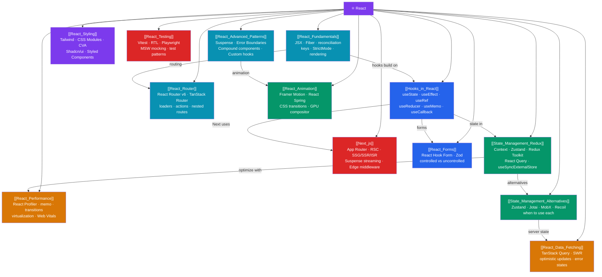

# ⚛️ React — Map of Content

> [!abstract] What This Section Covers
> Meta's declarative, intentionally unopinionated UI library — the virtual DOM and Fiber reconciler, the hooks model, context, React Server Components, and Next.js. React gives you the component model and the rendering engine; you compose the ecosystem (routing, state, data fetching) to fit the problem. This section covers: the React element model and JSX, hooks deep-dive, state management patterns, performance optimization, and the Next.js full-stack framework.

## Concept Map

## Learning Path

1. [[React_Fundamentals]] — JSX, the React element model, the Fiber reconciler (render vs commit phases), and `key`s.
2. [[Hooks_in_React]] — The two rules of hooks, `useState`, `useEffect`, `useRef`, `useMemo`, `useCallback`, and concurrent hooks.
3. [[React_Router]] — React Router v6+, TanStack Router, nested routes, loaders, actions, and file-based routing.
4. [[State_Management_Redux]] — Context re-renders, Zustand/Jotai external stores, Redux Toolkit, and React Query.
5. [[State_Management_Alternatives]] — Zustand, Jotai, MobX comparison; when server state (TanStack Query) replaces global stores.
6. [[React_Data_Fetching]] — TanStack Query, SWR, optimistic updates, caching strategies.
7. [[React_Forms]] — React Hook Form, Zod validation, controlled vs uncontrolled inputs, `useFieldArray`.
8. [[React_Styling]] — Tailwind CSS, CVA, CSS Modules, Shadcn/ui, Styled Components.
9. [[React_Testing]] — Vitest, React Testing Library, MSW, Playwright, test patterns.
10. [[React_Advanced_Patterns]] — Suspense, Error Boundaries, Compound components, Custom hooks, Portals.
11. [[React_Animation]] — Framer Motion, React Spring, CSS transitions, AnimatePresence, `prefers-reduced-motion`.
12. [[React_Performance]] — The React Profiler, `memo`/`useMemo`/`useCallback`, `useTransition`, list virtualization, and Web Vitals.
13. [[Next_js]] — App Router, React Server Components, rendering strategies (SSG/SSR/ISR/CSR), Suspense streaming, and Edge middleware.

## All Notes at a Glance

| Note | Difficulty | What You'll Learn |
|------|------------|-------------------|
| [[React_Fundamentals]] | Intermediate | JSX compilation, Fiber render/commit, reconciliation, key diffing, StrictMode double-invoke |
| [[Hooks_in_React]] | Intermediate | Rules of hooks, useState batching, useEffect timing, useRef, concurrent hooks |
| [[React_Router]] | Intermediate | React Router v6, TanStack Router, nested routes, loaders, actions, file-based routing |
| [[State_Management_Redux]] | Intermediate | Context splits, Zustand, Redux Toolkit, createSlice, RTK Query, React Query |
| [[State_Management_Alternatives]] | Intermediate | Zustand, Jotai, MobX, Recoil comparison; server vs client state separation |
| [[React_Data_Fetching]] | Intermediate | TanStack Query, SWR, optimistic updates, staleTime, cache invalidation |
| [[React_Forms]] | Intermediate | RHF, Zod schema validation, controlled vs uncontrolled, useFieldArray, server errors |
| [[React_Styling]] | Intermediate | Tailwind + CVA, CSS Modules, Shadcn/ui, Styled Components, cn() helper |
| [[React_Testing]] | Intermediate | Vitest, RTL queries, userEvent, MSW, TanStack Query in tests, Playwright E2E |
| [[React_Advanced_Patterns]] | Advanced | Suspense + use(), Error Boundaries, Compound components, Custom hooks, Portals |
| [[React_Animation]] | Intermediate | Framer Motion, AnimatePresence, layoutId, React Spring, CSS GPU-safe transforms |
| [[React_Performance]] | Advanced | Profiler, memo, useMemo cost/benefit, useTransition, virtualization, LCP/CLS/INP |
| [[Next_js]] | Advanced | App Router, RSC zero-JS, use client boundary, SSG/ISR/SSR, streaming, middleware |

## Key Questions This Section Answers

- How does the Fiber reconciler work, and why do `key`s matter in list diffing?
- Why can't you call hooks conditionally? What is the positional linked list?
- When does `useEffect` run relative to paint? How does it differ from `useLayoutEffect`?
- What is the difference between server state (TanStack Query) and client state (Zustand/Jotai)?
- When does `useMemo`/`useCallback` actually help vs add overhead?
- How do React Router loaders eliminate request waterfalls?
- What is the difference between React Server Components and Client Components?
- What are the four Next.js rendering strategies and when do you use each?
- Why should animations use `transform`/`opacity` and not `height`/`top`?

## Related Sections

- [[_MOC_WebDev_Master|↑ Web Dev Master MOC]]
- [[_MOC_TypeScript|← TypeScript]] — [[TypeScript_with_React]]
- [[_MOC_Angular|← Angular]] (alternative framework)

#MOC #WebDevelopment #React
