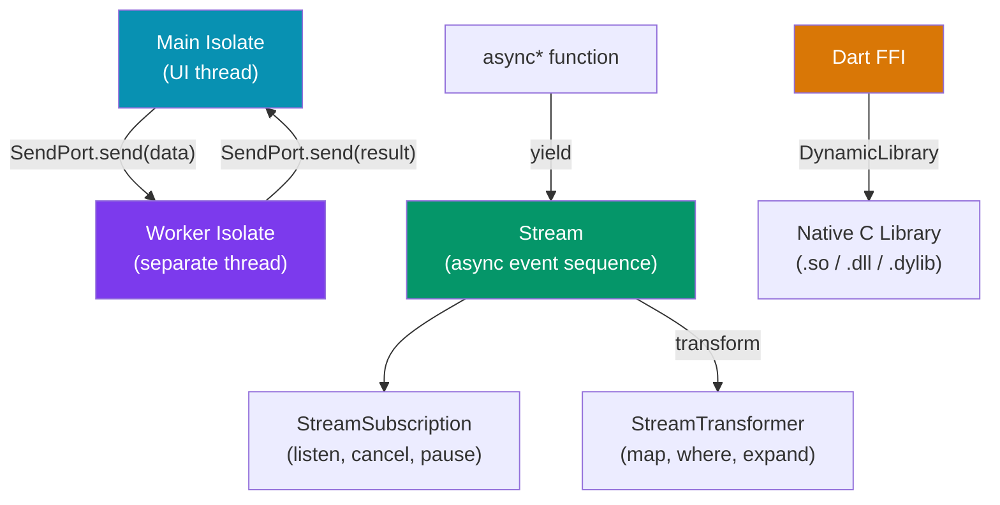

# ⚡ Dart Advanced

> [!abstract] TL;DR
> Advanced Dart covers: **Streams** (async event sequences — `StreamController`, `StreamTransformer`, broadcast vs single-subscription), **Isolates** (true parallelism via message-passing; no shared memory), **`compute()`** (fire-and-forget isolate for CPU work), **Future chaining** (`.then()`, `Future.wait()`, `Future.any()`), **async generators** (`async*` / `yield`), **Dart FFI** (calling native C libraries), and **extension methods** (adding methods to existing types without subclassing). Most Flutter performance work involves moving CPU-heavy work to an isolate via `compute()`.

## Intuition — analogy first

Isolates are like separate office buildings: each has its own employees (memory), its own coffee machine (event loop), and the only way they communicate is by passing printed memos through a slot (SendPort messages) — no shared whiteboards. Streams are like a conveyor belt of packages (events) that you subscribe to and process as they arrive. Extension methods are like a monkey-patching service that adds a new button to your microwave without opening it up.

---

## How It Works



---

## Key Concepts / Details

### Futures — Chaining and Composition

```dart
// Basic chaining
Future<User> fetchUser(String id) async {
  final response = await http.get(Uri.parse('/users/$id'));
  return User.fromJson(jsonDecode(response.body));
}

// .then() chaining (less common with async/await)
fetchUser('123')
    .then((user) => fetchOrders(user.id))
    .then((orders) => processOrders(orders))
    .catchError((error) => handleError(error))
    .whenComplete(() => hideLoadingSpinner());

// Future.wait — run concurrently, wait for all
final (user, orders, prefs) = await (
  fetchUser('123'),
  fetchOrders('123'),
  fetchPreferences('123'),
).wait; // Dart 3 record destructuring

// Older style:
final results = await Future.wait([fetchUser('123'), fetchOrders('123')]);

// Future.any — return first to complete (e.g., race with timeout)
final result = await Future.any([
  fetchFromCache(),
  fetchFromNetwork(),
  Future.delayed(const Duration(seconds: 5), () => throw TimeoutException()),
]);

// Error handling
try {
  final data = await fetchData();
} on NetworkException catch (e) {
  log('Network error: $e');
} on AuthException catch (e) {
  navigateToLogin();
} finally {
  hideSpinner();
}
```

---

### Streams — Async Event Sequences

```dart
// Single-subscription stream (most common — can only have one listener)
Stream<int> countdown(int from) async* {
  for (int i = from; i >= 0; i--) {
    yield i;
    await Future.delayed(const Duration(seconds: 1));
  }
}

// Listen
final sub = countdown(10).listen(
  (value) => print('T-$value'),
  onError: (error) => print('Error: $error'),
  onDone: () => print('Liftoff!'),
  cancelOnError: false,
);

// Cancel when done
await Future.delayed(const Duration(seconds: 3));
await sub.cancel();

// Broadcast stream — multiple listeners
final controller = StreamController<String>.broadcast();
controller.stream.listen((event) => print('Listener 1: $event'));
controller.stream.listen((event) => print('Listener 2: $event'));
controller.add('hello');
controller.add('world');
await controller.close();

// StreamTransformer — transform events in the pipeline
final loggedStream = myStream.transform(
  StreamTransformer<String, String>.fromHandlers(
    handleData: (data, sink) {
      print('Received: $data');
      sink.add(data.toUpperCase());
    },
  ),
);

// Common stream operators
myStream
    .where((event) => event.isNotEmpty)        // filter
    .map((event) => event.trim())              // transform
    .debounce(const Duration(milliseconds: 300)) // rxdart
    .distinct()                                 // deduplicate
    .take(5)                                    // limit to first 5
    .listen(print);
```

### Async Generators — `async*` and `yield`

```dart
// async* returns Stream<T>
Stream<List<Product>> paginatedProducts() async* {
  int page = 0;
  while (true) {
    final products = await fetchPage(page++);
    if (products.isEmpty) return; // closes the stream
    yield products;
  }
}

// sync* returns Iterable<T> (synchronous generator)
Iterable<int> fibonacci() sync* {
  int a = 0, b = 1;
  while (true) {
    yield a;
    final temp = a + b;
    a = b;
    b = temp;
  }
}

// Use with await for — iterates stream values
await for (final batch in paginatedProducts()) {
  processBatch(batch);
}
```

---

### Isolates — True Parallelism

Dart's main isolate runs the UI. Heavy CPU work (JSON parsing, image processing, encryption) must move to a separate isolate to avoid jank:

```dart
import 'dart:isolate';

// compute() — simplest: sends one message, receives one response
import 'package:flutter/foundation.dart';

// The function MUST be a top-level or static function
List<Product> _parseProducts(String jsonString) {
  // Runs in a separate isolate
  final List json = jsonDecode(jsonString);
  return json.map((e) => Product.fromJson(e)).toList();
}

// In your widget/service:
final products = await compute(_parseProducts, jsonString);

// ──────────────────────────────────────────────────────

// Full Isolate API — for long-running workers or bidirectional communication
class ImageProcessor {
  late Isolate _isolate;
  late ReceivePort _receivePort;
  late SendPort _sendPort;

  Future<void> start() async {
    _receivePort = ReceivePort();
    _isolate = await Isolate.spawn(_worker, _receivePort.sendPort);

    // First message from worker is its SendPort
    _sendPort = await _receivePort.first;
  }

  Future<Uint8List> process(Uint8List imageBytes) async {
    final response = ReceivePort();
    _sendPort.send({'data': imageBytes, 'replyPort': response.sendPort});
    return await response.first as Uint8List;
  }

  static void _worker(SendPort mainSendPort) {
    final workerReceivePort = ReceivePort();
    mainSendPort.send(workerReceivePort.sendPort); // send back our port

    workerReceivePort.listen((message) {
      final data = message['data'] as Uint8List;
      final replyPort = message['replyPort'] as SendPort;
      // Heavy processing here — doesn't affect UI thread
      final result = _applyFilter(data);
      replyPort.send(result);
    });
  }

  static Uint8List _applyFilter(Uint8List bytes) {
    // CPU-intensive image manipulation
    return bytes; // simplified
  }

  void dispose() {
    _isolate.kill(priority: Isolate.immediate);
    _receivePort.close();
  }
}
```

> [!important] Isolate constraints
> - No shared memory between isolates — all data must be **copied** via `SendPort`
> - Only certain types can be sent: primitives, `List`, `Map`, `Uint8List`, `TransferableTypedData`
> - You cannot send arbitrary objects or closures across isolates
> - Flutter objects (widgets, `BuildContext`) cannot be sent to isolates

---

### Extension Methods

```dart
// Add methods to existing types without modifying them
extension StringExtension on String {
  String get capitalize =>
      isEmpty ? this : '${this[0].toUpperCase()}${substring(1)}';

  bool get isValidEmail =>
      RegExp(r'^[\w-]+(\.[\w-]+)*@[\w-]+(\.[\w-]+)+$').hasMatch(this);

  String truncate(int maxLength, {String ellipsis = '...'}) =>
      length <= maxLength ? this : '${substring(0, maxLength - ellipsis.length)}$ellipsis';
}

// Extension on generic types
extension FutureExtension<T> on Future<T> {
  Future<T> withTimeout(Duration duration, {T Function()? onTimeout}) =>
      timeout(duration, onTimeout: onTimeout);
}

// Extension on Widget for fluent API (common pattern)
extension WidgetExtension on Widget {
  Widget paddingAll(double value) => Padding(padding: EdgeInsets.all(value), child: this);
  Widget center() => Center(child: this);
  Widget expand([int flex = 1]) => Expanded(flex: flex, child: this);
}

// Usage
'hello world'.capitalize;    // 'Hello world'
'user@example.com'.isValidEmail;  // true
Text('Title').paddingAll(16).center();
```

---

### Dart FFI — Calling Native C Libraries

```dart
import 'dart:ffi';
import 'dart:io';

// Bind to a native function: int add(int a, int b)
typedef AddFunc = Int32 Function(Int32 a, Int32 b);
typedef AddDart = int Function(int a, int b);

class NativeLib {
  static late DynamicLibrary _lib;
  static late AddDart add;

  static void load() {
    _lib = Platform.isAndroid
        ? DynamicLibrary.open('libnative.so')
        : DynamicLibrary.process(); // macOS/iOS statically linked

    add = _lib
        .lookup<NativeFunction<AddFunc>>('native_add')
        .asFunction<AddDart>();
  }
}

// Usage
NativeLib.load();
final result = NativeLib.add(3, 4); // calls C function
```

> [!tip] `ffigen` package
> Use `package:ffigen` to auto-generate Dart FFI bindings from C headers. Far less error-prone than manual `typedef` definitions.

---

## Trade-offs

| Concept | When to Use | Overhead |
|---------|------------|----------|
| `compute()` | One-shot CPU task (JSON parse, sort) | One isolate spawn per call |
| Long-lived Isolate | Repeated CPU tasks (image processing worker) | One-time spawn, reuse |
| `StreamController` | Push-based data sources (sensors, sockets) | Minimal |
| `async*` / `yield` | Lazy sequences, pagination | Minimal |
| Dart FFI | Need performance-critical native code (crypto, codecs) | High complexity |
| Extension methods | DRY code on existing types | Zero runtime overhead |

---

## Common Pitfalls

- **Calling `compute()` in a tight loop** — each `compute()` call spawns a new isolate (~1ms overhead). For repeated work, create a long-lived isolate worker instead.
- **Sending non-transferable objects to isolates** — sending a custom Dart class across an isolate boundary requires all fields to be serializable. Dart will throw a runtime error if you try to send a closure or a class with `Finalizable` fields.
- **Forgetting to close `StreamController`** — unclosed controllers hold references and keep the stream open. Always `await controller.close()` when done.
- **Broadcasting to a single-subscription stream** — calling `.listen()` twice on a single-subscription stream throws a `StateError`. Use `asBroadcastStream()` or `StreamController.broadcast()` when multiple listeners are needed.
- **Extension method naming conflicts** — if two extensions define the same method name on the same type, the compile-time import wins. Use prefixed imports to disambiguate.

---

## Related Concepts

- [[_MOC_Flutter|↑ Section MOC]]
- [[Dart_Language]] — foundational Dart (null safety, async/await, basic streams)
- [[Flutter_Architecture]] — isolates relate to platform channels on the main isolate
- [[Flutter_Networking]] — networking uses Futures and Streams extensively

---

## Review Questions

1. What is the difference between a single-subscription stream and a broadcast stream? When would you use each?
2. Why can't you share memory between Dart isolates? What mechanism do they use to communicate?
3. What is the difference between `compute()` and spawning a long-lived `Isolate`? When would you choose each?
4. Write an async generator (`async*`) that yields pages of results from a paginated API.
5. What restriction applies to functions passed to `compute()` or `Isolate.spawn()`? Why?

---

## Sources

- Dart docs: Asynchrony — https://dart.dev/libraries/async/async-await
- Dart docs: Isolates — https://dart.dev/language/isolates
- Dart docs: Streams — https://dart.dev/libraries/async/using-streams
- Dart FFI — https://dart.dev/interop/c-interop
- Extension methods — https://dart.dev/language/extension-methods

#web-development #flutter #dart #streams #isolates #futures #ffi #extension-methods
