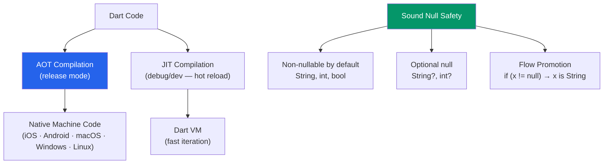

# 🎯 Dart Language

> [!abstract] TL;DR
> Dart is a strongly-typed, ahead-of-time compiled language with **sound null safety** — every type is non-nullable by default (`String` can never be null; `String?` opts in). Dart's `async`/`await` and `Future`/`Stream` model mirrors JavaScript's Promises. The two-queue event loop (microtasks drain before events) is the same model as Node.js. **Isolates** are Dart's concurrency primitive — separate memory heaps with message passing, no shared state, no data races. Flutter's `compute()` wraps `Isolate.run` for heavy off-thread work.

## Intuition — analogy FIRST

Dart's null safety is like a building with a strict no-visitor policy. Every room (variable) has an assigned occupant (value). By default, rooms are occupied — the building staff (compiler) refuses to rent a room without a confirmed occupant. To allow temporary vacancy (null), you must specifically request it with a `?` on the lease.

This eliminates the most common class of runtime errors — null pointer exceptions — at compile time. You can't accidentally enter an empty room because the building's blueprint guarantees occupancy.

Isolates are like separate office buildings with their own security systems. Workers in building A can't directly access the files in building B — they must send formal memos (messages) via a designated mail slot (SendPort). This eliminates the need for locks, mutexes, and race condition debugging.

---

## How It Works



---

## Key Concepts / Details

### Null Safety — The Core Guarantee

```dart
// Non-nullable (default) — compiler guarantees never null
String name = 'Alice';
int count = 0;
// name = null; // Compile error!

// Nullable — explicitly opt in with ?
String? nickname;       // null by default
int? optionalPort;

// Null-aware operators
String? input = getUserInput();

input?.toUpperCase();           // ?. safe navigation — null if input is null
input ?? 'default';             // ?? nullish coalescing — right side if null
input ??= 'default';           // ??= assign if null

// The ! operator — assert non-null (use sparingly — throws if wrong)
String value = input!;  // throws Null check operator used on null value if input is null

// late — deferred initialization (must be set before use)
late String config;
void init() { config = loadConfig(); }

// Flow promotion — compiler narrows type after null check
void process(String? value) {
  if (value == null) return;
  value.toUpperCase(); // OK — promoted to String (non-nullable)
}
```

### Types and Collections

```dart
// Primitive types
int age = 30;
double pi = 3.14159;
bool isActive = true;
String name = 'Alice';
String multiLine = '''
  Line 1
  Line 2
''';
String interpolated = 'Hello, $name! You are ${age + 1} next year.';

// Collections
List<String> names = ['Alice', 'Bob', 'Carol'];
List<int> numbers = [1, 2, 3, 4, 5];
names.add('Dave');
names.where((n) => n.length > 4).toList(); // ['Alice', 'Carol']
names.map((n) => n.toUpperCase()).toList(); // ['ALICE', 'BOB', 'CAROL']

Map<String, int> scores = { 'Alice': 95, 'Bob': 87 };
scores['Alice'];           // 95
scores['Unknown'];         // null (not an error)
scores['Unknown'] ?? 0;   // 0

Set<String> tags = {'flutter', 'dart', 'mobile'};
tags.add('flutter'); // no duplicate — still 3 elements

// Spread operator
List<int> combined = [...numbers, 6, 7, 8];
Map<String, int> merged = { ...scores, 'Carol': 92 };

// Collection if/for (collection expressions)
List<Widget> children = [
  Text('Always'),
  if (isAdmin) const AdminBadge(),
  for (final item in items) ItemCard(item: item),
];
```

### Functions and Parameters

```dart
// Named parameters (Flutter uses extensively for widget clarity)
void createUser({required String name, int age = 0, String? email}) {
  print('$name, $age, $email');
}
createUser(name: 'Alice', age: 30);
createUser(name: 'Bob', email: 'bob@example.com');

// Positional optional parameters (less common)
void log(String message, [String? level]) { ... }
log('hello');
log('error', 'ERROR');

// Arrow function syntax
int add(int a, int b) => a + b;
bool isEven(int n) => n % 2 == 0;

// Higher-order functions
List<int> evens = numbers.where(isEven).toList();
List<int> doubled = numbers.map((n) => n * 2).toList();
int sum = numbers.fold(0, (acc, n) => acc + n);
```

### Constructor Types

```dart
class Point {
  final double x;
  final double y;

  // Generative constructor — most common
  Point(this.x, this.y); // syntactic sugar for: Point(double x, double y) : this.x = x, this.y = y;

  // Named constructor
  Point.origin() : x = 0, y = 0;
  Point.fromJson(Map<String, dynamic> json)
      : x = (json['x'] as num).toDouble(),
        y = (json['y'] as num).toDouble();

  // const constructor — compile-time constant (must have all final fields)
  // const Point(this.x, this.y); — enables const Point(1, 2)

  // factory constructor — returns an existing instance or a subtype
  factory Point.fromString(String s) {
    final parts = s.split(',');
    return Point(double.parse(parts[0]), double.parse(parts[1]));
  }
}

// Factory for singleton
class Database {
  static final Database _instance = Database._internal();

  factory Database() => _instance; // always returns the same instance
  Database._internal();
}
```

### Mixins — Composable Behavior

```dart
// Mixin — add behavior without inheritance
mixin Logging {
  void log(String message) => print('[${runtimeType}] $message');
}

mixin Validation {
  bool isValid();
  void validate() {
    if (!isValid()) throw Exception('Validation failed');
  }
}

// 'on' constraint — mixin can only be applied to specific base class
mixin Swimming on Animal {
  void swim() => print('${name} is swimming'); // can access Animal.name
}

// Apply with 'with'
class UserService with Logging, Validation {
  bool isValid() => true;

  void createUser(String name) {
    validate();
    log('Creating user: $name');
  }
}

// Rightmost wins for method conflicts
class A with Logging, Validation {} // Validation methods take precedence over Logging for conflicts
```

### Extension Methods

```dart
// Add methods to existing types without modifying them
extension StringExtensions on String {
  String capitalize() => isEmpty ? '' : '${this[0].toUpperCase()}${substring(1)}';
  bool get isEmail => contains('@') && contains('.');
  List<String> get words => split(' ');
}

// Extension on nullable type
extension NullableStringExt on String? {
  String get orEmpty => this ?? '';
}

'hello'.capitalize();       // 'Hello'
'user@example.com'.isEmail; // true
'hello world'.words;        // ['hello', 'world']
```

### Async/Await and Futures

```dart
// Future — a value available eventually (like JS Promise)
Future<User> fetchUser(int id) async {
  final response = await http.get(Uri.parse('/api/users/$id'));
  if (response.statusCode == 200) {
    return User.fromJson(jsonDecode(response.body));
  }
  throw Exception('Failed to load user');
}

// Using Futures
Future<void> main() async {
  try {
    final user = await fetchUser(1);
    print(user.name);
  } catch (e) {
    print('Error: $e');
  }

  // Parallel execution
  final [users, posts] = await Future.wait([getUsers(), getPosts()]);
}

// Stream — async sequence of values (like RxJS Observable or async generator)
Stream<int> countUp(int max) async* {
  for (int i = 0; i < max; i++) {
    await Future.delayed(const Duration(seconds: 1));
    yield i; // emit value
  }
}

// Consuming streams
final sub = countUp(5).listen(
  (value) => print(value),
  onError: (e) => print('Error: $e'),
  onDone: () => print('Done!')
);

// Single-subscription vs broadcast streams
// Single-subscription: can only have one listener (like Future)
// Broadcast: multiple listeners (like event bus)
final controller = StreamController<String>.broadcast();
```

### Isolates — True Parallelism

```dart
import 'dart:isolate';
import 'package:flutter/foundation.dart';

// compute() — Flutter's shorthand for Isolate.run
// Runs a function in a separate isolate (separate thread/heap)
Future<List<int>> processData(List<int> data) async {
  // This runs in the main isolate — would block UI for large data
  return data.map((n) => n * 2).toList();
}

// Better: offload to another isolate
Future<List<int>> processDataInBackground(List<int> data) async {
  return await compute(_processIsolated, data);
}

// Must be a top-level or static function
List<int> _processIsolated(List<int> data) {
  return data.map((n) => n * 2).toList(); // runs in separate isolate
}

// Full Isolate API
Future<void> runIsolate() async {
  final receivePort = ReceivePort();

  await Isolate.spawn((sendPort) {
    // Code running in isolate (separate memory)
    final result = heavyCompute();
    sendPort.send(result); // pass result back via message
  }, receivePort.sendPort);

  final result = await receivePort.first; // wait for result
  receivePort.close();
}
```

---

## Real-World Notes

- **Sound null safety eliminates whole categories of NPE bugs** at compile time. The `!` operator is an escape hatch — use it sparingly and only when you're certain the value is non-null.
- **`late` variables are useful for fields initialized in `initState`** — declare as `late String data;` in the class body and assign in `initState()`.
- **`const` constructors are key to Flutter performance** — `const Text('hello')` is a compile-time constant; Flutter reuses the same widget instance across rebuilds.
- **`compute()` for >5ms off-thread work** — JSON parsing, image processing, and heavy computation should use `compute()` to avoid dropping frames.

---

## Common Pitfalls

- **Using `!` (bang operator) too liberally** — it crashes at runtime if the value is null. Use `?.`, `??`, or `if` checks instead.
- **Synchronous expensive work on the main isolate** — unlike web workers, Dart isolates don't have shared memory. Always `compute()` for heavy processing.
- **Forgetting to close streams** — `StreamSubscription.cancel()` or `StreamController.close()` to prevent memory leaks. Use `StreamBuilder` in Flutter (handles this automatically).
- **Mutable default parameter values** — `List<String> items = []` in a function definition creates ONE list shared across all calls. Use `List<String>? items` + `items ??= []` inside.

---

## Related Concepts

- [[_MOC_Flutter|↑ Section MOC]]
- [[Flutter_Architecture]] — How Dart code becomes Flutter UI
- [[Widgets_and_Layout]] — Dart classes as Flutter widgets
- [[State_Management_Flutter]] — Dart async patterns in state management

---

## Review Questions

1. What does `String?` mean in Dart? What does flow promotion do after `if (value != null)`?
2. What is the difference between `??` and `?.` operators? Give an example for each.
3. Explain the difference between a generative constructor, a named constructor, a `const` constructor, and a `factory` constructor.
4. What is a Dart mixin? How does it differ from inheritance?
5. Why do you use `compute()` instead of running heavy work directly in an `async` function?

---

## Sources

- Dart docs: Language tour — https://dart.dev/language
- Dart docs: Null safety — https://dart.dev/null-safety
- Dart docs: Isolates — https://dart.dev/language/isolates
- Flutter docs: Dart language overview — https://flutter.dev/docs/resources/dart-language

#web-development #flutter #dart #null-safety #isolates
