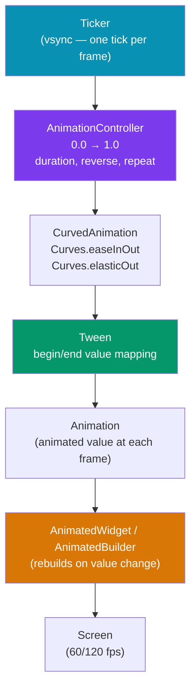

# 🎬 Flutter Animations

> [!abstract] TL;DR
> Flutter animations fall into two categories: **implicit** (widgets that animate automatically when a property changes — `AnimatedContainer`, `AnimatedOpacity`, `TweenAnimationBuilder`) and **explicit** (you drive the animation manually via `AnimationController` + `Tween` + `CurvedAnimation`). For complex scenes use **Hero** (shared-element transitions), **Lottie** (After Effects JSON), or **Rive** (interactive, state-machine-driven). Explicit animations require disposing the `AnimationController` to prevent memory leaks.

## Intuition — analogy first

Implicit animations are like an automatic sliding door — you set the open state and the door handles the movement. Explicit animations are like a manual crank machine — you control every turn of the crank (`AnimationController`), decide the gear ratio (`Tween`), and shape the speed curve (`CurvedAnimation`). Hero animations are like a prop that an actor carries between scenes: same object, seamlessly transported.

---

## How It Works



---

## Key Concepts / Details

### Implicit Animations — Zero Setup

Flutter provides `Animated*` versions of common widgets. When you change a value, the widget interpolates to the new value automatically:

```dart
class ImplicitDemo extends StatefulWidget {
  const ImplicitDemo({super.key});
  @override
  State<ImplicitDemo> createState() => _ImplicitDemoState();
}

class _ImplicitDemoState extends State<ImplicitDemo> {
  bool _big = false;

  @override
  Widget build(BuildContext context) {
    return GestureDetector(
      onTap: () => setState(() => _big = !_big),
      child: AnimatedContainer(
        duration: const Duration(milliseconds: 300),
        curve: Curves.easeInOut,
        width: _big ? 200 : 100,
        height: _big ? 200 : 100,
        color: _big ? Colors.blue : Colors.red,
        child: const Center(child: Text('Tap me')),
      ),
    );
  }
}

// Other implicit widgets
AnimatedOpacity(opacity: _visible ? 1.0 : 0.0, duration: 300.ms, child: widget)
AnimatedPadding(padding: ..., duration: ...)
AnimatedPositioned(top: ..., left: ..., duration: ...) // inside Stack
AnimatedSwitcher(duration: ..., child: _currentWidget) // cross-fades between children
```

### TweenAnimationBuilder — Custom Implicit Animation

```dart
TweenAnimationBuilder<double>(
  tween: Tween(begin: 0, end: _targetValue),
  duration: const Duration(milliseconds: 500),
  curve: Curves.bounceOut,
  builder: (context, value, child) {
    return Transform.scale(
      scale: value,
      child: child, // child is not rebuilt on each frame
    );
  },
  child: const Icon(Icons.star, size: 100),
)
```

---

### Explicit Animations — Full Control

Use when you need: loop, reverse, precise timing, multiple tweens, or imperative control:

```dart
class ExplicitDemo extends StatefulWidget {
  const ExplicitDemo({super.key});
  @override
  State<ExplicitDemo> createState() => _ExplicitDemoState();
}

class _ExplicitDemoState extends State<ExplicitDemo>
    with SingleTickerProviderStateMixin {  // provides vsync ticker
  late AnimationController _controller;
  late Animation<double> _scaleAnim;
  late Animation<Color?> _colorAnim;

  @override
  void initState() {
    super.initState();
    _controller = AnimationController(
      vsync: this,         // ties animation to widget's frame rate
      duration: const Duration(milliseconds: 600),
    );

    final curved = CurvedAnimation(parent: _controller, curve: Curves.elasticOut);

    // Chain multiple tweens to one controller
    _scaleAnim = Tween<double>(begin: 0.5, end: 1.0).animate(curved);
    _colorAnim = ColorTween(begin: Colors.red, end: Colors.blue).animate(curved);
  }

  @override
  void dispose() {
    _controller.dispose(); // ALWAYS dispose — prevents memory leak
    super.dispose();
  }

  @override
  Widget build(BuildContext context) {
    return GestureDetector(
      onTap: () {
        if (_controller.isCompleted) {
          _controller.reverse();
        } else {
          _controller.forward();
        }
      },
      child: AnimatedBuilder(
        animation: _controller, // rebuilds each frame
        builder: (context, child) {
          return Transform.scale(
            scale: _scaleAnim.value,
            child: Container(
              width: 100, height: 100,
              color: _colorAnim.value,
              child: child, // static child not rebuilt
            ),
          );
        },
        child: const Center(child: Text('Tap')),
      ),
    );
  }
}
```

**AnimationController key methods:**

| Method | Effect |
|--------|--------|
| `forward()` | Play 0.0 → 1.0 |
| `reverse()` | Play 1.0 → 0.0 |
| `repeat(reverse: true)` | Loop back and forth |
| `stop()` | Freeze at current value |
| `reset()` | Jump to 0.0 |

---

### Common Curves

```dart
Curves.linear          // constant speed
Curves.easeIn          // slow start
Curves.easeOut         // slow end (most natural for appearing elements)
Curves.easeInOut       // slow start and end
Curves.elasticOut      // spring overshoot (bouncy)
Curves.bounceOut       // ball bounce at end
Curves.fastOutSlowIn   // Material Design standard curve

// Custom cubic bezier
const myCurve = Cubic(0.17, 0.67, 0.83, 0.67);
```

---

### Hero Animations — Shared Element Transitions

Hero animates a widget from one screen to another. The widget with the same `tag` is "transported" between routes:

```dart
// Screen A
Hero(
  tag: 'product-image-${product.id}',
  child: Image.network(product.imageUrl, width: 100, height: 100, fit: BoxFit.cover),
)

// Screen B (after navigation)
Hero(
  tag: 'product-image-${product.id}', // same tag — links the two
  child: Image.network(product.imageUrl, width: double.infinity, fit: BoxFit.cover),
)
```

> [!tip] Hero with GoRouter
> Hero works with GoRouter automatically. Just ensure both routes have a `Hero` with the same `tag`. For custom animations, wrap the route with `HeroFlightShuttleBuilder`.

---

### Lottie — After Effects Animations

```bash
flutter pub add lottie
```

```dart
import 'package:lottie/lottie.dart';

// Play once on load
Lottie.asset('assets/animations/success.json')

// Control playback
class LottieDemo extends StatefulWidget { ... }
class _LottieDemoState extends State<LottieDemo>
    with SingleTickerProviderStateMixin {
  late AnimationController _controller;

  @override
  void initState() {
    super.initState();
    _controller = AnimationController(vsync: this);
  }

  @override
  Widget build(BuildContext context) {
    return Lottie.asset(
      'assets/animations/loading.json',
      controller: _controller,
      onLoaded: (composition) {
        _controller
          ..duration = composition.duration
          ..repeat(); // loop
      },
    );
  }

  @override
  void dispose() { _controller.dispose(); super.dispose(); }
}
```

---

### Rive — Interactive State Machine Animations

```bash
flutter pub add rive
```

```dart
import 'package:rive/rive.dart';

class RiveDemo extends StatefulWidget { ... }
class _RiveDemoState extends State<RiveDemo> {
  SMIBool? _isHovered;

  void _onRiveInit(Artboard artboard) {
    final controller = StateMachineController.fromArtboard(
      artboard,
      'ButtonStateMachine', // state machine name from Rive editor
    );
    artboard.addController(controller!);
    _isHovered = controller.findInput<bool>('isHovered') as SMIBool;
  }

  @override
  Widget build(BuildContext context) {
    return MouseRegion(
      onEnter: (_) => _isHovered?.change(true),
      onExit: (_) => _isHovered?.change(false),
      child: SizedBox(
        width: 200, height: 200,
        child: RiveAnimation.asset(
          'assets/animations/button.riv',
          onInit: _onRiveInit,
        ),
      ),
    );
  }
}
```

---

### Staggered Animations

```dart
class StaggeredDemo extends StatefulWidget { ... }
class _StaggeredDemoState extends State<StaggeredDemo>
    with SingleTickerProviderStateMixin {
  late AnimationController _controller;
  late List<Animation<Offset>> _slideAnimations;

  @override
  void initState() {
    super.initState();
    _controller = AnimationController(
      vsync: this,
      duration: const Duration(milliseconds: 1200),
    );

    // Stagger: each item starts 100ms after the previous
    _slideAnimations = List.generate(5, (i) {
      final start = i * 0.1;
      final end = start + 0.4;
      return Tween<Offset>(
        begin: const Offset(1.0, 0.0), // slide from right
        end: Offset.zero,
      ).animate(CurvedAnimation(
        parent: _controller,
        curve: Interval(start, end, curve: Curves.easeOut),
      ));
    });

    _controller.forward();
  }

  @override
  Widget build(BuildContext context) {
    return Column(
      children: List.generate(5, (i) =>
        SlideTransition(position: _slideAnimations[i], child: ListTile(title: Text('Item $i'))),
      ),
    );
  }

  @override
  void dispose() { _controller.dispose(); super.dispose(); }
}
```

---

## Trade-offs

| Approach | Control | Code Complexity | Use Case |
|----------|---------|-----------------|----------|
| Implicit (`AnimatedContainer`) | Low | Minimal | Simple state-driven changes |
| `TweenAnimationBuilder` | Medium | Low | Custom implicit, no controller |
| Explicit (`AnimationController`) | Full | Moderate | Loops, sequences, precise timing |
| Hero | Automatic | Minimal | Shared element between screens |
| Lottie | Designer-driven | Low | Pre-designed After Effects animations |
| Rive | Interactive state machine | Moderate | Game-quality interactive animations |

---

## Common Pitfalls

- **Not disposing `AnimationController`** — each controller holds a `Ticker` that fires every frame. Forgetting `controller.dispose()` in `dispose()` leaks memory and causes "A Ticker was created but disposed" warnings.
- **Using `setState` inside `AnimationBuilder`** — `AnimatedBuilder` already rebuilds every frame. Calling `setState` inside it adds an unnecessary extra rebuild.
- **Missing `SingleTickerProviderStateMixin`** — the `vsync: this` parameter requires the State to implement `TickerProvider`. Forgetting the mixin causes a runtime error. Use `TickerProviderStateMixin` for multiple controllers.
- **Hero tag collisions** — using the same string tag for multiple heroes (e.g., in a list where every row shares `tag: 'hero'`) causes a runtime assertion. Always make tags unique using item IDs.
- **Animating in debug mode** — Flutter's debug mode is slower due to JIT. Always benchmark animations in `flutter run --profile` on a real device.

---

## Related Concepts

- [[_MOC_Flutter|↑ Section MOC]]
- [[Widgets_and_Layout]] — AnimationBuilder, AnimatedWidget are standard widgets
- [[Flutter_Navigation]] — Hero animations tie into route transitions

---

## Review Questions

1. What is the difference between implicit and explicit animations in Flutter? Give one example of each.
2. Why must you call `controller.dispose()` in `dispose()`? What resource does an `AnimationController` hold that causes this requirement?
3. What does `SingleTickerProviderStateMixin` provide, and what happens if you use it with two `AnimationController`s?
4. How does a Hero animation work? What must match between the two screens?
5. Compare Lottie and Rive. When would you choose Rive over Lottie for a production app?

---

## Sources

- Flutter docs: Animations overview — https://docs.flutter.dev/ui/animations
- Flutter docs: Implicit animations — https://docs.flutter.dev/ui/animations/implicit-animations
- Lottie for Flutter — https://pub.dev/packages/lottie
- Rive for Flutter — https://pub.dev/packages/rive
- Flutter Hero animations — https://docs.flutter.dev/ui/animations/hero-animations

#web-development #flutter #animations #animation-controller #hero #lottie #rive
