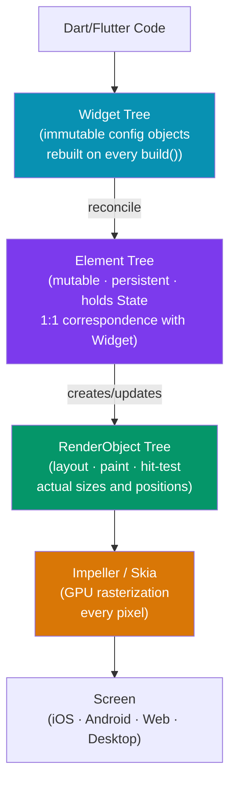

# 🏛️ Flutter Architecture

> [!abstract] TL;DR
> Flutter owns its entire rendering pipeline — it uses **Impeller** (or Skia on older devices) to paint every pixel itself rather than mapping to native widgets. This gives pixel-perfect parity across iOS, Android, web, and desktop. The framework maintains three synchronized trees: **Widget** (immutable config, rebuilt constantly), **Element** (mutable, long-lived, holds State), and **RenderObject** (layout, paint, hit-testing). Build modes: debug (JIT + hot reload), profile (AOT + profiling, the only honest benchmark), release (stripped AOT).

## Intuition — analogy FIRST

Flutter's rendering is like a custom print shop that owns its own printing press. Most cross-platform frameworks are like using whatever printer the local shop has (native widgets) — you get different ink, different paper, and slightly different results on each platform.

Flutter bought its own press (Impeller) and designs every letter, font, shadow, and color directly. The output is guaranteed identical on every surface because the same press runs everywhere. The only difference is the surface (iOS glass, Android plastic, browser canvas).

The three trees are like a theatre production: the **Script** (Widget) is what the director (developer) writes — immutable, rewritten for each scene. The **Actors** (Elements) are the persistent performers who know their lines and state. The **Stage mechanics** (RenderObjects) handle the physical space, lighting, and movement.

---

## How It Works



---

## Key Concepts / Details

### The Three Synchronized Trees

**Widget Tree** (immutable configuration):
- Each `Widget` is an immutable description of UI
- `build()` is called frequently — widgets are cheap to create and discard
- Like React's virtual DOM elements — a plain object describing what should exist

**Element Tree** (mutable, long-lived):
- Each `Element` corresponds to one `Widget` in the tree
- Elements persist across rebuilds — they hold `State` for `StatefulWidget`
- When `build()` returns a new widget, Flutter checks if the element can be updated (same `runtimeType` and `key`) or if a new element must be created
- This is where widget identity is maintained

**RenderObject Tree** (layout and painting):
- `RenderObject` performs actual layout (computes sizes/positions) and painting
- Expensive to create — fewer widgets have RenderObjects than Elements
- `RenderBox` (the most common) uses the box layout model
- Layout runs in one pass: constraints go down, sizes go up, parent positions

```dart
// Widget — configuration only, cheap, immutable
class MyButton extends StatelessWidget {
  final String label;
  final VoidCallback onPressed;

  const MyButton({super.key, required this.label, required this.onPressed});

  @override
  Widget build(BuildContext context) {
    // Returns new widget objects every build — that's OK
    return ElevatedButton(onPressed: onPressed, child: Text(label));
  }
}
```

### Build Modes

| Mode | Compilation | Performance | Use For |
|------|------------|-------------|---------|
| `flutter run` (debug) | JIT | Slow — 2-3x slower than release | Development, hot reload |
| `flutter run --profile` | AOT | Near-release speed | Performance profiling |
| `flutter build` (release) | AOT + stripped | Fastest | Distribution |

**Critical rule:** Always profile in `--profile` mode on a real device. Debug mode's JIT compilation makes everything appear slower. The Flutter DevTools Performance view only reflects the true cost in profile mode.

```bash
# Debug — hot reload, slow
flutter run

# Profile — measure real performance
flutter run --profile

# Release build — what users get
flutter build apk --release
flutter build ios --release
```

### Impeller vs Skia

- **Skia** — the original renderer (used before Flutter 3.10). Compiles shaders at runtime (causes jank/hitches on first animation).
- **Impeller** — Flutter's new renderer (default on iOS since 3.10, Android since 3.16). Compiles shaders ahead of time — eliminates "shader compilation jank". Predictable 120fps.

```dart
// Web renderers (Flutter web)
// CanvasKit — Impeller/Skia in WASM (~1.5MB overhead, pixel-perfect)
// skwasm — newest (requires COOP/COEP cross-origin isolation headers)
// HTML renderer — removed in Flutter 3.29+
```

### Platform Channels — Native Interop

Flutter communicates with native iOS/Android code via `MethodChannel`:

```dart
// Dart side
class BatteryService {
  static const channel = MethodChannel('com.example.app/battery');

  static Future<int> getBatteryLevel() async {
    try {
      final level = await channel.invokeMethod<int>('getBatteryLevel');
      return level ?? -1;
    } on PlatformException catch (e) {
      throw Exception('Failed: ${e.message}');
    }
  }
}
```

```kotlin
// Android side (Kotlin)
class MainActivity : FlutterActivity() {
  private val CHANNEL = "com.example.app/battery"

  override fun configureFlutterEngine(flutterEngine: FlutterEngine) {
    super.configureFlutterEngine(flutterEngine)
    MethodChannel(flutterEngine.dartExecutor.binaryMessenger, CHANNEL)
      .setMethodCallHandler { call, result ->
        if (call.method == "getBatteryLevel") {
          val level = getBatteryLevel()
          if (level != -1) result.success(level)
          else result.error("UNAVAILABLE", "Battery not available", null)
        } else {
          result.notImplemented()
        }
      }
  }
}
```

**`pigeon`** — generates type-safe Dart + native bindings from a schema, eliminating the stringly-typed `invokeMethod` pattern.

### Flutter vs React Native Architecture

| Aspect | Flutter | React Native |
|--------|---------|-------------|
| Rendering | Owns rendering (Impeller/Skia) | Uses native widgets (UIKit, Android Views) |
| Cross-platform parity | Pixel-identical | Platform-specific look |
| Performance | Smooth 120fps (Impeller) | Can be smooth, depends on bridge |
| Language | Dart (compiled AOT) | JavaScript (or TypeScript) |
| Bridge | MethodChannel for native | New Architecture (JSI, Fabric) |
| Bundle size | ~5MB overhead (CanvasKit for web) | Smaller native bridge |
| UI flexibility | Full custom render control | Limited to native widget capabilities |

### Flavors — Dev/Staging/Production

```bash
# Flavor configuration in pubspec.yaml and android/ios native configs
flutter run --flavor dev -t lib/main_dev.dart
flutter run --flavor staging -t lib/main_staging.dart
flutter build apk --flavor prod -t lib/main_prod.dart
```

```dart
// Entry points for each flavor
// lib/main_dev.dart
void main() {
  const environment = String.fromEnvironment('FLAVOR', defaultValue: 'dev');
  runApp(MyApp(config: AppConfig.forEnvironment(environment)));
}
```

### CI/CD Pipeline

```yaml
# github actions — typical Flutter CI
- run: flutter analyze
- run: flutter test
- run: flutter build apk --release
- run: flutter build ios --release --no-codesign
# Distribute via Firebase App Distribution, TestFlight, Play Store
```

---

## Real-World Notes

- **Flutter's "everything is a widget" model** — even padding, alignment, and layout are widgets. This uniformity simplifies the API surface but can create deep widget trees.
- **The element tree explains why `setState` works** — calling `setState` marks the element dirty and schedules a rebuild. The element persists; only the widget configuration is replaced.
- **Profile on a physical device** — simulator/emulator performance does not reflect real user experience. Always use `--profile` on a real device for performance decisions.
- **`const` widgets are a free optimization** — `const Text('Hello')` is compiled to a singleton. Flutter skips rebuilding it entirely. Use `const` on any widget with no dynamic data.

---

## Common Pitfalls

- **Not understanding the widget/element distinction** — when you "set state," you're not destroying and recreating the element; you're asking Flutter to reconcile the element with a new widget configuration.
- **Profiling in debug mode** — if your animation is slow in debug mode, it doesn't mean it will be slow in release. Always `flutter run --profile` before optimizing.
- **Calling platform channels from the wrong thread** — `MethodChannel.invokeMethod` must be called from the main isolate. Use `compute()` for heavy work, then invoke the channel from the result handler.
- **Forgetting `await` in async MethodChannel calls** — the call is async; without `await`, exceptions are swallowed.

---

## Related Concepts

- [[_MOC_Flutter|↑ Section MOC]]
- [[Dart_Language]] — The language that compiles to Flutter's native code
- [[Widgets_and_Layout]] — Detailed look at the Widget and RenderObject trees
- [[State_Management_Flutter]] — State lives in Elements; how `setState` and providers work

---

## Review Questions

1. Describe the three synchronized trees in Flutter. What does each one do?
2. Why does Flutter own its rendering engine (Impeller) instead of using native widgets?
3. What is the difference between debug, profile, and release build modes? Which one should you use for performance benchmarking?
4. How does a `MethodChannel` work? Give a real-world use case.
5. Why does Flutter use `const` constructors for widgets, and what performance benefit does it provide?

---

## Sources

- Flutter docs: Architectural overview — https://docs.flutter.dev/resources/architectural-overview
- Flutter docs: Build modes — https://docs.flutter.dev/testing/build-modes
- Impeller — https://github.com/flutter/flutter/wiki/Impeller
- Flutter docs: Platform channels — https://docs.flutter.dev/platform-integration/platform-channels

#web-development #flutter #architecture #impeller #three-trees
