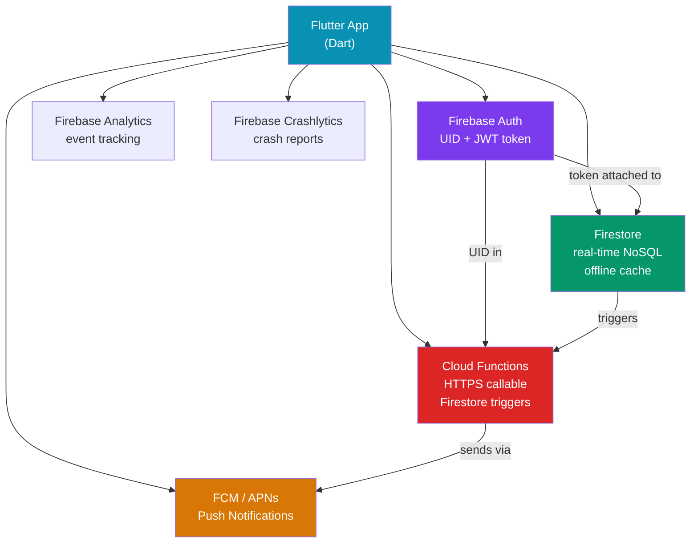

# 🔥 Flutter Firebase Integration

> [!abstract] TL;DR
> **FlutterFire** is the official suite of Flutter plugins for Firebase. It covers Auth (email, Google, Apple, anonymous), Firestore (real-time NoSQL with offline cache), Cloud Functions (server-side logic triggered from Dart), FCM (push notifications via APNs/FCM), Analytics, and Crashlytics. Setup requires a `google-services.json` (Android) and `GoogleService-Info.plist` (iOS) and a `Firebase.initializeApp()` call before `runApp()`. Every Firebase operation returns a `Future` or `Stream` — compose them with Riverpod / BLoC for reactive UI.

## Intuition — analogy first

Think of Firebase as a fully managed backend hotel. Your Flutter app is the guest: it never manages the kitchen (servers), plumbing (databases), or security doors (auth). It just checks in at the front desk (Auth), drops luggage in its room (Firestore), orders room service (Cloud Functions), and gets woken up by a bellhop (push notifications). Firebase manages all infrastructure; your Dart code only describes *what* to ask for, not *how* to run it.

---

## How It Works



---

## Key Concepts / Details

### FlutterFire Setup

```bash
# 1. Install FlutterFire CLI
dart pub global activate flutterfire_cli

# 2. Configure — generates firebase_options.dart
flutterfire configure

# 3. Add packages
flutter pub add firebase_core firebase_auth cloud_firestore firebase_messaging
flutter pub add firebase_analytics firebase_crashlytics
```

```dart
// main.dart — initialize before runApp()
import 'package:firebase_core/firebase_core.dart';
import 'firebase_options.dart'; // generated by flutterfire configure

void main() async {
  WidgetsFlutterBinding.ensureInitialized();
  await Firebase.initializeApp(options: DefaultFirebaseOptions.currentPlatform);
  runApp(const MyApp());
}
```

---

### Firebase Auth

```dart
import 'package:firebase_auth/firebase_auth.dart';

class AuthService {
  final _auth = FirebaseAuth.instance;

  // Email / password
  Future<UserCredential> signIn(String email, String password) =>
      _auth.signInWithEmailAndPassword(email: email, password: password);

  Future<UserCredential> register(String email, String password) =>
      _auth.createUserWithEmailAndPassword(email: email, password: password);

  Future<void> signOut() => _auth.signOut();

  // Stream — emits on every auth state change
  Stream<User?> get authState => _auth.authStateChanges();

  // Google Sign-In (add google_sign_in package)
  Future<UserCredential> signInWithGoogle() async {
    final googleUser = await GoogleSignIn().signIn();
    final googleAuth = await googleUser!.authentication;
    final credential = GoogleAuthProvider.credential(
      accessToken: googleAuth.accessToken,
      idToken: googleAuth.idToken,
    );
    return _auth.signInWithCredential(credential);
  }
}

// In widget — react to auth state
StreamBuilder<User?>(
  stream: AuthService().authState,
  builder: (context, snapshot) {
    if (snapshot.connectionState == ConnectionState.waiting) {
      return const CircularProgressIndicator();
    }
    return snapshot.hasData ? const HomeScreen() : const LoginScreen();
  },
)
```

---

### Cloud Firestore

```dart
import 'package:cloud_firestore/cloud_firestore.dart';

class UserRepository {
  final _db = FirebaseFirestore.instance;

  CollectionReference get _users => _db.collection('users');

  // Write — auto-generates document ID
  Future<DocumentReference> createUser(Map<String, dynamic> data) =>
      _users.add({...data, 'createdAt': FieldValue.serverTimestamp()});

  // Write — specific ID
  Future<void> updateUser(String uid, Map<String, dynamic> fields) =>
      _users.doc(uid).set(fields, SetOptions(merge: true));

  // Read once
  Future<Map<String, dynamic>?> getUser(String uid) async {
    final doc = await _users.doc(uid).get();
    return doc.data() as Map<String, dynamic>?;
  }

  // Real-time stream — UI updates automatically
  Stream<QuerySnapshot> getUsersStream() => _users
      .where('active', isEqualTo: true)
      .orderBy('createdAt', descending: true)
      .limit(50)
      .snapshots();

  // Batch write — atomic, up to 500 operations
  Future<void> batchUpdate(List<String> uids, Map<String, dynamic> fields) async {
    final batch = _db.batch();
    for (final uid in uids) {
      batch.update(_users.doc(uid), fields);
    }
    await batch.commit();
  }

  // Transaction — read-then-write atomically
  Future<void> incrementScore(String uid, int delta) =>
      _db.runTransaction((txn) async {
        final doc = await txn.get(_users.doc(uid));
        final current = (doc.data() as Map)['score'] as int? ?? 0;
        txn.update(_users.doc(uid), {'score': current + delta});
      });
}
```

**Offline persistence** is enabled by default on iOS/Android. Data is cached locally and synced when connectivity resumes.

---

### Cloud Functions — HTTPS Callable

```dart
import 'package:cloud_functions/cloud_functions.dart';

class FunctionsService {
  final _functions = FirebaseFunctions.instance;

  Future<Map<String, dynamic>> processPayment({
    required String token,
    required int amountCents,
  }) async {
    final callable = _functions.httpsCallable('processPayment');
    final result = await callable.call({
      'token': token,
      'amount': amountCents,
    });
    return Map<String, dynamic>.from(result.data as Map);
  }
}
```

```javascript
// functions/index.js (Cloud Functions v2)
const { onCall, HttpsError } = require('firebase-functions/v2/https');
const { initializeApp } = require('firebase-admin/app');
initializeApp();

exports.processPayment = onCall(async (request) => {
  if (!request.auth) throw new HttpsError('unauthenticated', 'Login required');
  // process payment with Stripe, etc.
  return { success: true, transactionId: 'txn_123' };
});
```

---

### Firebase Cloud Messaging (Push Notifications)

```dart
import 'package:firebase_messaging/firebase_messaging.dart';

// Top-level function — must be at the top level, not a class member
@pragma('vm:entry-point')
Future<void> _firebaseBackgroundHandler(RemoteMessage message) async {
  await Firebase.initializeApp();
  print('Background message: ${message.messageId}');
}

class NotificationService {
  final _messaging = FirebaseMessaging.instance;

  Future<void> initialize() async {
    // Request permissions (iOS)
    await _messaging.requestPermission(alert: true, badge: true, sound: true);

    // Register background handler
    FirebaseMessaging.onBackgroundMessage(_firebaseBackgroundHandler);

    // Get FCM token — send this to your server
    final token = await _messaging.getToken();
    print('FCM Token: $token');

    // Foreground messages
    FirebaseMessaging.onMessage.listen((message) {
      print('Foreground message: ${message.notification?.title}');
      // Show local notification using flutter_local_notifications
    });

    // App opened from notification (background → foreground)
    FirebaseMessaging.onMessageOpenedApp.listen((message) {
      // Navigate to relevant screen based on message.data
    });
  }

  // Subscribe to topic for broadcast messages
  Future<void> subscribeToTopic(String topic) =>
      _messaging.subscribeToTopic(topic);
}
```

---

### Firebase Analytics

```dart
import 'package:firebase_analytics/firebase_analytics.dart';

class AnalyticsService {
  final _analytics = FirebaseAnalytics.instance;

  // Log a custom event
  Future<void> logPurchase({required double value, required String currency}) =>
      _analytics.logPurchase(value: value, currency: currency);

  Future<void> logScreenView(String screenName) =>
      _analytics.logScreenView(screenName: screenName);

  Future<void> logEvent(String name, Map<String, Object> params) =>
      _analytics.logEvent(name: name, parameters: params);

  // Set user properties for segmentation
  Future<void> setUserProperty(String name, String value) =>
      _analytics.setUserProperty(name: name, value: value);
}

// NavigatorObserver — auto-tracks screen views
MaterialApp(
  navigatorObservers: [
    FirebaseAnalyticsObserver(analytics: FirebaseAnalytics.instance),
  ],
)
```

---

## Trade-offs

| Aspect | Firebase | Self-hosted Backend |
|--------|----------|---------------------|
| Setup time | Minutes | Days to weeks |
| Cost model | Pay-per-use (free tier generous) | Fixed infra cost |
| Vendor lock-in | High — proprietary SDK | None |
| Offline support | Built-in (Firestore) | Custom effort |
| Complex queries | Limited (no JOINs, no full-text) | Full SQL/ElasticSearch |
| Real-time | Built-in streams | WebSocket/SSE setup |
| Security rules | Declarative (powerful but tricky) | Custom middleware |
| Scaling | Automatic | Manual configuration |

---

## Common Pitfalls

- **Calling `Firebase.initializeApp()` after `runApp()`** — any Firebase call before initialization throws. Always `await Firebase.initializeApp()` inside `main()` before `runApp()`.
- **Firestore N+1 reads** — reading documents in a loop (`for uid in uids: getDoc(uid)`) fires N separate requests. Use `whereIn` queries (max 30 items) or batch reads.
- **FCM token not refreshed** — FCM tokens can rotate. Always listen to `_messaging.onTokenRefresh` and update your server-side record.
- **Firestore Security Rules defaulting to deny** — after testing in emulator, shipping to production with overly open rules (`allow read, write: if true`) is a common security mistake. Rules should scope reads/writes to the authenticated user's UID.
- **Not using offline persistence limitations** — Firestore's offline cache doesn't support queries that weren't previously executed while online. Plan your data model accordingly.
- **Background handler must be top-level** — `FirebaseMessaging.onBackgroundMessage()` handler must be a top-level or static function, not a class method. The `@pragma('vm:entry-point')` annotation is required to prevent tree-shaking in release builds.

---

## Related Concepts

- [[_MOC_Flutter|↑ Section MOC]]
- [[Flutter_Networking]] — REST APIs and WebSockets as alternatives to Firestore
- [[State_Management_Flutter]] — managing Firebase streams with Riverpod or BLoC
- [[Dart_Advanced]] — Streams and Futures that Firebase returns

---

## Review Questions

1. Why must `Firebase.initializeApp()` be called before `runApp()`? What happens if you skip `WidgetsFlutterBinding.ensureInitialized()`?
2. What is the difference between `snapshots()` and `get()` in Firestore? When would you use each?
3. A Firestore transaction reads a document and increments a counter. Why must you use a transaction rather than a regular read-then-write?
4. FCM background message handlers must be top-level functions. Why? What does `@pragma('vm:entry-point')` do?
5. Your Firestore security rules are `allow read, write: if request.auth != null`. What security risk does this create, and how would you improve it?

---

## Sources

- FlutterFire docs — https://firebase.flutter.dev/
- Firebase Auth — https://firebase.google.com/docs/auth/flutter/start
- Cloud Firestore — https://firebase.google.com/docs/firestore/quickstart
- FCM Flutter — https://firebase.flutter.dev/docs/messaging/overview
- Firebase Analytics — https://firebase.flutter.dev/docs/analytics/overview

#web-development #flutter #firebase #flutterfire #firestore #fcm
