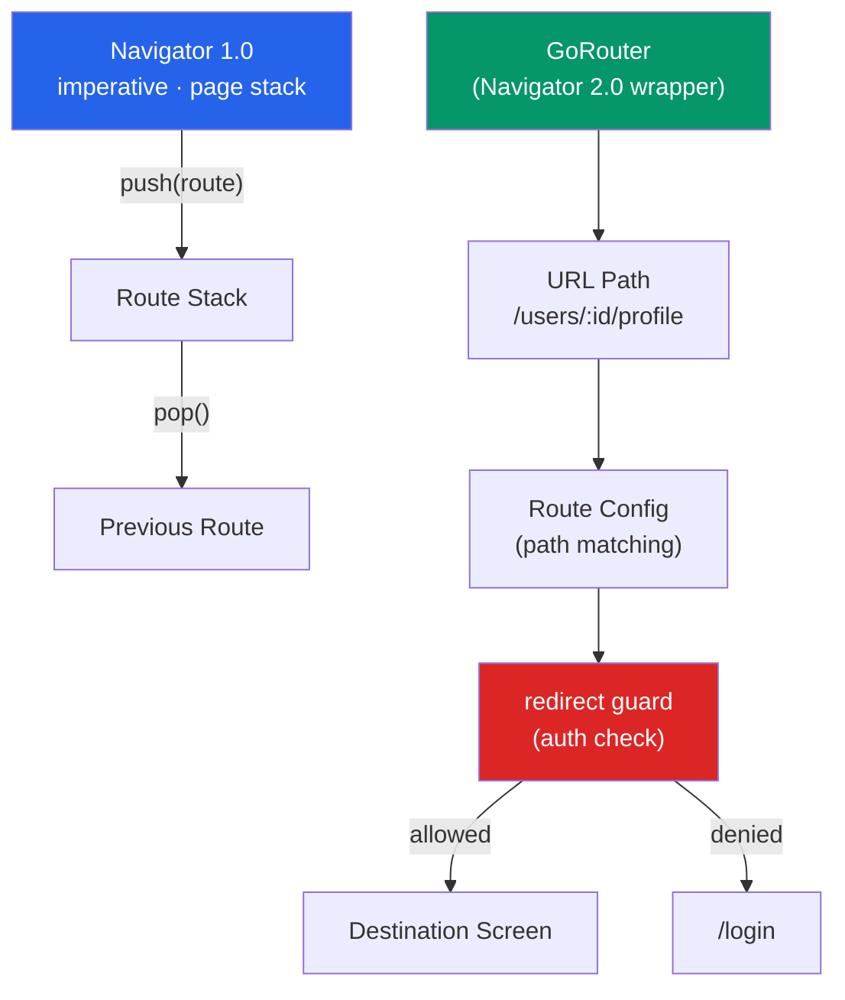

# 🗺️ Flutter Navigation

> [!abstract] TL;DR
> Flutter has two navigation APIs: **Navigator 1.0** (imperative stack: `push`/`pop`, simple but no URL sync) and **Navigator 2.0** (declarative Router API, URL-driven, needed for deep linking and web). **GoRouter** (the official recommended package) wraps Navigator 2.0 with a clean path-based API: `context.go` (replace), `context.push` (stack), path params `:id`, centralized `redirect` guards, `errorBuilder`, and `StatefulShellRoute.indexedStack` for persistent bottom-nav tabs. `Hero` provides shared-element transitions; `PopScope` controls back navigation.

## Intuition — analogy FIRST

**Navigator 1.0** is like a browser with only a Back button. You can only go back; you can't type a URL or jump to a specific page directly. It works fine for simple linear flows.

**Navigator 2.0 / GoRouter** is like a full browser with an address bar, back/forward buttons, and bookmarks (deep links). The URL defines the application state; you can navigate to any point directly. GoRouter is the address bar software — you type `/users/42/profile` and GoRouter figures out which screens to show.

**Hero** is the cinema zoom-in effect — an element "flies" from one scene (screen) to another, creating a visual continuity that helps users understand spatial relationships.

---

## How It Works



---

## Key Concepts / Details

### Navigator 1.0 — Imperative Stack

```dart
// Push a new route onto the stack
Navigator.push(context, MaterialPageRoute(
  builder: (context) => const UserDetailPage(userId: 42),
));

// Named route (registered in MaterialApp.routes)
Navigator.pushNamed(context, '/users', arguments: { 'filter': 'active' });

// Pop the current route (go back)
Navigator.pop(context);
Navigator.pop(context, result); // pass result back to caller

// Push and remove all previous routes (login → home)
Navigator.pushAndRemoveUntil(
  context,
  MaterialPageRoute(builder: (_) => const HomePage()),
  (route) => false, // remove all
);

// Await a result from a pushed route
final result = await Navigator.push<String>(
  context,
  MaterialPageRoute(builder: (_) => const PickerPage()),
);
if (result != null) handleSelection(result);
```

### GoRouter — Official Recommended Package

```dart
// Add to pubspec.yaml: go_router: ^14.0.0

// 1. Define routes
final router = GoRouter(
  initialLocation: '/',
  debugLogDiagnostics: true, // log route changes in debug

  // Auth redirect guard — runs before every navigation
  redirect: (context, state) {
    final isLoggedIn = AuthService.isLoggedIn();
    final isGoingToLogin = state.matchedLocation == '/login';

    if (!isLoggedIn && !isGoingToLogin) return '/login';
    if (isLoggedIn && isGoingToLogin) return '/';
    return null; // no redirect
  },

  errorBuilder: (context, state) => ErrorPage(error: state.error),

  routes: [
    GoRoute(path: '/', builder: (_, __) => const HomePage()),

    // Path parameters with :id
    GoRoute(
      path: '/users',
      builder: (_, __) => const UsersPage(),
      routes: [
        GoRoute(
          path: ':id',
          builder: (context, state) {
            final userId = int.parse(state.pathParameters['id']!);
            return UserDetailPage(userId: userId);
          },
          routes: [
            GoRoute(
              path: 'profile',
              builder: (context, state) {
                final userId = int.parse(state.pathParameters['id']!);
                return UserProfilePage(userId: userId);
              },
            ),
          ],
        ),
      ],
    ),

    // Query parameters
    GoRoute(
      path: '/search',
      builder: (context, state) {
        final query = state.uri.queryParameters['q'] ?? '';
        return SearchPage(query: query);
      },
    ),

    // Redirect
    GoRoute(path: '/old-path', redirect: (_, __) => '/new-path'),
  ],
);

// 2. Register in MaterialApp
MaterialApp.router(
  routerConfig: router,
  title: 'My App',
);

// 3. Navigate
context.go('/users/42');              // REPLACE stack (no back button)
context.push('/users/42/profile');   // PUSH onto stack (back button available)
context.replace('/login');            // replace current route
context.pop();                        // pop current route
context.goNamed('user-detail',        // named route
  pathParameters: { 'id': '42' },
  queryParameters: { 'tab': 'posts' }
);

// 4. Access parameters in the widget
class UserDetailPage extends StatelessWidget {
  final int userId;
  const UserDetailPage({super.key, required this.userId});

  @override
  Widget build(BuildContext context) {
    // Can also access via GoRouterState:
    final state = GoRouterState.of(context);
    final id = state.pathParameters['id'];

    return Scaffold(body: Text('User $userId'));
  }
}
```

### Persistent Bottom Navigation with `StatefulShellRoute`

```dart
final router = GoRouter(
  routes: [
    StatefulShellRoute.indexedStack(
      builder: (context, state, navigationShell) {
        return ScaffoldWithNavBar(navigationShell: navigationShell);
      },
      branches: [
        StatefulShellBranch(routes: [
          GoRoute(path: '/home', builder: (_, __) => const HomePage()),
        ]),
        StatefulShellBranch(routes: [
          GoRoute(path: '/discover', builder: (_, __) => const DiscoverPage()),
        ]),
        StatefulShellBranch(routes: [
          GoRoute(path: '/profile', builder: (_, __) => const ProfilePage()),
        ]),
      ],
    ),
  ],
);

class ScaffoldWithNavBar extends StatelessWidget {
  final StatefulNavigationShell navigationShell;
  const ScaffoldWithNavBar({super.key, required this.navigationShell});

  @override
  Widget build(BuildContext context) {
    return Scaffold(
      body: navigationShell, // renders the current branch
      bottomNavigationBar: BottomNavigationBar(
        currentIndex: navigationShell.currentIndex,
        onTap: (index) => navigationShell.goBranch(
          index,
          initialLocation: index == navigationShell.currentIndex,
        ),
        items: const [
          BottomNavigationBarItem(icon: Icon(Icons.home), label: 'Home'),
          BottomNavigationBarItem(icon: Icon(Icons.explore), label: 'Discover'),
          BottomNavigationBarItem(icon: Icon(Icons.person), label: 'Profile'),
        ],
      ),
    );
  }
}
```

### Deep Linking

```dart
// Android: android/app/src/main/AndroidManifest.xml
// <intent-filter>
//   <action android:name="android.intent.action.VIEW"/>
//   <category android:name="android.intent.category.DEFAULT"/>
//   <category android:name="android.intent.category.BROWSABLE"/>
//   <data android:scheme="https" android:host="example.com"/>
// </intent-filter>

// iOS: ios/Runner/Info.plist
// FlutterDeepLinkingEnabled = true
// CFBundleURLTypes with CFBundleURLSchemes

// GoRouter automatically handles deep links matching your route patterns
// https://example.com/users/42 → navigates to /users/42 route

// Flutter Universal Links (HTTPS) vs Custom Schemes (myapp://)
// Universal Links (App Links) are preferred — no disambiguation dialog
```

### Hero Transitions — Shared Element Animation

```dart
// Source screen
class ProductListPage extends StatelessWidget {
  @override
  Widget build(BuildContext context) {
    return GridView.builder(
      gridDelegate: const SliverGridDelegateWithFixedCrossAxisCount(crossAxisCount: 2),
      itemBuilder: (context, index) {
        final product = products[index];
        return GestureDetector(
          onTap: () => context.push('/products/${product.id}'),
          child: Hero(
            tag: 'product-${product.id}', // must match destination tag
            child: Image.network(product.imageUrl),
          ),
        );
      },
    );
  }
}

// Destination screen
class ProductDetailPage extends StatelessWidget {
  final String productId;
  @override
  Widget build(BuildContext context) {
    final product = getProduct(productId);
    return Scaffold(
      body: Column(children: [
        Hero(
          tag: 'product-${product.id}', // same tag — Flutter animates between them
          child: Image.network(product.imageUrl, width: double.infinity, height: 300),
        ),
        Text(product.name),
      ]),
    );
  }
}
```

### `PopScope` — Controlling Back Navigation

```dart
class FormPage extends StatefulWidget {
  @override
  State<FormPage> createState() => _FormPageState();
}

class _FormPageState extends State<FormPage> {
  bool _hasUnsavedChanges = false;

  @override
  Widget build(BuildContext context) {
    return PopScope(
      canPop: !_hasUnsavedChanges, // prevent back if unsaved changes

      onPopInvokedWithResult: (didPop, result) async {
        if (didPop) return; // already popped — nothing to do

        // Show confirmation dialog
        final confirmed = await showDialog<bool>(
          context: context,
          builder: (_) => AlertDialog(
            title: const Text('Discard changes?'),
            actions: [
              TextButton(onPressed: () => Navigator.pop(context, false), child: const Text('Cancel')),
              TextButton(onPressed: () => Navigator.pop(context, true), child: const Text('Discard')),
            ],
          ),
        );

        if (confirmed == true && context.mounted) {
          context.pop();
        }
      },

      child: Form(
        onChanged: () => setState(() => _hasUnsavedChanges = true),
        child: ...,
      ),
    );
  }
}
// IMPORTANT: Always check `context.mounted` after an `await` — the widget
// may have been disposed while the dialog was open.
```

---

## Real-World Notes

- **Use GoRouter for all production apps.** Navigator 1.0 doesn't handle deep links, browser back/forward, or URL-driven state — all of which users expect.
- **`context.go` vs `context.push`** — `go` replaces the entire stack (like a web redirect), `push` adds to it (like opening a modal or detail page). Misusing them is the most common GoRouter mistake.
- **GoRouter `redirect` runs on every navigation** — cache auth state efficiently (use a stream/notifier) to avoid blocking navigation.
- **`context.mounted` after `await`** — after any `await` in a widget method, the widget might have been disposed. Always check `if (context.mounted)` before using `context` after an await.

---

## Common Pitfalls

- **Using `Navigator.push` alongside GoRouter** — mixing APIs creates URL desync. Use GoRouter exclusively (`context.go`/`context.push`).
- **Forgetting `context.mounted` after await** — using `context.pop()` or `context.go()` after `await someDialog()` when the widget is disposed causes "Looking up a deactivated widget's ancestor is unsafe."
- **`Hero` tag conflicts** — if the same tag appears twice on screen simultaneously (e.g., in a list where the hero is visible), Flutter throws. Use unique tags per item.
- **Incorrect `canPop` logic in `PopScope`** — `canPop: false` prevents ALL back navigation including the OS back gesture on Android. Ensure the `onPopInvokedWithResult` callback handles the navigation manually.

---

## Related Concepts

- [[_MOC_Flutter|↑ Section MOC]]
- [[State_Management_Flutter]] — State that persists across navigation (Riverpod, Provider)
- [[Widgets_and_Layout]] — Scaffold and page widget structure
- [[Flutter_Architecture]] — The element tree that persists state across navigations

---

## Review Questions

1. What is the difference between Navigator 1.0 and Navigator 2.0? Why does GoRouter exist?
2. What is the difference between `context.go('/path')` and `context.push('/path')` in GoRouter?
3. How does `StatefulShellRoute.indexedStack` implement persistent bottom navigation tabs?
4. How does the `Hero` widget work? What must match between source and destination?
5. Why must you check `context.mounted` after an `await` in a Flutter widget?

---

## Sources

- GoRouter docs — https://pub.dev/packages/go_router
- Flutter docs: Navigation — https://docs.flutter.dev/ui/navigation
- GoRouter: StatefulShellRoute — https://pub.dev/documentation/go_router/latest/topics/StatefulShellRoute-topic.html
- Flutter docs: Deep linking — https://docs.flutter.dev/ui/navigation/deep-linking

#web-development #flutter #navigation #gorouter #deep-linking #hero
