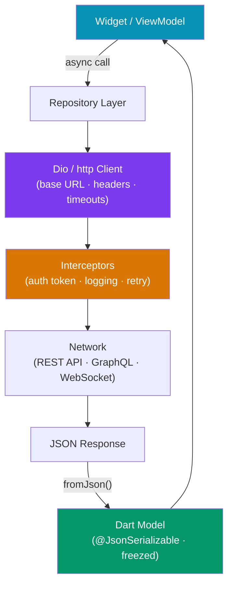

# 🌐 Flutter Networking

> [!abstract] TL;DR
> Flutter networking centers on two HTTP packages: **`http`** (simple, lightweight, Google-maintained) and **`dio`** (powerful — interceptors, cancel tokens, retry, multipart). JSON serialization uses **`json_annotation`** + **`build_runner`** for code-gen, or **`freezed`** for immutable models. **WebSockets** are handled via `dart:io`'s `WebSocket` or the `web_socket_channel` package. **GraphQL** integrates through `graphql_flutter`. Always move heavy parsing to an isolate via `compute()`.

## Intuition — analogy first

Think of `http` as a basic postal service — you drop a letter (request) in the box and eventually get a reply (response). `dio` is a courier service with add-ons: you can intercept every package in transit (interceptors), stop a delivery mid-flight (cancel tokens), and automatically retry if the courier truck breaks down (retry interceptor). JSON serialization code-gen (`build_runner`) is like a stamp machine: you design the blueprint once (annotations) and the machine generates all the boilerplate.

---

## How It Works



---

## Key Concepts / Details

### `http` Package — Simple Requests

```bash
flutter pub add http
```

```dart
import 'package:http/http.dart' as http;
import 'dart:convert';

class ApiClient {
  static const _baseUrl = 'https://api.example.com';
  final _client = http.Client(); // reuse — don't create per-request

  Future<List<Product>> getProducts() async {
    final response = await _client.get(
      Uri.parse('$_baseUrl/products'),
      headers: {
        'Authorization': 'Bearer $token',
        'Accept': 'application/json',
      },
    );

    if (response.statusCode == 200) {
      final List json = jsonDecode(response.body);
      return json.map((e) => Product.fromJson(e)).toList();
    } else {
      throw ApiException(
        statusCode: response.statusCode,
        message: 'Failed to fetch products',
      );
    }
  }

  Future<Product> createProduct(Map<String, dynamic> data) async {
    final response = await _client.post(
      Uri.parse('$_baseUrl/products'),
      headers: {'Content-Type': 'application/json', 'Authorization': 'Bearer $token'},
      body: jsonEncode(data),
    );
    if (response.statusCode == 201) {
      return Product.fromJson(jsonDecode(response.body));
    }
    throw ApiException(statusCode: response.statusCode, message: response.body);
  }

  void dispose() => _client.close();
}
```

---

### `dio` Package — Production-Grade HTTP

```bash
flutter pub add dio
flutter pub add dio_smart_retry # optional: auto-retry
```

```dart
import 'package:dio/dio.dart';

class DioClient {
  late final Dio _dio;

  DioClient({required String baseUrl, required String authToken}) {
    _dio = Dio(BaseOptions(
      baseUrl: baseUrl,
      connectTimeout: const Duration(seconds: 10),
      receiveTimeout: const Duration(seconds: 15),
      headers: {
        'Accept': 'application/json',
        'Content-Type': 'application/json',
      },
    ));

    _setupInterceptors(authToken);
  }

  void _setupInterceptors(String token) {
    // Logging interceptor
    _dio.interceptors.add(LogInterceptor(
      requestBody: true,
      responseBody: true,
      error: true,
    ));

    // Auth interceptor — attach token, refresh on 401
    _dio.interceptors.add(InterceptorsWrapper(
      onRequest: (options, handler) {
        options.headers['Authorization'] = 'Bearer $token';
        return handler.next(options);
      },
      onError: (DioException error, handler) async {
        if (error.response?.statusCode == 401) {
          // Refresh token and retry
          try {
            final newToken = await refreshToken();
            error.requestOptions.headers['Authorization'] = 'Bearer $newToken';
            final response = await _dio.fetch(error.requestOptions);
            return handler.resolve(response);
          } catch (e) {
            return handler.reject(error);
          }
        }
        return handler.next(error);
      },
    ));
  }

  Future<List<Product>> getProducts({CancelToken? cancelToken}) async {
    try {
      final response = await _dio.get<List>(
        '/products',
        cancelToken: cancelToken,
        queryParameters: {'page': 1, 'limit': 20},
      );
      return response.data!.map((e) => Product.fromJson(e)).toList();
    } on DioException catch (e) {
      throw _handleError(e);
    }
  }

  // Multipart file upload
  Future<String> uploadImage(File imageFile) async {
    final formData = FormData.fromMap({
      'file': await MultipartFile.fromFile(imageFile.path, filename: 'image.jpg'),
      'type': 'product',
    });
    final response = await _dio.post('/uploads', data: formData);
    return response.data['url'] as String;
  }

  ApiException _handleError(DioException e) => switch (e.type) {
    DioExceptionType.connectionTimeout => ApiException(message: 'Connection timeout'),
    DioExceptionType.receiveTimeout    => ApiException(message: 'Server timeout'),
    DioExceptionType.cancel            => ApiException(message: 'Request cancelled'),
    _                                  => ApiException(
                                           statusCode: e.response?.statusCode,
                                           message: e.message ?? 'Unknown error'),
  };
}

// Cancel a request mid-flight
final cancelToken = CancelToken();
// Pass to request:
client.getProducts(cancelToken: cancelToken);
// Later:
cancelToken.cancel('User navigated away');
```

---

### JSON Serialization — `json_annotation` + `build_runner`

```bash
flutter pub add json_annotation
flutter pub add dev:json_serializable build_runner
```

```dart
// models/product.dart
import 'package:json_annotation/json_annotation.dart';

part 'product.g.dart'; // generated file

@JsonSerializable()
class Product {
  final String id;
  final String name;
  final double price;

  @JsonKey(name: 'image_url') // map snake_case → camelCase
  final String imageUrl;

  @JsonKey(fromJson: _dateFromJson, toJson: _dateToJson)
  final DateTime createdAt;

  const Product({
    required this.id,
    required this.name,
    required this.price,
    required this.imageUrl,
    required this.createdAt,
  });

  factory Product.fromJson(Map<String, dynamic> json) => _$ProductFromJson(json);
  Map<String, dynamic> toJson() => _$ProductToJson(this);

  static DateTime _dateFromJson(String date) => DateTime.parse(date);
  static String _dateToJson(DateTime date) => date.toIso8601String();
}
```

```bash
# Generate the .g.dart file
dart run build_runner build --delete-conflicting-outputs

# Watch mode during development
dart run build_runner watch
```

**`freezed` — immutable models with union types:**

```bash
flutter pub add freezed_annotation json_annotation
flutter pub add dev:freezed build_runner json_serializable
```

```dart
import 'package:freezed_annotation/freezed_annotation.dart';

part 'user.freezed.dart';
part 'user.g.dart';

@freezed
class User with _$User {
  const factory User({
    required String id,
    required String email,
    @Default(false) bool isAdmin,
  }) = _User;

  factory User.fromJson(Map<String, dynamic> json) => _$UserFromJson(json);
}

// Generates: copyWith, ==, hashCode, toString, fromJson, toJson
final user = User(id: '1', email: 'alice@example.com');
final admin = user.copyWith(isAdmin: true);
```

---

### WebSockets

```bash
flutter pub add web_socket_channel
```

```dart
import 'package:web_socket_channel/web_socket_channel.dart';

class WebSocketService {
  late WebSocketChannel _channel;
  StreamSubscription? _subscription;

  void connect(String url) {
    _channel = WebSocketChannel.connect(Uri.parse(url));

    _subscription = _channel.stream.listen(
      (message) {
        final data = jsonDecode(message as String);
        _handleMessage(data);
      },
      onError: (error) => reconnect(url),
      onDone: () => print('WebSocket disconnected'),
    );
  }

  void send(Map<String, dynamic> data) {
    _channel.sink.add(jsonEncode(data));
  }

  void disconnect() {
    _subscription?.cancel();
    _channel.sink.close();
  }

  void _handleMessage(Map<String, dynamic> data) {
    // Process incoming message
  }

  Future<void> reconnect(String url) async {
    await Future.delayed(const Duration(seconds: 3));
    connect(url);
  }
}

// In a StreamBuilder widget
StreamBuilder(
  stream: _wsService.channel.stream,
  builder: (context, snapshot) {
    if (!snapshot.hasData) return const LoadingWidget();
    return MessageWidget(data: snapshot.data);
  },
)
```

---

### GraphQL with `graphql_flutter`

```bash
flutter pub add graphql_flutter
```

```dart
import 'package:graphql_flutter/graphql_flutter.dart';

// Setup
final _link = HttpLink(
  'https://api.example.com/graphql',
  defaultHeaders: {'Authorization': 'Bearer $token'},
);

final client = GraphQLClient(
  link: _link,
  cache: GraphQLCache(store: HiveStore()), // offline caching
);

// Query
const getUserQuery = r'''
  query GetUser($id: ID!) {
    user(id: $id) {
      id
      name
      email
      posts { id title }
    }
  }
''';

final result = await client.query(QueryOptions(
  document: gql(getUserQuery),
  variables: {'id': '123'},
  fetchPolicy: FetchPolicy.networkOnly,
));

if (result.hasException) throw result.exception!;
final user = result.data?['user'];

// In widget using Query widget
Query(
  options: QueryOptions(document: gql(getUserQuery), variables: {'id': '123'}),
  builder: (result, {fetchMore, refetch}) {
    if (result.isLoading) return const CircularProgressIndicator();
    if (result.hasException) return Text('Error: ${result.exception}');
    final user = result.data!['user'];
    return Text(user['name']);
  },
)
```

---

### Parsing JSON in an Isolate

For large JSON responses (>1MB), parse off the main thread:

```dart
import 'package:flutter/foundation.dart'; // compute()

// Top-level or static function required
List<Product> _parseProducts(String jsonBody) {
  final List raw = jsonDecode(jsonBody);
  return raw.map((e) => Product.fromJson(e as Map<String, dynamic>)).toList();
}

// In your repository
Future<List<Product>> fetchProducts() async {
  final response = await _dio.get<String>('/products', options: Options(responseType: ResponseType.plain));
  return compute(_parseProducts, response.data!);
}
```

---

## Trade-offs

| Package | Strengths | Weaknesses |
|---------|-----------|------------|
| `http` | Lightweight, no dependencies, simple API | No interceptors, no retry, no cancel tokens |
| `dio` | Interceptors, cancel tokens, file upload, retry | Heavier dependency, more boilerplate |
| `json_serializable` | Type-safe, IDE-friendly, handles edge cases | `build_runner` step required |
| `freezed` | Immutable models, union types, copyWith | Even more code-gen; complex setup |
| GraphQL (`graphql_flutter`) | Declarative, caching, real-time subscriptions | Learning curve; overkill for simple REST |
| `web_socket_channel` | Cross-platform, simple API | No automatic reconnection built in |

---

## Common Pitfalls

- **Creating a new `http.Client()` per request** — `http.Client` is reusable and maintains connection pools. Creating one per request loses this benefit and wastes resources. Create it once per service.
- **Parsing JSON on the main isolate for large payloads** — `jsonDecode` for megabyte payloads blocks the main thread and causes jank. Always use `compute(_parseFunction, jsonString)`.
- **Not handling `DioException` types** — treating all Dio errors as server errors misses network timeouts, cancellations, and parsing errors. Handle each `DioExceptionType` separately.
- **Forgetting to cancel requests on widget dispose** — if a widget is disposed before a request completes, `setState` on the defunct widget throws. Store `CancelToken` and cancel in `dispose()`.
- **Using `jsonDecode` with a response already typed** — Dio's `get<Map>()` already parses JSON for you. Calling `jsonDecode(response.data)` on an already-decoded Map throws a type error.

---

## Related Concepts

- [[_MOC_Flutter|↑ Section MOC]]
- [[Dart_Advanced]] — Futures, Streams, isolates (`compute()`)
- [[Flutter_Firebase]] — Firestore as an alternative to REST
- [[State_Management_Flutter]] — repositories feed Cubits/Riverpod providers

---

## Review Questions

1. What is the key advantage of `dio` over the `http` package? Give a real-world use case where `dio` interceptors are essential.
2. Why should you parse large JSON responses using `compute()` instead of doing it directly in `async/await`?
3. What does `build_runner` generate when you use `@JsonSerializable`? What command regenerates it?
4. How do you cancel a `dio` request mid-flight? Why would you want to do this in a Flutter widget?
5. A WebSocket connection drops unexpectedly. What does `onDone` receive, and how would you implement automatic reconnection?

---

## Sources

- http package — https://pub.dev/packages/http
- dio package — https://pub.dev/packages/dio
- json_serializable — https://pub.dev/packages/json_serializable
- freezed — https://pub.dev/packages/freezed
- web_socket_channel — https://pub.dev/packages/web_socket_channel
- graphql_flutter — https://pub.dev/packages/graphql_flutter

#web-development #flutter #networking #dio #rest-api #json #websockets #graphql
