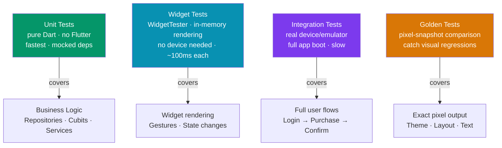

# 🧪 Flutter Testing

> [!abstract] TL;DR
> Flutter has three testing layers: **unit tests** (pure Dart logic, no Flutter framework, fastest), **widget tests** (render a widget tree in memory using `WidgetTester`, no real device needed), and **integration tests** (run on a real device/emulator via `integration_test`, test full user flows). Use **Mocktail** (or `mockito`) for mocking dependencies. **Golden tests** capture rendered screenshots and fail on pixel drift. Run all layers with `flutter test`; integration tests with `flutter test integration_test/`.

## Intuition — analogy first

Testing layers are like quality checks in a car factory. Unit tests are the parts-inspector who checks each bolt individually — fast, isolated, no assembly needed. Widget tests are the assembly-line mock-up: they put the dashboard together on a test rig (no engine, no wheels) and verify the controls look and respond correctly. Integration tests are the test driver who takes the completed car on a real road course — slow but proves the whole system works together.

---

## How It Works



---

## Key Concepts / Details

### Unit Tests — Pure Dart Logic

No `flutter_test` widgets required. These test services, repositories, cubits, and utilities:

```dart
// test/services/cart_service_test.dart
import 'package:flutter_test/flutter_test.dart';
import 'package:mocktail/mocktail.dart';
import 'package:my_app/services/cart_service.dart';
import 'package:my_app/repositories/product_repository.dart';

// Mocktail mock — extend Mock, implement the class
class MockProductRepository extends Mock implements ProductRepository {}

void main() {
  late CartService sut; // system under test
  late MockProductRepository mockRepo;

  setUp(() {
    mockRepo = MockProductRepository();
    sut = CartService(repository: mockRepo);
  });

  group('CartService', () {
    test('addItem increases total price', () {
      // Arrange
      final product = Product(id: '1', name: 'Widget', price: 9.99);
      when(() => mockRepo.getProduct('1')).thenReturn(product);

      // Act
      sut.addItem('1', quantity: 2);

      // Assert
      expect(sut.totalPrice, closeTo(19.98, 0.01));
      verify(() => mockRepo.getProduct('1')).called(1);
    });

    test('removeItem that does not exist throws StateError', () {
      expect(() => sut.removeItem('nonexistent'), throwsA(isA<StateError>()));
    });

    test('clearCart resets total to zero', () {
      sut.addItem('1', quantity: 1);
      sut.clearCart();
      expect(sut.totalPrice, 0.0);
    });
  });
}
```

### Mocktail Essentials

```dart
// Stub a method
when(() => mock.fetchUser(any())).thenAnswer((_) async => fakeUser);

// Stub with specific argument
when(() => mock.getProduct('sku-123')).thenReturn(product);

// Throw an exception
when(() => mock.login(any(), any())).thenThrow(AuthException('invalid'));

// Verify calls
verify(() => mock.saveUser(captureAny())).called(1);
verifyNever(() => mock.deleteUser(any()));

// Capture argument for assertion
final captured = verify(() => mock.save(captureAny())).captured;
expect(captured.single.name, 'Alice');
```

---

### Widget Tests — In-Memory Rendering

Widget tests use `WidgetTester` to pump widgets into an in-memory Flutter engine:

```dart
// test/widgets/login_button_test.dart
import 'package:flutter/material.dart';
import 'package:flutter_test/flutter_test.dart';

void main() {
  testWidgets('LoginButton shows loading indicator when tapped', (tester) async {
    bool tapped = false;

    await tester.pumpWidget(
      MaterialApp(
        home: Scaffold(
          body: LoginButton(
            onPressed: () async {
              tapped = true;
              await Future.delayed(const Duration(seconds: 1));
            },
          ),
        ),
      ),
    );

    // Verify initial state
    expect(find.text('Login'), findsOneWidget);
    expect(find.byType(CircularProgressIndicator), findsNothing);

    // Tap the button
    await tester.tap(find.byType(LoginButton));
    await tester.pump(); // process the tap, one frame

    // Verify loading state (async not yet complete)
    expect(find.byType(CircularProgressIndicator), findsOneWidget);
    expect(tapped, isTrue);

    // Complete all animations and async operations
    await tester.pumpAndSettle();

    // Back to idle state
    expect(find.byType(CircularProgressIndicator), findsNothing);
  });

  testWidgets('shows error text when validation fails', (tester) async {
    await tester.pumpWidget(
      const MaterialApp(home: LoginForm()),
    );

    // Submit empty form
    await tester.tap(find.byType(ElevatedButton));
    await tester.pumpAndSettle();

    // Error text appears
    expect(find.text('Email is required'), findsOneWidget);
  });
}
```

**Key `WidgetTester` methods:**

| Method | Purpose |
|--------|---------|
| `pumpWidget(widget)` | Mount widget, render first frame |
| `pump()` | Advance one frame (process pending microtasks) |
| `pumpAndSettle()` | Pump until no more frames pending (animations done) |
| `tap(finder)` | Simulate a tap |
| `enterText(finder, text)` | Type into a text field |
| `drag(finder, offset)` | Simulate a drag gesture |
| `longPress(finder)` | Long press |
| `find.text('...')` | Find by text |
| `find.byType(Widget)` | Find by widget type |
| `find.byKey(key)` | Find by ValueKey |
| `expect(finder, findsOneWidget)` | Assert one match |
| `expect(finder, findsNothing)` | Assert no match |
| `expect(finder, findsNWidgets(3))` | Assert N matches |

---

### Testing with Bloc/Riverpod

```dart
// Testing a Cubit
import 'package:bloc_test/bloc_test.dart';

blocTest<AuthCubit, AuthState>(
  'emits [loading, authenticated] when login succeeds',
  build: () {
    when(() => mockAuthService.login(any(), any()))
        .thenAnswer((_) async => fakeUser);
    return AuthCubit(authService: mockAuthService);
  },
  act: (cubit) => cubit.login('user@example.com', 'password'),
  expect: () => [AuthLoading(), AuthAuthenticated(fakeUser)],
);

// Widget test with Riverpod
testWidgets('shows username from provider', (tester) async {
  await tester.pumpWidget(
    ProviderScope(
      overrides: [
        userProvider.overrideWithValue(AsyncData(fakeUser)),
      ],
      child: const MaterialApp(home: ProfileScreen()),
    ),
  );
  expect(find.text(fakeUser.name), findsOneWidget);
});
```

---

### Integration Tests — Real Device

```bash
# Add dependency
flutter pub add dev:integration_test

# Run on connected device
flutter test integration_test/app_test.dart
```

```dart
// integration_test/app_test.dart
import 'package:flutter_test/flutter_test.dart';
import 'package:integration_test/integration_test.dart';
import 'package:my_app/main.dart' as app;

void main() {
  IntegrationTestWidgetsFlutterBinding.ensureInitialized();

  testWidgets('complete login flow', (tester) async {
    app.main(); // boots the real app
    await tester.pumpAndSettle();

    // Enter credentials
    await tester.enterText(find.byKey(const Key('emailField')), 'user@test.com');
    await tester.enterText(find.byKey(const Key('passwordField')), 'password123');
    await tester.tap(find.byKey(const Key('loginButton')));
    await tester.pumpAndSettle(const Duration(seconds: 5));

    // Verify home screen appears
    expect(find.byKey(const Key('homeScreen')), findsOneWidget);
  });
}
```

---

### Golden Tests — Screenshot Comparison

```bash
flutter pub add dev:golden_toolkit
```

```dart
import 'package:golden_toolkit/golden_toolkit.dart';

void main() {
  testGoldens('ProductCard renders correctly', (tester) async {
    await loadAppFonts(); // load custom fonts for accurate rendering

    final product = Product(name: 'Widget Pro', price: 29.99, rating: 4.5);

    await tester.pumpWidgetBuilder(
      ProductCard(product: product),
      surfaceSize: const Size(375, 200),
    );

    await screenMatchesGolden(tester, 'product_card');
  });
}
```

```bash
# Generate golden files (first run)
flutter test --update-goldens

# Compare against saved goldens
flutter test
```

> [!warning] Golden files are platform-specific
> Golden pixel output differs between macOS/Linux/Windows (anti-aliasing, font rendering). Generate and compare goldens on the same OS, ideally in CI. Use `flutter_test_config.dart` to configure font size tolerance.

---

### Test Coverage

```bash
# Run tests with coverage
flutter test --coverage

# View coverage report (requires lcov)
genhtml coverage/lcov.info -o coverage/html
open coverage/html/index.html

# Or use the coverage package
dart pub global activate coverage
format_coverage --lcov --in=coverage/lcov.info --out=coverage/lcov.info
```

---

## Trade-offs

| Test Type | Speed | Fidelity | Cost |
|-----------|-------|----------|------|
| Unit | Very fast (~1ms) | Logic only | Low |
| Widget | Fast (~100ms) | UI + logic, no real device | Medium |
| Integration | Slow (seconds) | Full system on device | High |
| Golden | Medium | Exact pixel output | Medium (maintain files) |

---

## Common Pitfalls

- **Using `pump()` vs `pumpAndSettle()`** — `pump()` advances one frame. If an animation or async operation isn't done, you'll assert on an intermediate state. Use `pumpAndSettle()` to wait for all pending work, but beware: it can time out if you have infinite animations (e.g., a looping `CircularProgressIndicator`).
- **Not providing a `MaterialApp` wrapper in widget tests** — many widgets require `BuildContext` with `Localizations` and `MediaQuery`. Wrapping in `MaterialApp` (or `ProviderScope` for Riverpod) prevents errors like "No Directionality widget found."
- **Mocking concrete classes with Mocktail** — Mocktail mocks only work on classes with a default constructor and on abstract classes/interfaces. Mock the interface, not the concrete repository.
- **Golden test flakiness on different OS** — text rendering varies by platform. Never run golden generation on one OS and comparison on another. Pin to a single CI runner OS.
- **Skipping `IntegrationTestWidgetsFlutterBinding.ensureInitialized()`** — integration tests fail silently without this call.

---

## Related Concepts

- [[_MOC_Flutter|↑ Section MOC]]
- [[Flutter_CICD_and_Deployment]] — running tests in CI pipelines
- [[State_Management_Flutter]] — testing Cubits and Riverpod providers
- [[Dart_Advanced]] — async patterns relevant to async widget tests

---

## Review Questions

1. What are the three Flutter testing layers? What does each one test, and what are the trade-offs?
2. When should you use `pump()` vs `pumpAndSettle()` in a widget test? What is the risk of using `pumpAndSettle()` with a looping animation?
3. How do you override a Riverpod provider in a widget test? Why is this important for isolation?
4. What are golden tests? Why must golden files be generated and compared on the same operating system?
5. Write a `blocTest` that verifies a `CounterCubit` emits `[1]` when `increment()` is called starting from 0.

---

## Sources

- Flutter docs: Testing overview — https://docs.flutter.dev/testing/overview
- flutter_test API — https://api.flutter.dev/flutter/flutter_test/flutter_test-library.html
- Mocktail — https://pub.dev/packages/mocktail
- bloc_test — https://pub.dev/packages/bloc_test
- golden_toolkit — https://pub.dev/packages/golden_toolkit
- integration_test — https://docs.flutter.dev/testing/integration-tests

#web-development #flutter #testing #widget-testing #integration-testing #golden-tests #mocktail
