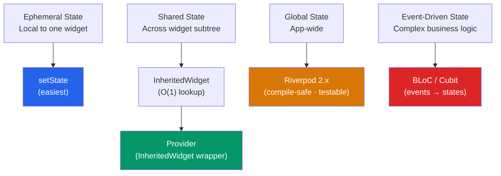

# 🧠 Flutter State Management

> [!abstract] TL;DR
> Flutter state management follows a clear escalation path: `setState` for ephemeral local state → `InheritedWidget`/`Provider` for shared subtree state → `Riverpod 2.x` for compile-safe global state with FutureProvider/caching → BLoC/Cubit for event-driven business logic separation. The key principle: escalate from `setState` → Provider → Riverpod/BLoC strictly by scope and complexity. Always `dispose` controllers, streams, and listeners. Never let UI logic bleed into domain logic.

## Intuition — analogy FIRST

State management choices are like different types of noticeboards.

**`setState`** is a sticky note on your own desk — only you can see it; it disappears when you leave your seat (widget disposes).

**Provider** is a team noticeboard — your whole team (widget subtree) can see it; when the team room is closed (subtree unmounts), the board is removed.

**Riverpod** is a company-wide digital dashboard — accessible from anywhere in the building (BuildContext-independent), version-controlled (immutable state), and auto-refreshed when data changes.

**BLoC** is the company's formal process management system — events (requests) go in, go through a defined process (business logic), and produce states (outcomes). Clear audit trail, strict separation of concerns.

---

## How It Works



---

## Key Concepts / Details

### Level 1: `setState` — Local Ephemeral State

Use for: form field values, UI toggles (expanded/collapsed), local counters, animation state.

```dart
class ExpandableCard extends StatefulWidget {
  final String title;
  final Widget content;
  const ExpandableCard({super.key, required this.title, required this.content});
  @override State<ExpandableCard> createState() => _ExpandableCardState();
}

class _ExpandableCardState extends State<ExpandableCard> {
  bool _isExpanded = false;

  @override
  Widget build(BuildContext context) {
    return Column(children: [
      ListTile(
        title: Text(widget.title),
        trailing: Icon(_isExpanded ? Icons.expand_less : Icons.expand_more),
        onTap: () => setState(() => _isExpanded = !_isExpanded),
      ),
      AnimatedCrossFade(
        firstChild: const SizedBox.shrink(),
        secondChild: widget.content,
        crossFadeState: _isExpanded ? CrossFadeState.showSecond : CrossFadeState.showFirst,
        duration: const Duration(milliseconds: 200),
      ),
    ]);
  }
}
```

### Level 2: `InheritedWidget` — O(1) Ancestor Lookup

The primitive under Provider, Theme, MediaQuery, and Navigator:

```dart
// InheritedWidget provides data to its subtree
class ThemeData extends InheritedWidget {
  final Color primaryColor;
  final String fontFamily;

  const ThemeData({
    super.key,
    required this.primaryColor,
    required this.fontFamily,
    required super.child,
  });

  // Static method for descendants to access data — O(1) lookup
  static ThemeData of(BuildContext context) {
    return context.dependOnInheritedWidgetOfExactType<ThemeData>()!;
  }

  // Flutter calls rebuild on consumers when this returns false
  @override
  bool updateShouldNotify(ThemeData oldWidget) =>
      primaryColor != oldWidget.primaryColor ||
      fontFamily != oldWidget.fontFamily;
}

// Consumer
class MyText extends StatelessWidget {
  @override
  Widget build(BuildContext context) {
    final theme = ThemeData.of(context); // O(1) lookup
    return Text('Hello', style: TextStyle(
      color: theme.primaryColor,
      fontFamily: theme.fontFamily,
    ));
  }
}
```

### Level 3: Provider — InheritedWidget Made Ergonomic

```dart
// Add to pubspec.yaml: provider: ^6.1.0

// 1. Define a ChangeNotifier
class CartModel extends ChangeNotifier {
  final List<CartItem> _items = [];

  List<CartItem> get items => List.unmodifiable(_items);
  int get count => _items.length;
  double get total => _items.fold(0, (sum, item) => sum + item.price);

  void add(CartItem item) {
    _items.add(item);
    notifyListeners(); // triggers rebuild of all listeners
  }

  void remove(String id) {
    _items.removeWhere((item) => item.id == id);
    notifyListeners();
  }
}

// 2. Provide it above the widget tree
void main() => runApp(
  ChangeNotifierProvider(
    create: (_) => CartModel(),
    child: const MyApp(),
  ),
);

// Multiple providers
MultiProvider(
  providers: [
    ChangeNotifierProvider(create: (_) => CartModel()),
    ChangeNotifierProvider(create: (_) => UserModel()),
    Provider(create: (_) => ApiService()),
  ],
  child: const MyApp(),
)

// 3. Consume — context.watch rebuilds on change, context.read doesn't
class CartBadge extends StatelessWidget {
  @override
  Widget build(BuildContext context) {
    final count = context.watch<CartModel>().count; // re-renders on change
    return Badge(label: Text('$count'));
  }
}

class CartButton extends StatelessWidget {
  @override
  Widget build(BuildContext context) {
    return TextButton(
      onPressed: () => context.read<CartModel>().add(item), // read: no rebuild
      child: const Text('Add to Cart'),
    );
  }
}

// Consumer widget — for more granular rebuilds
Consumer<CartModel>(
  builder: (context, cart, child) {
    // child doesn't rebuild even if cart changes
    return Row(children: [
      child!, // static part
      Text('Total: \$${cart.total}'),
    ]);
  },
  child: const Icon(Icons.shopping_cart), // built once
)
```

### Level 4: Riverpod 2.x — Compile-Safe, BuildContext-Independent

```dart
// Add to pubspec.yaml: flutter_riverpod: ^2.5.0

// 1. Wrap app in ProviderScope
void main() => runApp(const ProviderScope(child: MyApp()));

// 2. Define providers at top level
final cartProvider = NotifierProvider<CartNotifier, CartState>(() {
  return CartNotifier();
});

// Notifier — replaces ChangeNotifier
class CartNotifier extends Notifier<CartState> {
  @override
  CartState build() => const CartState(items: [], total: 0);

  void add(CartItem item) {
    state = state.copyWith(
      items: [...state.items, item],
      total: state.total + item.price,
    );
  }

  void remove(String id) {
    final filtered = state.items.where((i) => i.id != id).toList();
    state = state.copyWith(
      items: filtered,
      total: filtered.fold(0, (sum, i) => sum + i.price),
    );
  }
}

// FutureProvider — handles loading/error/data automatically
final usersProvider = FutureProvider<List<User>>((ref) async {
  final repo = ref.watch(userRepositoryProvider);
  return repo.getUsers();
});

// Family — parameterized providers
final userProvider = FutureProvider.family<User, int>((ref, id) async {
  final repo = ref.watch(userRepositoryProvider);
  return repo.getUserById(id);
});

// 3. Consume in widget (ConsumerWidget instead of StatelessWidget)
class UserList extends ConsumerWidget {
  @override
  Widget build(BuildContext context, WidgetRef ref) {
    final usersAsync = ref.watch(usersProvider);

    return usersAsync.when(
      data:    (users) => ListView.builder(
        itemCount: users.length,
        itemBuilder: (_, i) => UserTile(user: users[i]),
      ),
      loading: () => const CircularProgressIndicator(),
      error:   (err, _) => Text('Error: $err'),
    );
  }
}

// ref.watch — rebuild on change
// ref.read  — one-time read (in callbacks)
// ref.listen — side-effect when provider changes (navigate, show snackbar)
```

### Level 5: BLoC / Cubit — Event-Driven

```dart
// Add: flutter_bloc: ^8.1.0

// Cubit — simpler (no explicit events)
class CounterCubit extends Cubit<int> {
  CounterCubit() : super(0);

  void increment() => emit(state + 1);
  void decrement() => emit(state - 1);
  void reset() => emit(0);
}

// BLoC — events + states (full pattern)
// Events
abstract class CartEvent {}
class CartItemAdded extends CartEvent { final CartItem item; CartItemAdded(this.item); }
class CartItemRemoved extends CartEvent { final String id; CartItemRemoved(this.id); }

// States
abstract class CartState {}
class CartInitial extends CartState {}
class CartLoaded extends CartState {
  final List<CartItem> items;
  CartLoaded(this.items);
}

// BLoC
class CartBloc extends Bloc<CartEvent, CartState> {
  CartBloc() : super(CartInitial()) {
    on<CartItemAdded>((event, emit) async {
      final current = state is CartLoaded ? (state as CartLoaded).items : <CartItem>[];
      emit(CartLoaded([...current, event.item]));
    });
    on<CartItemRemoved>((event, emit) {
      if (state is CartLoaded) {
        final items = (state as CartLoaded).items.where((i) => i.id != event.id).toList();
        emit(CartLoaded(items));
      }
    });
  }
}

// Usage
BlocProvider(
  create: (_) => CartBloc(),
  child: BlocBuilder<CartBloc, CartState>(
    builder: (context, state) {
      if (state is CartLoaded) {
        return ListView(children: state.items.map((i) => Text(i.name)).toList());
      }
      return const Text('Empty cart');
    },
  ),
)
```

### State Management Decision Guide

| Scenario | Recommended |
|----------|-------------|
| Toggle, counter, form field in one widget | `setState` |
| Data shared within a small subtree | `Provider` (ChangeNotifier) |
| App-wide data, compile-safe, testable | `Riverpod 2.x` |
| Async data with built-in loading/error | `FutureProvider` (Riverpod) |
| Complex business logic, event-driven, testable | `BLoC` |
| Simple state mutations, step up from setState | `Cubit` |
| Page-level state, not truly global | `InheritedWidget` or `Provider` scoped to route |

---

## Real-World Notes

- **`ref.watch` vs `ref.read`** — `watch` rebuilds the widget when the provider changes; `read` is a one-shot read (use in callbacks, not in `build`). Confusing them is the most common Riverpod bug.
- **Provider `context.watch` in callbacks** — calling `context.watch` inside `onPressed` or a timer callback crashes. Use `context.read` in callbacks.
- **BLoC is excellent for testability** — BLoC's pure event-in/state-out model makes it easy to write unit tests without any Flutter/widget dependencies.
- **Dispose all Cubits/BLoCs** — BlocProvider handles this automatically. If you manually create one, call `cubit.close()` in `dispose`.

---

## Common Pitfalls

- **`context.watch` inside `initState` or `didChangeDependencies`** — these run before the first build; the context isn't ready for Provider lookup. Use `context.read` in init callbacks.
- **Not marking models as `immutable` with Riverpod** — Riverpod state should be immutable. Mutating state objects without `emit`/`state = newState` breaks change detection.
- **Riverpod `ref.read(provider)` in `build`** — this won't rebuild when the provider changes. Use `ref.watch` in `build`.
- **Provider `ProviderNotFoundException`** — the Provider is looked up above the subtree where it's provided. Ensure `ChangeNotifierProvider` is above all consumers in the widget tree.

---

## Related Concepts

- [[_MOC_Flutter|↑ Section MOC]]
- [[Widgets_and_Layout]] — `setState` and `State` lifecycle
- [[Flutter_Architecture]] — InheritedWidget as the O(1) lookup primitive
- [[Flutter_Navigation]] — State that survives navigation (global providers)

---

## Review Questions

1. Describe the state management escalation path from `setState` to BLoC. When do you move to each level?
2. What is the difference between `context.watch<T>()` and `context.read<T>()` in Provider?
3. In Riverpod, what is the difference between `ref.watch` and `ref.read`? When do you use each?
4. What is a `FutureProvider` in Riverpod and what does `usersAsync.when(data:, loading:, error:)` do?
5. What is the difference between a `Cubit` and a `BLoC`?

---

## Sources

- Provider docs — https://pub.dev/packages/provider
- Riverpod docs — https://riverpod.dev/docs/introduction/getting_started
- flutter_bloc docs — https://bloclibrary.dev/getting-started/
- Flutter docs: State management — https://docs.flutter.dev/data-and-backend/state-mgmt/options

#web-development #flutter #state-management #provider #riverpod #bloc
