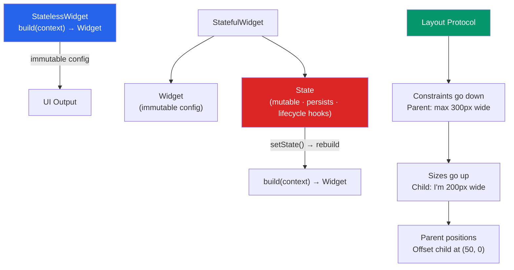

# 🎨 Flutter Widgets and Layout

> [!abstract] TL;DR
> Everything in Flutter is a widget — even padding, alignment, and gesture detection. `StatelessWidget` is a pure function of its configuration; `StatefulWidget` separates mutable `State` (which persists across rebuilds) from the immutable widget config. The layout protocol is a single-pass algorithm: **constraints go down** (parent tells child its size limits), **sizes go up** (child reports its size), **parent positions** (parent sets child's offset). The classic "unbounded constraint" error occurs when a scrollable widget inherits infinite constraints from an ancestor.

## Intuition — analogy FIRST

Flutter's widget hierarchy is like nested picture frames. Each frame (widget) tells its inner frame (child): "You can be at most this wide and this tall." The inner frame says: "I need 120px." The outer frame then positions the inner frame within itself.

The "constraints go down" protocol is the outer frame defining the rules. The "sizes go up" is the inner frame reporting its actual size. The parent positions is the outer frame deciding where to place the inner frame within its bounds.

A `StatelessWidget` is a photo behind the glass — fixed, pure, determined only by its frame. A `StatefulWidget` is a digital photo frame with changeable content — the frame (widget) is still replaced on rebuild, but the display module (State) persists and remembers what was shown.

---

## How It Works



---

## Key Concepts / Details

### StatelessWidget

```dart
class ProductCard extends StatelessWidget {
  final Product product;
  final VoidCallback onTap;

  const ProductCard({super.key, required this.product, required this.onTap});

  @override
  Widget build(BuildContext context) {
    // Called every time parent rebuilds — must be pure
    return GestureDetector(
      onTap: onTap,
      child: Container(
        padding: const EdgeInsets.all(16),
        decoration: BoxDecoration(
          color: Theme.of(context).colorScheme.surface,
          borderRadius: BorderRadius.circular(12),
        ),
        child: Column(
          crossAxisAlignment: CrossAxisAlignment.start,
          children: [
            Image.network(product.imageUrl),
            Text(product.name, style: Theme.of(context).textTheme.titleMedium),
            Text('\$${product.price.toStringAsFixed(2)}'),
          ],
        ),
      ),
    );
  }
}
```

### StatefulWidget — Two-Class Pattern

```dart
// Widget — immutable config (pass-through to State)
class Counter extends StatefulWidget {
  final int initialCount;
  const Counter({super.key, this.initialCount = 0});

  @override
  State<Counter> createState() => _CounterState();
}

// State — mutable, persists across rebuilds
class _CounterState extends State<Counter> {
  late int _count;

  @override
  void initState() {
    super.initState();
    _count = widget.initialCount; // access widget config via widget.
  }

  @override
  void didChangeDependencies() {
    super.didChangeDependencies();
    // Called when an InheritedWidget dependency changes
    // e.g., Theme, MediaQuery, custom providers
  }

  @override
  void didUpdateWidget(Counter oldWidget) {
    super.didUpdateWidget(oldWidget);
    // Called when parent rebuilds with new widget config
    if (widget.initialCount != oldWidget.initialCount) {
      _count = widget.initialCount; // sync state with new config
    }
  }

  void _increment() {
    setState(() {
      _count++; // marks element dirty → schedules rebuild
    });
  }

  @override
  void dispose() {
    // ALWAYS clean up: cancel timers, close streams, dispose controllers
    super.dispose();
  }

  @override
  Widget build(BuildContext context) {
    return Column(
      children: [
        Text('$_count', style: const TextStyle(fontSize: 48)),
        ElevatedButton(onPressed: _increment, child: const Text('+')),
      ],
    );
  }
}
```

### Layout Widgets

```dart
// Column and Row — flex-based layout
Column(
  mainAxisAlignment: MainAxisAlignment.center,    // main axis (vertical for Column)
  crossAxisAlignment: CrossAxisAlignment.start,   // cross axis (horizontal)
  children: [
    const Text('Item 1'),
    const Text('Item 2'),
    Expanded(child: Container()),  // takes remaining space
    const Flexible(child: Text('Flexible')), // takes as much as it needs (up to remaining)
  ],
)

// Stack — z-axis layering (like CSS position: absolute)
Stack(
  alignment: Alignment.bottomRight,
  children: [
    Image.network(url),
    Positioned(
      bottom: 8, right: 8,
      child: Container(
        color: Colors.black54,
        padding: const EdgeInsets.all(4),
        child: const Text('Caption'),
      ),
    ),
  ],
)

// Container — box model (padding, margin, decoration, constraints)
Container(
  width: 200,
  height: 100,
  margin: const EdgeInsets.all(8),
  padding: const EdgeInsets.symmetric(horizontal: 16, vertical: 8),
  decoration: BoxDecoration(
    color: Colors.blue,
    borderRadius: BorderRadius.circular(8),
    boxShadow: [BoxShadow(blurRadius: 4, color: Colors.black26)],
  ),
  child: const Text('Box'),
)
```

### The Constraint Protocol — "Constraints Down, Sizes Up"

```dart
// The classic unbounded constraint error:
// Column + ListView → crash: "Vertical viewport was given unbounded height"
// Column gives ListView unbounded height, but ListView needs a height to scroll within

// WRONG:
Column(children: [
  Text('Title'),
  ListView(children: [...]), // ERROR: unbounded height
])

// CORRECT option 1: give ListView a fixed height
Column(children: [
  const Text('Title'),
  SizedBox(height: 300, child: ListView(children: [...])),
])

// CORRECT option 2: use Expanded to take remaining space
Column(children: [
  const Text('Title'),
  Expanded(child: ListView(children: [...])),
])

// CORRECT option 3: use CustomScrollView with Slivers
CustomScrollView(
  slivers: [
    const SliverToBoxAdapter(child: Text('Title')),
    SliverList(delegate: SliverChildBuilderDelegate(
      (context, index) => Text('Item $index'),
      childCount: 100,
    )),
  ],
)
```

### Slivers — Lazy Scrolling

Slivers are scroll-aware widgets that only render visible items:

```dart
CustomScrollView(
  slivers: [
    // Collapsible app bar
    SliverAppBar(
      expandedHeight: 200,
      pinned: true,
      flexibleSpace: FlexibleSpaceBar(title: const Text('Products')),
    ),

    // Grid of items (lazy)
    SliverGrid(
      gridDelegate: const SliverGridDelegateWithMaxCrossAxisExtent(
        maxCrossAxisExtent: 200,
        crossAxisSpacing: 8,
        mainAxisSpacing: 8,
      ),
      delegate: SliverChildBuilderDelegate(
        (context, index) => ProductCard(product: products[index]),
        childCount: products.length,
      ),
    ),

    // List of items (lazy)
    SliverList(
      delegate: SliverChildBuilderDelegate(
        (context, index) => ListTile(title: Text('Item ${index + 1}')),
        childCount: 50,
      ),
    ),
  ],
)
```

### `Keys` — Preserving State Across Position Changes

```dart
// Keys tell Flutter which widget instance corresponds to which element

// ValueKey — stable identity for list items
ListView(children: items.map(
  (item) => ItemWidget(key: ValueKey(item.id), item: item)
).toList());

// GlobalKey — survives across parent widget changes (carries State with it)
final scaffoldKey = GlobalKey<ScaffoldState>();
// ...
scaffoldKey.currentState?.openDrawer();

// Remounting trick — force reset state by changing the key
// New key → new element → state reset
class ParentWidget extends StatefulWidget {
  @override
  State<ParentWidget> createState() => _ParentState();
}

class _ParentState extends State<ParentWidget> {
  Key _formKey = UniqueKey();

  void resetForm() {
    setState(() => _formKey = UniqueKey()); // force new element, reset form state
  }

  @override
  Widget build(BuildContext context) {
    return FormWidget(key: _formKey);
  }
}
```

### `CustomPaint` — Drawing with Canvas

```dart
class CircularProgress extends StatelessWidget {
  final double progress; // 0.0 to 1.0

  const CircularProgress({super.key, required this.progress});

  @override
  Widget build(BuildContext context) {
    return CustomPaint(
      size: const Size(100, 100),
      painter: _CirclePainter(progress),
    );
  }
}

class _CirclePainter extends CustomPainter {
  final double progress;
  _CirclePainter(this.progress);

  @override
  void paint(Canvas canvas, Size size) {
    final paint = Paint()
      ..color = Colors.blue
      ..strokeWidth = 8
      ..style = PaintingStyle.stroke
      ..strokeCap = StrokeCap.round;

    canvas.drawArc(
      Rect.fromLTWH(4, 4, size.width - 8, size.height - 8),
      -pi / 2,                  // start at top
      2 * pi * progress,        // sweep angle
      false,
      paint,
    );
  }

  @override
  bool shouldRepaint(_CirclePainter old) => old.progress != progress;
}
```

---

## Real-World Notes

- **`const` constructors are Flutter's most impactful micro-optimization** — `const Padding(padding: EdgeInsets.all(8), child: ...)` is compiled to a singleton. No rebuild ever recreates it.
- **`Expanded` vs `Flexible`** — `Expanded` forces the child to fill all remaining space; `Flexible` allows the child to be as small as its content (up to the remaining space).
- **`ListView.builder` vs `ListView`** — always use `ListView.builder` for long lists — it's lazy. `ListView` with a children list creates all items upfront.
- **`SizedBox` is the recommended spacer** — `SizedBox(height: 16)` for vertical spacing, `SizedBox(width: 8)` for horizontal. It's more explicit than `Padding`.

---

## Common Pitfalls

- **Unbounded constraint errors** — the most common Flutter layout error. Occurs when a widget that needs a bound (ListView, GridView) is inside a widget that provides none (Column, Row). Wrap with `SizedBox` or `Expanded`.
- **Calling `setState` after `dispose`** — if an async operation completes after the widget is disposed, calling `setState` throws. Check `mounted` before calling setState in async callbacks.
- **Using `GlobalKey` unnecessarily** — GlobalKeys are expensive. Use `ValueKey` for list items and only `GlobalKey` when you need to access State or RenderBox from outside.
- **Forgetting `const` on immutable widgets** — a `Text('Hello')` without `const` is recreated on every parent rebuild. Add `const` and Flutter reuses it.

---

## Related Concepts

- [[_MOC_Flutter|↑ Section MOC]]
- [[Flutter_Architecture]] — The three trees that widgets participate in
- [[Dart_Language]] — Dart class patterns used to define widgets
- [[State_Management_Flutter]] — State that lives inside StatefulWidget.State or external stores

---

## Review Questions

1. What is the difference between a `StatelessWidget` and a `StatefulWidget`? When does `State` persist?
2. Describe the constraint protocol: "constraints go down, sizes go up, parent positions." Give a one-pass example.
3. Why does `Column(children: [ListView(...)])` crash? Give two ways to fix it.
4. What is the difference between `Expanded` and `Flexible` in a `Row`/`Column`?
5. When should you use a `ValueKey` vs a `GlobalKey` in a list of widgets?

---

## Sources

- Flutter docs: Widget catalog — https://docs.flutter.dev/ui/widgets
- Flutter docs: Layouts — https://docs.flutter.dev/ui/layout
- Flutter docs: State management — https://docs.flutter.dev/data-and-backend/state-mgmt/options
- Flutter docs: Understanding constraints — https://docs.flutter.dev/ui/layout/constraints

#web-development #flutter #widgets #layout #statefulwidget #constraints
