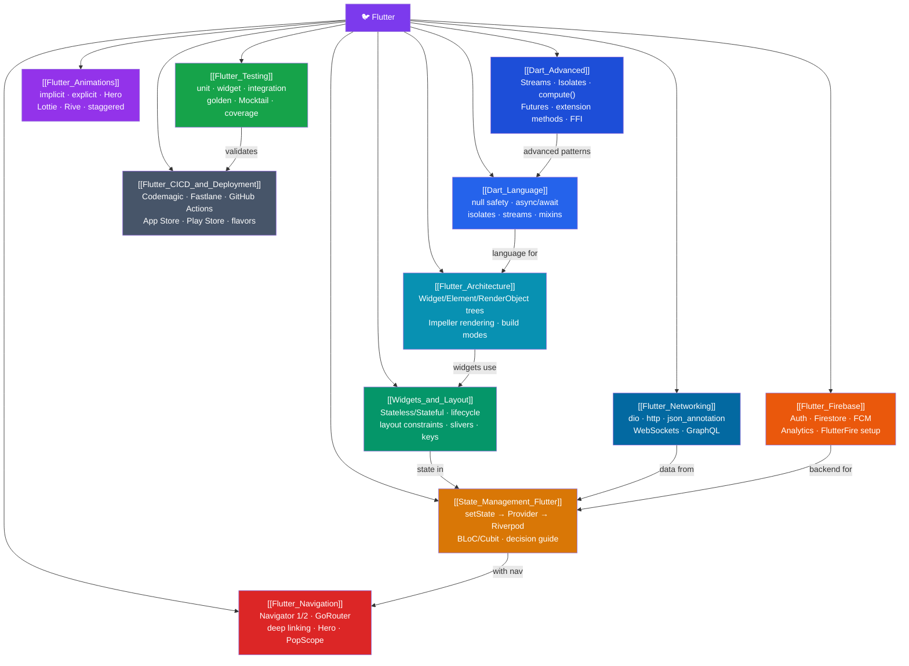

# 🐦 Flutter — Map of Content

> [!abstract] What This Section Covers
> Google's UI toolkit that compiles one Dart codebase to iOS, Android, web, and desktop — and, unlike React Native, owns its rendering engine (Impeller/Skia) to paint every pixel itself for pixel-perfect cross-platform parity and 120fps animation. This section covers: the Dart language essentials (including advanced streams and isolates), the Flutter architecture (three synchronized trees), widgets and layout, state management (setState → Provider → Riverpod → BLoC), navigation, networking (dio, WebSockets, GraphQL), Firebase integration, animations (implicit, explicit, Lottie, Rive), testing (unit, widget, integration, golden), and CI/CD/deployment (Codemagic, Fastlane, GitHub Actions, App Store, Play Store).

## Concept Map

## Learning Path

1. [[Dart_Language]] — Null safety, named/optional params, constructor kinds, mixins, async/await, streams, and isolates.
2. [[Dart_Advanced]] — Streams deep dive, Isolates, `compute()`, async generators, extension methods, and Dart FFI.
3. [[Flutter_Architecture]] — The three synchronized trees, Impeller rendering, build modes, and platform channels.
4. [[Widgets_and_Layout]] — StatelessWidget, StatefulWidget lifecycle, the constraint protocol ("constraints down, sizes up"), slivers, and keys.
5. [[State_Management_Flutter]] — The progression from `setState` to Provider, Riverpod 2.x, and BLoC — with a decision guide.
6. [[Flutter_Navigation]] — Navigator 1.0 vs 2.0, GoRouter, deep linking, `StatefulShellRoute`, Hero transitions, and `PopScope`.
7. [[Flutter_Networking]] — REST APIs with dio/http, JSON serialization with `json_annotation`, WebSockets, and GraphQL.
8. [[Flutter_Firebase]] — FlutterFire setup, Firebase Auth, Firestore real-time sync, FCM push notifications, and Analytics.
9. [[Flutter_Animations]] — Implicit vs explicit animations, AnimationController, Tween, Hero, Lottie, Rive, and staggered sequences.
10. [[Flutter_Testing]] — Unit, widget, and integration tests; `WidgetTester`; Mocktail; golden tests; test coverage.
11. [[Flutter_CICD_and_Deployment]] — Flavors, code signing, Codemagic, GitHub Actions, App Store, and Play Store publishing.

## All Notes at a Glance

| Note | Difficulty | What You'll Learn |
|------|------------|-------------------|
| [[Dart_Language]] | Intermediate | Null safety, ?/??/!/ late, factory/const constructors, mixins, isolates, streams |
| [[Dart_Advanced]] | Advanced | Streams, Isolates, compute(), async*, extension methods, Dart FFI |
| [[Flutter_Architecture]] | Intermediate | Widget/Element/RenderObject trees, Impeller, debug/profile/release, MethodChannel |
| [[Widgets_and_Layout]] | Intermediate | Stateless/Stateful, lifecycle, Row/Column/Stack, Expanded, slivers, CustomPaint, Keys |
| [[State_Management_Flutter]] | Intermediate | setState, InheritedWidget, Provider, Riverpod, BLoC/Cubit |
| [[Flutter_Navigation]] | Intermediate | push/pop, GoRouter, path params, redirect guards, deep linking, Hero |
| [[Flutter_Networking]] | Intermediate | dio vs http, interceptors, json_annotation, build_runner, WebSockets, GraphQL |
| [[Flutter_Firebase]] | Intermediate | FlutterFire setup, Auth, Firestore streams, FCM, Analytics, Cloud Functions |
| [[Flutter_Animations]] | Intermediate | AnimationController, Tween, CurvedAnimation, Hero, Lottie, Rive, staggered |
| [[Flutter_Testing]] | Intermediate | Unit/widget/integration tests, WidgetTester, Mocktail, golden tests, coverage |
| [[Flutter_CICD_and_Deployment]] | Advanced | Flavors, Fastlane Match, GitHub Actions, Codemagic, store publishing, code signing |

## Key Questions This Section Answers

- What are the three synchronized trees in Flutter and what does each do?
- Why does Flutter own its rendering engine (Impeller/Skia) instead of using native widgets?
- What is the constraint protocol: "constraints go down, sizes go up, parent positions"?
- When do you use Provider vs Riverpod vs BLoC for state management?
- What is the difference between Navigator 1.0 and Navigator 2.0 (the Router API)?
- How do you implement deep linking in Flutter?
- When should you use `compute()` vs a long-lived Isolate for CPU-heavy work?
- What is the difference between implicit and explicit Flutter animations?
- How does FlutterFire Auth integrate with Firestore security rules?
- What is the difference between unit, widget, and integration tests in Flutter?
- How do flavors work, and what is the role of code signing in deployment?

## Related Sections

- [[_MOC_WebDev_Master|↑ Web Dev Master MOC]]
- [[_MOC_TypeScript|← TypeScript]] (Dart has similar type system concepts)
- [[_MOC_React|← React]] (widget model similarities to React component model)

#MOC #WebDevelopment #Flutter
