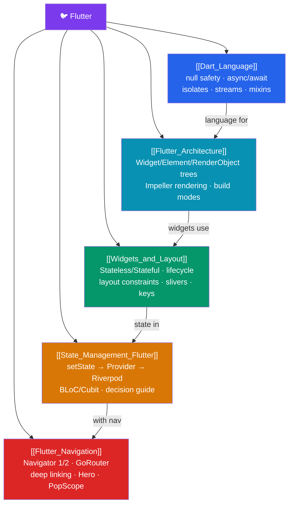

# 🐦 Flutter — Map of Content

> [!abstract] What This Section Covers
> Google's UI toolkit that compiles one Dart codebase to iOS, Android, web, and desktop — and, unlike React Native, owns its rendering engine (Impeller/Skia) to paint every pixel itself for pixel-perfect cross-platform parity and 120fps animation. This section covers: the Dart language essentials, the Flutter architecture (three synchronized trees), widgets and layout, state management (setState → Provider → Riverpod → BLoC), and navigation (Navigator 1/2, GoRouter, deep linking).

## Concept Map

## Learning Path

1. [[Dart_Language]] — Null safety, named/optional params, constructor kinds, mixins, async/await, streams, and isolates.
2. [[Flutter_Architecture]] — The three synchronized trees, Impeller rendering, build modes, and platform channels.
3. [[Widgets_and_Layout]] — StatelessWidget, StatefulWidget lifecycle, the constraint protocol ("constraints down, sizes up"), slivers, and keys.
4. [[State_Management_Flutter]] — The progression from `setState` to Provider, Riverpod 2.x, and BLoC — with a decision guide.
5. [[Flutter_Navigation]] — Navigator 1.0 vs 2.0, GoRouter, deep linking, `StatefulShellRoute`, Hero transitions, and `PopScope`.

## All Notes at a Glance

| Note | Difficulty | What You'll Learn |
|------|------------|-------------------|
| [[Dart_Language]] | Intermediate | Null safety, ?/??/!/ late, factory/const constructors, mixins, isolates, streams |
| [[Flutter_Architecture]] | Intermediate | Widget/Element/RenderObject trees, Impeller, debug/profile/release, MethodChannel |
| [[Widgets_and_Layout]] | Intermediate | Stateless/Stateful, lifecycle, Row/Column/Stack, Expanded, slivers, CustomPaint, Keys |
| [[State_Management_Flutter]] | Intermediate | setState, InheritedWidget, Provider, Riverpod, BLoC/Cubit |
| [[Flutter_Navigation]] | Intermediate | push/pop, GoRouter, path params, redirect guards, deep linking, Hero |

## Key Questions This Section Answers

- What are the three synchronized trees in Flutter and what does each do?
- Why does Flutter own its rendering engine (Impeller/Skia) instead of using native widgets?
- What is the constraint protocol: "constraints go down, sizes go up, parent positions"?
- When do you use Provider vs Riverpod vs BLoC for state management?
- What is the difference between Navigator 1.0 and Navigator 2.0 (the Router API)?
- How do you implement deep linking in Flutter?

## Related Sections

- [[_MOC_WebDev_Master|↑ Web Dev Master MOC]]
- [[_MOC_TypeScript|← TypeScript]] (Dart has similar type system concepts)
- [[_MOC_React|← React]] (widget model similarities to React component model)

#MOC #WebDevelopment #Flutter
