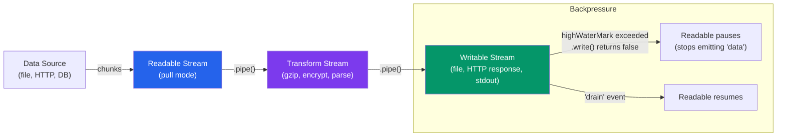

# 🌊 Node.js Async and Streams

> [!abstract] TL;DR
> Node.js async patterns evolved from error-first callbacks → Promises → async/await. The `EventEmitter` class is the foundation for all event-based APIs in Node.js. Streams enable processing large data (files, HTTP responses, database results) in chunks without loading everything into memory — they compose via `.pipe()`, and backpressure prevents a fast producer from overwhelming a slow consumer. Worker Threads bring true parallelism for CPU-intensive work.

## Intuition — analogy FIRST

Callbacks are like leaving your phone number at a restaurant — you go do other things and they call you when your table is ready. "Callback hell" is like the restaurant calling you, who then calls the valet, who then calls the sommelier — a chain of nested phone calls that's hard to follow.

Streams are like a conveyor belt at a factory — items move from one station to the next in small batches, never piling up. Without backpressure, it's like a firehose filling a garden hose — you need a mechanism to tell the source to slow down when the destination can't keep up.

---

## How It Works



---

## Key Concepts / Details

### Callbacks and Callback Hell

```javascript
// Error-first callback convention: (err, result)
const fs = require('fs');

fs.readFile('config.json', 'utf8', (err, data) => {
  if (err) { console.error(err); return; }

  const config = JSON.parse(data);

  // Callback hell — "pyramid of doom"
  fs.readFile(config.dataFile, 'utf8', (err, rawData) => {
    if (err) { console.error(err); return; }

    processData(rawData, (err, processed) => {
      if (err) { console.error(err); return; }

      fs.writeFile('output.json', JSON.stringify(processed), (err) => {
        if (err) { console.error(err); return; }
        console.log('Done!');  // deeply nested, hard to read/maintain
      });
    });
  });
});

// Fix: promisify the callback-based API
const { promisify } = require('util');
const readFile = promisify(fs.readFile);
const writeFile = promisify(fs.writeFile);

// Or use the built-in promises namespace (Node 10+)
const fsp = require('fs').promises;

// Now use async/await — flat, readable
async function processConfig() {
  const data = await fsp.readFile('config.json', 'utf8');
  const config = JSON.parse(data);
  const rawData = await fsp.readFile(config.dataFile, 'utf8');
  const processed = await processData(rawData);
  await fsp.writeFile('output.json', JSON.stringify(processed));
  console.log('Done!');
}
```

### EventEmitter

`EventEmitter` is the core pub/sub mechanism underlying streams, HTTP servers, and most Node.js APIs:

```javascript
const { EventEmitter } = require('events');

class OrderSystem extends EventEmitter {
  constructor() {
    super();
    this.orders = [];
  }

  placeOrder(order) {
    this.orders.push(order);
    this.emit('order:placed', order);       // emit with payload
  }

  fulfillOrder(orderId) {
    const order = this.orders.find(o => o.id === orderId);
    if (!order) {
      this.emit('error', new Error(`Order ${orderId} not found`)); // errors need 'error' listener
      return;
    }
    this.emit('order:fulfilled', order);
  }
}

const shop = new OrderSystem();

// .on() — persistent listener
shop.on('order:placed', (order) => {
  console.log(`New order: ${order.item}`);
});

// .once() — fires exactly once then auto-removes
shop.once('order:placed', (order) => {
  console.log('First order ever!');
});

// Always handle 'error' events — unhandled 'error' throws
shop.on('error', (err) => console.error('Shop error:', err.message));

// Remove listener to prevent memory leaks
const handler = (order) => console.log(order);
shop.on('order:fulfilled', handler);
shop.off('order:fulfilled', handler); // or shop.removeListener(...)

// Check listener count — warn if too many (default max is 10)
shop.setMaxListeners(20); // increase if legitimate

shop.placeOrder({ id: 1, item: 'Widget' });
```

### Streams in Depth

```javascript
const fs = require('fs');
const zlib = require('zlib');
const { Transform, pipeline } = require('stream');
const { promisify } = require('util');
const pipelineAsync = promisify(pipeline);

// --- Readable Stream ---
const readable = fs.createReadStream('large-file.csv', {
  encoding: 'utf8',
  highWaterMark: 64 * 1024  // 64KB chunks (default 16KB)
});

readable.on('data', chunk => console.log(`Received ${chunk.length} bytes`));
readable.on('end', () => console.log('File read complete'));
readable.on('error', err => console.error('Read error:', err));

// --- Writable Stream ---
const writable = fs.createWriteStream('output.txt');
writable.write('line 1\n');
writable.write('line 2\n');
writable.end('final line\n'); // signals end of writing

// --- Transform Stream (modify data in-flight) ---
class CSVParser extends Transform {
  constructor() {
    super({ readableObjectMode: true }); // output objects, not strings
    this._buffer = '';
    this._headers = null;
  }

  _transform(chunk, encoding, callback) {
    this._buffer += chunk.toString();
    const lines = this._buffer.split('\n');
    this._buffer = lines.pop(); // keep incomplete last line

    for (const line of lines) {
      if (!this._headers) {
        this._headers = line.split(',');
      } else {
        const values = line.split(',');
        const record = Object.fromEntries(
          this._headers.map((h, i) => [h.trim(), values[i]?.trim()])
        );
        this.push(record); // push parsed object downstream
      }
    }
    callback(); // signal this chunk is processed
  }

  _flush(callback) {
    if (this._buffer) { /* process remaining data */ }
    callback();
  }
}

// --- pipeline — replaces .pipe() chains, handles errors properly ---
async function processFile() {
  await pipelineAsync(
    fs.createReadStream('data.csv'),
    new CSVParser(),
    new Transform({
      objectMode: true,
      transform(record, enc, cb) {
        record.amount = parseFloat(record.amount) * 1.1; // 10% markup
        cb(null, JSON.stringify(record) + '\n');
      }
    }),
    fs.createWriteStream('output.ndjson')
  );
  console.log('Pipeline complete');
}

// pipeline correctly destroys all streams on error — .pipe() does not
```

### Backpressure

```javascript
const fs = require('fs');

// Manual backpressure — check .write() return value
const readable = fs.createReadStream('huge.bin');
const writable = fs.createWriteStream('copy.bin');

readable.on('data', (chunk) => {
  const canContinue = writable.write(chunk);
  if (!canContinue) {
    // writable buffer is full — pause reading
    readable.pause();
    writable.once('drain', () => {
      // buffer drained — resume reading
      readable.resume();
    });
  }
});

readable.on('end', () => writable.end());

// This whole pattern is automated by pipeline() / .pipe()
// Just use pipeline — it handles backpressure automatically
```

### Worker Threads for CPU Work

```javascript
const { Worker, isMainThread, parentPort, workerData } = require('worker_threads');

if (isMainThread) {
  // --- Main thread ---
  function runWorker(data) {
    return new Promise((resolve, reject) => {
      const worker = new Worker(__filename, { workerData: data });
      worker.on('message', resolve);
      worker.on('error', reject);
      worker.on('exit', (code) => {
        if (code !== 0) reject(new Error(`Worker exited with code ${code}`));
      });
    });
  }

  // Run CPU work in parallel workers — doesn't block the event loop
  async function processParallel(items) {
    const chunkSize = Math.ceil(items.length / 4); // 4 workers
    const chunks = Array.from({ length: 4 }, (_, i) =>
      items.slice(i * chunkSize, (i + 1) * chunkSize)
    );
    const results = await Promise.all(chunks.map(chunk => runWorker(chunk)));
    return results.flat();
  }

} else {
  // --- Worker thread ---
  const result = workerData.map(item => expensiveCompute(item));
  parentPort.postMessage(result);
}

function expensiveCompute(n) {
  // CPU-intensive work — safe here, not on the main thread
  let sum = 0;
  for (let i = 0; i < 1e7; i++) sum += Math.sqrt(i * n);
  return sum;
}
```

### Buffer

```javascript
// Buffer — fixed-size chunk of raw binary memory (outside V8 heap)
const buf1 = Buffer.from('Hello', 'utf8');         // from string
const buf2 = Buffer.from([0x48, 0x65, 0x6c, 0x6c, 0x6f]); // from bytes
const buf3 = Buffer.alloc(10);                      // zero-filled, 10 bytes
const buf4 = Buffer.allocUnsafe(10);                // uninitialized (faster, less safe)

buf1.toString('utf8');    // 'Hello'
buf1.toString('hex');     // '48656c6c6f'
buf1.toString('base64');  // 'SGVsbG8='

buf1.length;              // 5 (bytes, not characters — matters for multi-byte UTF-8)
Buffer.concat([buf1, buf2]); // concatenate buffers
Buffer.compare(buf1, buf2);  // 0 if equal

// Buffers are used automatically in streams — you rarely create them manually
// But you need them for binary protocols, encryption, file I/O with binary data
```

---

## Real-World Notes

- **Use `pipeline` not `.pipe()`** — `.pipe()` does not propagate errors to the destination, so a read error leaves the write stream open and leaking. `pipeline` handles this correctly.
- **`EventEmitter` memory leaks** — adding listeners in a loop without removing them causes the "MaxListenersExceededWarning". Use `emitter.setMaxListeners(Infinity)` only if the high count is expected and correct.
- **Worker threads share memory via `SharedArrayBuffer`** — for high-throughput data exchange, pass a `SharedArrayBuffer` and use `Atomics` for synchronization instead of copying data via `postMessage`.
- **Streams in object mode** — set `{ objectMode: true }` to push/pull JavaScript objects instead of Buffers. Useful for parsing pipelines (CSV → JS object → DB insert).

---

## Common Pitfalls

1. **Not listening for the `'error'` event on a stream** — an unhandled stream error throws an uncaught exception. Always add `.on('error', handler)` or use `pipeline`.
2. **Using `.pipe()` instead of `pipeline` in production** — `.pipe()` doesn't destroy the write stream when the read stream errors. Use the `pipeline` utility.
3. **Creating Workers for fast tasks** — Worker thread creation has ~30ms overhead. For sub-millisecond tasks, a thread pool adds more latency than it saves.
4. **Forgetting to call `callback()` in a Transform `_transform`** — the stream will stall forever waiting for the signal that the chunk is processed.
5. **`setMaxListeners` as a band-aid** — increasing the limit without understanding why you have many listeners usually hides a real memory leak.

---

## Related Concepts

- [[_MOC_NodeJS|↑ Section MOC]]
- [[NodeJS_Fundamentals]] — Event loop phases that process EventEmitter callbacks
- [[Async_JS_Promises]] — Promises and async/await patterns
- [[NodeJS_HTTP_and_REST]] — HTTP request/response objects are Readable/Writable streams
- [[NodeJS_Database_and_Production]] — Streaming query results from databases

---

## Review Questions

1. What is backpressure in streams? How does `pipeline` handle it compared to `.pipe()`?
2. Describe the four types of streams in Node.js. Give a real-world example of each.
3. Why should you use Worker Threads instead of `setTimeout` for CPU-intensive tasks?
4. What is the difference between `.on()` and `.once()` on an EventEmitter?
5. When does `setImmediate` fire relative to stream `'data'` events and Promise microtasks?

---

## Sources

- Node.js docs: Stream — https://nodejs.org/api/stream.html
- Node.js docs: Worker Threads — https://nodejs.org/api/worker_threads.html
- Node.js docs: Events — https://nodejs.org/api/events.html
- Node.js docs: Buffer — https://nodejs.org/api/buffer.html

#WebDevelopment #NodeJS #streams #eventemitter #worker-threads #backpressure
