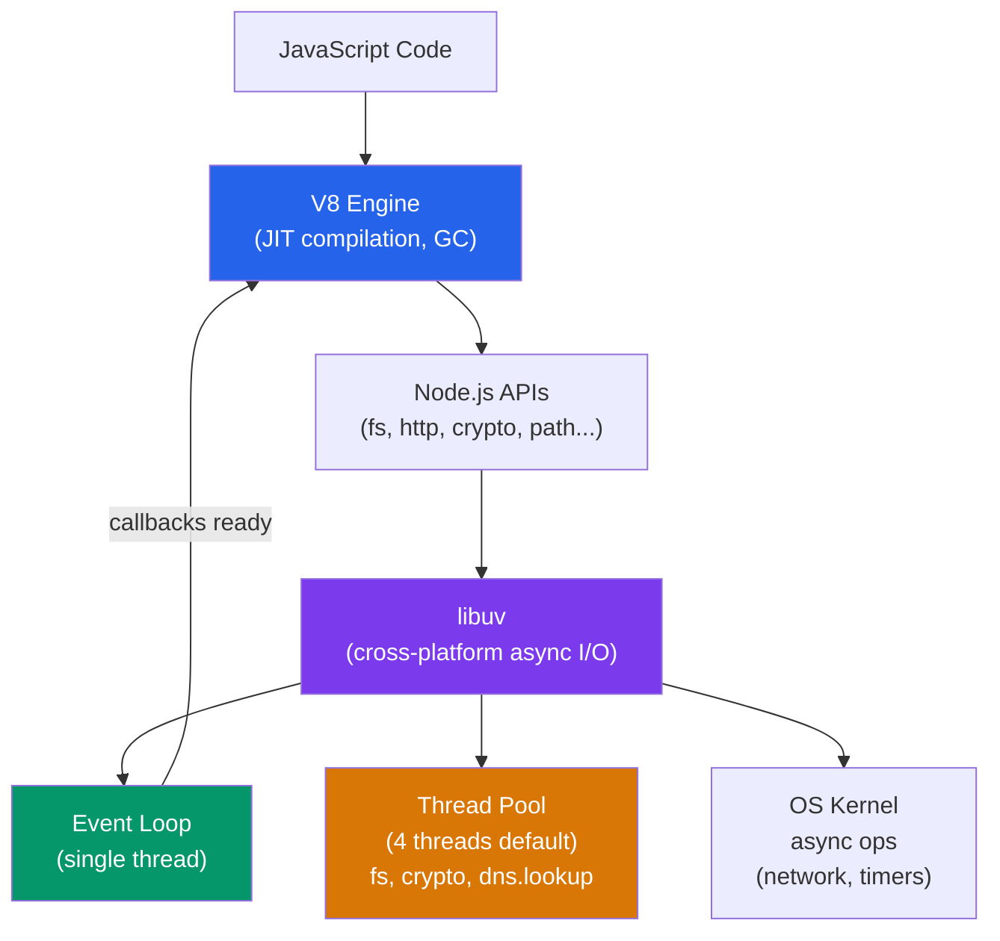

# 🟢 Node.js Fundamentals

> [!abstract] TL;DR
> Node.js is a JavaScript runtime built on Chrome's V8 engine and libuv, enabling non-blocking, event-driven I/O outside the browser. It runs on a single thread but handles thousands of concurrent connections through an event loop that delegates I/O work to the OS kernel or a thread pool. The event loop has six distinct phases — timers, pending callbacks, idle/prepare, poll, check, and close callbacks — and `process.nextTick` callbacks drain before each phase transition.

## Intuition — analogy FIRST

Think of Node.js as a single highly efficient restaurant manager (the event loop) who never waits idle. Instead of cooking each order personally (blocking), the manager takes an order, hands it to the kitchen staff (libuv thread pool / OS), and immediately moves to the next customer. When the kitchen signals that an order is ready, the manager delivers it. The manager never stands still — they're always taking new orders or delivering completed ones. This is why Node.js handles thousands of concurrent HTTP connections with a single thread.

---

## How It Works



**The six event loop phases (in order):**

| Phase | What runs |
|-------|-----------|
| **timers** | `setTimeout` / `setInterval` callbacks whose delay has expired |
| **pending callbacks** | I/O error callbacks deferred from the previous iteration |
| **idle, prepare** | Internal use only |
| **poll** | Retrieve new I/O events; execute I/O callbacks (most of your code runs here) |
| **check** | `setImmediate` callbacks |
| **close callbacks** | `socket.on('close', ...)`, `process.on('exit', ...)` |

Between every phase, Node drains the `process.nextTick` queue and the Promise microtask queue before moving to the next phase.

---

## Key Concepts / Details

### Event Loop Phase Ordering

```javascript
// Demonstrates the full execution order in Node.js
console.log('1 - start (synchronous)');

setTimeout(() => console.log('5 - setTimeout'), 0);        // timers phase
setImmediate(() => console.log('6 - setImmediate'));        // check phase

Promise.resolve().then(() => console.log('3 - Promise'));  // microtask queue
process.nextTick(() => console.log('2 - nextTick'));       // nextTick queue (highest priority async)

Promise.resolve().then(() => {
  process.nextTick(() => console.log('4 - nested nextTick inside Promise'));
});

console.log('1b - end (synchronous)');

// Output:
// 1 - start (synchronous)
// 1b - end (synchronous)
// 2 - nextTick           ← nextTick drains before microtasks
// 3 - Promise            ← microtask
// 4 - nested nextTick    ← new nextTick added during microtask phase still runs
// 5 - setTimeout         ← timers phase (or setImmediate first in I/O callbacks)
// 6 - setImmediate
```

### The process Object

`process` is a global object providing information about and control over the current Node.js process:

```javascript
// Environment variables — set in shell or .env files, read via process.env
const port = process.env.PORT || 3000;
const nodeEnv = process.env.NODE_ENV; // 'development', 'production', 'test'

// Command-line arguments — process.argv[0] is 'node', [1] is the script path
// node server.js --port 8080 --debug
const args = process.argv.slice(2); // ['--port', '8080', '--debug']

// Parse args manually or use a library like commander/yargs
const portIndex = args.indexOf('--port');
const cliPort = portIndex !== -1 ? parseInt(args[portIndex + 1]) : 3000;

// Process info
console.log(process.pid);       // process ID
console.log(process.platform);  // 'linux', 'darwin', 'win32'
console.log(process.version);   // 'v20.11.0'
console.log(process.cwd());     // current working directory
console.log(process.memoryUsage()); // { rss, heapTotal, heapUsed, external }

// Graceful exit
process.on('SIGTERM', () => {
  console.log('Received SIGTERM — shutting down gracefully');
  server.close(() => process.exit(0));
});

process.on('uncaughtException', (err) => {
  console.error('Uncaught exception:', err);
  process.exit(1); // always exit after uncaught exceptions
});
```

### Global Object

In Node.js, `global` is the top-level scope (equivalent to `window` in browsers). Variables declared without `let`/`const`/`var` at the module level do NOT automatically become globals — each file is wrapped in a module function:

```javascript
// These are truly global across all modules
global.mySharedState = {}; // anti-pattern — avoid polluting global

// Built-in globals (no import needed)
console.log(typeof setTimeout);   // 'function'
console.log(typeof setInterval);  // 'function'
console.log(typeof setImmediate); // 'function' (Node-only)
console.log(typeof Buffer);       // 'function' (Node-only)
console.log(typeof __dirname);    // 'string' — directory of current file
console.log(typeof __filename);   // 'string' — full path of current file
console.log(typeof module);       // 'object' — CommonJS module wrapper
console.log(typeof require);      // 'function' — CommonJS require

// globalThis — cross-environment reference to the global object (Node 12+)
globalThis === global; // true in Node.js
```

### Non-Blocking I/O in Practice

```javascript
const fs = require('fs');

// BLOCKING (synchronous) — stalls the event loop
const data = fs.readFileSync('/etc/hosts', 'utf8'); // nothing else runs until this completes
console.log(data);

// NON-BLOCKING (asynchronous) — event loop continues, callback fires when ready
fs.readFile('/etc/hosts', 'utf8', (err, data) => {
  if (err) throw err;
  console.log(data);
});
console.log('This prints BEFORE the file is read');

// Promise-based (Node 10+) — same non-blocking behavior with cleaner syntax
const { readFile } = require('fs').promises;
async function readConfig() {
  const data = await readFile('/etc/hosts', 'utf8');
  return data;
}
```

### Thread Pool Sizing

libuv's thread pool (default 4 threads) handles CPU-bound tasks like file system operations and crypto:

```javascript
// Increase thread pool for CPU-heavy workloads (e.g., crypto.pbkdf2)
// Set BEFORE requiring any modules that use it
process.env.UV_THREADPOOL_SIZE = '8';

// Operations that use the thread pool:
// - fs.readFile, fs.writeFile (disk I/O)
// - crypto.pbkdf2, crypto.randomBytes
// - dns.lookup (not dns.resolve — that uses the OS async API)
// - zlib (compression)

// Operations that do NOT use the thread pool (use OS async directly):
// - TCP/UDP networking (net, http, https)
// - Child processes
// - Timers
```

---

## Real-World Notes

- **Never use sync I/O in a server** — `readFileSync`, `writeFileSync`, and similar blocking calls stall the event loop for every concurrent user. They're acceptable only in startup scripts or CLI tools.
- **`process.nextTick` can starve I/O** — if you recursively call `process.nextTick` in a loop, the poll phase never runs and I/O events are never processed. Use `setImmediate` when you want to defer work after I/O.
- **Tune `UV_THREADPOOL_SIZE` for CPU-heavy crypto** — a server doing `bcrypt` or `pbkdf2` hashing will saturate 4 threads. Set this to the number of CPU cores.
- **`__dirname` and `__filename` are undefined in ES modules** — use `import.meta.url` + `new URL` + `fileURLToPath` instead.

---

## Common Pitfalls

1. **Blocking the event loop with synchronous CPU work** — a `for` loop over 10 million items blocks every request. Use Worker Threads for CPU-intensive tasks.
2. **Assuming `setTimeout(fn, 0)` is immediate** — it fires in the timers phase, not right away. If you need post-I/O scheduling, use `setImmediate`.
3. **Not handling `uncaughtException`** — an unhandled exception crashes the entire process. Always set up `process.on('uncaughtException')` and `process.on('unhandledRejection')`.
4. **Ignoring `process.env.NODE_ENV`** — many libraries (Express, React) change behavior based on this. Always set it to `'production'` in prod builds.
5. **Mutating `global`** — sharing state via `global` creates hidden coupling between modules. Use dependency injection instead.

---

## Related Concepts

- [[_MOC_NodeJS|↑ Section MOC]]
- [[NodeJS_Async_and_Streams]] — Deep dive into the async patterns the event loop enables
- [[NodeJS_Modules_and_NPM]] — How Node.js loads and caches modules
- [[NodeJS_HTTP_and_REST]] — Building HTTP servers on top of the event loop
- [[Async_JS_Promises]] — Browser event loop vs Node.js event loop

---

## Review Questions

1. Describe the six phases of the Node.js event loop in order. In which phase does most I/O callback code run?
2. What is the execution priority order between `process.nextTick`, Promise microtasks, `setImmediate`, and `setTimeout(fn, 0)`?
3. Why does Node.js use a thread pool if it's "single-threaded"? Which operations use the thread pool?
4. What is the difference between `process.nextTick` and `setImmediate`? When would you prefer one over the other?
5. How would you detect and handle a CPU-intensive operation blocking the event loop?

---

## Sources

- Node.js docs: The Node.js Event Loop — https://nodejs.org/en/docs/guides/event-loop-timers-and-nexttick
- libuv documentation — https://docs.libuv.org/en/v1.x/
- Bert Belder: Everything you need to know about Node.js Event Loop — https://www.youtube.com/watch?v=PNa9OMajl9s
- Node.js docs: process — https://nodejs.org/api/process.html

#WebDevelopment #NodeJS #event-loop #v8 #libuv
