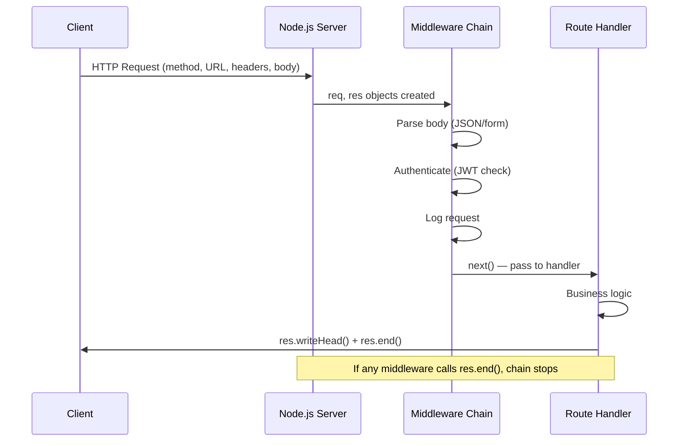

# 🌐 Node.js HTTP and REST

> [!abstract] TL;DR
> Node.js ships with a built-in `http` module for creating HTTP servers without any framework. A request and response are streams — `req` is Readable, `res` is Writable. Every incoming request fires a callback with a request and response object. The middleware concept (a chain of functions that process a request before sending a response) underpins all Node.js web frameworks. CORS, JSON parsing, and URL routing must all be handled explicitly when using the raw http module.

## Intuition — analogy FIRST

An HTTP server is like a post office. Every letter (request) that arrives has an address (URL), a type (method: GET/POST), and a body (payload). The post office's sorting process (routing + middleware) reads the envelope, stamps it, adds handling notes, and eventually delivers it to the right desk (route handler) for processing. The handler then sends a reply letter (response). CORS is like international shipping rules — you need the right postage and labels before parcels are accepted from foreign addresses.

---

## How It Works



---

## Key Concepts / Details

### Creating an HTTP Server with the Built-in Module

```javascript
const http = require('http');
const url = require('url');

const server = http.createServer((req, res) => {
  // req: http.IncomingMessage (Readable stream)
  // res: http.ServerResponse (Writable stream)

  const parsedUrl = url.parse(req.url, true); // parse query strings
  const pathname = parsedUrl.pathname;
  const query = parsedUrl.query; // { page: '2', limit: '10' }

  console.log(`${req.method} ${pathname}`);
  console.log('Headers:', req.headers);

  // Route based on method + path
  if (req.method === 'GET' && pathname === '/health') {
    res.writeHead(200, { 'Content-Type': 'application/json' });
    res.end(JSON.stringify({ status: 'ok', uptime: process.uptime() }));

  } else if (req.method === 'GET' && pathname === '/users') {
    const page = parseInt(query.page) || 1;
    res.writeHead(200, { 'Content-Type': 'application/json' });
    res.end(JSON.stringify({ page, users: [] }));

  } else {
    res.writeHead(404, { 'Content-Type': 'application/json' });
    res.end(JSON.stringify({ error: 'Not Found' }));
  }
});

server.listen(3000, '0.0.0.0', () => {
  console.log('Server running on http://localhost:3000');
});

server.on('error', (err) => {
  if (err.code === 'EADDRINUSE') {
    console.error('Port 3000 already in use');
    process.exit(1);
  }
});
```

### Reading the Request Body

The request body is a stream — you must collect chunks and parse when complete:

```javascript
const http = require('http');

function readBody(req) {
  return new Promise((resolve, reject) => {
    const chunks = [];
    req.on('data', chunk => chunks.push(chunk));
    req.on('end', () => resolve(Buffer.concat(chunks).toString()));
    req.on('error', reject);
  });
}

const server = http.createServer(async (req, res) => {
  if (req.method === 'POST' && req.url === '/api/users') {
    try {
      const rawBody = await readBody(req);
      const contentType = req.headers['content-type'] || '';

      let body;
      if (contentType.includes('application/json')) {
        body = JSON.parse(rawBody);
      } else {
        res.writeHead(415, { 'Content-Type': 'application/json' });
        res.end(JSON.stringify({ error: 'Unsupported Media Type' }));
        return;
      }

      // Validate and use body
      const { name, email } = body;
      if (!name || !email) {
        res.writeHead(400, { 'Content-Type': 'application/json' });
        res.end(JSON.stringify({ error: 'name and email required' }));
        return;
      }

      res.writeHead(201, { 'Content-Type': 'application/json' });
      res.end(JSON.stringify({ id: Date.now(), name, email }));

    } catch (err) {
      res.writeHead(500, { 'Content-Type': 'application/json' });
      res.end(JSON.stringify({ error: 'Internal Server Error' }));
    }
  }
});
```

### URL Parsing with the Modern URL API

```javascript
// Prefer the WHATWG URL API (Node 10+) over legacy url.parse()
const base = 'http://localhost:3000';
const reqUrl = '/api/users?page=2&limit=10&role=admin&role=editor';
const parsed = new URL(reqUrl, base);

parsed.pathname;                         // '/api/users'
parsed.searchParams.get('page');         // '2'
parsed.searchParams.get('limit');        // '10'
parsed.searchParams.getAll('role');      // ['admin', 'editor']
parsed.searchParams.has('sort');         // false
parsed.searchParams.toString();          // 'page=2&limit=10&role=admin&role=editor'

// Build URLs programmatically
const apiUrl = new URL('/api/v2/posts', 'https://api.example.com');
apiUrl.searchParams.set('author', 'alice');
apiUrl.searchParams.set('published', 'true');
console.log(apiUrl.toString()); // https://api.example.com/api/v2/posts?author=alice&published=true
```

### CORS Handling

Cross-Origin Resource Sharing must be configured explicitly:

```javascript
const http = require('http');

const ALLOWED_ORIGINS = new Set([
  'https://myapp.com',
  'https://staging.myapp.com',
  'http://localhost:3001', // dev frontend
]);

function setCORSHeaders(req, res) {
  const origin = req.headers.origin;

  if (ALLOWED_ORIGINS.has(origin)) {
    res.setHeader('Access-Control-Allow-Origin', origin);
    res.setHeader('Vary', 'Origin'); // caching hint — response varies by Origin
  }

  res.setHeader('Access-Control-Allow-Methods', 'GET, POST, PUT, DELETE, OPTIONS');
  res.setHeader('Access-Control-Allow-Headers', 'Content-Type, Authorization');
  res.setHeader('Access-Control-Max-Age', '86400'); // preflight cache: 1 day
  res.setHeader('Access-Control-Allow-Credentials', 'true');
}

const server = http.createServer((req, res) => {
  setCORSHeaders(req, res);

  // Handle preflight — browser sends OPTIONS before cross-origin POST/PUT
  if (req.method === 'OPTIONS') {
    res.writeHead(204);
    res.end();
    return;
  }

  // Regular request handling continues...
  res.writeHead(200, { 'Content-Type': 'application/json' });
  res.end(JSON.stringify({ data: 'hello' }));
});
```

### Middleware Pattern (Manual Implementation)

```javascript
// Middleware is just a function: (req, res, next) => void
// Compose them into a pipeline manually — this is what Express automates

function createApp() {
  const middlewares = [];

  function use(fn) {
    middlewares.push(fn);
  }

  function handleRequest(req, res) {
    let index = 0;

    function next(err) {
      if (err) {
        // Skip to error handler
        const errorHandler = middlewares.find(fn => fn.length === 4);
        if (errorHandler) errorHandler(err, req, res, () => {});
        return;
      }
      const fn = middlewares[index++];
      if (fn) fn(req, res, next);
    }

    next();
  }

  return { use, handleRequest };
}

const app = createApp();

// Logger middleware
app.use((req, res, next) => {
  console.log(`[${new Date().toISOString()}] ${req.method} ${req.url}`);
  next();
});

// JSON parser middleware
app.use(async (req, res, next) => {
  if (req.headers['content-type']?.includes('application/json')) {
    const chunks = [];
    for await (const chunk of req) chunks.push(chunk);
    req.body = JSON.parse(Buffer.concat(chunks).toString());
  }
  next();
});

// Route handler
app.use((req, res, next) => {
  if (req.url === '/' && req.method === 'GET') {
    res.end('Hello World');
  } else {
    next();
  }
});

const server = http.createServer(app.handleRequest.bind(app));
```

### HTTP/2 with Node.js

```javascript
const http2 = require('http2');
const fs = require('fs');

// HTTP/2 requires TLS in browsers (can use plaintext for testing)
const server = http2.createSecureServer({
  key: fs.readFileSync('server.key'),
  cert: fs.readFileSync('server.crt'),
});

server.on('stream', (stream, headers) => {
  const method = headers[':method'];
  const path = headers[':path'];

  // Server Push — proactively send resources the client will need
  if (path === '/') {
    stream.pushStream({ ':path': '/style.css' }, (err, pushStream) => {
      if (!err) {
        pushStream.respond({ ':status': 200, 'content-type': 'text/css' });
        fs.createReadStream('style.css').pipe(pushStream);
      }
    });
  }

  stream.respond({ ':status': 200, 'content-type': 'text/html' });
  fs.createReadStream('index.html').pipe(stream);
});

server.listen(8443);
// HTTP/2 advantages: multiplexing (multiple requests on one connection),
// header compression (HPACK), server push, binary framing
```

---

## Key Concepts Table

| Concept | Description |
|---------|-------------|
| `req.method` | HTTP verb: GET, POST, PUT, DELETE, PATCH, HEAD, OPTIONS |
| `req.url` | Raw URL string including query string |
| `req.headers` | Object of request headers (lowercased keys) |
| `res.writeHead(status, headers)` | Set status code and headers (must call before `res.write/end`) |
| `res.setHeader(name, value)` | Set individual response header |
| `res.statusCode = 200` | Alternative to `writeHead` for just setting status |
| `res.end(data)` | Send response body and signal end of response |
| Preflight | OPTIONS request browser sends before cross-origin POST/PUT |
| `Vary: Origin` | Tells CDNs the response differs by Origin header |

---

## Real-World Notes

- **Use a framework for production APIs** — the raw `http` module requires you to implement routing, body parsing, and error handling manually. Express/Fastify handle these correctly.
- **Always set `Content-Type`** — browsers and clients use this to determine how to parse the response. Omitting it causes silent failures.
- **Never trust `req.headers.host` for CORS decisions** — use `req.headers.origin` (set by browsers on cross-origin requests) and compare against an allowlist.
- **HTTP/2 multiplexing eliminates the need for connection pooling tricks** — the browser can use a single connection for dozens of concurrent requests to the same origin.

---

## Common Pitfalls

1. **Calling `res.end()` twice** — calling `end` on an already-ended response throws `"write after end"`. Guard with a flag or return immediately after calling `end`.
2. **Not reading the request body for POST requests** — if you don't consume the request stream, the client's connection may hang waiting for acknowledgement.
3. **Setting headers after `res.writeHead()`** — `setHeader` calls after `writeHead` throw. Set all headers before calling `writeHead`, or use only `setHeader` and let `writeHead` be implicit.
4. **Forgetting CORS preflight for PUT/DELETE** — browsers only skip preflight for GET and simple POST. All other methods need the OPTIONS handler.
5. **Using `url.parse()` instead of the WHATWG URL API** — `url.parse` is deprecated. Use `new URL(req.url, 'http://localhost')` instead.

---

## Related Concepts

- [[_MOC_NodeJS|↑ Section MOC]]
- [[NodeJS_Fundamentals]] — Event loop handling I/O events from the network
- [[NodeJS_Async_and_Streams]] — req/res are Readable/Writable streams
- [[Express_Framework]] — Express wraps the http module with a middleware system
- [[NodeJS_Database_and_Production]] — Request lifecycle ends with a DB query

---

## Review Questions

1. Why must you collect chunks and concatenate them to read a POST request body? What happens if you try to read `req.body` directly?
2. What is a CORS preflight request? When does the browser send it, and what must your server respond with?
3. Describe the middleware pattern. How does `next()` work? What happens if `next` is never called?
4. What are the main advantages of HTTP/2 over HTTP/1.1? How does Node.js support it?
5. Why is `url.parse()` deprecated? What should you use instead, and what extra argument does it need?

---

## Sources

- Node.js docs: HTTP — https://nodejs.org/api/http.html
- Node.js docs: HTTP/2 — https://nodejs.org/api/http2.html
- MDN Web Docs: CORS — https://developer.mozilla.org/en-US/docs/Web/HTTP/CORS
- WHATWG URL standard — https://url.spec.whatwg.org/

#WebDevelopment #NodeJS #http #rest #cors #http2 #middleware
