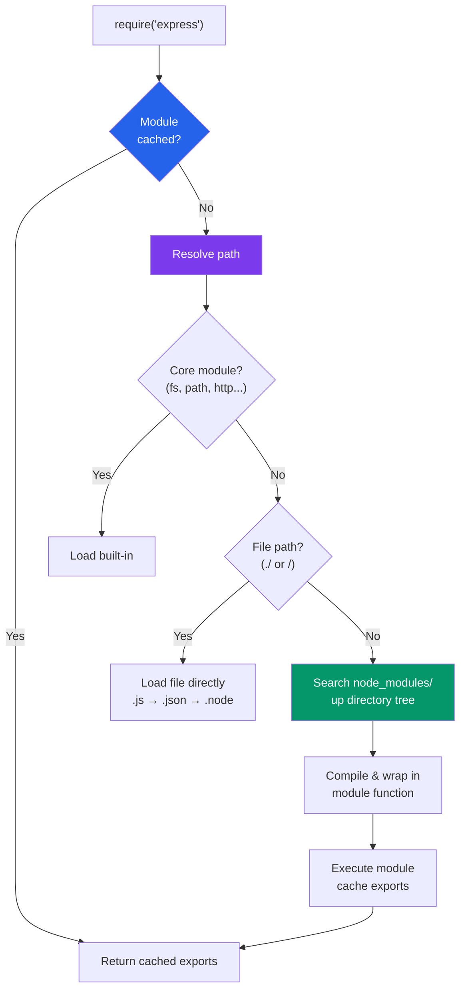

# 📦 Node.js Modules and NPM

> [!abstract] TL;DR
> Node.js has two module systems: CommonJS (CJS — the original, synchronous `require`/`module.exports`) and ECMAScript Modules (ESM — the standard `import`/`export`). NPM is the package registry and CLI that manages dependencies through `package.json` and locks exact versions in `package-lock.json`. Semantic versioning (`MAJOR.MINOR.PATCH`) governs compatibility contracts. Modern projects use pnpm or Yarn for performance and workspaces support.

## Intuition — analogy FIRST

Think of modules as files in a filing cabinet. CommonJS is like a librarian who photocopies the file and hands it to you — the first time you request a file, it's cached; subsequent requests get the same cached copy. ESM is a newer, stricter system where you declare upfront what you need and the system optimizes dependencies statically before any code runs.

NPM is the app store for your filing cabinet — a massive registry of reusable file sets (packages). `package.json` is your shopping list, `package-lock.json` is the receipt that records the exact items you bought so anyone else rebuilding the cabinet gets identical contents.

---

## How It Works



---

## Key Concepts / Details

### CommonJS vs ESM — Comparison

| Feature | CommonJS | ESM |
|---------|----------|-----|
| Syntax | `require()` / `module.exports` | `import` / `export` |
| Loading | Synchronous | Asynchronous (static analysis) |
| Tree-shaking | Not possible | Supported by bundlers |
| Top-level `await` | Not supported | Supported |
| `__dirname` / `__filename` | Available | Not available (use `import.meta.url`) |
| File extension | `.js` (default CJS) | `.mjs` or `"type": "module"` in package.json |
| Circular deps | Returns partial exports | Handles via live bindings |

### CommonJS Module System

```javascript
// math.js — exporting with CommonJS
function add(a, b) { return a + b; }
function subtract(a, b) { return a - b; }

// Named exports via module.exports object
module.exports = { add, subtract };

// Or shorthand — exports is an alias for module.exports
exports.multiply = (a, b) => a * b;
// WARNING: never reassign exports directly — it breaks the reference
// exports = { add }; // WRONG — breaks module.exports link

// app.js — importing with CommonJS
const { add, subtract } = require('./math');
const multiply = require('./math').multiply;

// Dynamic require — resolved at runtime
const dbDriver = require(`./drivers/${process.env.DB_TYPE}`);

// Built-in modules — no path prefix needed
const fs = require('fs');
const path = require('path');
const { promisify } = require('util');
```

### ECMAScript Modules (ESM)

```javascript
// math.mjs (or math.js with "type":"module" in package.json)

// Named exports
export function add(a, b) { return a + b; }
export const PI = 3.14159;

// Default export — one per module
export default class Calculator {
  add(a, b) { return a + b; }
}

// Re-export from another module (barrel export pattern)
export { readFile, writeFile } from 'fs/promises';
export * from './utils.js';

// app.mjs — importing
import Calculator, { add, PI } from './math.mjs';
import { readFile } from 'fs/promises';

// Dynamic import — returns a Promise (works in both CJS and ESM)
const { add: dynamicAdd } = await import('./math.mjs');

// __dirname equivalent in ESM
import { fileURLToPath } from 'url';
import { dirname } from 'path';
const __filename = fileURLToPath(import.meta.url);
const __dirname = dirname(__filename);
```

### package.json Structure

```json
{
  "name": "my-app",
  "version": "1.2.3",
  "description": "A sample Node.js application",
  "main": "dist/index.js",          // CJS entry point
  "module": "dist/index.mjs",       // ESM entry point (bundlers)
  "exports": {                       // Modern conditional exports
    ".": {
      "import": "./dist/index.mjs",
      "require": "./dist/index.cjs"
    },
    "./utils": "./dist/utils.js"
  },
  "type": "module",                  // "module" = ESM by default, omit for CJS
  "scripts": {
    "start": "node dist/index.js",
    "dev": "nodemon src/index.js",
    "build": "tsc",
    "test": "jest",
    "lint": "eslint src/"
  },
  "dependencies": {
    "express": "^4.18.2",           // ^ = compatible with (same major)
    "pg": "~8.11.0"                  // ~ = approximately (same minor)
  },
  "devDependencies": {
    "typescript": "^5.3.0",
    "jest": "^29.0.0",
    "nodemon": "^3.0.0"
  },
  "peerDependencies": {
    "react": ">=17.0.0"             // host app must provide this
  },
  "engines": {
    "node": ">=18.0.0",
    "npm": ">=9.0.0"
  },
  "keywords": ["api", "rest", "express"],
  "license": "MIT",
  "repository": {
    "type": "git",
    "url": "https://github.com/user/my-app.git"
  }
}
```

### Semantic Versioning

```
MAJOR.MINOR.PATCH  →  2.4.1

MAJOR — breaking changes (API removed or changed incompatibly)
MINOR — new features, backwards compatible
PATCH — bug fixes, backwards compatible

Version range operators in package.json:
  "1.2.3"    exact version
  "^1.2.3"   >=1.2.3 <2.0.0  (same major — most common)
  "~1.2.3"   >=1.2.3 <1.3.0  (same minor)
  ">=1.2.3"  any version >= 1.2.3
  "*"        any version (dangerous)
  "1.x"      any 1.x version

Pre-release tags:
  "1.0.0-alpha.1"    alpha — not ready for production
  "1.0.0-beta.2"     beta — feature complete, may have bugs
  "1.0.0-rc.1"       release candidate — final testing
```

### npm vs yarn vs pnpm

```bash
# npm (bundled with Node.js)
npm install                    # install all deps
npm install express            # add runtime dep
npm install --save-dev jest    # add dev dep
npm install -g nodemon         # install globally
npm update                     # update within semver range
npm audit                      # check for vulnerabilities
npm audit fix                  # auto-fix vulnerabilities
npm run build                  # run script from package.json
npx create-react-app my-app   # run package without installing globally

# yarn (v1 classic — similar to npm)
yarn                           # install all deps
yarn add express
yarn add --dev jest
yarn upgrade
yarn dlx create-react-app my-app  # equivalent of npx

# pnpm (efficient disk usage — symlinks to global content store)
pnpm install
pnpm add express
pnpm add -D jest
pnpm dlx create-react-app my-app
# pnpm workspaces are first-class — great for monorepos
```

### Creating and Publishing a Package

```javascript
// src/index.js — your package entry point
/**
 * @module my-string-utils
 */

/**
 * Capitalizes the first letter of a string.
 * @param {string} str
 * @returns {string}
 */
export function capitalize(str) {
  if (!str) return str;
  return str.charAt(0).toUpperCase() + str.slice(1);
}

export function kebabCase(str) {
  return str
    .replace(/([a-z])([A-Z])/g, '$1-$2')
    .replace(/\s+/g, '-')
    .toLowerCase();
}
```

```bash
# Publishing workflow
npm login                           # authenticate with npmjs.com
npm version patch                   # bump version, creates git tag
npm publish                         # publish to registry
npm publish --access public         # for scoped packages (@user/pkg)

# .npmignore (or use "files" in package.json to whitelist)
# src/
# tests/
# *.test.js
```

---

## Real-World Notes

- **Commit `package-lock.json`** but not `node_modules/` — the lock file ensures reproducible installs across machines and CI. Add `node_modules/` to `.gitignore`.
- **Use `npm ci` in CI/CD pipelines** — it installs exact versions from `package-lock.json` and fails if lock file is out of sync. Never use `npm install` in CI.
- **Prefer named exports over default exports** in libraries — named exports enable better tree-shaking and IDE autocomplete. Default exports make refactoring harder.
- **Use `"exports"` field in package.json** for modern packages — it allows conditional exports for ESM/CJS, subpath exports, and blocks deep imports into private internals.
- **`npx` runs without global install** — prefer `npx prettier --write .` over `npm install -g prettier` to avoid global version conflicts.

---

## Common Pitfalls

1. **Mixing CJS `require` and ESM `import` in the same file** — this is not allowed. Choose one system per file (and ideally per project).
2. **`exports` alias reassignment** — `exports = { foo }` breaks the reference to `module.exports`. Always use `module.exports = {...}` or `exports.foo = ...`.
3. **Publishing without a `.npmignore`** — source files, tests, and secrets may be included. Use `"files"` in package.json to whitelist what to publish.
4. **`^` version ranges can introduce breaking changes** — a published `2.0.0` of a dep will not be installed by `^1.x`, but a new minor version could change behavior.
5. **Circular dependencies in CJS** — when module A requires B and B requires A, one gets a partially-initialized export object. Restructure to break the cycle.

---

## Related Concepts

- [[_MOC_NodeJS|↑ Section MOC]]
- [[NodeJS_Fundamentals]] — How Node.js wraps each file in a module function
- [[NodeJS_Async_and_Streams]] — Dynamic `import()` returns a Promise
- [[JS_Modules_Bundling]] — Webpack/Vite consume these same module formats

---

## Review Questions

1. What are the key differences between CommonJS and ESM? When would you use each?
2. Explain what `^1.2.3` and `~1.2.3` mean in `package.json`. What range of versions does each allow?
3. Describe the module resolution algorithm for `require('express')` — where does Node look?
4. What is the difference between `npm install` and `npm ci`? When should you use `npm ci`?
5. Why can't you do `exports = { add, subtract }` in CommonJS? What's the correct pattern?

---

## Sources

- Node.js docs: Modules — CommonJS — https://nodejs.org/api/modules.html
- Node.js docs: ES Modules — https://nodejs.org/api/esm.html
- npm documentation: package.json — https://docs.npmjs.com/cli/v10/configuring-npm/package-json
- Semantic Versioning spec — https://semver.org/

#WebDevelopment #NodeJS #commonjs #esm #npm #modules
