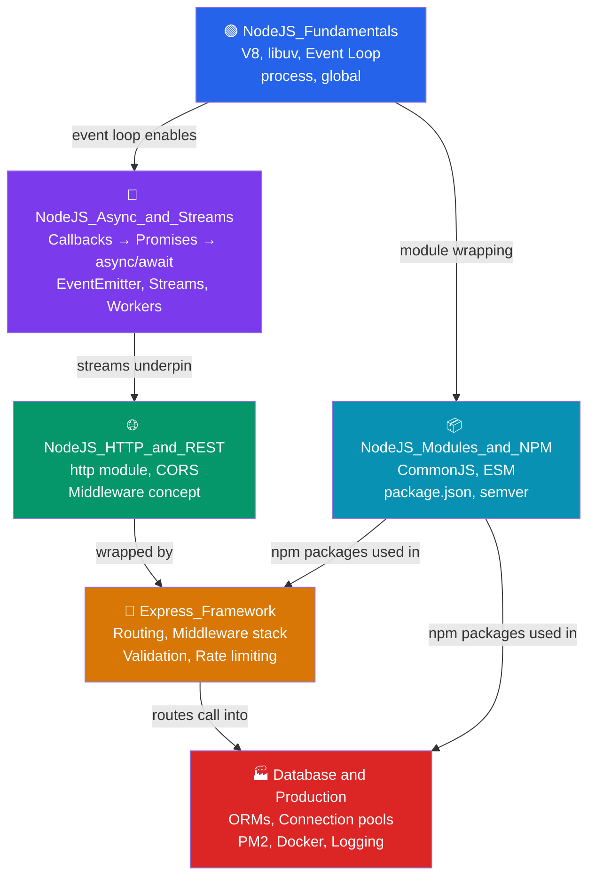

# 🟢 Node.js — Map of Content

Node.js is a JavaScript runtime built on Chrome's V8 engine that enables server-side JavaScript with non-blocking, event-driven I/O. This section covers Node.js from its core architecture through production deployment — from how the event loop works under the hood, to building REST APIs with Express, to shipping a Dockerized service running on PM2.

---

## Notes in This Section

| Note | What it covers |
|------|---------------|
| [[NodeJS_Fundamentals]] | V8 engine, libuv, event loop phases, non-blocking I/O, `process` global, `global` object |
| [[NodeJS_Modules_and_NPM]] | CommonJS vs ESM, module resolution algorithm, package.json, semantic versioning, npm/yarn/pnpm |
| [[NodeJS_Async_and_Streams]] | Callbacks, Promises, EventEmitter, Readable/Writable/Transform streams, backpressure, Worker Threads |
| [[NodeJS_HTTP_and_REST]] | Built-in `http` module, request/response lifecycle, URL parsing, CORS, HTTP/2 |
| [[Express_Framework]] | Express routing (Router, params, query), middleware pipeline, error handling, express-validator, rate limiting |
| [[NodeJS_Database_and_Production]] | pg/Prisma/mongoose, connection pooling, dotenv, pino logging, PM2 clustering, graceful shutdown, Docker |

---

## Topic Relationships



---

## Recommended Learning Path

1. **[[NodeJS_Fundamentals]]** — Start here. Understand what makes Node.js different: single-threaded event loop, V8, libuv, non-blocking I/O. Learn the 6 event loop phases and the `process` object.

2. **[[NodeJS_Modules_and_NPM]]** — Learn how Node.js loads code. Understand CommonJS vs ESM, the module resolution algorithm, and how to manage dependencies with npm. This underpins every Node.js project.

3. **[[NodeJS_Async_and_Streams]]** — Deep-dive into async patterns. Progress from callbacks to Promises to async/await. Then learn EventEmitter and Streams — the abstractions that make Node.js efficient for I/O-heavy work.

4. **[[NodeJS_HTTP_and_REST]]** — See how Node.js handles HTTP at the raw level. Build a server from scratch with the built-in `http` module to understand what frameworks abstract for you. Learn CORS and HTTP/2.

5. **[[Express_Framework]]** — Move to Express for production-quality routing and middleware. Learn the middleware pipeline, error handling patterns, validation with express-validator, and rate limiting.

6. **[[NodeJS_Database_and_Production]]** — Connect to databases, configure environments, add structured logging, set up PM2 clustering, implement graceful shutdown, and Dockerize the app.

---

## Cross-Section Links

- [[Async_JS_Promises]] — Browser event loop vs Node.js event loop (covered in [[NodeJS_Fundamentals]])
- [[JS_Modules_Bundling]] — Webpack/Vite consume the same ESM modules described in [[NodeJS_Modules_and_NPM]]
- [[_MOC_WebDev_Master|↑ Web Development Master MOC]]

---

## Quick Reference

### Event Loop Priority (highest → lowest)
```
process.nextTick  >  Promise microtasks  >  setImmediate  >  setTimeout(fn, 0)
```

### HTTP Status Codes at a Glance
```
200 OK        201 Created   204 No Content
400 Bad Request   401 Unauthorized   403 Forbidden   404 Not Found   409 Conflict
422 Unprocessable   429 Too Many Requests
500 Internal Server Error   502 Bad Gateway   503 Service Unavailable
```

### package.json Version Ranges
```
"^1.2.3"  →  >=1.2.3  <2.0.0   (same major)
"~1.2.3"  →  >=1.2.3  <1.3.0   (same minor)
"1.2.3"   →  exact version only
```

### Stream Types
```
Readable   — source of data           (fs.createReadStream, http.IncomingMessage)
Writable   — destination for data     (fs.createWriteStream, http.ServerResponse)
Duplex     — both readable + writable (net.Socket)
Transform  — read+write with mutation (zlib.createGzip, crypto cipher)
```

#NodeJS #MOC #WebDevelopment
