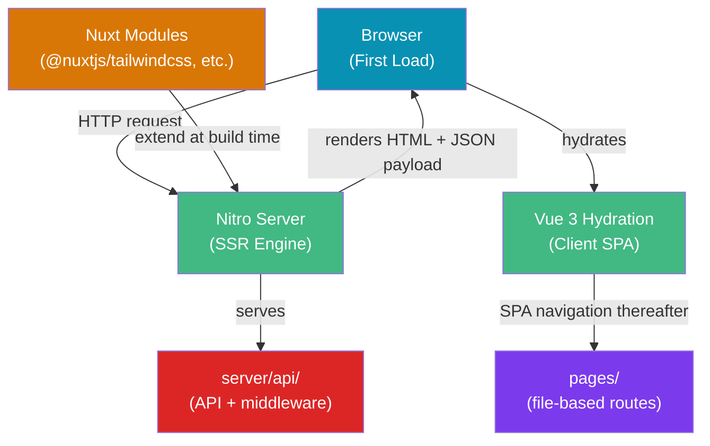

# Nuxt Framework

> [!abstract] TL;DR
> Nuxt 3 is the full-stack framework built on Vue 3 and Vite that adds what Vue alone leaves to you: file-based routing, server-side rendering (SSR), static site generation (SSG), auto-imports of composables and components, a server engine (Nitro), and a module ecosystem. Nuxt uses `useFetch`/`useAsyncData` for universal data fetching that works identically in SSR and CSR contexts. The `pages/`, `server/`, `composables/`, and `components/` directories are convention-driven — drop a file in the right place and Nuxt configures it automatically.

## Intuition — analogy FIRST

Vue is the engine block; Nuxt is the complete car. Vue gives you reactivity, components, and templating. Nuxt pre-assembles the chassis: the routing system (your steering wheel), the server engine Nitro (your drivetrain that works on any road — Node.js, Deno, Cloudflare Workers, AWS Lambda), the data-fetching layer (automatic fuel injection — server on first load, client on navigation), and the module system (your accessories catalog). You write Vue components; Nuxt handles the rest.

---

## How It Works



---

## Key Concepts / Details

### Directory Structure

```
my-nuxt-app/
├── app.vue              ← root app component (wraps all pages)
├── nuxt.config.ts       ← Nuxt configuration
├── pages/               ← file-based routing (auto-scanned)
│   ├── index.vue        → /
│   ├── about.vue        → /about
│   └── blog/
│       ├── index.vue    → /blog
│       └── [slug].vue   → /blog/:slug  (dynamic segment)
├── components/          ← auto-imported components (no import needed)
│   └── AppHeader.vue    → usable as <AppHeader /> anywhere
├── composables/         ← auto-imported composables
│   └── useUser.ts       → usable as useUser() anywhere
├── server/
│   ├── api/
│   │   └── hello.ts     → GET /api/hello
│   └── middleware/
│       └── auth.ts      → runs on every server request
├── middleware/           ← client-side route middleware
│   └── auth.ts
├── layouts/
│   └── default.vue      ← wraps pages unless overridden
└── public/              ← static assets served at /
```

### Auto-Imports — Zero Boilerplate

```vue
<!-- pages/index.vue — NO explicit imports needed -->
<script setup lang="ts">
// composables/useCounter.ts is auto-imported by Nuxt
const { count, increment } = useCounter()

// Vue's ref, computed, watch — all auto-imported
const doubled = computed(() => count.value * 2)

// Nuxt built-ins — useFetch, useRoute, useRouter — auto-imported
const route = useRoute()
const { data: posts } = await useFetch('/api/posts')
</script>
```

Nuxt scans `composables/`, `utils/`, and `components/` and generates TypeScript-aware auto-imports — no more walls of `import` statements.

### useFetch and useAsyncData

```vue
<script setup lang="ts">
// useFetch: shorthand for most REST API calls
const { data, pending, error, refresh } = await useFetch('/api/products', {
  key: 'products-list',            // cache key — must be unique per page
  transform: (res) => res.items,   // transform before caching
  // watch: [filterRef],           // re-fetch when a ref changes
})

// useAsyncData: full control, any async function
const { data: user } = await useAsyncData('user-profile', async () => {
  const profile = await $fetch('/api/user')
  const perms = await $fetch('/api/user/permissions')
  return { ...profile, permissions: perms }
})

// $fetch: isomorphic fetch (h3 on server, native fetch on client)
// Use $fetch inside event handlers — NOT top-level setup — to avoid double-fetching
async function onSubmit() {
  await $fetch('/api/submit', { method: 'POST', body: formData.value })
}
</script>
```

| Hook | Use Case |
|------|---------|
| `useFetch(url)` | Simple REST calls with auto-caching |
| `useAsyncData(key, fn)` | Custom async logic, multiple calls |
| `$fetch(url)` | Imperative fetches in event handlers |
| `useLazyFetch` / `useLazyAsyncData` | Non-blocking — page loads before data arrives |

### SSR vs SSG vs Hybrid Rendering

```ts
// nuxt.config.ts
export default defineNuxtConfig({
  // SSR (default): server renders on every request
  ssr: true,

  // Hybrid Rendering — per-route rendering rules
  routeRules: {
    '/': { prerender: true },         // SSG — pre-render at build time
    '/blog/**': { isr: 60 },          // ISR — revalidate every 60 seconds
    '/dashboard/**': { ssr: false },  // CSR — skip server render
    '/api/**': { cors: true },        // CORS headers for API routes
    '/admin/**': { robots: false },   // exclude from robots.txt
  },
})
```

### Nitro Server — API Routes

```ts
// server/api/users/[id].ts  →  GET /api/users/:id
export default defineEventHandler(async (event) => {
  const id = getRouterParam(event, 'id')
  const query = getQuery(event)          // ?foo=bar
  // const body = await readBody(event)  // for POST/PUT

  const user = await db.findUser(id)
  if (!user) throw createError({ statusCode: 404, message: 'User not found' })
  return user  // automatically JSON-serialized
})

// server/api/users/index.post.ts  →  POST /api/users
export default defineEventHandler(async (event) => {
  const body = await readBody(event)
  const user = await db.createUser(body)
  setResponseStatus(event, 201)
  return user
})
```

### Nuxt Modules

```ts
// nuxt.config.ts
export default defineNuxtConfig({
  modules: [
    '@nuxtjs/tailwindcss',   // Tailwind CSS
    '@pinia/nuxt',           // Pinia (auto-imports stores)
    '@nuxt/image',           // Optimized <NuxtImg> component
    '@nuxtjs/i18n',          // Internationalization
    '@vueuse/nuxt',          // VueUse composables auto-import
  ],
  image: { quality: 80, format: ['webp'] },
})
```

---

## Trade-Offs

| Feature | Nuxt 3 | Next.js 14 | SvelteKit |
|---------|--------|------------|-----------|
| Base framework | Vue 3 | React | Svelte |
| Server engine | Nitro (multi-runtime) | Edge Runtime / Node | Vite + adapter |
| Auto-imports | Built-in | No (explicit imports) | No |
| File-based routing | `pages/` directory | `app/` directory | `+page.svelte` |
| TypeScript support | First-class | First-class | First-class |
| Learning curve | Gentle (Vue base) | Moderate (React) | Gentle (Svelte) |

---

## Common Pitfalls

1. **Double data fetching**: Using `$fetch` at the top level of `<script setup>` issues a server request AND a client request. Use `useFetch` or `useAsyncData` — they deduplicate automatically using the cache key.
2. **Missing unique cache key**: Two `useAsyncData` calls with the same key share cached data. Always use a unique key per logical data source.
3. **Server-only secrets in components**: `process.env.SECRET` in a component runs on the client too (value becomes `undefined` in the browser). Use `server/` routes or `useRuntimeConfig()` with `runtimeConfig.private.*` keys.
4. **`<NuxtLink>` vs `<a>`**: Always use `<NuxtLink>` for internal navigation — it enables client-side SPA transitions. A plain `<a href>` triggers a full page reload.
5. **Hydration mismatches**: Rendering different HTML on server vs client (e.g., `Date.now()`, random IDs) causes Vue hydration errors. Use `<ClientOnly>` wrapper or initialize inside `onMounted`.

---

## Related Concepts

- [[_MOC_Vue|↑ Vue Section MOC]]
- [[Vue_Fundamentals]] — Vue 3 SFC fundamentals Nuxt builds on
- [[Vue_Reactivity_and_Composition_API]] — Composable patterns used throughout Nuxt apps
- [[NextJS_Fundamentals]] — Nuxt's counterpart in the React ecosystem

---

## Review Questions

1. What is the difference between `useFetch` and `$fetch` in Nuxt 3? When should you use each?
2. Explain how Nuxt's auto-import system works. What directories does it scan, and what is the trade-off compared to explicit imports?
3. What is the `routeRules` option in `nuxt.config.ts` and how does it enable Hybrid Rendering per route?
4. A Nitro server route should handle `POST /api/users`. Where do you place the file and how do you name it to restrict it to POST only?
5. What causes a hydration mismatch and what are two strategies to prevent one?

---

## Sources

- Nuxt 3 docs: Getting Started — https://nuxt.com/docs/getting-started/introduction
- Nuxt 3 docs: Data Fetching — https://nuxt.com/docs/getting-started/data-fetching
- Nuxt 3 docs: Server Routes — https://nuxt.com/docs/guide/directory-structure/server
- Nitro docs — https://nitro.unjs.io/

#web-development #vue #nuxt #ssr #nitro #ssg
