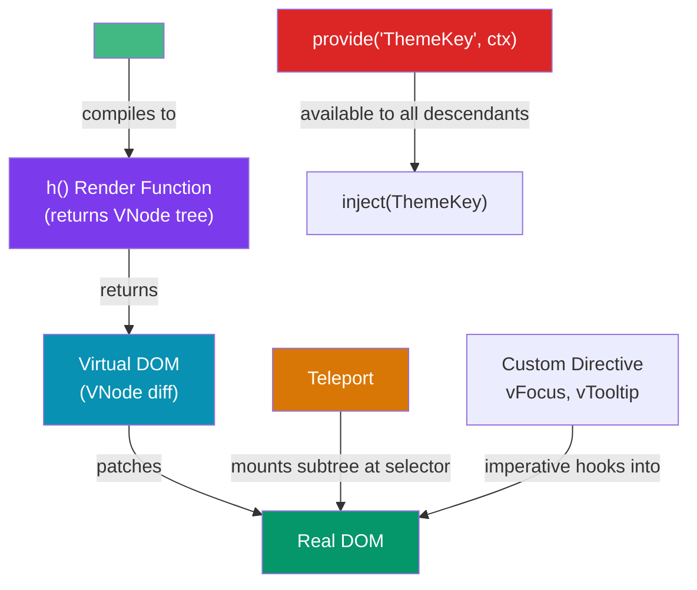

# Vue Advanced Patterns

> [!abstract] TL;DR
> Beyond standard templates and components, Vue 3 offers four low-level mechanisms for advanced use cases: **Teleport** renders a component's subtree in a different part of the DOM (useful for modals and tooltips that must escape CSS overflow/z-index stacking contexts); **Provide/Inject** passes values deep down the component tree without prop-drilling; **Custom Directives** attach imperative DOM behavior to elements declaratively; **render functions** (`h()`) bypass the template compiler entirely for fully programmatic component trees. These mechanisms power most UI library internals and enable patterns that templates alone cannot express.

## Intuition — analogy FIRST

A template is giving instructions in plain language. But sometimes you need direct control:
- **Teleport** is like a pneumatic postal tube — the modal logically belongs to the button's component, but it physically needs to arrive at the `<body>` level to escape the building's local plumbing (CSS stacking contexts).
- **Provide/Inject** is like a building's electrical grid — the main panel (provider) distributes power to any outlet (injector) in the building without running wires through every floor in between.
- **Custom Directives** are like sticky notes attached to a DOM element that tell the browser how to behave: `v-focus` (autofocus me), `v-tooltip` (show this hint), `v-click-outside` (call this function when clicked elsewhere).
- **Render functions** are the compiler itself — you describe the VDOM tree in JavaScript rather than HTML, gaining full programmatic power at the cost of template readability.

---

## How It Works



---

## Key Concepts / Details

### Teleport — Escape the DOM Hierarchy

```vue
<!-- ModalButton.vue -->
<script setup lang="ts">
import { ref } from 'vue'
const isOpen = ref(false)
</script>

<template>
  <button @click="isOpen = true">Open Modal</button>

  <!--
    Teleport renders the inner DOM into #modal-root (at <body> level),
    even though this component is deep in the tree.
    The component still belongs to ModalButton's component tree —
    it receives props, uses inject, and emits events normally.
    :disabled="true" makes Teleport render in-place (useful for SSR).
  -->
  <Teleport to="#modal-root">
    <div v-if="isOpen" class="modal-overlay" @click.self="isOpen = false">
      <div class="modal-content" role="dialog" aria-modal="true">
        <h2>Confirm action</h2>
        <slot>Default content</slot>
        <button @click="isOpen = false">Close</button>
      </div>
    </div>
  </Teleport>
</template>
```

```html
<!-- index.html — add the Teleport target outside #app -->
<div id="app"></div>
<div id="modal-root"></div>
```

Key insight: the teleported subtree **participates in the parent component tree** (reactivity, provide/inject, emits all work normally). Only the DOM position changes.

### Provide / Inject — Implicit Dependency Tree

```ts
// composables/useTheme.ts — typed provide/inject with InjectionKey
import { provide, inject, ref, type InjectionKey, type Ref } from 'vue'

export interface ThemeContext {
  theme: Ref<'light' | 'dark'>
  toggleTheme: () => void
}

// InjectionKey gives full type inference on inject()
export const ThemeKey: InjectionKey<ThemeContext> = Symbol('theme')

// Provider — called once in a parent or root component
export function useThemeProvider() {
  const theme = ref<'light' | 'dark'>('light')
  const toggleTheme = () => {
    theme.value = theme.value === 'light' ? 'dark' : 'light'
  }
  provide(ThemeKey, { theme, toggleTheme })
}

// Consumer — called in any descendant at any depth
export function useTheme() {
  const ctx = inject(ThemeKey)
  if (!ctx) throw new Error('useTheme() must be used within a ThemeProvider')
  return ctx
}
```

```vue
<!-- App.vue (root provider) -->
<script setup>
import { useThemeProvider } from '@/composables/useTheme'
useThemeProvider()
</script>

<!-- ThemeToggle.vue (anywhere deep in the tree) -->
<script setup>
import { useTheme } from '@/composables/useTheme'
const { theme, toggleTheme } = useTheme()
</script>
<template>
  <button @click="toggleTheme">Mode: {{ theme }}</button>
</template>
```

**Critical**: always provide the `ref` itself, not `.value`. `provide('count', count)` where `count` is a `ref` preserves reactivity. `provide('count', count.value)` loses it.

### Custom Directives

```ts
// directives/vFocus.ts
import type { Directive } from 'vue'

// Object with lifecycle hook callbacks (same names as component hooks)
export const vFocus: Directive<HTMLElement> = {
  mounted(el) { el.focus() },
}

// directives/vTooltip.ts — with value, arg, and modifiers
export const vTooltip: Directive<HTMLElement & { _tip?: HTMLSpanElement }, string> = {
  mounted(el, binding) {
    // binding.value  = "tooltip text"
    // binding.arg    = "top" (from v-tooltip:top)
    // binding.modifiers = { dark: true } (from v-tooltip.dark)
    const tip = document.createElement('span')
    tip.className = `tooltip tooltip--${binding.arg ?? 'bottom'}`
    tip.textContent = binding.value
    el.appendChild(tip)
    el._tip = tip
  },
  updated(el, binding) {
    if (el._tip) el._tip.textContent = binding.value
  },
  unmounted(el) {
    if (el._tip) el.removeChild(el._tip)
  },
}
```

```ts
// main.ts — register globally
import { createApp } from 'vue'
import App from './App.vue'
import { vFocus } from './directives/vFocus'
import { vTooltip } from './directives/vTooltip'

const app = createApp(App)
app.directive('focus', vFocus)
app.directive('tooltip', vTooltip)
app.mount('#app')
```

```vue
<!-- Usage in templates -->
<template>
  <input v-focus />                                <!-- auto-focused on mount -->
  <button v-tooltip="'Click to save'">Save</button>
  <button v-tooltip:top.dark="'Danger!'">Delete</button>
</template>
```

### Render Functions with h()

```ts
// components/DynamicHeading.ts
// Use h() when the tag itself is dynamic — templates cannot express this
import { h, defineComponent, type PropType } from 'vue'

export default defineComponent({
  props: {
    level: { type: Number as PropType<1|2|3|4|5|6>, default: 1 },
    text: String,
  },
  setup(props, { slots }) {
    // h(tag | Component, props, children)
    return () => h(
      `h${props.level}`,                     // dynamic tag name
      { class: `heading heading--${props.level}` },
      slots.default ? slots.default() : props.text
    )
  },
})

// Functional component (stateless, cheapest render)
const Badge = (props: { color: string; label: string }) =>
  h('span', { class: `badge badge--${props.color}` }, props.label)
```

### Vue Plugins

```ts
// plugins/analyticsPlugin.ts
import type { App } from 'vue'

export interface AnalyticsOptions { apiKey: string; debug?: boolean }

export const AnalyticsPlugin = {
  install(app: App, options: AnalyticsOptions) {
    // 1. Register global components
    app.component('AnalyticsBadge', AnalyticsBadgeComponent)

    // 2. Register global directives
    app.directive('track', vTrackDirective)

    // 3. Provide options to descendants via inject
    app.provide('analyticsOptions', options)

    // 4. Add global property (prefer composables/inject over this)
    app.config.globalProperties.$track = (event: string) =>
      analytics.send(event, options.apiKey)
  },
}

// main.ts
app.use(AnalyticsPlugin, { apiKey: 'abc123', debug: true })
```

### Custom Composable Patterns

```ts
// Pattern: Composable with lifecycle-scoped event listener
import { onMounted, onUnmounted } from 'vue'

export function useEventListener<K extends keyof WindowEventMap>(
  event: K,
  handler: (e: WindowEventMap[K]) => void,
) {
  onMounted(() => window.addEventListener(event, handler))
  onUnmounted(() => window.removeEventListener(event, handler))
}

// Pattern: Persistent ref synchronized to localStorage
import { ref, watch } from 'vue'

export function useLocalStorage<T>(key: string, defaultValue: T) {
  const stored = localStorage.getItem(key)
  const value = ref<T>(stored !== null ? JSON.parse(stored) : defaultValue)
  watch(value, (v) => localStorage.setItem(key, JSON.stringify(v)), { deep: true })
  return value
}

// Usage — no setup overhead in the consuming component
const theme = useLocalStorage('theme', 'light')
useEventListener('resize', () => console.log(window.innerWidth))
```

---

## Trade-Offs

| Pattern | Best For | Avoid When |
|---------|---------|------------|
| Teleport | Modals, tooltips escaping z-index / overflow | Simple in-place rendering |
| Provide/Inject | Deep trees, plugin APIs, design system theming | Shallow 1–2 level prop passing |
| Custom Directives | Imperative DOM manipulation (focus, scroll, drag) | Component logic — use composables instead |
| `h()` render function | Dynamic tag names, headless UI libraries | Ordinary UI — templates are more readable |
| Plugins | Cross-cutting concerns (auth, i18n, analytics) | Single-component features |

---

## Common Pitfalls

1. **Non-reactive provide**: `provide('count', count.value)` where `count` is a `ref` — you're providing the raw number, not the reactive ref. Descendants get a stale snapshot. Always provide the ref itself.
2. **Missing directive cleanup**: Custom directives that add DOM elements or event listeners must remove them in `unmounted`. Forgetting causes memory leaks on every component re-render.
3. **Teleport and SSR**: `<Teleport>` is skipped during server-side rendering (no `#modal-root` in Node). Wrap SSR-sensitive teleports with `<ClientOnly>` in Nuxt, or use `:disabled="isServer"`.
4. **`h()` type inference with dynamic tags**: `h('div')` is typed; `h(tagName)` where `tagName` is a `string` loses element-specific prop types. Add explicit `as keyof HTMLElementTagNameMap` cast if needed.
5. **`inject` without a default**: `inject(ThemeKey)` returns `undefined` if called outside a providing ancestor. Always provide a fallback value or throw a meaningful error.

---

## Related Concepts

- [[_MOC_Vue|↑ Vue Section MOC]]
- [[Vue_Fundamentals]] — Template syntax and directives foundation
- [[Vue_Components_and_Props]] — Props/emits and slot patterns that complement Provide/Inject
- [[Vue_Reactivity_and_Composition_API]] — Custom composable patterns leveraged by directives and plugins

---

## Review Questions

1. A modal rendered deep in the component tree ignores `z-index` set on its parent. How does `<Teleport>` fix this, and what does it NOT change about the component's reactive data flow?
2. What is an `InjectionKey<T>` and why is it preferred over a plain string key for `provide`/`inject`?
3. Write the skeleton of a `v-click-outside` custom directive that calls a callback when the user clicks outside the bound element. Which directive lifecycle hooks do you need?
4. When would you use a render function (`h()`) instead of a `<template>`? Give a concrete example from a real UI library use case.
5. What is the difference between `app.provide()` in a plugin and `provide()` inside a component's `setup()`?

---

## Sources

- Vue 3 docs: Teleport — https://vuejs.org/guide/built-ins/teleport
- Vue 3 docs: Provide / Inject — https://vuejs.org/guide/components/provide-inject
- Vue 3 docs: Custom Directives — https://vuejs.org/guide/reusability/custom-directives
- Vue 3 docs: Render Functions — https://vuejs.org/guide/extras/render-function

#web-development #vue #advanced #teleport #provide-inject #directives #render-functions #plugins
