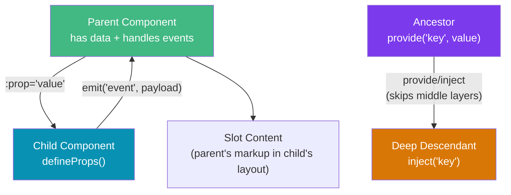

# Vue Components and Props

> [!abstract] TL;DR
> Vue components communicate through **props** (parent → child data), **emits** (child → parent events), and **slots** (parent → child markup injection). In Vue 3 with `<script setup>`, these are declared with `defineProps()` and `defineEmits()` — compiler macros that require no import. `provide/inject` breaks the prop-drilling chain for deeply nested trees. Attribute inheritance (fallthrough) automatically applies non-prop attributes to the root element — controllable via `inheritAttrs: false`.

## Intuition — analogy FIRST

Think of a component as an appliance. **Props** are the controls on the front panel — the parent sets them. **Emits** are the appliance's output signals — a dishwasher beeps when done (emitting an event the parent can hear). **Slots** are the removable compartment — you insert your own dishes (markup) and the appliance handles the rest. **Provide/inject** is like a building's plumbing — the water source (provider) is installed once at the top floor, and any apartment (injector) can tap into it without running pipes through every floor in between.

---

## How It Works



---

## Key Concepts / Details

### Component Registration

```typescript
// GLOBAL registration (main.ts) — available everywhere, increases bundle size
import { createApp } from 'vue'
import BaseButton from './components/BaseButton.vue'

const app = createApp(App)
app.component('BaseButton', BaseButton)  // <BaseButton /> works anywhere
app.mount('#app')

// LOCAL registration (preferred — tree-shakeable)
// In <script setup>, imported components are auto-registered
<script setup>
import MyCard from './MyCard.vue'
// <MyCard /> is now available in this component's template
</script>
```

### Props — defineProps

```vue
<!-- ChildComponent.vue -->
<script setup lang="ts">
// TypeScript-style defineProps (preferred)
interface Props {
  title: string
  count?: number           // optional
  items: string[]
  variant?: 'primary' | 'secondary'
  modelValue?: string      // for v-model support
}

const props = defineProps<Props>()

// With defaults (withDefaults)
const propsWithDefaults = withDefaults(defineProps<Props>(), {
  count: 0,
  variant: 'primary',
  items: () => [],   // factory function for reference types!
})

// Runtime defineProps (no TypeScript)
const runtimeProps = defineProps({
  title: {
    type: String,
    required: true,
  },
  count: {
    type: Number,
    default: 0,
    validator: (val: number) => val >= 0,
  },
})
</script>

<template>
  <div>
    <h2>{{ props.title }}</h2>
    <span>{{ propsWithDefaults.count }}</span>
  </div>
</template>
```

```vue
<!-- Parent usage -->
<template>
  <ChildComponent
    title="Hello"
    :count="42"
    :items="['a', 'b', 'c']"
    variant="secondary"
  />
</template>
```

### Emits — defineEmits

```vue
<script setup lang="ts">
// TypeScript-style emits
const emit = defineEmits<{
  change: [value: string]        // named tuple: event name + payload types
  submit: [formData: FormData]
  'update:modelValue': [value: string]  // v-model convention
}>()

// Runtime style
// const emit = defineEmits(['change', 'submit'])

function handleInput(event: Event) {
  const value = (event.target as HTMLInputElement).value
  emit('update:modelValue', value)  // enables v-model on this component
}

function submitForm() {
  emit('submit', new FormData())
}
</script>

<template>
  <input @input="handleInput" />
  <button @click="submitForm">Submit</button>
</template>
```

```vue
<!-- Parent using v-model with custom component -->
<template>
  <!-- v-model expands to :modelValue="val" @update:modelValue="val = $event" -->
  <MyInput v-model="searchText" />

  <!-- Named v-model -->
  <UserForm v-model:firstName="first" v-model:lastName="last" />
</template>
```

### Slots — Default, Named, and Scoped

```vue
<!-- Card.vue — component with slots -->
<template>
  <div class="card">
    <!-- Default slot -->
    <div class="card-body">
      <slot>Fallback content if no slot provided</slot>
    </div>

    <!-- Named slot -->
    <div class="card-header">
      <slot name="header" />
    </div>

    <!-- Scoped slot: exposes data UP to the parent -->
    <ul>
      <li v-for="item in items" :key="item.id">
        <slot name="item" :item="item" :index="index" />
      </li>
    </ul>
  </div>
</template>
```

```vue
<!-- Parent consuming slots -->
<template>
  <Card>
    <!-- default slot -->
    <p>Main body content here</p>

    <!-- named slot -->
    <template #header>
      <h2>Card Title</h2>
    </template>

    <!-- scoped slot — parent receives data from child -->
    <template #item="{ item, index }">
      <span class="badge">{{ index + 1 }}</span>
      {{ item.name }}
    </template>
  </Card>
</template>
```

### Provide / Inject

```typescript
// ThemeProvider.vue — ancestor provides
<script setup>
import { provide, ref } from 'vue'

const theme = ref<'light' | 'dark'>('light')

function toggleTheme() {
  theme.value = theme.value === 'light' ? 'dark' : 'light'
}

// Provide a readonly ref to prevent mutation from consumers
provide('theme', { theme: readonly(theme), toggleTheme })
</script>

// DeepChild.vue — descendant injects
<script setup>
import { inject } from 'vue'

// inject(key, defaultValue) — type inferred from provide
const { theme, toggleTheme } = inject('theme', {
  theme: ref('light'),
  toggleTheme: () => {}
})
</script>

// InjectionKey for type-safe provide/inject (TypeScript)
// keys.ts
import type { InjectionKey, Ref } from 'vue'
export const ThemeKey: InjectionKey<Ref<'light' | 'dark'>> = Symbol('theme')

// Parent: provide(ThemeKey, ref('dark'))
// Child: const theme = inject(ThemeKey)  // type: Ref<'light' | 'dark'> | undefined
```

### Attribute Inheritance (Fallthrough)

```vue
<!-- BaseInput.vue -->
<script setup>
// Opt out of auto-inheritance on root element
defineOptions({ inheritAttrs: false })
</script>

<template>
  <!-- $attrs contains non-prop attributes (class, style, id, event listeners) -->
  <!-- Manually apply to the inner input, not the wrapper div -->
  <div class="input-wrapper">
    <input v-bind="$attrs" class="input" />
  </div>
</template>

<!-- Parent usage — class goes to <input>, not <div> -->
<BaseInput class="search-input" placeholder="Type here..." @focus="onFocus" />
```

---

## Real-World Notes

- **One-way data flow**: never mutate a prop directly. Emit an event to ask the parent to update. Mutating props causes hard-to-debug reactivity issues.
- **`provide/inject` is for configuration/context** (themes, auth, i18n), not for general state management — use Pinia for that.
- **Scoped slots** are Vue's answer to React render props — they let a child component control the layout while the parent controls the data/markup.
- **`defineProps` and `defineEmits` are compiler macros** — they're processed at build time and don't need to be imported. Calling them inside a function or conditional throws a compile error.

---

## Common Pitfalls

- **Mutating props** — use `const localCopy = ref(props.value)` and emit changes upward.
- **Missing factory defaults for Array/Object props** — `default: []` is evaluated once and shared. Use `default: () => []`.
- **Losing reactivity when destructuring props** — `const { count } = props` breaks reactivity. Use `toRefs(props)` or keep `props.count`.
- **Forgetting `readonly()` on provided values** — consumers can accidentally mutate provided state without it.

---

## Related Concepts

- [[_MOC_Vue|↑ Section MOC]]
- [[Vue_Fundamentals]] — Template syntax and directives
- [[Vue_Reactivity_and_Composition_API]] — ref, reactive, composables
- [[Vue_Router_and_Pinia]] — App-level state management with Pinia

---

## Review Questions

1. What is the difference between defining props with TypeScript generics (`defineProps<Props>()`) vs the runtime object syntax?
2. How does `v-model` on a custom component work under the hood? What event must the component emit?
3. What is a scoped slot and why is it useful? Give an example use case.
4. When should you use `provide/inject` vs Pinia for shared state?
5. What does `inheritAttrs: false` do and when would you need it?

---

## Sources

- Vue 3 docs: Props — https://vuejs.org/guide/components/props
- Vue 3 docs: Events — https://vuejs.org/guide/components/events
- Vue 3 docs: Slots — https://vuejs.org/guide/components/slots
- Vue 3 docs: Provide/Inject — https://vuejs.org/guide/components/provide-inject

#web-development #vue #components #props #slots #provide-inject
