# Vue Forms

> [!abstract] TL;DR
> Vue form handling spans three tiers: native `v-model` for simple state, validation libraries for field-level rules, and full form frameworks for complex schemas. **Vee-Validate v4** is the compositional leader — it uses `useField`/`useForm` composables and integrates with Zod/Yup schemas via adapters for end-to-end type safety. **FormKit** takes a schema-driven approach where a single configuration object describes inputs, labels, validation, and styles. **Vuelidate** stays lightweight and reactive-first. Server-side validation errors can be mapped back to form fields in all three libraries.

## Intuition — analogy FIRST

Think of a paper form at a government office. The paper is your HTML template. `v-model` is the pen that writes values in fields as the user types. A validation library is the clerk who reviews the form before accepting it — checking that signatures are present, dates are valid, and required fields are not empty. A form framework like FormKit goes further: it is a form-printing machine that generates the paper, the fields, the instructions, and the clerk's checklist all from a single blueprint configuration object.

---

## How It Works

```mermaid
graph TD
    Template["Template\n<Form> <Field> <input v-model>"]
    VModel["v-model / useField\n(two-way binding)"]
    State["Reactive State\n(useForm internals)"]
    Schema["Validation Schema\n(Zod / Yup / rules)"]
    Errors["Error State\n(errors, meta.valid)"]
    Submit["Submit Handler\nonSubmit(values)"]

    Template -->|"user input"| VModel
    VModel --> State
    State -->|"validate against"| Schema
    Schema -->|"produces"| Errors
    Errors -->|"displayed in"| Template
    State -->|"valid → trigger"| Submit

    style Template fill:#42b883,color:#fff
    style Schema fill:#0891b2,color:#fff
    style Errors fill:#dc2626,color:#fff
    style Submit fill:#059669,color:#fff
```



---

## Key Concepts / Details

### Vee-Validate v4 with Zod (Composable API)

```vue
<script setup lang="ts">
import { useForm, useField } from 'vee-validate'
import { toTypedSchema } from '@vee-validate/zod'
import { z } from 'zod'

// 1. Define schema — single source of truth for types AND validation
const schema = z.object({
  email: z.string().email('Invalid email address'),
  password: z.string().min(8, 'Password must be at least 8 characters'),
  age: z.number({ invalid_type_error: 'Age must be a number' })
         .int().min(18, 'Must be at least 18'),
})

// 2. Initialize form — toTypedSchema bridges Zod to Vee-Validate
const { handleSubmit, errors, isSubmitting, resetForm, setErrors } = useForm({
  validationSchema: toTypedSchema(schema),
  initialValues: { email: '', password: '', age: undefined },
})

// 3. Bind individual fields
const { value: email, errorMessage: emailError } = useField<string>('email')
const { value: password, errorMessage: passwordError } = useField<string>('password')

// 4. handleSubmit only calls the callback when the form is VALID
const onSubmit = handleSubmit(async (values) => {
  // values is typed as z.infer<typeof schema>
  try {
    await api.register(values)
    resetForm()
  } catch (err) {
    if (err.response?.status === 422) {
      // Map server errors back to fields
      setErrors({ email: 'Email already taken' })
    }
  }
})
</script>

<template>
  <form @submit="onSubmit" novalidate>
    <div>
      <label for="email">Email</label>
      <input id="email" v-model="email" type="email" :class="{ error: emailError }" />
      <span class="error-msg">{{ emailError }}</span>
    </div>
    <div>
      <label for="password">Password</label>
      <input id="password" v-model="password" type="password" />
      <span class="error-msg">{{ passwordError }}</span>
    </div>
    <button type="submit" :disabled="isSubmitting">
      {{ isSubmitting ? 'Submitting…' : 'Register' }}
    </button>
  </form>
</template>
```

### Vee-Validate with `<Form>` and `<Field>` Components

```vue
<!-- Component-based API — less boilerplate for simple forms -->
<script setup lang="ts">
import { Form, Field, ErrorMessage } from 'vee-validate'
import { toTypedSchema } from '@vee-validate/zod'
import { z } from 'zod'

const validationSchema = toTypedSchema(z.object({
  name: z.string().min(2, 'At least 2 characters'),
  email: z.string().email('Invalid email'),
}))

async function onSubmit(values: Record<string, unknown>) {
  await api.save(values)
}
</script>

<template>
  <Form :validation-schema="validationSchema" @submit="onSubmit" v-slot="{ isSubmitting }">
    <Field name="name" type="text" placeholder="Full name" />
    <ErrorMessage name="name" class="error" />

    <Field name="email" type="email" placeholder="Email" />
    <ErrorMessage name="email" class="error" />

    <button :disabled="isSubmitting">Submit</button>
  </Form>
</template>
```

### FormKit — Schema-Driven Forms

```vue
<script setup lang="ts">
// FormKit describes the entire form as a data structure
const formSchema = [
  {
    $formkit: 'text',
    name: 'username',
    label: 'Username',
    validation: 'required|length:3,20',
    help: 'Choose a unique username',
  },
  {
    $formkit: 'email',
    name: 'email',
    label: 'Email',
    validation: 'required|email',
  },
  {
    $formkit: 'select',
    name: 'role',
    label: 'Role',
    options: ['admin', 'editor', 'viewer'],
    validation: 'required',
  },
]

async function submitHandler(data: Record<string, unknown>) {
  // data is already validated when this runs
  await api.save(data)
}
</script>

<template>
  <!-- Schema-driven: FormKitSchema renders the entire form -->
  <FormKit type="form" :actions="false" @submit="submitHandler">
    <FormKitSchema :schema="formSchema" />
    <button type="submit">Submit</button>
  </FormKit>

  <!-- Or use individual FormKit inputs -->
  <FormKit
    type="text"
    name="name"
    label="Full Name"
    validation="required|length:2,50"
    validation-visibility="live"
  />
</template>
```

### Vuelidate — Reactive-First (Lightweight)

```vue
<script setup lang="ts">
import { reactive } from 'vue'
import { useVuelidate } from '@vuelidate/core'
import { required, email, minLength } from '@vuelidate/validators'

const state = reactive({ name: '', email: '', password: '' })

const rules = {
  name:     { required, minLength: minLength(2) },
  email:    { required, email },
  password: { required, minLength: minLength(8) },
}

const v$ = useVuelidate(rules, state)

async function submit() {
  const isValid = await v$.value.$validate()
  if (!isValid) return
  await api.submit(state)
}
</script>

<template>
  <form @submit.prevent="submit">
    <input v-model="state.name" @blur="v$.name.$touch()" />
    <span v-if="v$.name.$error">{{ v$.name.$errors[0].$message }}</span>

    <input v-model="state.email" type="email" @blur="v$.email.$touch()" />
    <span v-if="v$.email.$error">{{ v$.email.$errors[0].$message }}</span>

    <button type="submit">Save</button>
  </form>
</template>
```

### Library Comparison

| Feature | Vee-Validate v4 | FormKit | Vuelidate |
|---------|----------------|---------|-----------|
| API style | Composable (`useField`/`useForm`) | Schema-driven config | Reactive object |
| Zod/Yup integration | First-class (adapter) | Plugin | Via validators |
| Bundle size | ~12 KB gzipped | ~30 KB gzipped | ~5 KB gzipped |
| TypeScript | Excellent (typed schemas) | Good | Good |
| UI agnostic | Yes | No (opinionated styling) | Yes |
| Server error mapping | `setErrors()` | `node.setErrors()` | Manual |
| Best for | Complex forms, Zod ecosystem | Rapid schema-defined UIs | Simple reactive forms |

### Zod Integration Pattern

```ts
// Shared schema — works for both frontend validation AND backend parsing
// src/schemas/register.ts
import { z } from 'zod'

export const RegisterSchema = z.object({
  email: z.string().email(),
  password: z.string().min(8).regex(/[A-Z]/, 'Needs uppercase'),
  confirmPassword: z.string(),
}).refine(
  (data) => data.password === data.confirmPassword,
  { message: "Passwords don't match", path: ['confirmPassword'] }
)

export type RegisterData = z.infer<typeof RegisterSchema>

// Frontend: useForm({ validationSchema: toTypedSchema(RegisterSchema) })
// Backend:  RegisterSchema.parse(req.body)  — same rules, no duplication
```

---

## Common Pitfalls

1. **Forgetting `@blur` for Vuelidate**: Vuelidate errors only show after `$touch()`. Without `@blur="v$.field.$touch()"`, errors never appear until `$validate()` is called on submit.
2. **Inline schema object causing re-validation loops**: In Vee-Validate, passing `validationSchema` as an inline object literal (`{ validationSchema: toTypedSchema(z.object({...})) }`) creates a new reference on every render, triggering infinite re-validation. Define the schema outside the component.
3. **Mixing `v-model` with `useField`**: `useField` manages its own binding via its returned `value` ref. Applying `v-model` to the same input creates a double-binding conflict.
4. **Missing `novalidate` on `<form>`**: Without `novalidate`, the browser shows its own validation popups that conflict with your library's error display.
5. **FormKit global plugin not installed**: FormKit requires `app.use(defaultConfig)` in `main.ts`. Missing it causes silent failures with no styling or validation.

---

## Related Concepts

- [[_MOC_Vue|↑ Vue Section MOC]]
- [[Vue_Fundamentals]] — `v-model` and template directives foundation
- [[Vue_Reactivity_and_Composition_API]] — Composable patterns Vee-Validate v4 is built on
- [[Vue_Components_and_Props]] — Building reusable form field components

---

## Review Questions

1. What is `toTypedSchema` from `@vee-validate/zod` and why is it needed to connect Zod to Vee-Validate?
2. A Vee-Validate form receives a 422 response from the server with field-specific errors. How do you map those errors back to the corresponding form fields?
3. What is the key architectural difference between Vee-Validate's composable API and FormKit's schema-driven API? When would you choose each?
4. Explain why defining a Zod schema in a shared module improves full-stack type safety.
5. Why would you choose Vuelidate over Vee-Validate for a simple login form?

---

## Sources

- Vee-Validate v4 docs — https://vee-validate.logaretm.com/v4/
- Zod docs — https://zod.dev/
- FormKit docs — https://formkit.com/
- Vuelidate docs — https://vuelidate-next.netlify.app/

#web-development #vue #forms #validation #vee-validate #zod #formkit
