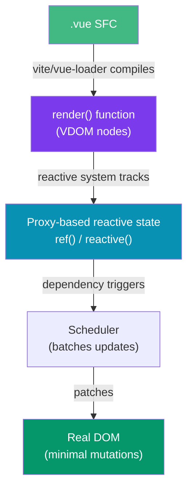

# Vue Fundamentals

> [!abstract] TL;DR
> Vue 3 is a progressive, component-based UI framework. A Single File Component (SFC) bundles template, script, and style in one `.vue` file. Vue offers two authoring styles: the older **Options API** (object-based, `data()/methods/computed`) and the modern **Composition API** (`<script setup>`, composable functions). Both compile to the same underlying reactive system — choose based on team preference. Template syntax uses mustache interpolation `{{ }}` and directives (`v-if`, `v-for`, `v-bind`, `v-on`, `v-model`) that are compiled away at build time.

## Intuition — analogy FIRST

Vue is like a smart spreadsheet: you declare cells (reactive data), and Vue automatically recalculates every formula (computed properties, template bindings) that depends on those cells — you never manually say "recalculate." The template is the formula; the reactive state is the cell value. Change the cell, and every dependent formula updates itself.

The Single File Component is Vue's secret weapon: one `.vue` file owns its own HTML structure, JavaScript logic, and scoped CSS — like a self-contained widget you can drop anywhere without global style bleed.

---

## How It Works



---

## Key Concepts / Details

### Single File Components (SFC)

```vue
<!-- Counter.vue — the canonical SFC structure -->
<script setup lang="ts">
import { ref, computed } from 'vue'

// Reactive state
const count = ref(0)
const doubled = computed(() => count.value * 2)

// Methods are just functions
function increment() {
  count.value++
}
</script>

<template>
  <div class="counter">
    <p>Count: {{ count }}</p>
    <p>Doubled: {{ doubled }}</p>
    <button @click="increment">+1</button>
  </div>
</template>

<style scoped>
/* scoped = CSS only applies to this component's elements */
.counter { padding: 1rem; }
button { margin-top: 0.5rem; }
</style>
```

### Options API vs Composition API

```vue
<!-- OPTIONS API style -->
<script>
export default {
  name: 'OptionsCounter',
  data() {
    return { count: 0 }
  },
  computed: {
    doubled() { return this.count * 2 }
  },
  methods: {
    increment() { this.count++ }
  },
  mounted() {
    console.log('mounted')
  }
}
</script>

<!-- COMPOSITION API style (preferred in Vue 3) -->
<script setup>
import { ref, computed, onMounted } from 'vue'
const count = ref(0)
const doubled = computed(() => count.value * 2)
function increment() { count.value++ }
onMounted(() => console.log('mounted'))
</script>
```

Key differences: Composition API groups code by **feature** (all counter logic together), not by **option type** (`data`, `computed`, `methods` spread across the file). Composition API is also tree-shakeable and enables reusable composables.

### Template Syntax and Directives

```vue
<template>
  <!-- Mustache interpolation — text only -->
  <p>{{ message }}</p>
  <p>{{ user.name.toUpperCase() }}</p>

  <!-- v-bind: bind attributes dynamically (shorthand :) -->
  
  <button :disabled="isLoading">Submit</button>

  <!-- v-on: listen to events (shorthand @) -->
  <button @click="handleClick">Click</button>
  <input @keydown.enter="submit" />       <!-- key modifier -->
  <button @click.stop="doThis">Stop</button>  <!-- event modifier -->

  <!-- v-if / v-else-if / v-else: conditional rendering (DOM in/out) -->
  <p v-if="status === 'loading'">Loading…</p>
  <p v-else-if="status === 'error'">Error!</p>
  <p v-else>{{ data }}</p>

  <!-- v-show: toggle visibility (CSS display: none, stays in DOM) -->
  <Spinner v-show="isLoading" />

  <!-- v-for: list rendering — always bind :key -->
  <ul>
    <li v-for="item in items" :key="item.id">{{ item.name }}</li>
  </ul>

  <!-- v-model: two-way binding (sugar for :value + @input) -->
  <input v-model="searchQuery" placeholder="Search…" />
  <select v-model="selectedColor">
    <option v-for="c in colors" :key="c" :value="c">{{ c }}</option>
  </select>
</template>
```

### Computed Properties and Watchers

```vue
<script setup>
import { ref, computed, watch, watchEffect } from 'vue'

const firstName = ref('Ada')
const lastName = ref('Lovelace')

// Computed: cached, only re-evaluates when deps change
const fullName = computed(() => `${firstName.value} ${lastName.value}`)

// Writable computed
const fullNameWritable = computed({
  get: () => `${firstName.value} ${lastName.value}`,
  set: (val) => {
    const [first, ...rest] = val.split(' ')
    firstName.value = first
    lastName.value = rest.join(' ')
  }
})

// watch: explicit deps, lazy by default, has old/new values
watch(firstName, (newVal, oldVal) => {
  console.log(`${oldVal} → ${newVal}`)
})

// watch multiple sources
watch([firstName, lastName], ([newFirst, newLast]) => {
  console.log('Name changed:', newFirst, newLast)
}, { immediate: true })   // run on mount too

// watchEffect: auto-tracks deps, runs immediately
watchEffect(() => {
  // accesses firstName.value and lastName.value — tracked automatically
  document.title = `${firstName.value} ${lastName.value}`
})
</script>
```

### Lifecycle Hooks

```vue
<script setup>
import { onMounted, onUpdated, onUnmounted, onBeforeMount } from 'vue'

onBeforeMount(() => {
  // DOM not yet created — good for setup that doesn't need the DOM
})

onMounted(() => {
  // DOM is ready — fetch data, init third-party libs, access $el
  console.log('Component mounted')
})

onUpdated(() => {
  // Called after a reactive state update triggers a DOM update
  // Avoid mutating state here (causes infinite loop)
})

onUnmounted(() => {
  // Cleanup: clear intervals, abort fetches, remove event listeners
  clearInterval(timer)
  controller.abort()
})
</script>
```

Lifecycle order: `beforeCreate → created → beforeMount → mounted → beforeUpdate → updated → beforeUnmount → unmounted`. In Composition API, `setup()` runs at the same time as `beforeCreate/created` — you don't need those hooks.

---

## Real-World Notes

- **`v-if` vs `v-show`**: use `v-if` when the condition rarely changes (conditional DOM creation/destruction). Use `v-show` for frequently toggled UI (CSS toggle is cheaper than DOM creation).
- **`v-for` and `v-if` should not be on the same element** — `v-if` has higher priority in Vue 3. Use a `<template v-for>` wrapper instead.
- **`<script setup>` is the recommended way to write Vue 3 components** — it's more concise and performs better than `defineComponent()`.
- **`key` on `v-for`** is critical: use a stable unique ID, never the array index if the list can reorder.

---

## Common Pitfalls

- **Forgetting `.value`** on a `ref` inside `<script setup>` — reactive refs require `.value` in JS; templates unwrap them automatically.
- **Using `v-for` index as `:key`** — causes incorrect component reuse on list mutations.
- **Mutating props directly** — props flow down, events flow up; mutation bypasses the reactivity system.
- **`v-if` + `v-for` on same element** — undefined behavior; always use a wrapper `<template>`.

---

## Related Concepts

- [[_MOC_Vue|↑ Section MOC]]
- [[Vue_Components_and_Props]] — Props, emits, slots, and component communication
- [[Vue_Reactivity_and_Composition_API]] — Deep dive into ref/reactive and composables
- [[Vue_Router_and_Pinia]] — Routing and state management

---

## Review Questions

1. What is the difference between `v-if` and `v-show`? When would you use each?
2. Explain the difference between a `computed` property and a `watch`. When would you use `watchEffect`?
3. What lifecycle hook is the right place to fetch data? Why not `onUpdated`?
4. Why does `<script setup>` require `.value` to access a `ref`, but templates do not?
5. What happens when you put `v-if` and `v-for` on the same element in Vue 3?

---

## Sources

- Vue 3 docs: Template Syntax — https://vuejs.org/guide/essentials/template-syntax
- Vue 3 docs: Reactivity Fundamentals — https://vuejs.org/guide/essentials/reactivity-fundamentals
- Vue 3 docs: Lifecycle Hooks — https://vuejs.org/guide/essentials/lifecycle

#web-development #vue #composition-api #sfc #directives
