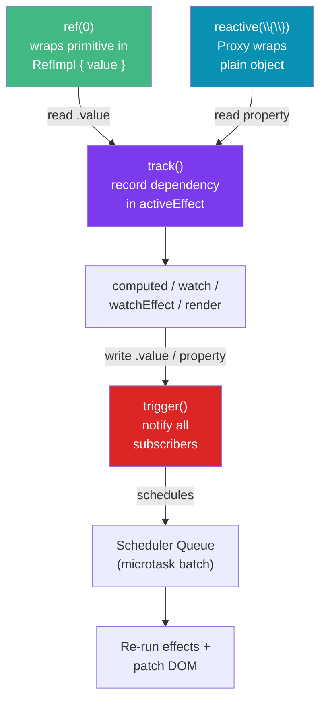

# Vue Reactivity and Composition API

> [!abstract] TL;DR
> Vue 3's reactivity system is built on JavaScript `Proxy`. `ref()` wraps a single value (accessed via `.value`), while `reactive()` wraps an object (accessed directly). Both are tracked by Vue's dependency tracker: when a reactive value is read inside a computed/watch/template, Vue records the dependency; when the value changes, Vue reruns the effect. The Composition API exposes this system directly through `ref`, `reactive`, `computed`, `watch`, and `watchEffect`, plus the `setup()` function. Custom composables (`useXxx`) extract reusable stateful logic into plain functions.

## Intuition — analogy FIRST

Vue's reactivity is like a spreadsheet with a live audit trail. Every formula (computed, watch, template render) that reads a cell gets its name added to that cell's subscriber list. Change the cell, and Vue automatically notifies every subscriber to re-evaluate. The `Proxy` intercepts every read (`get`) and write (`set`) on the object — so Vue knows exactly who read what, and who changed what.

`ref` is for a single box (you always go through `.value` to open it). `reactive` is for a whole filing cabinet of boxes (you access drawers directly by name).

---

## How It Works



---

## Key Concepts / Details

### ref() vs reactive()

```typescript
import { ref, reactive, isRef, isReactive } from 'vue'

// ref: wraps any value (primitive OR object) in a reactive container
const count = ref(0)
const user = ref({ name: 'Ada', age: 36 })

// Access in JS: always via .value
count.value++
user.value.name = 'Grace'  // object properties are also reactive

// Access in templates: unwrapped automatically (no .value needed)
// <p>{{ count }}</p>  — works

// reactive: wraps a plain object (no .value required)
const state = reactive({
  count: 0,
  user: { name: 'Ada' }
})
state.count++
state.user.name = 'Grace'

// When to use which:
// ref  — primitives, single values, function return values, composables
// reactive — grouped component state (form fields, filter state)

// CAUTION: destructuring breaks reactivity on reactive()
const { count: rawCount } = state  // rawCount is no longer reactive!
// Fix: use toRefs
import { toRefs, toRef } from 'vue'
const { count: reactiveCount } = toRefs(state)  // reactiveCount.value is reactive
const userRef = toRef(state, 'user')             // single property ref
```

### computed()

```typescript
import { ref, computed } from 'vue'

const items = ref([
  { id: 1, name: 'Apple', category: 'fruit' },
  { id: 2, name: 'Carrot', category: 'vegetable' },
])
const filter = ref('fruit')

// Read-only computed — cached until deps change
const filtered = computed(() =>
  items.value.filter(i => i.category === filter.value)
)
console.log(filtered.value)  // access via .value

// Writable computed
const firstName = ref('Ada')
const lastName = ref('Lovelace')
const fullName = computed({
  get: () => `${firstName.value} ${lastName.value}`,
  set: (v: string) => {
    const [first, ...rest] = v.split(' ')
    firstName.value = first
    lastName.value = rest.join(' ')
  }
})
fullName.value = 'Grace Hopper'  // sets both firstName and lastName
```

### watch() and watchEffect()

```typescript
import { ref, watch, watchEffect } from 'vue'

const query = ref('')
const results = ref<string[]>([])

// watch: explicit deps, old + new values, lazy by default
watch(query, async (newQuery, oldQuery) => {
  console.log(`Changed from "${oldQuery}" to "${newQuery}"`)
  results.value = await fetchSearch(newQuery)
}, {
  immediate: true,   // run on mount
  deep: true,        // deep watch nested object properties
  flush: 'post',     // run after DOM update (sync/pre/post)
})

// Watch multiple sources (array)
const x = ref(0), y = ref(0)
watch([x, y], ([newX, newY], [oldX, oldY]) => {
  console.log(`x: ${oldX} → ${newX}, y: ${oldY} → ${newY}`)
})

// watchEffect: auto-tracks ALL reactive deps read inside, runs immediately
watchEffect(async (onCleanup) => {
  const controller = new AbortController()
  onCleanup(() => controller.abort())  // cleanup on re-run or unmount

  // query.value is read here → tracked automatically
  results.value = await fetch(`/api/search?q=${query.value}`, {
    signal: controller.signal
  }).then(r => r.json())
})

// Stop a watcher manually
const stop = watchEffect(() => { /* ... */ })
stop()  // clean up
```

### readonly() and Shallow Variants

```typescript
import { ref, reactive, readonly, shallowRef, shallowReactive } from 'vue'

const state = reactive({ count: 0, nested: { value: 1 } })
const readonlyState = readonly(state)
// readonlyState.count = 1  // ⚠ Warning: Set operation on key "count" failed

// shallowRef: only .value change is reactive (not properties of .value)
const bigList = shallowRef([{ id: 1 }])
bigList.value = [...bigList.value, { id: 2 }]  // reactive ✓
bigList.value[0].id = 99  // NOT reactive — use when you control updates wholesale

// shallowReactive: only top-level properties are reactive
const shallow = shallowReactive({ items: [1, 2, 3] })
shallow.items.push(4)  // NOT reactive
shallow.items = [...shallow.items, 4]  // reactive ✓
```

### Custom Composables

```typescript
// composables/useCounter.ts
import { ref, computed } from 'vue'

export function useCounter(initialValue = 0) {
  const count = ref(initialValue)
  const isZero = computed(() => count.value === 0)

  function increment(by = 1) { count.value += by }
  function decrement(by = 1) { count.value -= by }
  function reset() { count.value = initialValue }

  return { count, isZero, increment, decrement, reset }
}

// composables/useFetch.ts — async composable with loading/error state
import { ref, watchEffect } from 'vue'

export function useFetch<T>(url: () => string) {
  const data = ref<T | null>(null)
  const error = ref<Error | null>(null)
  const isLoading = ref(false)

  watchEffect(async (onCleanup) => {
    const controller = new AbortController()
    onCleanup(() => controller.abort())

    isLoading.value = true
    error.value = null
    try {
      const res = await fetch(url(), { signal: controller.signal })
      data.value = await res.json()
    } catch (e) {
      if (e instanceof Error && e.name !== 'AbortError') error.value = e
    } finally {
      isLoading.value = false
    }
  })

  return { data, error, isLoading }
}

// Usage in component
<script setup>
import { useCounter } from '@/composables/useCounter'
import { useFetch } from '@/composables/useFetch'

const { count, increment } = useCounter(10)
const userId = ref(1)
const { data: user, isLoading } = useFetch<User>(() => `/api/users/${userId.value}`)
</script>
```

---

## Real-World Notes

- **`ref` in templates is auto-unwrapped** — only at the top level. `nested.ref.value` still needs `.value` in a template if `nested` is a non-reactive object.
- **Composables consolidate logic by feature**, not by lifecycle hook — this is the core advantage over Options API's `data/computed/methods` split.
- **`reactive` has gotchas**: replacing the whole object (`state = newObj`) loses reactivity; destructuring without `toRefs` loses reactivity. `ref` is safer for composable return values.
- **`watchEffect` vs `watch`**: use `watchEffect` for side effects that should always sync with their deps; use `watch` when you need old/new values or need the watcher to be lazy.

---

## Common Pitfalls

- **Destructuring `reactive()` without `toRefs`** — the extracted values are no longer reactive. Always use `toRefs(state)` if you need destructuring.
- **Calling composables outside `setup()`** — composables that use lifecycle hooks or `provide/inject` must be called synchronously inside `setup()` (or `<script setup>`).
- **`shallowRef` mutation confusion** — mutating properties of a `shallowRef` object won't trigger updates. You must replace `.value` entirely.
- **Async `setup()` without `Suspense`** — an async `setup()` makes the whole component suspend; wrap with `<Suspense>` or handle async inside `onMounted`/`watchEffect`.

---

## Related Concepts

- [[_MOC_Vue|↑ Section MOC]]
- [[Vue_Fundamentals]] — Template syntax and lifecycle basics
- [[Vue_Components_and_Props]] — How reactive data flows between components
- [[Vue_Router_and_Pinia]] — Pinia leverages the same reactivity primitives

---

## Review Questions

1. What is the difference between `ref()` and `reactive()`? When would you choose one over the other?
2. Why does destructuring `reactive()` break reactivity, and how do you fix it?
3. Explain the difference between `watch` and `watchEffect`. When would you prefer each?
4. Write a composable `useLocalStorage(key, defaultValue)` that syncs a `ref` to `localStorage`.
5. What does `readonly()` prevent, and why is it useful in `provide/inject`?

---

## Sources

- Vue 3 docs: Reactivity Fundamentals — https://vuejs.org/guide/essentials/reactivity-fundamentals
- Vue 3 docs: Computed and Watch — https://vuejs.org/guide/essentials/computed
- Vue 3 docs: Composables — https://vuejs.org/guide/reusability/composables

#web-development #vue #reactivity #composition-api #composables #ref #reactive
