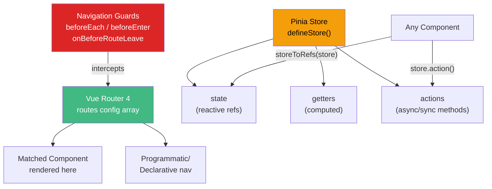

# Vue Router and Pinia

> [!abstract] TL;DR
> **Vue Router 4** is the official client-side router: you define a route map, use `<router-view>` to render the matched component, and `<router-link>` for navigation. Navigation guards (`beforeEach`, `beforeEnter`, in-component guards) run before route changes for auth checks and redirects. **Pinia** is the official Vue 3 state management library: you define a store with `defineStore()` containing `state`, `getters`, and `actions`. Stores are reactive and fully typed — `storeToRefs()` extracts reactive refs from a store without losing reactivity. Pinia replaces Vuex with a simpler, TypeScript-first API.

## Intuition — analogy FIRST

**Vue Router** is like an airport terminal: `<router-view>` is the departure gate area that shows whichever plane (component) is scheduled for the current destination. `<router-link>` is the ticket counter — it navigates without a full page reload. Navigation guards are security checkpoints — they can let you through, redirect you, or cancel your trip.

**Pinia** is like a shared whiteboard in a team room: any component can read from it or write to it. Unlike passing props (emailing everyone individually), the whiteboard is always current and everyone reads the same version. Getters are pre-computed summaries on the board; actions are the procedures you follow to update it.

---

## How It Works



---

## Key Concepts / Details

### Vue Router 4 — Setup

```typescript
// src/router/index.ts
import { createRouter, createWebHistory } from 'vue-router'
import HomeView from '@/views/HomeView.vue'

const routes = [
  {
    path: '/',
    name: 'home',
    component: HomeView,
  },
  {
    // Lazy-loaded route — split into its own chunk
    path: '/about',
    name: 'about',
    component: () => import('@/views/AboutView.vue'),
  },
  {
    // Dynamic segment — :id is a route param
    path: '/users/:id',
    name: 'user-detail',
    component: () => import('@/views/UserDetailView.vue'),
    // Route-level meta for guards
    meta: { requiresAuth: true },
  },
  {
    // Nested routes — child renders in parent's <router-view>
    path: '/dashboard',
    component: () => import('@/views/DashboardLayout.vue'),
    children: [
      { path: '', name: 'dashboard', component: () => import('@/views/DashboardHome.vue') },
      { path: 'settings', name: 'settings', component: () => import('@/views/Settings.vue') },
    ]
  },
  {
    // Catch-all 404
    path: '/:pathMatch(.*)*',
    name: 'not-found',
    component: () => import('@/views/NotFound.vue'),
  }
]

export const router = createRouter({
  history: createWebHistory(import.meta.env.BASE_URL),  // HTML5 history mode
  routes,
})
```

### Navigation Guards

```typescript
// Global guard — runs before EVERY navigation
router.beforeEach(async (to, from) => {
  const authStore = useAuthStore()

  if (to.meta.requiresAuth && !authStore.isLoggedIn) {
    // Cancel navigation, redirect to login with intended destination
    return { name: 'login', query: { redirect: to.fullPath } }
  }
  // Return nothing / true to proceed
})

// Route-level guard (defined in routes config)
{
  path: '/admin',
  component: AdminPanel,
  beforeEnter: (to, from) => {
    if (!isAdmin()) return { name: 'home' }
  }
}

// In-component guard (Composition API)
import { onBeforeRouteLeave, onBeforeRouteUpdate } from 'vue-router'

onBeforeRouteLeave((to, from) => {
  if (hasUnsavedChanges.value) {
    const ok = window.confirm('You have unsaved changes. Leave?')
    if (!ok) return false  // cancel navigation
  }
})

// onBeforeRouteUpdate fires when params change on the same component
// e.g., /users/1 → /users/2
onBeforeRouteUpdate(async (to, from) => {
  await loadUser(to.params.id as string)
})
```

### Accessing Route Data

```vue
<script setup>
import { useRoute, useRouter } from 'vue-router'

const route = useRoute()   // current route state (reactive)
const router = useRouter() // imperative navigation

// Route params and query
console.log(route.params.id)        // /users/42 → "42"
console.log(route.query.search)     // ?search=foo → "foo"
console.log(route.name)             // 'user-detail'

// Programmatic navigation
router.push({ name: 'home' })
router.push({ name: 'user-detail', params: { id: '42' } })
router.push({ path: '/search', query: { q: 'vue' } })
router.replace('/new-path')  // no new history entry
router.back()
</script>

<template>
  <!-- Declarative navigation -->
  <router-link :to="{ name: 'home' }">Home</router-link>
  <router-link :to="{ name: 'user-detail', params: { id: '42' } }">User 42</router-link>

  <!-- Active class applied automatically when link matches current route -->
  <router-link to="/about" active-class="nav-active">About</router-link>

  <!-- Where matched component renders -->
  <router-view />
</template>
```

### Pinia — defineStore

```typescript
// stores/counter.ts
import { defineStore } from 'pinia'
import { ref, computed } from 'vue'

// OPTION 1: Setup Store (Composition API style — recommended)
export const useCounterStore = defineStore('counter', () => {
  // state = refs
  const count = ref(0)
  const name = ref('Counter')

  // getters = computed
  const doubleCount = computed(() => count.value * 2)
  const isPositive = computed(() => count.value > 0)

  // actions = functions
  function increment() { count.value++ }
  function decrement() { count.value-- }
  async function incrementAsync(by: number) {
    await new Promise(resolve => setTimeout(resolve, 100))
    count.value += by
  }
  function $reset() { count.value = 0 }  // manual reset

  return { count, name, doubleCount, isPositive, increment, decrement, incrementAsync, $reset }
})

// OPTION 2: Options Store (familiar to Vuex users)
export const useCartStore = defineStore('cart', {
  state: () => ({
    items: [] as CartItem[],
    discount: 0,
  }),
  getters: {
    total: (state) => state.items.reduce((sum, i) => sum + i.price, 0),
    discountedTotal(): number { return this.total * (1 - this.discount) }  // 'this' = store
  },
  actions: {
    addItem(item: CartItem) { this.items.push(item) },
    async checkout() {
      const result = await api.checkout(this.items)
      this.items = []
      return result
    }
  }
})
```

### Using Pinia in Components

```vue
<script setup lang="ts">
import { storeToRefs } from 'pinia'
import { useCounterStore } from '@/stores/counter'

const counterStore = useCounterStore()

// storeToRefs: extracts reactive refs — SAFE to destructure
// (do NOT destructure the store directly — breaks reactivity for state/getters)
const { count, doubleCount, isPositive } = storeToRefs(counterStore)

// Actions are plain functions — can destructure directly (not reactive values)
const { increment, decrement, incrementAsync } = counterStore

// Subscribe to changes
counterStore.$subscribe((mutation, state) => {
  localStorage.setItem('counter', JSON.stringify(state))
})
</script>

<template>
  <div>
    <p>Count: {{ count }} (Double: {{ doubleCount }})</p>
    <button @click="increment">+1</button>
    <button @click="decrement">-1</button>
    <button @click="() => incrementAsync(5)">+5 async</button>
  </div>
</template>
```

### Pinia vs Vuex Comparison

| Feature | Pinia | Vuex 4 |
|---------|-------|--------|
| TypeScript | First-class, auto-inferred | Requires manual typing |
| Mutations | Removed (actions do it all) | Required separate layer |
| Modules | Each store is a module | Namespaced modules config |
| DevTools | Full support | Full support |
| Setup stores | Composition API style | No |
| Bundle size | ~1.5 kB | ~10 kB |

---

## Real-World Notes

- **Vue Router 4 vs 3**: `createRouter`/`createWebHistory` replace the old constructor. Composition API hooks (`useRoute`, `useRouter`) replace `this.$route` / `this.$router`.
- **Lazy-load routes** with `() => import(...)` to automatically code-split each route into its own chunk.
- **Pinia stores persist across components**: data fetched in one component is available in another via the same store — no prop drilling or event bus needed.
- **`storeToRefs` only for state/getters** — actions are functions and don't need reactive wrapping. Mixing them causes type errors.

---

## Common Pitfalls

- **Accessing `useRoute()` outside of `setup()`** — it requires an active component instance. Use inside `<script setup>` or `setup()`.
- **Destructuring store state without `storeToRefs`** — `const { count } = store` gives a plain number, not a reactive ref.
- **Missing `<router-view>` in layout** — the router will match routes but render nothing without a `<router-view>` in the component tree.
- **Mutating Pinia state outside actions** — works in dev mode but breaks the devtools mutation tracking pattern.

---

## Related Concepts

- [[_MOC_Vue|↑ Section MOC]]
- [[Vue_Fundamentals]] — Vue 3 basics and reactivity
- [[Vue_Reactivity_and_Composition_API]] — Understanding the reactivity primitives Pinia uses
- [[Vue_Testing_and_Performance]] — Testing stores and guarded routes

---

## Review Questions

1. How do navigation guards differ from in-component guards? Give a use case for each.
2. What is the difference between `router.push()` and `router.replace()`?
3. Why must you use `storeToRefs()` when destructuring from a Pinia store?
4. Compare Pinia's setup store style to the options store style — when would you prefer each?
5. How would you handle authenticated routes with Vue Router? Show the guard implementation.

---

## Sources

- Vue Router 4 docs — https://router.vuejs.org/guide/
- Pinia docs — https://pinia.vuejs.org/introduction.html
- Vue Router Navigation Guards — https://router.vuejs.org/guide/advanced/navigation-guards

#web-development #vue #vue-router #pinia #state-management #navigation-guards
