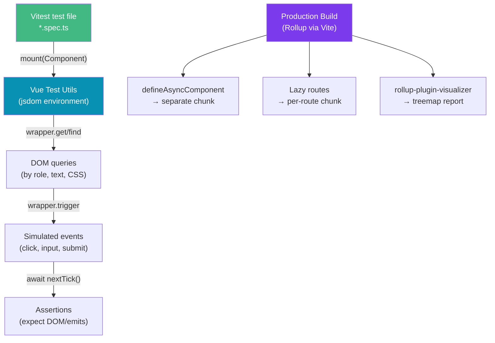

# Vue Testing and Performance

> [!abstract] TL;DR
> Test Vue components with **Vitest** (fast, Vite-native test runner) and **Vue Test Utils** (VTU — official mounting library). VTU mounts a component in a jsdom environment, lets you query elements, trigger events, and await reactive updates. For performance: `v-memo` memoizes sub-trees, `<KeepAlive>` caches component instances to avoid re-mounting, `defineAsyncComponent()` lazy-loads components, and virtual scrolling handles long lists. Analyze bundle size with `rollup-plugin-visualizer` and use `import()` splitting for large features.

## Intuition — analogy FIRST

Testing a Vue component is like testing a vending machine. You **mount** it (plug it in), **find** the button you want to press (query the DOM), **trigger** the interaction (click it), and **assert** that the right item comes out (check what rendered). Vue Test Utils is the technician's toolkit that lets you simulate inputs and inspect outputs without needing a real browser.

Performance optimization is about paying only for what's visible and necessary: `KeepAlive` is like tabbing between browser tabs without reloading them, `defineAsyncComponent` is like on-demand streaming instead of downloading the whole movie upfront, and virtual scrolling is rendering only the window rows visible on screen instead of all 10,000 rows.

---

## How It Works



---

## Key Concepts / Details

### Setting Up Vitest + Vue Test Utils

```bash
# Install
npm install -D vitest @vue/test-utils jsdom @vitejs/plugin-vue
```

```typescript
// vite.config.ts — add test configuration
import { defineConfig } from 'vite'
import vue from '@vitejs/plugin-vue'

export default defineConfig({
  plugins: [vue()],
  test: {
    environment: 'jsdom',
    globals: true,     // no need to import describe/it/expect
    setupFiles: ['./src/test/setup.ts'],
  },
})
```

### Mounting Components

```typescript
// components/Counter.spec.ts
import { describe, it, expect, vi } from 'vitest'
import { mount, shallowMount } from '@vue/test-utils'
import Counter from './Counter.vue'

describe('Counter', () => {
  it('renders initial count', () => {
    const wrapper = mount(Counter, {
      props: { initialCount: 5 }
    })
    expect(wrapper.text()).toContain('5')
  })

  it('increments on button click', async () => {
    const wrapper = mount(Counter)
    await wrapper.get('button').trigger('click')
    expect(wrapper.get('[data-testid="count"]').text()).toBe('1')
  })

  it('emits update event', async () => {
    const wrapper = mount(Counter)
    await wrapper.get('button').trigger('click')

    // Check emitted events
    expect(wrapper.emitted('update')).toBeTruthy()
    expect(wrapper.emitted('update')![0]).toEqual([1])
  })
})

// mount vs shallowMount:
// mount: renders child components fully (integration test)
// shallowMount: stubs child components (unit test, faster)
```

### Testing with Pinia and Router

```typescript
import { createTestingPinia } from '@pinia/testing'
import { createRouter, createMemoryHistory } from 'vue-router'
import { routes } from '@/router'

it('shows user data from store', async () => {
  const router = createRouter({ history: createMemoryHistory(), routes })

  const wrapper = mount(UserProfile, {
    global: {
      plugins: [
        router,
        createTestingPinia({
          initialState: {
            user: { currentUser: { id: 1, name: 'Ada' } }
          },
          createSpy: vi.fn,  // stub all actions with vi.fn
        })
      ]
    }
  })

  await router.isReady()
  expect(wrapper.text()).toContain('Ada')
})
```

### Mocking Composables

```typescript
// Mock a composable module
vi.mock('@/composables/useFetch', () => ({
  useFetch: vi.fn(() => ({
    data: ref({ name: 'Ada', email: 'ada@example.com' }),
    isLoading: ref(false),
    error: ref(null),
  }))
}))

it('renders fetched user', () => {
  const wrapper = mount(UserCard, {
    props: { userId: '1' }
  })
  expect(wrapper.find('.user-name').text()).toBe('Ada')
})
```

### Finding Elements and Asserting

```typescript
// Querying elements
wrapper.find('.my-class')        // returns WrapperLike (may be empty)
wrapper.get('.my-class')         // throws if not found (preferred for required elements)
wrapper.findAll('li')            // returns array

// Querying by test ID (most robust)
wrapper.get('[data-testid="submit-btn"]')

// Waiting for async updates
await wrapper.get('button').trigger('click')
await nextTick()  // wait for Vue to process reactivity + DOM update

// Asserting existence
expect(wrapper.find('.error').exists()).toBe(false)
expect(wrapper.find('[data-testid="spinner"]').isVisible()).toBe(true)

// Asserting text
expect(wrapper.get('h1').text()).toBe('Hello')

// Asserting classes
expect(wrapper.get('.btn').classes()).toContain('btn-primary')

// Asserting attributes
expect(wrapper.get('input').attributes('disabled')).toBeDefined()

// Form inputs
await wrapper.get('input').setValue('hello')
```

### v-memo — Memoizing Sub-trees

```vue
<template>
  <!-- v-memo: skip re-rendering this subtree if deps haven't changed -->
  <!-- deps array is like React's useMemo([a, b]) -->
  <div v-memo="[item.id, item.selected]">
    <ExpensiveVisualization :item="item" />
  </div>

  <!-- Common use case: large v-for lists with selected state -->
  <div
    v-for="item in items"
    :key="item.id"
    v-memo="[item.id === selectedId]"
  >
    {{ item.name }}
  </div>
</template>
```

### KeepAlive — Caching Component Instances

```vue
<template>
  <!-- Wrap router-view or dynamic components to cache mounted instances -->
  <KeepAlive :include="['HomeView', 'SearchView']" :max="5">
    <router-view />
  </KeepAlive>

  <!-- Dynamic component caching -->
  <KeepAlive>
    <component :is="activeTab === 'chart' ? ChartView : TableView" />
  </KeepAlive>
</template>

<script setup>
import { onActivated, onDeactivated } from 'vue'

// KeepAlive-specific lifecycle hooks
onActivated(() => {
  // Component re-activated (tabbed back to)
  refreshData()
})

onDeactivated(() => {
  // Component deactivated (tabbed away from)
  pauseAnimations()
})
</script>
```

### Lazy Loading Components

```typescript
import { defineAsyncComponent } from 'vue'

// Simple async component — loaded on first render
const HeavyChart = defineAsyncComponent(
  () => import('./components/HeavyChart.vue')
)

// With loading/error states
const AsyncUserDashboard = defineAsyncComponent({
  loader: () => import('./views/UserDashboard.vue'),
  loadingComponent: LoadingSpinner,
  errorComponent: ErrorFallback,
  delay: 200,         // show LoadingSpinner after 200ms
  timeout: 10000,     // fail after 10s
})
```

### Virtual Scrolling for Long Lists

```vue
<!-- Use @tanstack/vue-virtual for long lists -->
<script setup>
import { useVirtualizer } from '@tanstack/vue-virtual'
import { ref } from 'vue'

const items = ref(Array.from({ length: 10000 }, (_, i) => ({ id: i, name: `Item ${i}` })))
const parentRef = ref<HTMLDivElement | null>(null)

const virtualizer = useVirtualizer({
  count: items.value.length,
  getScrollElement: () => parentRef.value,
  estimateSize: () => 48,  // estimated row height in px
})
</script>

<template>
  <div ref="parentRef" style="height: 500px; overflow-y: auto;">
    <div :style="{ height: virtualizer.getTotalSize() + 'px', position: 'relative' }">
      <div
        v-for="virtualRow in virtualizer.getVirtualItems()"
        :key="virtualRow.index"
        :style="{
          position: 'absolute',
          top: virtualRow.start + 'px',
          height: virtualRow.size + 'px',
        }"
      >
        {{ items[virtualRow.index].name }}
      </div>
    </div>
  </div>
</template>
```

---

## Real-World Notes

- **`data-testid` attributes** are the most stable way to query elements in tests — they survive CSS refactors and text changes.
- **`createTestingPinia`** from `@pinia/testing` auto-stubs all actions with spies, so you test component behavior in isolation without real API calls.
- **`KeepAlive` increases memory usage** — it holds the entire component tree in memory. Use `:max` to cap the cache size and include/exclude for fine control.
- **Bundle analysis**: run `npx vite build` with `rollup-plugin-visualizer` to see a treemap of your bundle. Look for unexpectedly large chunks.

---

## Common Pitfalls

- **Forgetting `await` after `trigger()`** — DOM updates are async. Always `await wrapper.get('btn').trigger('click')` before asserting the updated DOM.
- **Using `mount` when `shallowMount` is appropriate** — `mount` renders all child components, pulling in their dependencies. `shallowMount` stubs them out for cleaner unit tests.
- **Overusing `KeepAlive`** — caching components with stale data leads to UX bugs. Always refresh on `onActivated`.
- **`v-memo` with wrong deps** — if the dependency array misses a value the template uses, the component will show stale data.

---

## Related Concepts

- [[_MOC_Vue|↑ Section MOC]]
- [[Vue_Fundamentals]] — Component lifecycle hooks
- [[Vue_Router_and_Pinia]] — Testing with router and Pinia
- [[Vue_Reactivity_and_Composition_API]] — Composables that need testing

---

## Review Questions

1. What is the difference between `mount()` and `shallowMount()` in Vue Test Utils?
2. Why must you `await` after calling `wrapper.trigger()`?
3. How does `v-memo` differ from `computed()`? What problem does it solve?
4. When should you use `<KeepAlive>` and what are its risks?
5. What is `defineAsyncComponent` and how does it improve initial load performance?

---

## Sources

- Vue Test Utils docs — https://test-utils.vuejs.org/
- Vitest docs — https://vitest.dev/guide/
- Vue 3 docs: Performance — https://vuejs.org/guide/best-practices/performance

#web-development #vue #testing #vitest #vue-test-utils #performance #keepalive
