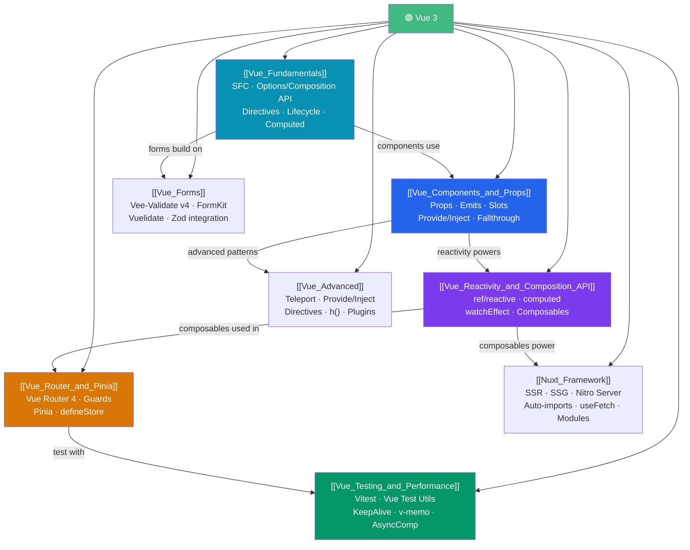

# Vue — Map of Content

> [!abstract] What This Section Covers
> Vue 3 is a progressive, component-based UI framework that sits between Angular's full-framework approach and React's minimal-library approach. Vue offers a gentle learning curve with its template-based syntax while providing the full power of the Composition API for complex applications. This section covers: Vue 3 fundamentals and SFC structure, component communication (props/emits/slots), the Proxy-based reactivity system and composable patterns, routing and state management with Vue Router 4 and Pinia, testing with Vitest + Vue Test Utils plus performance optimization techniques, Nuxt 3 full-stack framework (SSR/SSG/Nitro), form validation libraries (Vee-Validate/FormKit/Vuelidate), and advanced patterns (Teleport, Provide/Inject, Custom Directives, render functions).

## Concept Map

## Learning Path

1. [[Vue_Fundamentals]] — Start here: SFC structure, Options API vs Composition API, template directives, computed/watchers, lifecycle hooks.
2. [[Vue_Components_and_Props]] — Component communication: props with `defineProps`, emits with `defineEmits`, default/named/scoped slots, provide/inject.
3. [[Vue_Reactivity_and_Composition_API]] — Deep dive: `ref` vs `reactive`, `computed`, `watch`/`watchEffect`, custom composables (`useXxx`), reactivity under the hood (Proxy).
4. [[Vue_Router_and_Pinia]] — App-level concerns: Vue Router 4 route config, navigation guards, dynamic routes; Pinia `defineStore`, state/getters/actions, `storeToRefs`.
5. [[Vue_Testing_and_Performance]] — Quality and optimization: Vitest + VTU component tests, mocking Pinia, `v-memo`, `<KeepAlive>`, `defineAsyncComponent`, virtual scrolling.
6. [[Nuxt_Framework]] — Full-stack Vue: Nuxt 3 architecture, SSR/SSG/hybrid rendering, Nitro server engine, auto-imports, `useFetch`/`useAsyncData`, Nuxt modules.
7. [[Vue_Forms]] — Form handling: Vee-Validate v4 with Zod schemas, FormKit schema-driven forms, Vuelidate reactive approach, server error mapping.
8. [[Vue_Advanced]] — Low-level patterns: `<Teleport>` for modals, typed `provide`/`inject`, custom directives with lifecycle hooks, `h()` render functions, Vue plugins.

## All Notes at a Glance

| Note | Difficulty | What You'll Learn |
|------|------------|-------------------|
| [[Vue_Fundamentals]] | Beginner | SFC, template syntax, v-if/v-for/v-model, computed, watchers, lifecycle hooks |
| [[Vue_Components_and_Props]] | Intermediate | defineProps, defineEmits, slots, provide/inject, attribute inheritance |
| [[Vue_Reactivity_and_Composition_API]] | Intermediate | ref/reactive, Proxy tracking, watchEffect, composables, toRefs |
| [[Vue_Router_and_Pinia]] | Intermediate | Route config, navigation guards, Pinia stores, storeToRefs |
| [[Vue_Testing_and_Performance]] | Advanced | Vitest setup, VTU mount, v-memo, KeepAlive, async components, virtualization |
| [[Nuxt_Framework]] | Intermediate | Nuxt 3, SSR/SSG/hybrid rendering, Nitro, useFetch/useAsyncData, auto-imports, modules |
| [[Vue_Forms]] | Intermediate | Vee-Validate v4, Zod integration, FormKit schema-driven, Vuelidate, server errors |
| [[Vue_Advanced]] | Advanced | Teleport, typed provide/inject, custom directives, h() render functions, plugins |

## Key Questions This Section Answers

- What is a Single File Component and how does it differ from React's JSX approach?
- What is the difference between `ref()` and `reactive()`, and when do you use each?
- How does Vue's Proxy-based reactivity track dependencies automatically?
- How do you write a reusable composable, and why is it better than mixins?
- How do navigation guards enable authentication-protected routes?
- What is the difference between Pinia and Vuex, and why is Pinia the new standard?
- How do you test a Vue component that depends on a Pinia store?

## Related Sections

- [[_MOC_WebDev_Master|↑ Web Dev Master MOC]]
- [[_MOC_React|← React]] — Alternative component framework with similar reactivity concepts
- [[_MOC_TypeScript|← TypeScript]] — Vue 3 and Pinia have first-class TypeScript support
- [[_MOC_Build_Tools|→ Build Tools]] — Vite powers Vue 3's dev server and production builds

#MOC #WebDevelopment #Vue
