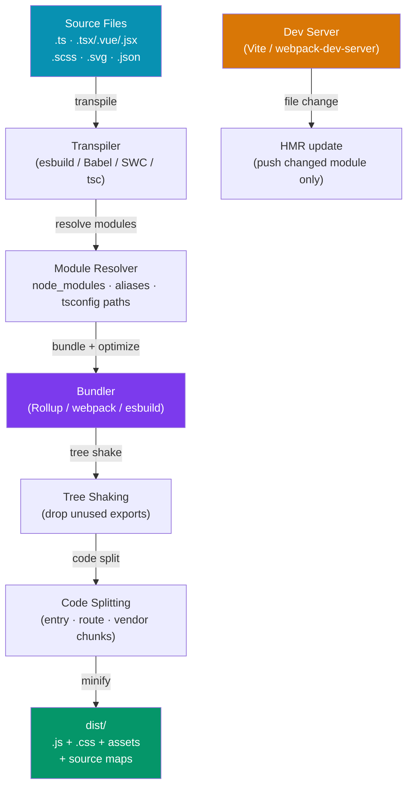

# Build Tools Overview

> [!abstract] TL;DR
> Build tools transform modern JavaScript (ESM modules, TypeScript, JSX, CSS Modules) into browser-compatible bundles. A **bundler** (webpack, Rollup, Vite) combines many modules into fewer files, applies tree-shaking to drop dead code, and splits code for lazy loading. A **transpiler** (Babel, esbuild, SWC) converts modern syntax to older syntax. A **task runner** (Gulp, Make) orchestrates arbitrary tasks. The dev experience relies on **HMR** (Hot Module Replacement) to push only changed modules to the browser without full reload. **Source maps** map minified production code back to original sources for debugging.

## Intuition — analogy FIRST

A build tool is like a publishing house for your code. You write in whatever language and format you prefer (TypeScript, JSX, SCSS, individual ES modules). The build tool is the editorial team that: translates your drafts (transpiler), checks for unused content and removes it (tree shaking), assembles chapters into books in the optimal order (bundling), prints lightweight pocket editions vs. full references (minification), and tells you exactly which original page a typo came from even in the pocket edition (source maps).

In development, HMR is like a live editor that swaps only the changed paragraph in your printed document without reprinting the whole book.

---

## How It Works



---

## Key Concepts / Details

### JavaScript Module Systems

```javascript
// CommonJS (CJS) — Node.js legacy, synchronous, runtime resolution
const fs = require('fs')
const { readFile } = require('fs')
module.exports = { myFunction }
module.exports.default = MyClass

// ES Modules (ESM) — the standard, static, tree-shakeable
import fs from 'fs'
import { readFile } from 'fs'
import type { User } from './types'    // TypeScript-only import
export function myFunction() {}
export default class MyClass {}
export { myFunction }

// UMD (Universal Module Definition) — works in CJS + AMD + global (legacy)
// Used for library bundles that need to run anywhere
(function (root, factory) {
  if (typeof define === 'function' && define.amd) { define(['dep'], factory) }
  else if (typeof module !== 'undefined') { module.exports = factory(require('dep')) }
  else { root.MyLib = factory(root.dep) }
}(this, function(dep) { return { /* library */ } }))

// IIFE (Immediately Invoked Function Expression) — single global variable
// Used for script tags, no module system required
var MyLib = (function() {
  return { version: '1.0' }
})()
```

Modern projects use ESM exclusively — it's the only format that enables static analysis for tree shaking. CJS requires dynamic execution to know what's exported.

### Tree Shaking

```javascript
// math.js — named exports
export function add(a, b) { return a + b }
export function subtract(a, b) { return a - b }
export function multiply(a, b) { return a * b }  // unused

// main.js — only imports add and subtract
import { add, subtract } from './math'
console.log(add(1, 2))

// After tree shaking: multiply is NOT included in the bundle
// Works ONLY with static imports (not dynamic require())
// CJS modules are NOT tree-shakeable (dynamic resolution)
```

Tree shaking requires:
1. **ESM static imports** (not `require()`)
2. **No side effects** in imported modules — mark with `"sideEffects": false` in `package.json`
3. **Minifier** pass (Terser/esbuild) to actually remove the dead code

### Code Splitting

```javascript
// Entry splitting: separate vendor chunk
// webpack / Rollup separates node_modules into vendor.js automatically

// Dynamic import (lazy loading) — creates a separate chunk
const HeavyChart = () => import('./components/HeavyChart')   // React
const HeavyChart = defineAsyncComponent(() => import('./components/HeavyChart.vue')) // Vue

// Route-level splitting (each route = separate chunk)
// React Router
const UserPage = lazy(() => import('./pages/UserPage'))
// Vue Router
{ path: '/users', component: () => import('./views/UserPage.vue') }

// Manual chunk grouping (webpack splitChunks / Rollup manualChunks)
// vite.config.ts
build: {
  rollupOptions: {
    output: {
      manualChunks: {
        'vendor-react': ['react', 'react-dom'],
        'vendor-charts': ['recharts', 'd3'],
      }
    }
  }
}
```

### Source Maps

```
// Source map types (devtool option in webpack / sourcemap in vite)
// false         — no source maps (fastest build, no debugging)
// inline        — base64 embedded in JS (no extra files, large bundle)
// hidden        — file written but not linked (for error tracking services like Sentry)
// source-map    — separate .map file (production debugging)
// eval-source-map — fastest rebuild, detailed (dev only)

// vite.config.ts
export default defineConfig({
  build: {
    sourcemap: 'hidden',  // send to Sentry but not expose publicly
  }
})
```

### Dev Server and HMR

```
HMR lifecycle:
1. File changes on disk
2. Dev server detects change via file watcher
3. Bundler recompiles only the changed module (and its dependents)
4. WebSocket message sent to browser
5. Browser runtime replaces the old module in-memory
6. Framework-specific HMR handler re-runs effects / re-renders component
7. Application state is preserved (no full reload)

// Fallback: if HMR fails, dev server triggers full page reload
// Vite has native ESM HMR (fast: no bundling in dev)
// webpack-dev-server HMR requires bundling (slower for large projects)
```

### Minification

```javascript
// Before minification (source)
function calculateDiscountedPrice(originalPrice, discountPercentage) {
  const discountAmount = originalPrice * (discountPercentage / 100)
  return originalPrice - discountAmount
}

// After minification (Terser/esbuild output)
function c(a,b){return a-a*(b/100)}

// What minification does:
// - Rename variables to single characters
// - Remove whitespace and comments
// - Constant folding: (100 / 100) → 1
// - Dead code elimination: if (false) { ... } → removed
// - Property mangling: long object keys → short keys (aggressive mode)
```

---

## Real-World Notes

- **Bundlers vs transpilers**: esbuild and SWC are transpilers (syntax transform), not full bundlers. Vite uses esbuild for transpilation but Rollup for actual bundling in production.
- **`"sideEffects": false` in package.json** is critical for your own libraries — without it, bundlers can't tree-shake any exports from your package.
- **Dynamic `import()` is the only code-splitting mechanism** — static imports are always bundled together. Route-level splitting is the highest-impact optimization for SPAs.
- **Source maps in production**: upload `.map` files to your error tracking service (Sentry, Datadog), but do NOT serve them publicly — they expose your original source code.

---

## Common Pitfalls

- **CJS interop issues** — mixing `require()` and `import` causes dual-package hazards. Prefer pure ESM for new projects.
- **Circular imports** — `A → B → A` can cause `undefined` at runtime. Detect with `madge` or webpack's `CircularDependencyPlugin`.
- **Too-aggressive code splitting** — creating hundreds of tiny chunks causes more HTTP requests than a single bundle. Use `manualChunks` to group related modules.
- **`process.env` in browser code** — bundlers replace `process.env.NODE_ENV` at build time, but arbitrary `process.env` access throws at runtime. Use `import.meta.env` in Vite.

---

## Related Concepts

- [[_MOC_Build_Tools|↑ Section MOC]]
- [[Vite_and_Rollup]] — The modern, fast build toolchain
- [[Webpack_Fundamentals]] — The battle-tested, highly configurable bundler
- [[Package_Managers_and_Toolchain]] — npm/yarn/pnpm and the broader TypeScript toolchain

---

## Review Questions

1. What is the difference between CJS and ESM? Why does tree shaking require ESM?
2. Explain tree shaking: what conditions must be met for a function to be tree-shaken?
3. What is HMR and how does it differ from a full page reload?
4. What is a source map and why should you use `'hidden'` mode in production?
5. What is the difference between entry splitting and dynamic import code splitting?

---

## Sources

- Webpack docs: Concepts — https://webpack.js.org/concepts/
- Vite docs: Why Vite? — https://vitejs.dev/guide/why
- Rollup docs: Tree shaking — https://rollupjs.org/introduction/#tree-shaking

#web-development #build-tools #bundling #tree-shaking #code-splitting #hmr #modules
