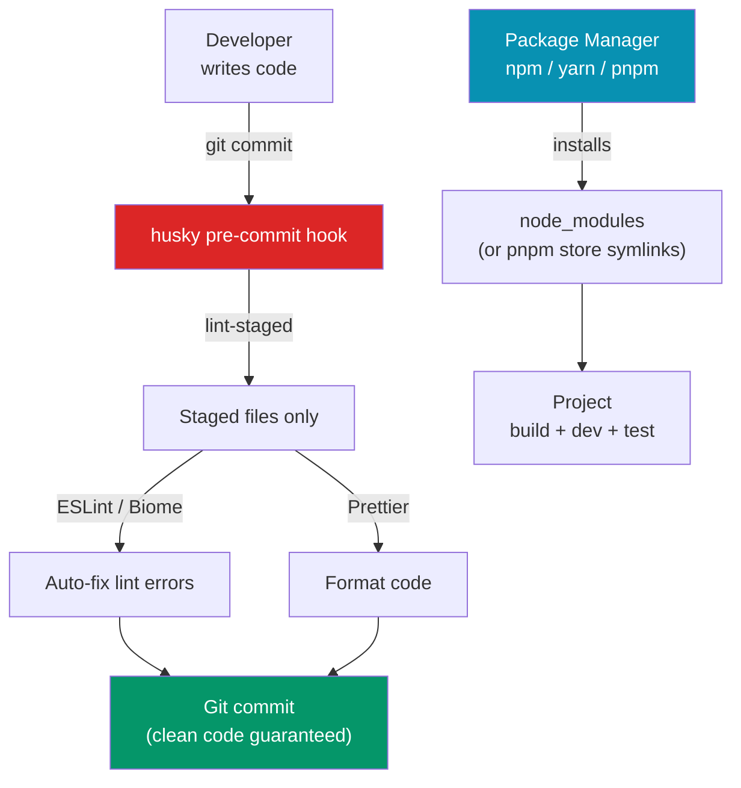

# Package Managers and Toolchain

> [!abstract] TL;DR
> The JavaScript ecosystem's package manager trio — **npm**, **yarn**, and **pnpm** — differ in disk usage, install speed, and monorepo support. **pnpm** is the modern choice: a content-addressable global store means no package duplication across projects. For monorepos, **Turborepo** and **Nx** add intelligent caching and task orchestration. The **TypeScript toolchain** chains `tsc` (type checking), `tsx`/`ts-node` (execute TS directly), and ESM-aware transpilers. **Biome/ESLint + Prettier** enforce code quality, and **husky + lint-staged** run these checks as pre-commit hooks.

## Intuition — analogy FIRST

Package managers are like different library systems. **npm** is the town library: fine for one reader, but everyone gets their own copy of every book (node_modules duplication). **pnpm** is an inter-library loan system backed by a single giant warehouse: every project gets a symlink to the one physical book in the warehouse — same content, no duplication. **yarn** is the private lending library with faster checkout procedures.

A pre-commit hook is like a door sensor at the library — the system checks your books automatically before you leave. If the scanner beeps (lint error), you can't exit until the issue is resolved.

---

## How It Works



---

## Key Concepts / Details

### npm vs yarn vs pnpm

```bash
# npm — the default, bundled with Node.js
npm install
npm install react --save-prod     # -P (default)
npm install vitest --save-dev     # -D
npm install -g typescript         # global
npm run dev                       # run script
npm workspaces                    # monorepo support
# Lockfile: package-lock.json

# yarn (Berry/v4) — improved UX, Plug'n'Play
yarn install
yarn add react
yarn add --dev vitest
yarn dlx create-vite my-app       # like npx
yarn workspaces                   # built-in monorepo support
# Lockfile: yarn.lock

# pnpm — fast, disk-efficient, strict
pnpm install
pnpm add react
pnpm add -D vitest
pnpm exec tsc                     # like npx
pnpm -r run build                 # recursive: run in all workspace packages
# Lockfile: pnpm-lock.yaml
```

| Feature | npm | yarn | pnpm |
|---------|-----|------|------|
| Disk usage | High (duplicates) | Medium | Low (hard links) |
| Install speed | Baseline | Fast | Fastest |
| Hoisting | Yes (flat) | Yes | No (strict, phantom deps blocked) |
| Monorepo workspaces | Yes | Yes (better) | Yes (best) |
| Lockfile conflicts | Common | Common | Less frequent |
| Node compatibility | Best | Good | Good |

### pnpm Workspaces (Monorepo)

```yaml
# pnpm-workspace.yaml — at repo root
packages:
  - 'apps/*'
  - 'packages/*'
  - '!**/test/**'
```

```
my-monorepo/
├── pnpm-workspace.yaml
├── package.json              # root (private)
├── apps/
│   ├── web/                  # frontend app
│   └── api/                  # backend service
└── packages/
    ├── ui/                   # shared component library
    └── utils/                # shared utilities
```

```bash
# Install dep in a specific workspace
pnpm add react --filter web
pnpm add --dev eslint --filter ./packages/ui

# Run script in all workspaces
pnpm -r run build

# Run with Turborepo (see below)
pnpm turbo run build
```

### Turborepo

```json
// turbo.json — at repo root
{
  "$schema": "https://turbo.build/schema.json",
  "pipeline": {
    "build": {
      "dependsOn": ["^build"],     // build deps before this package
      "outputs": ["dist/**", ".next/**"],
      "cache": true                // cache output between runs
    },
    "test": {
      "dependsOn": ["build"],
      "outputs": [],
      "cache": true,
      "env": ["CI"]                // bust cache if CI env var changes
    },
    "dev": {
      "cache": false,              // never cache dev server
      "persistent": true           // long-running task
    },
    "lint": {
      "outputs": [],
      "cache": true
    }
  }
}
```

```bash
# Run build for only affected packages (compared to main branch)
pnpm turbo run build --filter='...[origin/main]'

# Turbo remote cache (team-wide)
npx turbo login
npx turbo link
pnpm turbo run build  # now pulls from remote cache
```

### TypeScript Toolchain

```bash
# tsc — the TypeScript compiler
npx tsc --noEmit          # type-check only, no output (CI)
npx tsc --watch           # watch mode
npx tsc --build           # build with project references (monorepo)

# ts-node — execute TypeScript in Node (CommonJS)
npx ts-node src/server.ts

# tsx — execute TypeScript/ESM (faster, no type checking)
npx tsx src/server.ts
npx tsx watch src/server.ts   # watch mode

# tsup — build TypeScript packages (wraps esbuild)
npx tsup src/index.ts --format cjs,esm --dts
```

```json
// tsconfig.json — recommended modern settings
{
  "compilerOptions": {
    "target": "ES2022",
    "module": "ESNext",
    "moduleResolution": "Bundler",     // Vite/webpack-aware resolution
    "lib": ["ES2022", "DOM", "DOM.Iterable"],
    "strict": true,
    "noUncheckedIndexedAccess": true,  // arr[0] is T | undefined
    "exactOptionalPropertyTypes": true,
    "verbatimModuleSyntax": true,      // preserve import type
    "paths": {
      "@/*": ["./src/*"]               // must mirror vite alias
    },
    "baseUrl": ".",
    "outDir": "./dist",
    "rootDir": "./src",
    "declaration": true,
    "declarationMap": true,
    "sourceMap": true,
    "skipLibCheck": true
  }
}
```

### ESLint + Prettier (Biome alternative)

```typescript
// eslint.config.ts (flat config, ESLint 9+)
import js from '@eslint/js'
import typescript from '@typescript-eslint/eslint-plugin'
import tsParser from '@typescript-eslint/parser'
import prettier from 'eslint-config-prettier'   // disables ESLint rules that conflict with Prettier

export default [
  js.configs.recommended,
  {
    files: ['**/*.{ts,tsx}'],
    plugins: { '@typescript-eslint': typescript },
    languageOptions: { parser: tsParser },
    rules: {
      '@typescript-eslint/no-unused-vars': 'error',
      '@typescript-eslint/explicit-function-return-type': 'warn',
      'no-console': ['warn', { allow: ['warn', 'error'] }],
    }
  },
  prettier,  // must be last to override conflicting rules
]
```

```json
// .prettierrc
{
  "semi": false,
  "singleQuote": true,
  "tabWidth": 2,
  "trailingComma": "all",
  "printWidth": 100,
  "arrowParens": "always"
}
```

### Husky + lint-staged Pre-commit Hooks

```bash
# Setup
npm install -D husky lint-staged
npx husky init             # creates .husky/ and adds prepare script

# .husky/pre-commit
#!/usr/bin/env sh
. "$(dirname -- "$0")/_/husky.sh"
npx lint-staged
```

```json
// package.json — lint-staged config
{
  "lint-staged": {
    "*.{ts,tsx,vue}": [
      "eslint --fix",           // fix auto-fixable issues
      "prettier --write"        // format
    ],
    "*.{json,md,css,scss}": [
      "prettier --write"
    ]
  },
  "scripts": {
    "prepare": "husky"          // install hooks on npm install
  }
}
```

### Biome — All-in-one Alternative

```json
// biome.json — replaces ESLint + Prettier in one tool
{
  "$schema": "https://biomejs.dev/schemas/1.8.0/schema.json",
  "formatter": {
    "enabled": true,
    "indentStyle": "space",
    "indentWidth": 2,
    "lineWidth": 100
  },
  "linter": {
    "enabled": true,
    "rules": {
      "recommended": true,
      "correctness": { "noUnusedVariables": "error" },
      "suspicious": { "noExplicitAny": "warn" }
    }
  },
  "organizeImports": { "enabled": true }
}
```

```bash
npx biome check --write .     # lint + format + organize imports (all at once)
```

---

## Real-World Notes

- **pnpm's strict hoisting prevents phantom dependencies** — if you accidentally `require('lodash')` without listing it in `package.json`, pnpm will throw. npm/yarn's flat hoisting hides this bug.
- **Turborepo remote caching** is a major CI time saver in monorepos — if nothing changed in a package since the last build, the cached output is restored instead of rebuilding.
- **`moduleResolution: "Bundler"` in tsconfig** is the correct setting for Vite/webpack projects — it resolves `.ts` extensions that bundlers understand but tsc's `Node16` resolution would reject.
- **Biome is 20-100x faster than ESLint** (Rust-based), but has fewer rules and plugins than ESLint. Best for greenfield projects without a large ESLint config.

---

## Common Pitfalls

- **Not committing lockfiles** — `package-lock.json`/`pnpm-lock.yaml` must be committed. Without them, `npm ci` in CI will produce different versions than development.
- **pnpm `shamefully-hoist`** — some packages that rely on hoisting (legacy Webpack plugins) break with pnpm's strict mode. Set `shamefully-hoist=true` in `.npmrc` as a temporary fix.
- **husky not running in CI** — `prepare` script runs on `npm install`, which may be wrong in CI. Guard: `"prepare": "node -e \"if (process.env.CI !== 'true') process.exit(1)\" || husky"`.
- **ESLint flat config vs legacy** — ESLint 9 uses flat config (`eslint.config.js`); older configs use `.eslintrc.*`. Mixing them causes "no config found" errors.

---

## Related Concepts

- [[_MOC_Build_Tools|↑ Section MOC]]
- [[Build_Tools_Overview]] — Why build tools exist and what they do
- [[Vite_and_Rollup]] — The build tool that uses these packages
- [[Webpack_Fundamentals]] — The bundler that sits in this toolchain

---

## Review Questions

1. What is pnpm's key architectural difference from npm? What problem does it solve?
2. Why should lockfiles be committed to version control?
3. What does `turbo run build --filter='...[origin/main]'` do?
4. What is the difference between `ts-node` and `tsx`? When would you prefer each?
5. What does `eslint-config-prettier` do and why must it be listed last in the ESLint config?

---

## Sources

- pnpm docs — https://pnpm.io/motivation
- Turborepo docs — https://turbo.build/repo/docs
- Biome docs — https://biomejs.dev/guides/getting-started/

#web-development #build-tools #pnpm #npm #monorepo #turborepo #eslint #husky #typescript-toolchain
