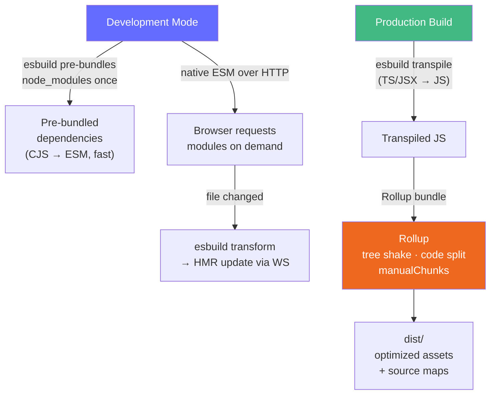

# Vite and Rollup

> [!abstract] TL;DR
> **Vite** is a next-generation build tool that serves native ESM in development (no bundling — instant server start) and uses **Rollup** for optimized production builds. In dev, Vite uses **esbuild** (written in Go, 10-100x faster than Babel) to transpile TypeScript/JSX on demand. This unbundled dev approach means only the modules the browser actually requests are processed. In production, Rollup produces tree-shaken, code-split bundles with excellent ESM output. Vite's plugin system is a superset of Rollup's plugin API.

## Intuition — analogy FIRST

Traditional bundlers (webpack) are like a factory that assembles the whole car before you can test-drive it — even if you only changed the steering wheel. Vite is like a Formula 1 pit crew: in development, they hand you exactly the part the car needs right now (on-demand module serving via native ESM). In production race conditions, they pre-assemble everything optimally (Rollup bundle). The mechanic's toolkit (esbuild) works at machine speed instead of JavaScript speed.

---

## How It Works



---

## Key Concepts / Details

### vite.config.ts — Core Configuration

```typescript
import { defineConfig, loadEnv } from 'vite'
import vue from '@vitejs/plugin-vue'
import react from '@vitejs/plugin-react'
import { resolve } from 'path'

export default defineConfig(({ command, mode }) => {
  // command: 'serve' (dev) | 'build' (prod)
  // mode: 'development' | 'production' | custom
  const env = loadEnv(mode, process.cwd(), '')

  return {
    plugins: [
      vue(),        // or react()
    ],

    resolve: {
      alias: {
        '@': resolve(__dirname, './src'),         // @/components/... instead of ../../
        '~': resolve(__dirname, './src/styles'),
      }
    },

    server: {
      port: 3000,
      proxy: {
        '/api': {
          target: 'http://localhost:8080',
          changeOrigin: true,
          rewrite: (path) => path.replace(/^\/api/, ''),
        }
      }
    },

    build: {
      outDir: 'dist',
      sourcemap: 'hidden',      // for error tracking
      minify: 'esbuild',        // or 'terser' for more aggressive
      target: 'es2020',         // output syntax target
      rollupOptions: {
        output: {
          manualChunks: {
            vendor: ['vue', 'vue-router', 'pinia'],
            charts: ['recharts'],
          },
          chunkFileNames: 'assets/[name]-[hash].js',
          assetFileNames: 'assets/[name]-[hash][extname]',
        }
      },
      chunkSizeWarningLimit: 500,  // warn above 500kB
    },

    css: {
      modules: {
        localsConvention: 'camelCase',    // .my-class → myClass in JS
      },
      preprocessorOptions: {
        scss: {
          additionalData: `@use "@/styles/variables" as *;`,  // global SCSS vars
        }
      }
    }
  }
})
```

### Environment Variables

```bash
# .env                     — loaded in all cases
# .env.local               — loaded in all cases, gitignored (secrets)
# .env.development         — only in dev (vite dev)
# .env.production          — only in prod (vite build)
# .env.staging             — custom mode (vite build --mode staging)

# Variables MUST be prefixed with VITE_ to be exposed to the browser
VITE_API_URL=https://api.example.com
VITE_APP_TITLE=My App
SUPER_SECRET=server-only-not-exposed   # no VITE_ prefix → NOT in bundle
```

```typescript
// Accessing in source
const apiUrl = import.meta.env.VITE_API_URL   // string | undefined
const isDev = import.meta.env.DEV             // boolean
const isProd = import.meta.env.PROD           // boolean
const mode = import.meta.env.MODE            // 'development' | 'production' | custom

// TypeScript: extend the ImportMetaEnv interface
// src/vite-env.d.ts
interface ImportMetaEnv {
  readonly VITE_API_URL: string
  readonly VITE_APP_TITLE: string
}
interface ImportMeta {
  readonly env: ImportMetaEnv
}
```

### Plugins

```typescript
// Vite plugins are Rollup plugins + Vite-specific hooks
// @vitejs/plugin-vue, @vitejs/plugin-react are the framework plugins

// Writing a simple Vite plugin
function myPlugin(): Plugin {
  return {
    name: 'my-plugin',

    // Rollup hooks
    resolveId(source) {
      if (source === 'virtual:my-module') return source  // resolve virtual module
    },
    load(id) {
      if (id === 'virtual:my-module') return 'export const msg = "hello from virtual"'
    },
    transform(code, id) {
      if (!id.endsWith('.ts')) return
      // transform TypeScript source
      return { code: transformedCode, map: sourceMap }
    },

    // Vite-specific hooks
    configureServer(server) {
      server.middlewares.use('/custom', (req, res) => {
        res.end('custom response')
      })
    },
    handleHotUpdate({ file, server }) {
      if (file.endsWith('.json')) {
        server.ws.send({ type: 'full-reload' })
      }
    }
  }
}
```

### Rollup — Library Mode

```typescript
// Building a component library or utility package
// vite.config.ts for a library
import { defineConfig } from 'vite'
import vue from '@vitejs/plugin-vue'
import dts from 'vite-plugin-dts'  // generates .d.ts files

export default defineConfig({
  plugins: [vue(), dts()],
  build: {
    lib: {
      entry: resolve(__dirname, 'src/index.ts'),
      name: 'MyComponentLib',          // global variable name for UMD/IIFE
      formats: ['es', 'cjs'],          // output formats
      fileName: (format) => `my-lib.${format}.js`,
    },
    rollupOptions: {
      // Don't bundle peer dependencies
      external: ['vue'],
      output: {
        globals: { vue: 'Vue' }        // for UMD: map externals to globals
      }
    }
  }
})
```

```json
// package.json for the library
{
  "main": "./dist/my-lib.cjs.js",
  "module": "./dist/my-lib.es.js",
  "types": "./dist/index.d.ts",
  "exports": {
    ".": {
      "import": "./dist/my-lib.es.js",
      "require": "./dist/my-lib.cjs.js"
    }
  },
  "sideEffects": false
}
```

### Vite vs Webpack Performance Comparison

| Metric | Vite | webpack 5 |
|--------|------|-----------|
| Cold dev start (large app) | ~300ms | 30-60s |
| Hot update (file change) | <50ms | 500ms–3s |
| Production build | Moderate (Rollup) | Moderate (webpack) |
| Config complexity | Low | High |
| Ecosystem / plugins | Growing (Rollup-compatible) | Massive |
| Module Federation | Limited (vite-plugin-federation) | First-class |
| Legacy browser support | Manual (vite-legacy plugin) | First-class (Babel) |

---

## Real-World Notes

- **Vite pre-bundles node_modules** (CJS→ESM conversion + deduplication) on first run and caches them. This is why the first cold start is slow but subsequent starts are fast.
- **Vite's `resolve.alias`** is the standard way to avoid `../../..` paths. Map `@` to `src/` universally.
- **Rollup `external`** is critical for libraries — never bundle your peer deps (React, Vue) or your consumers will get duplicate instances.
- **Vite is opinionated about ESM** — it doesn't support CommonJS source files natively. CJS dependencies are pre-bundled, but your source must be ESM.

---

## Common Pitfalls

- **`process.env` access in Vite** — use `import.meta.env` instead. `process.env` is not available in the browser; Vite replaces it at build time but not dynamically.
- **Missing `VITE_` prefix** — variables without the prefix are stripped from the bundle. Don't accidentally expose secrets.
- **`manualChunks` circular dependency** — if two manual chunks reference each other, Rollup will merge them. Use `console.log(bundle)` in a custom Rollup plugin to debug.
- **Rollup and dynamic `require()`** — Rollup doesn't support dynamic `require()`. Use `import()` or configure `@rollup/plugin-commonjs`.

---

## Related Concepts

- [[_MOC_Build_Tools|↑ Section MOC]]
- [[Build_Tools_Overview]] — Module systems, tree shaking, code splitting fundamentals
- [[Webpack_Fundamentals]] — The alternative bundler with a different architecture
- [[Package_Managers_and_Toolchain]] — TypeScript toolchain that feeds into Vite

---

## Review Questions

1. Why is Vite's dev server so much faster than webpack's? Explain the fundamental architectural difference.
2. What is the difference between `command === 'serve'` and `command === 'build'` in `vite.config.ts`?
3. Why must environment variables be prefixed with `VITE_`? What happens to those without the prefix?
4. When building a library with Vite, why must you list React/Vue as `external`?
5. What is the difference between Rollup's `manualChunks` and dynamic `import()` for code splitting?

---

## Sources

- Vite docs — https://vitejs.dev/guide/
- Rollup docs — https://rollupjs.org/introduction/
- Vite: Why Vite? — https://vitejs.dev/guide/why

#web-development #build-tools #vite #rollup #esbuild #bundling #library-mode
