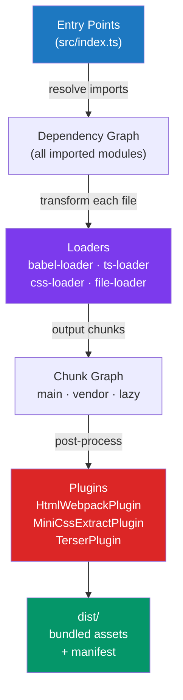

# Webpack Fundamentals

> [!abstract] TL;DR
> **webpack 5** is a battle-tested, highly configurable module bundler. Its core model: start from an **entry** file, recursively build a dependency graph, apply **loaders** to transform each file type (TypeScript, CSS, images), and apply **plugins** to perform global transformations (HTML generation, CSS extraction, minification). `optimization.splitChunks` automatically splits common modules into shared chunks. **Module Federation** enables microfrontend architectures by sharing modules across separately deployed apps at runtime. webpack 5 introduced a persistent disk cache that dramatically improves rebuild performance.

## Intuition — analogy FIRST

webpack is like a city grid planner. Starting from the city hall (entry point), the planner maps every road and building that city hall depends on — recursively — until the entire city is charted (dependency graph). **Loaders** are specialist tradespeople who convert foreign materials: the concrete mixer (babel-loader) converts raw TypeScript into standard JavaScript; the painter (css-loader) reads CSS imports; the electrician (file-loader) wires up image assets. **Plugins** are city-wide ordinances: "install street lights everywhere" (HtmlWebpackPlugin injects the script tag), "use underground cables" (MiniCssExtractPlugin extracts CSS to a separate file).

---

## How It Works



---

## Key Concepts / Details

### webpack.config.js — Core Configuration

```javascript
// webpack.config.js
const path = require('path')
const HtmlWebpackPlugin = require('html-webpack-plugin')
const MiniCssExtractPlugin = require('mini-css-extract-plugin')

module.exports = (env, argv) => {
  const isDev = argv.mode === 'development'

  return {
    // Entry: starting points of the dependency graph
    entry: {
      main: './src/index.ts',
      admin: './src/admin/index.ts',  // multiple entry points → multiple bundles
    },

    // Output: where to write the bundles
    output: {
      path: path.resolve(__dirname, 'dist'),
      filename: isDev ? '[name].bundle.js' : '[name].[contenthash].js',
      chunkFilename: '[name].[contenthash].chunk.js',
      clean: true,            // clean dist/ before build
      publicPath: '/',        // base URL for all assets
    },

    // Mode: dev enables HMR/readable names; prod enables minification
    mode: isDev ? 'development' : 'production',

    // Source maps
    devtool: isDev ? 'eval-source-map' : 'hidden-source-map',

    resolve: {
      extensions: ['.ts', '.tsx', '.js', '.jsx'],  // resolve these without extension
      alias: {
        '@': path.resolve(__dirname, 'src'),        // @/components/...
      }
    }
  }
}
```

### Loaders

```javascript
// Loaders transform files BEFORE they're added to the dependency graph
// Applied right-to-left in the 'use' array

module: {
  rules: [
    // TypeScript → JavaScript (babel-loader + @babel/preset-typescript)
    {
      test: /\.(ts|tsx)$/,
      exclude: /node_modules/,
      use: {
        loader: 'babel-loader',
        options: {
          presets: [
            ['@babel/preset-env', { targets: 'defaults' }],
            '@babel/preset-typescript',
            ['@babel/preset-react', { runtime: 'automatic' }],  // JSX
          ]
        }
      }
    },

    // CSS + CSS Modules
    {
      test: /\.module\.css$/,
      use: [
        isDev ? 'style-loader' : MiniCssExtractPlugin.loader, // inject or extract
        {
          loader: 'css-loader',
          options: { modules: { localIdentName: '[name]__[local]--[hash:5]' } }
        },
        'postcss-loader',  // autoprefixer, etc.
      ]
    },
    {
      test: /\.css$/,
      exclude: /\.module\.css$/,
      use: [isDev ? 'style-loader' : MiniCssExtractPlugin.loader, 'css-loader', 'postcss-loader'],
    },

    // SCSS
    { test: /\.scss$/, use: ['style-loader', 'css-loader', 'sass-loader'] },

    // Asset modules (webpack 5 — replaces file-loader / url-loader)
    {
      test: /\.(png|jpg|gif|svg)$/i,
      type: 'asset',               // auto: inline if <8kB, file otherwise
      parser: { dataUrlCondition: { maxSize: 8 * 1024 } },
    },
    {
      test: /\.(woff2?|eot|ttf|otf)$/,
      type: 'asset/resource',      // always emit as file
      generator: { filename: 'fonts/[name].[hash][ext]' }
    },
  ]
}
```

### Plugins

```javascript
plugins: [
  // Generate HTML and inject script/link tags automatically
  new HtmlWebpackPlugin({
    template: './public/index.html',
    chunks: ['main'],             // only inject main entry
    favicon: './public/favicon.ico',
  }),

  // Extract CSS into separate files (instead of inline <style> tags)
  new MiniCssExtractPlugin({
    filename: isDev ? '[name].css' : '[name].[contenthash].css',
  }),

  // Replace variables at build time
  new webpack.DefinePlugin({
    'process.env.API_URL': JSON.stringify(process.env.API_URL),
    __DEV__: isDev,
  }),

  // Copy static assets to dist/
  new CopyWebpackPlugin({
    patterns: [{ from: 'public/robots.txt', to: 'robots.txt' }],
  }),

  // Analyze bundle size (run with: ANALYZE=true npm build)
  process.env.ANALYZE && new BundleAnalyzerPlugin(),
].filter(Boolean)
```

### optimization.splitChunks

```javascript
optimization: {
  // Separate runtime chunk (webpack bootstrap code) — helps with caching
  runtimeChunk: 'single',

  splitChunks: {
    chunks: 'all',              // optimize both async and non-async chunks
    cacheGroups: {
      // Vendor chunk: all of node_modules
      vendor: {
        test: /[\\/]node_modules[\\/]/,
        name: 'vendor',
        priority: 10,
        reuseExistingChunk: true,
      },
      // Separate heavy UI library
      reactVendor: {
        test: /[\\/]node_modules[\\/](react|react-dom)[\\/]/,
        name: 'react-vendor',
        priority: 20,           // higher priority wins
      },
      // Common chunk: modules used in 2+ entry points
      common: {
        minChunks: 2,           // used in at least 2 places
        name: 'common',
        priority: 5,
        reuseExistingChunk: true,
      }
    }
  },

  // Minification
  minimizer: [
    new TerserPlugin({
      parallel: true,
      terserOptions: {
        compress: { drop_console: !isDev },  // remove console.log in prod
      }
    }),
    new CssMinimizerPlugin(),
  ]
}
```

### Module Federation (Microfrontends)

```javascript
// HOST app — webpack.config.js
const { ModuleFederationPlugin } = require('webpack').container

plugins: [
  new ModuleFederationPlugin({
    name: 'host',
    remotes: {
      // Load the checkout app's exposed modules at runtime
      checkout: 'checkout@https://checkout.example.com/remoteEntry.js',
    },
    shared: {
      react: { singleton: true, requiredVersion: '^18.0.0' },
      'react-dom': { singleton: true },
    }
  })
]

// REMOTE app (checkout) — webpack.config.js
new ModuleFederationPlugin({
  name: 'checkout',
  filename: 'remoteEntry.js',    // manifest file
  exposes: {
    './CheckoutFlow': './src/CheckoutFlow',
    './CartSummary': './src/CartSummary',
  },
  shared: { react: { singleton: true } }
})

// Consuming in host app
const CheckoutFlow = React.lazy(() => import('checkout/CheckoutFlow'))
```

### webpack Dev Server

```javascript
devServer: {
  port: 3000,
  hot: true,          // enable HMR
  historyApiFallback: true,   // serve index.html for all 404s (SPA routing)
  proxy: [{
    context: ['/api'],
    target: 'http://localhost:8080',
    pathRewrite: { '^/api': '' },
    changeOrigin: true,
  }],
  static: { directory: path.join(__dirname, 'public') },
}
```

---

## Real-World Notes

- **`contenthash` vs `chunkhash`**: use `[contenthash]` for long-term caching — it only changes when the file's content changes, not when any module in the chunk changes.
- **`runtimeChunk: 'single'`** prevents the runtime bootstrap from busting vendor chunk hashes on every rebuild.
- **ts-loader vs babel-loader for TypeScript**: `ts-loader` does full type checking (slow); `babel-loader + @babel/preset-typescript` transpiles only (fast). Run `tsc --noEmit` separately in CI for type checking.
- **webpack 5 persistent cache**: add `cache: { type: 'filesystem' }` to dramatically speed up subsequent builds.

---

## Common Pitfalls

- **Missing `publicPath`** — without it, chunk URLs are relative and break when the app is not served from root.
- **Loader order confusion** — loaders run right-to-left. `['css-loader', 'sass-loader']` means sass first, then css-loader. Reversing them causes errors.
- **Module Federation version mismatch** — if host and remote use different React versions without `singleton: true`, you'll get "hooks can only be called inside a function component" errors.
- **`style-loader` in production** — injects CSS into `<style>` tags at runtime (no FOUC protection, no caching). Always use `MiniCssExtractPlugin` in production.

---

## Related Concepts

- [[_MOC_Build_Tools|↑ Section MOC]]
- [[Build_Tools_Overview]] — Module systems and bundling fundamentals
- [[Vite_and_Rollup]] — The modern alternative to webpack
- [[Package_Managers_and_Toolchain]] — TypeScript and Babel toolchain that webpack consumes

---

## Review Questions

1. Explain the difference between a webpack loader and a webpack plugin. Give a concrete example of each.
2. Why does `contenthash` in filenames improve caching? How is it different from `hash`?
3. How does `optimization.splitChunks` decide which modules to extract into a shared chunk?
4. What problem does Module Federation solve, and what does `singleton: true` on a shared dep do?
5. Why should you use `babel-loader` instead of `ts-loader` for TypeScript in most CI pipelines?

---

## Sources

- webpack 5 docs: Concepts — https://webpack.js.org/concepts/
- webpack docs: Module Federation — https://webpack.js.org/concepts/module-federation/
- webpack docs: SplitChunksPlugin — https://webpack.js.org/plugins/split-chunks-plugin/

#web-development #build-tools #webpack #loaders #plugins #module-federation #code-splitting
