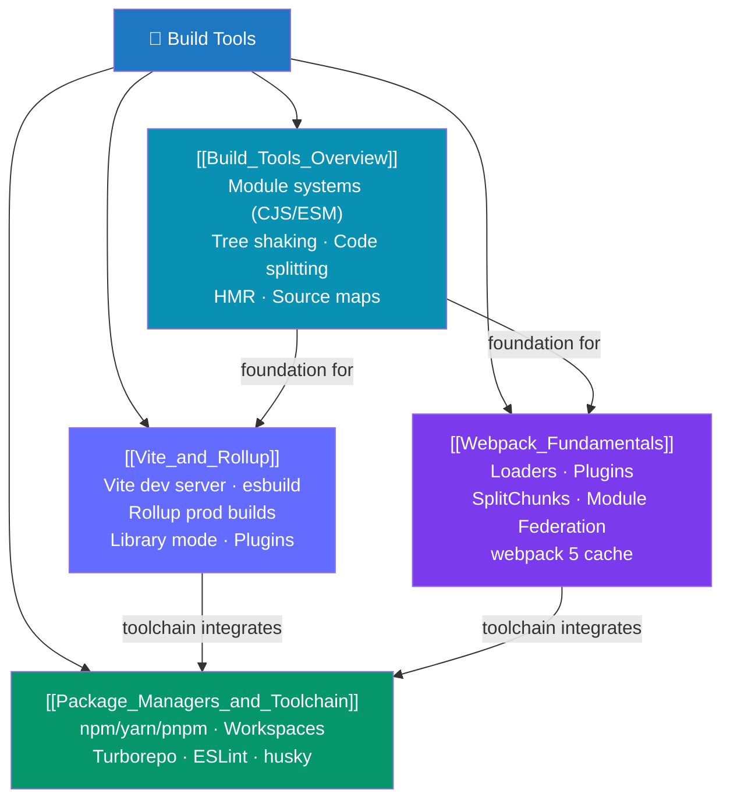

# Build Tools — Map of Content

> [!abstract] What This Section Covers
> Modern JavaScript applications require a build pipeline to transform TypeScript, JSX, CSS modules, and static assets into browser-deliverable bundles. This section covers the foundations of how bundlers work (module systems, tree shaking, code splitting, HMR), the two dominant bundler families (Vite/Rollup as the modern choice, webpack as the battle-tested incumbent), and the surrounding toolchain: package managers (npm/yarn/pnpm), monorepo orchestration (Turborepo/Nx), the TypeScript compiler toolchain, code quality tools (ESLint/Biome/Prettier), and pre-commit automation (husky + lint-staged).

## Concept Map

## Learning Path

1. [[Build_Tools_Overview]] — Start here to understand WHY build tools exist: module systems (CJS vs ESM vs UMD), tree shaking, code splitting strategies, source maps, and HMR mechanics.
2. [[Vite_and_Rollup]] — The modern toolchain: Vite's unbundled dev server (native ESM + esbuild), `vite.config.ts`, environment variables, Rollup production builds, library mode.
3. [[Webpack_Fundamentals]] — The incumbent: entry/output/loaders/plugins model, `optimization.splitChunks`, Module Federation for microfrontends, webpack 5 persistent cache.
4. [[Package_Managers_and_Toolchain]] — The surrounding ecosystem: pnpm vs npm vs yarn, pnpm workspaces, Turborepo caching, TypeScript toolchain (tsc/tsx/tsup), ESLint/Biome/Prettier, husky + lint-staged.

## All Notes at a Glance

| Note | Difficulty | What You'll Learn |
|------|------------|-------------------|
| [[Build_Tools_Overview]] | Beginner | CJS/ESM/UMD, tree shaking conditions, code splitting patterns, source maps, HMR lifecycle |
| [[Vite_and_Rollup]] | Intermediate | Vite architecture, vite.config.ts, env vars, Rollup library mode, Vite vs webpack performance |
| [[Webpack_Fundamentals]] | Intermediate | webpack 5 config, loaders, plugins, splitChunks, Module Federation, contenthash caching |
| [[Package_Managers_and_Toolchain]] | Intermediate | pnpm store, monorepo workspaces, Turborepo pipeline, tsc/tsx, ESLint flat config, pre-commit hooks |

## Key Questions This Section Answers

- Why can't you use `require()` in a Vite project? What module system should you use?
- What conditions must be met for tree shaking to actually remove dead code?
- Why is Vite's dev server so much faster than webpack's? What is native ESM serving?
- What is the difference between a webpack loader and a webpack plugin?
- How does pnpm avoid the disk space waste of npm's node_modules?
- How does Turborepo's remote cache speed up CI in a monorepo?
- What does `husky + lint-staged` actually do and how does it prevent bad commits?

## Related Sections

- [[_MOC_WebDev_Master|↑ Web Dev Master MOC]]
- [[_MOC_Vue|← Vue]] — Vite is the standard build tool for Vue 3
- [[_MOC_React|← React]] — Create React App (deprecated) vs Vite-based setups
- [[_MOC_TypeScript|← TypeScript]] — tsconfig settings that interface with the build toolchain

#MOC #WebDevelopment #BuildTools
