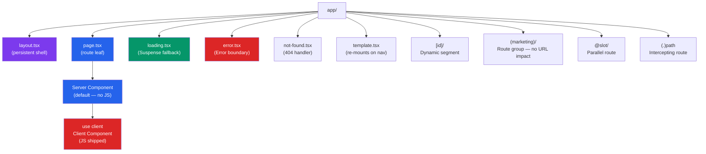

# Next.js App Router

> [!abstract] TL;DR
> The App Router (Next.js 13+) maps the filesystem directly to URL routes. Every folder under `app/` can contain special files — `page.tsx`, `layout.tsx`, `loading.tsx`, `error.tsx` — that Next.js composes automatically into a nested UI tree. Components are Server Components by default (zero JS shipped). Add `"use client"` only at the leaf nodes that require interactivity. Server Actions (`"use server"`) let you mutate data and revalidate caches from server-side functions called directly from client forms.

## Intuition — analogy FIRST

The App Router is a filing cabinet where folder names are URL segments and special file names are roles. Drop a `page.tsx` in a folder — that URL becomes live. Drop a `layout.tsx` — that folder gets a persistent frame that survives navigation. Drop a `loading.tsx` — streaming is handled automatically with a Suspense skeleton. The framework reads the cabinet structure at build time and wires the routing tree. You write files, not router configuration.

---

## How It Works



---

## Key Concepts / Details

### Special Files Reference

| File | Purpose | Re-mounts on nav? |
|------|---------|-------------------|
| `page.tsx` | Makes the route publicly accessible | Yes |
| `layout.tsx` | Shared UI that wraps child routes | No — persists |
| `template.tsx` | Like layout but re-mounts on navigation | Yes |
| `loading.tsx` | Automatic `<Suspense>` wrapper with skeleton UI | Per route |
| `error.tsx` | React Error Boundary for this segment | Per route |
| `not-found.tsx` | Renders when `notFound()` is called | Per route |
| `route.ts` | API Route Handler (replaces `pages/api/`) | N/A |
| `middleware.ts` | Runs at edge before any route | N/A |

### Nested Layouts

```tsx
// app/layout.tsx — root layout
import type { Metadata } from 'next';
import { Inter } from 'next/font/google';

const inter = Inter({ subsets: ['latin'] });

export const metadata: Metadata = {
  title: { template: '%s | MyApp', default: 'MyApp' },
  description: 'Production Next.js app',
};

export default function RootLayout({ children }: { children: React.ReactNode }) {
  return (
    <html lang="en" className={inter.className}>
      <body>
        <nav>/* persistent nav — survives page transitions */</nav>
        <main>{children}</main>
      </body>
    </html>
  );
}

// app/dashboard/layout.tsx — nested layout (wraps /dashboard/*)
export default function DashboardLayout({ children }: { children: React.ReactNode }) {
  return (
    <div className="dashboard-container">
      <aside>/* sidebar — persists within /dashboard/* */</aside>
      <section>{children}</section>
    </div>
  );
}
```

### Dynamic Segments and Route Groups

```
app/
├── (marketing)/          ← route group — (marketing) not in URL
│   ├── about/page.tsx    → /about
│   └── pricing/page.tsx  → /pricing
├── (app)/                ← different layout for authenticated area
│   ├── layout.tsx        ← auth-required layout
│   ├── dashboard/page.tsx → /dashboard
│   └── settings/page.tsx  → /settings
├── blog/
│   ├── page.tsx          → /blog
│   └── [slug]/           ← dynamic segment — slug = params.slug
│       ├── page.tsx      → /blog/my-post-title
│       └── [...path]/    ← catch-all — /blog/a/b/c → path = ['a','b','c']
│           └── page.tsx
└── [[...optional]]/      ← optional catch-all — matches / AND /a/b
    └── page.tsx
```

```tsx
// app/blog/[slug]/page.tsx
interface PageProps {
  params: { slug: string };
  searchParams: { [key: string]: string | string[] | undefined };
}

export default async function BlogPost({ params, searchParams }: PageProps) {
  const post = await getPost(params.slug); // server-side fetch
  return <Article post={post} />;
}

// Pre-generate static paths at build time (SSG)
export async function generateStaticParams() {
  const posts = await getPosts();
  return posts.map(post => ({ slug: post.slug }));
}

// Dynamic SEO metadata per page
export async function generateMetadata({ params }: PageProps) {
  const post = await getPost(params.slug);
  return {
    title: post.title,
    description: post.excerpt,
    openGraph: {
      title: post.title,
      images: [post.coverImage],
    },
  };
}
```

### Server vs Client Components

```tsx
// app/products/page.tsx — Server Component (default)
// Runs ONLY on server. Zero JavaScript shipped to client.
import { db } from '@/lib/db';

export default async function ProductsPage() {
  // Direct database access — impossible in client components
  const products = await db.product.findMany({ where: { published: true } });

  return (
    <ul>
      {products.map(p => (
        // AddToCart needs interactivity → Client Component
        <li key={p.id}>
          {p.name}
          <AddToCartButton productId={p.id} price={p.price} />
        </li>
      ))}
    </ul>
  );
}
```

```tsx
// components/AddToCartButton.tsx — Client Component
'use client'; // boundary: this file and its children run on client

import { useState } from 'react';

export function AddToCartButton({ productId, price }: { productId: string; price: number }) {
  const [added, setAdded] = useState(false);

  return (
    <button
      onClick={() => { setAdded(true); addToCart(productId); }}
      className={added ? 'btn-success' : 'btn-primary'}
    >
      {added ? 'Added!' : `Add — $${price}`}
    </button>
  );
}
```

### Server Actions

```tsx
// app/contact/page.tsx
import { revalidatePath } from 'next/cache';
import { redirect } from 'next/navigation';

// Server Action — runs on the server, callable from client forms
async function submitContact(formData: FormData) {
  'use server'; // marks this function as a server action

  const name = formData.get('name') as string;
  const email = formData.get('email') as string;
  const message = formData.get('message') as string;

  // Validate
  if (!name || !email) throw new Error('Name and email required');

  // Persist to database
  await db.contactSubmission.create({ data: { name, email, message } });

  // Invalidate cached data and redirect
  revalidatePath('/admin/submissions');
  redirect('/contact/thank-you');
}

// Server Component with a Server Action form — works without JS!
export default function ContactPage() {
  return (
    <form action={submitContact}>
      <input name="name" placeholder="Name" required />
      <input name="email" type="email" placeholder="Email" required />
      <textarea name="message" placeholder="Message" required />
      <button type="submit">Send Message</button>
    </form>
  );
}
```

### Parallel Routes and Intercepting Routes

```
app/
├── layout.tsx
├── @modal/                 ← parallel route slot
│   └── (..)photo/[id]/     ← intercept /photo/[id]
│       └── page.tsx        ← rendered in @modal slot (modal overlay)
├── photo/
│   └── [id]/
│       └── page.tsx        ← full-page view when navigated directly
└── page.tsx                ← receives { children, modal } props
```

```tsx
// app/layout.tsx — receives parallel route slots
export default function Layout({
  children,
  modal,        // @modal slot
}: {
  children: React.ReactNode;
  modal: React.ReactNode;
}) {
  return (
    <>
      {children}
      {modal}   {/* renders the intercepted modal when active */}
    </>
  );
}
```

---

## Real-World Notes

- **Use Route Groups `(group)` to share layouts without affecting URLs** — group authenticated and unauthenticated layouts cleanly without a `/auth/` prefix.
- **`loading.tsx` auto-wraps the route in `<Suspense>`** — you get streaming for free just by adding the file. No manual Suspense wrapper needed.
- **`error.tsx` must be a Client Component** — React Error Boundaries require class lifecycle methods or the `"use client"` directive.
- **Server Actions eliminate API routes for mutations** — no need for `POST /api/create-post` when you can call an async function directly.

---

## Common Pitfalls

1. **Importing Client Component from Server Component — fine. Reverse — broken.** A Client Component cannot import a Server Component; pass server data via props instead.
2. **`"use client"` at the top of every file** — this defeats the purpose of RSC. Push boundaries down to leaves; keep data-fetching components as Server Components.
3. **Not co-locating `error.tsx` with the segment** — a single root `error.tsx` catches everything but gives poor UX. Add segment-level error files for granular recovery.
4. **Forgetting to `await` Server Action results** — Server Actions are async; unhandled promise rejections cause silent failures.
5. **Route groups (`(group)`) sharing the same path** — two route groups cannot have the same leaf URL or Next.js throws a conflict error at build time.

---

## Related Concepts

- [[_MOC_NextJS|↑ Section MOC]]
- [[NextJS_Fundamentals]] — Project setup and App vs Pages Router overview
- [[NextJS_Data_Fetching]] — How Server Components fetch data and caching strategies
- [[NextJS_Fullstack_Patterns]] — Server Actions with form state, tRPC, and Prisma patterns

---

## Review Questions

1. What is the difference between `layout.tsx` and `template.tsx`? When would you use each?
2. How does a route group `(marketing)` affect the URL structure?
3. What is the component composition rule between Server Components and Client Components?
4. How do parallel routes enable a modal UI pattern with deep-linking support?
5. What does the `"use server"` directive inside a function body (not a file) mean?

---

## Sources

- Next.js docs: App Router Routing — https://nextjs.org/docs/app/building-your-application/routing
- Next.js docs: Server Actions — https://nextjs.org/docs/app/building-your-application/data-fetching/server-actions-and-mutations
- Next.js docs: Parallel Routes — https://nextjs.org/docs/app/building-your-application/routing/parallel-routes

#NextJS #React #WebDevelopment #AppRouter #ServerComponents #routing
