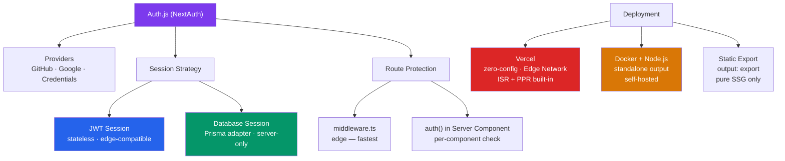

# Next.js Authentication and Deployment

> [!abstract] TL;DR
> Auth.js (formerly NextAuth.js) is the de-facto authentication library for Next.js App Router. It provides OAuth providers (GitHub, Google), Credentials, JWT/database sessions, and a typed `auth()` function for session access in Server Components and Route Handlers. Protect routes at the edge with middleware. Deploy on Vercel (zero-config) or self-host with a Docker container using `output: 'standalone'`. ISR and on-demand revalidation work in production via `revalidatePath`/`revalidateTag` called from Server Actions.

## Intuition — analogy FIRST

Authentication is the building's security desk: **Auth.js** is the desk clerk who checks IDs (providers), issues visitor badges (sessions/JWTs), and keeps a log (database sessions). **Middleware** is the turnstile at the elevator — it checks your badge before you can reach any floor (route), stopping unauthorized access at the edge before any server-side code runs. **Deployment** is moving from a test kitchen to a commercial restaurant: Vercel is the fully staffed catering company (zero-config, handles scaling); self-hosting is renting a kitchen and staffing it yourself (more control, more responsibility).

---

## How It Works



---

## Key Concepts / Details

### Auth.js Setup

```bash
npm install next-auth@beta
```

```typescript
// auth.ts — central auth config (used everywhere)
import NextAuth from 'next-auth';
import GitHub from 'next-auth/providers/github';
import Google from 'next-auth/providers/google';
import Credentials from 'next-auth/providers/credentials';
import { PrismaAdapter } from '@auth/prisma-adapter';
import { db } from '@/lib/db';
import bcrypt from 'bcryptjs';

export const { handlers, auth, signIn, signOut } = NextAuth({
  adapter: PrismaAdapter(db),   // store sessions in database

  providers: [
    GitHub({
      clientId: process.env.GITHUB_CLIENT_ID!,
      clientSecret: process.env.GITHUB_CLIENT_SECRET!,
    }),
    Google({
      clientId: process.env.GOOGLE_CLIENT_ID!,
      clientSecret: process.env.GOOGLE_CLIENT_SECRET!,
    }),
    Credentials({
      async authorize(credentials) {
        const user = await db.user.findUnique({
          where: { email: credentials.email as string },
        });
        if (!user?.passwordHash) return null;
        const valid = await bcrypt.compare(
          credentials.password as string,
          user.passwordHash
        );
        return valid ? user : null;
      },
    }),
  ],

  session: { strategy: 'jwt' }, // 'jwt' (stateless) or 'database' (server-only)

  callbacks: {
    // Add user ID to JWT/session
    async jwt({ token, user }) {
      if (user) token.id = user.id;
      return token;
    },
    async session({ session, token }) {
      if (token.id) session.user.id = token.id as string;
      return session;
    },
  },

  pages: {
    signIn: '/login',           // custom sign-in page
    error: '/auth/error',       // custom error page
  },
});
```

### Route Handlers for Auth

```typescript
// app/api/auth/[...nextauth]/route.ts
import { handlers } from '@/auth';

export const { GET, POST } = handlers;
// This handles all Auth.js callbacks: /api/auth/signin, /api/auth/callback/*, etc.
```

### Using `auth()` in Server Components

```tsx
// app/dashboard/page.tsx — protected Server Component
import { auth } from '@/auth';
import { redirect } from 'next/navigation';

export default async function DashboardPage() {
  const session = await auth(); // reads JWT/database session server-side

  if (!session?.user) {
    redirect('/login'); // server-side redirect — no flash of protected content
  }

  const user = session.user;
  const data = await getDashboardData(user.id);

  return (
    <div>
      <h1>Welcome, {user.name}</h1>
      <Dashboard data={data} />
    </div>
  );
}
```

### Middleware Route Protection (Edge)

```typescript
// middleware.ts — runs at Vercel Edge Network / Node.js edge
import { auth } from '@/auth';
import { NextResponse } from 'next/server';

export default auth((req) => {
  const isLoggedIn = !!req.auth;
  const { pathname } = req.nextUrl;

  // Protected routes
  const isProtected = pathname.startsWith('/dashboard') ||
                      pathname.startsWith('/admin') ||
                      pathname.startsWith('/settings');

  // Auth routes — redirect logged-in users away from login/register
  const isAuthRoute = pathname.startsWith('/login') ||
                      pathname.startsWith('/register');

  if (isAuthRoute && isLoggedIn) {
    return NextResponse.redirect(new URL('/dashboard', req.url));
  }

  if (isProtected && !isLoggedIn) {
    const loginUrl = new URL('/login', req.url);
    loginUrl.searchParams.set('callbackUrl', pathname); // preserve destination
    return NextResponse.redirect(loginUrl);
  }
});

export const config = {
  matcher: ['/((?!api|_next/static|_next/image|favicon.ico).*)'],
};
```

### Sign In / Sign Out UI

```tsx
// app/login/page.tsx
import { signIn } from '@/auth';

export default function LoginPage() {
  return (
    <div>
      {/* OAuth sign-in via Server Action */}
      <form action={async () => { 'use server'; await signIn('github'); }}>
        <button type="submit">Sign in with GitHub</button>
      </form>

      <form action={async () => { 'use server'; await signIn('google'); }}>
        <button type="submit">Sign in with Google</button>
      </form>
    </div>
  );
}

// components/SignOutButton.tsx
'use client';
import { signOut } from 'next-auth/react'; // client-side signOut

export function SignOutButton() {
  return <button onClick={() => signOut({ callbackUrl: '/' })}>Sign Out</button>;
}
```

### Deploying to Vercel

```bash
# Zero-config: push to GitHub, connect to Vercel, done
# Vercel detects Next.js automatically

# Environment variables: set in Vercel dashboard
# Production: DATABASE_URL, NEXTAUTH_SECRET, GITHUB_CLIENT_ID, etc.

# next build runs automatically on push
# ISR revalidation works via Vercel's Edge Cache
# on-demand revalidation via revalidatePath/revalidateTag hits Vercel's cache
```

### Self-Hosting with Docker

```dockerfile
# Dockerfile — multi-stage build with standalone output
FROM node:20-alpine AS deps
WORKDIR /app
COPY package*.json ./
RUN npm ci --only=production

FROM node:20-alpine AS builder
WORKDIR /app
COPY --from=deps /app/node_modules ./node_modules
COPY . .
RUN npm run build

FROM node:20-alpine AS runner
WORKDIR /app
ENV NODE_ENV=production

# Copy only what's needed for standalone output
COPY --from=builder /app/.next/standalone ./
COPY --from=builder /app/.next/static ./.next/static
COPY --from=builder /app/public ./public

EXPOSE 3000
CMD ["node", "server.js"]
```

```javascript
// next.config.js — enable standalone output for Docker
module.exports = {
  output: 'standalone', // bundles only required node_modules (~50% smaller image)
};
```

### Static Export

```javascript
// next.config.js — pure SSG, no server required
module.exports = {
  output: 'export',
  // trailingSlash: true, // optional: /about → /about/index.html
};
```

```bash
next build   # outputs to out/ directory
# Deploy out/ to any static host: S3, Netlify, GitHub Pages
# LIMITATION: no ISR, no SSR, no Route Handlers, no middleware
```

---

## Real-World Notes

- **`NEXTAUTH_SECRET` is required in production** — generate with `openssl rand -base64 32`. Without it, Auth.js throws in production.
- **JWT strategy for edge middleware** — database session strategy requires a database call per request; JWT strategy reads the cookie without a round-trip, making edge middleware fast.
- **Vercel preview deployments use production env vars** — create separate preview env vars in Vercel dashboard or branch-specific env files.
- **`output: 'standalone'` reduces Docker image size significantly** — it traces dependencies and copies only what's needed, typically halving the image size vs a naive `node_modules` copy.

---

## Common Pitfalls

1. **Setting `NEXTAUTH_URL` incorrectly** — must match the exact deployment URL including protocol. `https://myapp.vercel.app` not `http://`. On Vercel, `NEXTAUTH_URL` is optional (auto-detected).
2. **Using database session strategy with middleware** — requires a database call on every request at the edge; prefer JWT for middleware, database sessions only for server-side checks.
3. **Forgetting `callbackUrl` in middleware redirects** — users are redirected to login but after signing in land on `/dashboard` instead of their original destination without it.
4. **Static export with dynamic features** — `output: 'export'` silently skips ISR/SSR routes. Add `export const dynamic = 'error'` to route segments that must not be static to catch this at build time.
5. **Not sealing secrets in Server Actions** — passing `session.user.id` through client-side form hidden fields is a security risk. Read it from `auth()` server-side, not from client input.

---

## Related Concepts

- [[_MOC_NextJS|↑ Section MOC]]
- [[NextJS_App_Router]] — Server Components and middleware foundation
- [[NextJS_Fullstack_Patterns]] — Protecting mutations in Server Actions, middleware patterns
- [[NextJS_Optimization]] — Production build and image optimization

---

## Review Questions

1. What is the difference between JWT session strategy and database session strategy in Auth.js? When would you prefer each?
2. Why is middleware the preferred place for route protection rather than individual page checks?
3. What does `output: 'standalone'` do in `next.config.js` and why does it reduce Docker image size?
4. What limitations does `output: 'export'` (static export) impose on the Next.js feature set?
5. How does `callbackUrl` improve the authentication UX? Trace the full redirect flow.

---

## Sources

- Auth.js docs (NextAuth v5) — https://authjs.dev/getting-started/installation
- Next.js docs: Authentication — https://nextjs.org/docs/app/building-your-application/authentication
- Next.js docs: Deployment — https://nextjs.org/docs/app/building-your-application/deploying

#NextJS #React #WebDevelopment #authentication #deployment #AuthJS #Vercel #Docker
