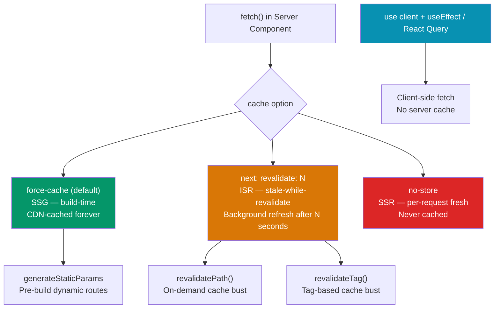

# Next.js Data Fetching

> [!abstract] TL;DR
> Next.js extends the native `fetch` API with cache-control options that select the rendering strategy: `cache: 'force-cache'` gives SSG, `next: { revalidate: N }` gives ISR, `cache: 'no-store'` gives SSR. Route Handlers (`route.ts`) replace `pages/api/` for REST-style endpoints. Streaming with `<Suspense>` delivers the page shell immediately and flushes data boundaries as they resolve. `revalidatePath` and `revalidateTag` trigger on-demand cache invalidation from Server Actions.

## Intuition — analogy FIRST

Think of the four rendering strategies as four ways to print a newspaper: **SSG** is printed once at press time and everyone gets the same copy (fastest delivery, but stale until the next print run); **ISR** prints on demand but keeps the last copy on the shelf while the new one prints in the background (stale-while-revalidate); **SSR** prints a fresh copy for every reader (always current, more printing overhead); **CSR** hands the reader a blank page and a printer — they assemble it themselves in their living room (most flexible, slowest first paint).

---

## How It Works



---

## Key Concepts / Details

### The Four Rendering Strategies

```tsx
// 1. SSG — build once, serve from CDN
// Default when no dynamic data. cache: 'force-cache' is implicit.
async function getBlogPost(slug: string) {
  const res = await fetch(`https://cms.example.com/posts/${slug}`, {
    cache: 'force-cache', // cached at build time (default)
  });
  return res.json();
}

// Generate static paths for all dynamic routes
export async function generateStaticParams() {
  const posts = await fetch('https://cms.example.com/posts').then(r => r.json());
  return posts.map((post: { slug: string }) => ({ slug: post.slug }));
}

export default async function BlogPostPage({ params }: { params: { slug: string } }) {
  const post = await getBlogPost(params.slug);
  return <Article post={post} />;
}
```

```tsx
// 2. ISR — revalidate every N seconds (stale-while-revalidate)
async function getProductPrices() {
  const res = await fetch('https://api.example.com/prices', {
    next: { revalidate: 60 }, // regenerate after 60 seconds in background
  });
  return res.json();
}
// Users get cached copy; background refresh triggers after 60s
// revalidate: 0 → ISR that revalidates immediately (effectively SSR)
```

```tsx
// 3. SSR — fresh data on every request
async function getDashboardData(userId: string) {
  const res = await fetch(`https://api.example.com/users/${userId}/dashboard`, {
    cache: 'no-store', // never cache — fetch fresh every request
  });
  return res.json();
}
// OR: using next/headers makes the route dynamically rendered automatically
import { cookies } from 'next/headers';

export default async function DashboardPage() {
  const session = cookies().get('session-token'); // forces SSR
  const data = await getDashboardData(session!.value);
  return <Dashboard data={data} />;
}
```

```tsx
// 4. CSR — client-side only (React Query / SWR)
'use client';
import { useQuery } from '@tanstack/react-query';

export function LivePriceWidget({ symbol }: { symbol: string }) {
  const { data, isLoading } = useQuery({
    queryKey: ['price', symbol],
    queryFn: () => fetch(`/api/price/${symbol}`).then(r => r.json()),
    refetchInterval: 5000, // poll every 5s — real-time feel
  });

  if (isLoading) return <Skeleton />;
  return <span>${data?.price}</span>;
}
```

### Route Handlers (API Routes)

```typescript
// app/api/users/route.ts
import { NextRequest, NextResponse } from 'next/server';

// GET /api/users?role=admin
export async function GET(request: NextRequest) {
  const role = request.nextUrl.searchParams.get('role');

  const users = await db.user.findMany({
    where: role ? { role } : undefined,
  });

  return NextResponse.json(users, {
    status: 200,
    headers: { 'Cache-Control': 's-maxage=60, stale-while-revalidate' },
  });
}

// POST /api/users
export async function POST(request: NextRequest) {
  const body = await request.json();
  const user = await db.user.create({ data: body });
  return NextResponse.json(user, { status: 201 });
}

// app/api/users/[id]/route.ts — dynamic route handler
export async function GET(
  request: NextRequest,
  { params }: { params: { id: string } }
) {
  const user = await db.user.findUnique({ where: { id: params.id } });
  if (!user) return NextResponse.json({ error: 'Not found' }, { status: 404 });
  return NextResponse.json(user);
}
```

### Streaming with Suspense

```tsx
// app/dashboard/page.tsx — streaming approach
import { Suspense } from 'react';

// Shell renders immediately; Suspense boundaries stream independently
export default function DashboardPage() {
  return (
    <div>
      <DashboardHeader /> {/* renders instantly */}

      <Suspense fallback={<MetricsSkeleton />}>
        <MetricsPanel />   {/* slow DB query — streams when ready */}
      </Suspense>

      <Suspense fallback={<TableSkeleton />}>
        <RecentOrders />   {/* another slow query — streams independently */}
      </Suspense>
    </div>
  );
}

// MetricsPanel is a Server Component that awaits data
async function MetricsPanel() {
  // Parallel fetches inside the same Suspense boundary
  const [revenue, users, orders] = await Promise.all([
    getRevenue(),
    getUserCount(),
    getOrderCount(),
  ]);

  return <Metrics revenue={revenue} users={users} orders={orders} />;
}
```

### Cache Tags and On-Demand Revalidation

```typescript
// Fetching with cache tags
async function getProductsByCategory(category: string) {
  const res = await fetch(`https://api.example.com/products?category=${category}`, {
    next: {
      revalidate: 3600,
      tags: [`products`, `category-${category}`],  // tag for targeted invalidation
    },
  });
  return res.json();
}

// Server Action to invalidate specific tags
import { revalidateTag, revalidatePath } from 'next/cache';

async function updateProduct(id: string, data: ProductUpdate) {
  'use server';
  await db.product.update({ where: { id }, data });

  revalidateTag('products');               // invalidate all product caches
  revalidateTag(`product-${id}`);         // invalidate specific product
  revalidatePath('/products');             // invalidate the products page path
  revalidatePath('/products/[id]', 'page'); // invalidate all dynamic product pages
}
```

### unstable_cache for Non-fetch Data Sources

```typescript
import { unstable_cache } from 'next/cache';

// Cache the result of a Prisma query (non-fetch) with ISR-like behavior
const getCachedUserProfile = unstable_cache(
  async (userId: string) => {
    return db.user.findUnique({
      where: { id: userId },
      include: { profile: true },
    });
  },
  ['user-profile'],           // cache key parts
  {
    revalidate: 300,          // revalidate every 5 minutes
    tags: ['users'],          // tag for targeted invalidation
  }
);

// Usage in Server Component
export default async function ProfilePage({ params }: { params: { id: string } }) {
  const user = await getCachedUserProfile(params.id);
  return <UserProfile user={user} />;
}
```

### Reading Cookies and Headers in Server Components

```typescript
import { cookies, headers } from 'next/headers';

export default async function PersonalizedPage() {
  // Reading cookies opts the route into dynamic rendering (SSR)
  const cookieStore = cookies();
  const theme = cookieStore.get('theme')?.value ?? 'light';
  const sessionToken = cookieStore.get('session')?.value;

  // Reading headers also opts into dynamic rendering
  const headersList = headers();
  const userAgent = headersList.get('user-agent') ?? '';
  const isMobile = /Mobile/.test(userAgent);

  const user = sessionToken ? await getUserFromSession(sessionToken) : null;

  return <Page user={user} theme={theme} isMobile={isMobile} />;
}
```

---

## Real-World Notes

- **`fetch` deduplication is automatic within a request** — if two Server Components fetch the same URL in the same render, Next.js executes it once. This is React's built-in request memoization.
- **`cookies()` and `headers()` make the route dynamic** — calling them forces SSR; avoid them in components that should be statically rendered.
- **`generateStaticParams` runs at build time** — it's the App Router equivalent of `getStaticPaths`. Return only the params you want pre-built; other paths fallback at runtime.
- **ISR with `revalidate: 0` is different from `cache: 'no-store'`** — `revalidate: 0` still respects the stale-while-revalidate model; `no-store` skips caching entirely.

---

## Common Pitfalls

1. **Sequential awaits when parallel is possible** — `const a = await fetchA(); const b = await fetchB()` takes `time(A) + time(B)`. Use `Promise.all([fetchA(), fetchB()])` to cut it to `max(time(A), time(B))`.
2. **Forgetting that `loading.tsx` uses Suspense** — placing async data fetching outside of Suspense boundaries blocks the entire route until data resolves.
3. **Using `unstable_cache` with mutable closures** — the cache key must capture all inputs; dynamic values from closures not in the key array cause stale data bugs.
4. **Route Handler caching pitfalls** — `GET` Route Handlers are cached by default in static routes. Add `export const dynamic = 'force-dynamic'` or read `request` to opt out.
5. **Mutating data without `revalidatePath`** — after a Server Action writes to the database, cached pages serve stale data. Always call `revalidatePath` or `revalidateTag`.

---

## Related Concepts

- [[_MOC_NextJS|↑ Section MOC]]
- [[NextJS_App_Router]] — File-based routing and Server Components
- [[NextJS_Fullstack_Patterns]] — Server Actions, tRPC, and Prisma with Server Components
- [[NextJS_Optimization]] — Image, font, and script optimization built on top of data fetching

---

## Review Questions

1. How do you choose between SSG, ISR, SSR, and CSR? Give a real-world example for each.
2. What is the difference between `revalidatePath` and `revalidateTag`? When would you use tags?
3. How does `fetch` deduplication work within a single Next.js request? What enables it?
4. Why does calling `cookies()` or `headers()` in a Server Component change the rendering strategy?
5. Rewrite this sequential fetch to be parallel: `const user = await getUser(id); const posts = await getPosts(id);`

---

## Sources

- Next.js docs: Data Fetching — https://nextjs.org/docs/app/building-your-application/data-fetching
- Next.js docs: Caching — https://nextjs.org/docs/app/building-your-application/caching
- Next.js docs: Rendering — https://nextjs.org/docs/app/building-your-application/rendering

#NextJS #React #WebDevelopment #DataFetching #SSR #SSG #ISR #caching
