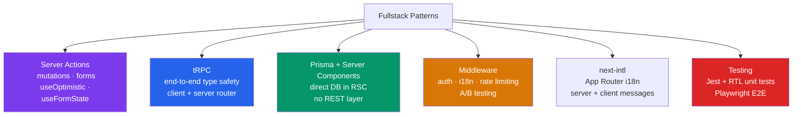

# Next.js Fullstack Patterns

> [!abstract] TL;DR
> Modern Next.js fullstack development centers on Server Actions for mutations (with `useFormState`, `useFormStatus`, and `useOptimistic` for rich UX), tRPC for end-to-end type-safe APIs, and Prisma as the ORM integrated directly into Server Components. Middleware handles cross-cutting concerns (auth, i18n, A/B testing, rate limiting). Testing uses Jest + React Testing Library for unit/integration and Playwright for E2E. `next-intl` provides localization with App Router support.

## Intuition — analogy FIRST

Server Actions with `useOptimistic` are like a modern delivery app: when you tap "Order," the app immediately shows your order as placed (optimistic update) before the server confirms — if the request fails, it rolls back. tRPC is a shared vocabulary between the kitchen (server) and the front-of-house (client) — both sides speak the same typed language, so mismatches cause compile errors, not runtime crashes. Prisma with Server Components is the chef going directly to the pantry (database) without a middleman API layer — fastest path from ingredients to plate.

---

## How It Works



---

## Key Concepts / Details

### Server Actions — Advanced Patterns

```tsx
// lib/actions/post.ts — Server Actions in a separate file
'use server';

import { revalidatePath } from 'next/cache';
import { redirect } from 'next/navigation';
import { auth } from '@/auth';
import { db } from '@/lib/db';
import { z } from 'zod';

// Zod schema for validation
const PostSchema = z.object({
  title: z.string().min(1, 'Title required').max(200),
  content: z.string().min(10, 'Content too short'),
});

// Return type for useFormState — { success, errors?, data? }
export type PostFormState = {
  success: boolean;
  errors?: { title?: string[]; content?: string[] };
  message?: string;
};

export async function createPost(
  prevState: PostFormState,
  formData: FormData
): Promise<PostFormState> {
  const session = await auth();
  if (!session?.user) return { success: false, message: 'Unauthorized' };

  const raw = { title: formData.get('title'), content: formData.get('content') };
  const result = PostSchema.safeParse(raw);

  if (!result.success) {
    return { success: false, errors: result.error.flatten().fieldErrors };
  }

  await db.post.create({
    data: { ...result.data, authorId: session.user.id },
  });

  revalidatePath('/posts');
  return { success: true, message: 'Post created!' };
}
```

```tsx
// components/CreatePostForm.tsx — Client Component using useFormState
'use client';

import { useFormState, useFormStatus } from 'react-dom';
import { createPost, type PostFormState } from '@/lib/actions/post';

const initialState: PostFormState = { success: false };

function SubmitButton() {
  const { pending } = useFormStatus(); // reads form submission state
  return (
    <button type="submit" disabled={pending}>
      {pending ? 'Creating...' : 'Create Post'}
    </button>
  );
}

export function CreatePostForm() {
  const [state, formAction] = useFormState(createPost, initialState);

  return (
    <form action={formAction}>
      {state.message && (
        <p className={state.success ? 'text-green-600' : 'text-red-600'}>
          {state.message}
        </p>
      )}
      <input name="title" placeholder="Post title" />
      {state.errors?.title && <p className="text-red-500">{state.errors.title[0]}</p>}
      <textarea name="content" placeholder="Content" />
      {state.errors?.content && <p className="text-red-500">{state.errors.content[0]}</p>}
      <SubmitButton />
    </form>
  );
}
```

### Optimistic Updates — `useOptimistic`

```tsx
'use client';

import { useOptimistic, useTransition } from 'react';
import { toggleLike } from '@/lib/actions/post';

interface Post { id: string; likes: number; liked: boolean; }

export function LikeButton({ post }: { post: Post }) {
  const [optimisticPost, addOptimistic] = useOptimistic(
    post,
    (state, liked: boolean) => ({
      ...state,
      liked,
      likes: liked ? state.likes + 1 : state.likes - 1,
    })
  );
  const [, startTransition] = useTransition();

  const handleLike = () => {
    const newLiked = !optimisticPost.liked;
    startTransition(() => {
      addOptimistic(newLiked); // instant UI update
    });
    toggleLike(post.id, newLiked); // actual server call (no await — fire and forget pattern)
  };

  return (
    <button onClick={handleLike}>
      {optimisticPost.liked ? '❤️' : '🤍'} {optimisticPost.likes}
    </button>
  );
}
```

### tRPC with Next.js

```typescript
// server/trpc.ts — tRPC setup
import { initTRPC, TRPCError } from '@trpc/server';
import { auth } from '@/auth';

const t = initTRPC.context<{ userId: string | null }>().create();
export const router = t.router;
export const publicProcedure = t.procedure;
export const protectedProcedure = t.procedure.use(async ({ ctx, next }) => {
  if (!ctx.userId) throw new TRPCError({ code: 'UNAUTHORIZED' });
  return next({ ctx: { userId: ctx.userId } });
});

// server/routers/posts.ts
import { z } from 'zod';
import { router, protectedProcedure, publicProcedure } from '../trpc';

export const postsRouter = router({
  list: publicProcedure.query(async () => {
    return db.post.findMany({ orderBy: { createdAt: 'desc' } });
  }),
  create: protectedProcedure
    .input(z.object({ title: z.string(), content: z.string() }))
    .mutation(async ({ input, ctx }) => {
      return db.post.create({ data: { ...input, authorId: ctx.userId } });
    }),
});

// app/api/trpc/[trpc]/route.ts — Route Handler adapter
import { fetchRequestHandler } from '@trpc/server/adapters/fetch';
import { appRouter } from '@/server/root';
import { auth } from '@/auth';

const handler = (req: Request) =>
  fetchRequestHandler({
    endpoint: '/api/trpc',
    req,
    router: appRouter,
    createContext: async () => {
      const session = await auth();
      return { userId: session?.user?.id ?? null };
    },
  });

export { handler as GET, handler as POST };
```

```tsx
// Client-side tRPC usage (end-to-end type-safe)
'use client';
import { trpc } from '@/lib/trpc';

export function PostList() {
  const { data: posts, isLoading } = trpc.posts.list.useQuery();
  const createPost = trpc.posts.create.useMutation({
    onSuccess: () => trpc.posts.list.invalidate(), // auto refetch
  });

  return (
    <div>
      {posts?.map(p => <p key={p.id}>{p.title}</p>)}
      <button onClick={() => createPost.mutate({ title: 'New', content: 'Body' })}>
        Add Post
      </button>
    </div>
  );
}
```

### Prisma with Server Components

```tsx
// app/products/page.tsx — Prisma directly in Server Component
import { db } from '@/lib/db'; // PrismaClient singleton

export default async function ProductsPage({
  searchParams,
}: {
  searchParams: { page?: string; q?: string };
}) {
  const page = Number(searchParams.page ?? 1);
  const search = searchParams.q;

  // No API layer — direct Prisma query in Server Component
  const [products, total] = await Promise.all([
    db.product.findMany({
      where: search ? { name: { contains: search, mode: 'insensitive' } } : undefined,
      skip: (page - 1) * 20,
      take: 20,
      orderBy: { createdAt: 'desc' },
      include: { category: true },
    }),
    db.product.count({ where: search ? { name: { contains: search } } : undefined }),
  ]);

  return <ProductGrid products={products} total={total} page={page} />;
}
```

### Internationalization with next-intl

```typescript
// i18n.ts
import { getRequestConfig } from 'next-intl/server';

export default getRequestConfig(async ({ locale }) => ({
  messages: (await import(`./messages/${locale}.json`)).default,
}));
```

```typescript
// middleware.ts — locale detection
import createMiddleware from 'next-intl/middleware';

export default createMiddleware({
  locales: ['en', 'es', 'fr'],
  defaultLocale: 'en',
});

export const config = {
  matcher: ['/((?!api|_next|_vercel|.*\\..*).*)'],
};
```

### Testing

```typescript
// __tests__/components/PostCard.test.tsx — Jest + React Testing Library
import { render, screen } from '@testing-library/react';
import userEvent from '@testing-library/user-event';
import { PostCard } from '@/components/PostCard';

describe('PostCard', () => {
  const post = { id: '1', title: 'Hello World', excerpt: 'Test excerpt', slug: 'hello-world' };

  it('renders post title and excerpt', () => {
    render(<PostCard post={post} />);
    expect(screen.getByRole('heading', { name: /hello world/i })).toBeInTheDocument();
    expect(screen.getByText(/test excerpt/i)).toBeInTheDocument();
  });

  it('navigates to post on click', async () => {
    const user = userEvent.setup();
    render(<PostCard post={post} />);
    await user.click(screen.getByRole('link'));
    // verify navigation intent via href
    expect(screen.getByRole('link')).toHaveAttribute('href', '/blog/hello-world');
  });
});
```

```typescript
// e2e/auth.spec.ts — Playwright E2E
import { test, expect } from '@playwright/test';

test('authenticated user can create a post', async ({ page }) => {
  // Set auth cookie for test user (from test fixture)
  await page.context().addCookies([{ name: 'session', value: 'test-session', url: 'http://localhost:3000' }]);

  await page.goto('/posts/new');
  await page.fill('[name=title]', 'E2E Test Post');
  await page.fill('[name=content]', 'This is a test post body with enough content.');
  await page.click('button[type=submit]');

  await expect(page).toHaveURL('/posts');
  await expect(page.getByText('E2E Test Post')).toBeVisible();
});
```

---

## Real-World Notes

- **Server Actions replace most API routes for mutations** — use Route Handlers only for webhooks, third-party callbacks, or endpoints consumed by non-Next.js clients.
- **`useOptimistic` rolls back automatically on server error** — you don't need manual error handling to restore the previous state; React handles the rollback if the transition throws.
- **tRPC procedure types flow to the client automatically** — change the server router's return type and the client TypeScript errors immediately. No need to regenerate schemas.
- **Prisma singleton in `lib/db.ts`** — Next.js hot reload in development creates multiple Prisma instances. Use a global singleton pattern: `const db = globalThis.__prisma ?? new PrismaClient()`.

---

## Common Pitfalls

1. **Server Action security — always re-authorize** — never trust client-passed IDs. Fetch the session inside the action and verify ownership: `where: { id, authorId: session.user.id }`.
2. **`useFormState` requires `'use client'`** — it's a React DOM hook; the form component must be a Client Component even if the action runs on the server.
3. **Prisma in Edge Runtime** — Prisma's Node.js driver doesn't run at the edge. Use Prisma Accelerate or a different driver (`@prisma/adapter-neon`) for edge-compatible queries.
4. **tRPC without `superjson`** — dates, Maps, and Sets don't serialize over JSON. Add `superjson` as a transformer to preserve complex types end-to-end.
5. **Playwright tests hitting real database** — use a test database or seed/teardown fixtures. Never run E2E against production data.

---

## Related Concepts

- [[_MOC_NextJS|↑ Section MOC]]
- [[NextJS_App_Router]] — Server Actions and `"use server"` foundation
- [[NextJS_Data_Fetching]] — Reading data; this note covers writing (mutations)
- [[NextJS_Authentication_and_Deployment]] — Protecting Server Actions with `auth()`

---

## Review Questions

1. What does `useFormStatus` give you and which component must it be called in?
2. How does `useOptimistic` handle server errors? What happens to the optimistic state?
3. What is the advantage of tRPC over a REST API in a Next.js fullstack app?
4. Why must Prisma use a singleton in development? What problem does it solve?
5. How would you prevent a Server Action from being called by unauthorized users?

---

## Sources

- Next.js docs: Server Actions and Mutations — https://nextjs.org/docs/app/building-your-application/data-fetching/server-actions-and-mutations
- tRPC docs: Next.js App Router Setup — https://trpc.io/docs/client/nextjs/setup
- next-intl docs — https://next-intl-docs.vercel.app/
- Playwright docs: Next.js Testing — https://playwright.dev/docs/intro

#NextJS #React #WebDevelopment #fullstack #ServerActions #tRPC #Prisma #testing #i18n
