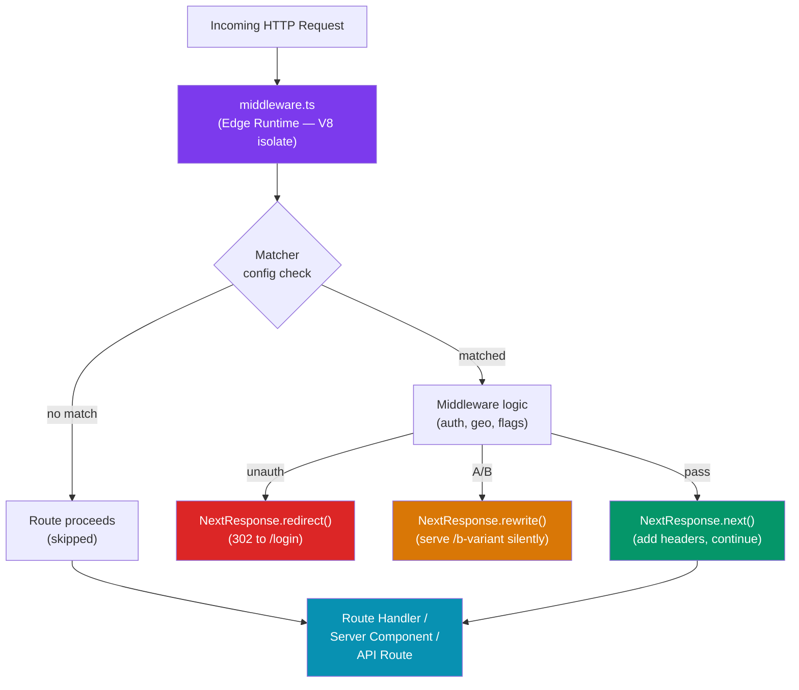

# Next.js Middleware

> [!abstract] TL;DR
> Next.js Middleware runs at the **Edge** — before a request reaches any route, Server Component, or API handler — making it the ideal place to rewrite URLs, redirect users, set response headers, and inspect cookies without a round-trip to the origin. A single `middleware.ts` file at the project root handles all matched routes, controlled by a `matcher` config or conditional logic. Common use cases: authentication (redirect unauthenticated users), A/B testing (rewrite to variant URLs), geolocation-based routing, and rate-limiting header injection. Middleware cannot access Node.js APIs — it runs in the Edge Runtime (V8 isolate).

## Intuition — analogy FIRST

Middleware is the building security desk that every visitor must pass before reaching any floor. The desk runs instantly (Edge Runtime — no building elevator needed), checks your badge (cookie/JWT), and either waves you through, redirects you to reception (login page), or re-routes you to a specific department (A/B test variant) — all before you even board the elevator. Individual floors (routes, Server Components) never need to implement their own security checks because the desk handles it universally.

---

## How It Works



---

## Key Concepts / Details

### Middleware File and Matcher Config

```ts
// middleware.ts — must be at the project root (next to app/ or pages/)
import { NextResponse } from 'next/server'
import type { NextRequest } from 'next/server'

export function middleware(request: NextRequest) {
  // request.nextUrl — mutable clone of the URL (for rewrites/redirects)
  // request.cookies — cookie accessors
  // request.headers — read-only headers
  // request.geo   — geolocation (Vercel only: city, country, region)
  // request.ip    — client IP (Vercel only)

  return NextResponse.next()  // pass through unchanged
}

// matcher config — controls which paths trigger middleware
// Without this, middleware runs on EVERY request including _next/static
export const config = {
  matcher: [
    // Match all paths except static files and Next.js internals
    '/((?!_next/static|_next/image|favicon.ico|.*\\.(?:svg|png|jpg|jpeg|gif|webp)$).*)',
  ],
}
```

### Authentication Middleware

```ts
// middleware.ts
import { NextResponse } from 'next/server'
import type { NextRequest } from 'next/server'
import { verifyJWT } from '@/lib/auth'   // Edge-compatible JWT verify (jose library)

const PROTECTED_PATHS = ['/dashboard', '/profile', '/settings']

export async function middleware(request: NextRequest) {
  const { pathname } = request.nextUrl

  // Only protect specific paths
  const isProtected = PROTECTED_PATHS.some((p) => pathname.startsWith(p))
  if (!isProtected) return NextResponse.next()

  const token = request.cookies.get('auth-token')?.value

  if (!token) {
    // Redirect to login, preserving the original destination
    const loginUrl = new URL('/login', request.url)
    loginUrl.searchParams.set('callbackUrl', pathname)
    return NextResponse.redirect(loginUrl)
  }

  try {
    const payload = await verifyJWT(token)
    // Forward user info to the route via a request header
    const requestHeaders = new Headers(request.headers)
    requestHeaders.set('x-user-id', payload.sub)
    requestHeaders.set('x-user-role', payload.role)

    return NextResponse.next({ request: { headers: requestHeaders } })
  } catch {
    // Invalid or expired token — clear cookie and redirect
    const response = NextResponse.redirect(new URL('/login', request.url))
    response.cookies.delete('auth-token')
    return response
  }
}

export const config = {
  matcher: ['/dashboard/:path*', '/profile/:path*', '/settings/:path*'],
}
```

```ts
// app/dashboard/page.tsx — reading the header set by middleware
import { headers } from 'next/headers'

export default function DashboardPage() {
  const headersList = headers()
  const userId = headersList.get('x-user-id')
  // userId is already verified — no re-checking in the component
  return <div>Welcome, user {userId}</div>
}
```

### A/B Testing with Rewrites

```ts
// middleware.ts
import { NextResponse } from 'next/server'
import type { NextRequest } from 'next/server'

export function middleware(request: NextRequest) {
  const { pathname } = request.nextUrl

  if (pathname === '/landing') {
    // Check for existing bucket cookie (sticky sessions)
    let bucket = request.cookies.get('ab-bucket')?.value

    if (!bucket) {
      // Assign user to variant A or B (50/50)
      bucket = Math.random() < 0.5 ? 'a' : 'b'
    }

    // Rewrite the URL — user sees /landing but gets /landing-a or /landing-b
    const url = request.nextUrl.clone()
    url.pathname = `/landing-${bucket}`
    const response = NextResponse.rewrite(url)

    // Persist bucket assignment for subsequent visits
    response.cookies.set('ab-bucket', bucket, {
      maxAge: 60 * 60 * 24 * 30,  // 30 days
      httpOnly: false,             // accessible to analytics scripts
    })
    return response
  }

  return NextResponse.next()
}
```

### Geolocation-Based Routing

```ts
// middleware.ts (Vercel deployment — geo is populated automatically)
import { NextResponse } from 'next/server'
import type { NextRequest } from 'next/server'

const COUNTRY_ROUTES: Record<string, string> = {
  GB: '/en-gb',
  DE: '/de',
  JP: '/ja',
}

export function middleware(request: NextRequest) {
  const country = request.geo?.country ?? 'US'

  // Only redirect on root path visit
  if (request.nextUrl.pathname === '/') {
    const targetLocale = COUNTRY_ROUTES[country]
    if (targetLocale) {
      return NextResponse.redirect(new URL(targetLocale, request.url))
    }
  }

  return NextResponse.next()
}
```

### Response Header Injection

```ts
// middleware.ts — add security headers globally
export function middleware(request: NextRequest) {
  const response = NextResponse.next()

  response.headers.set('X-Frame-Options', 'DENY')
  response.headers.set('X-Content-Type-Options', 'nosniff')
  response.headers.set('Referrer-Policy', 'strict-origin-when-cross-origin')
  response.headers.set(
    'Content-Security-Policy',
    "default-src 'self'; script-src 'self' 'unsafe-inline'"
  )

  return response
}
```

### Middleware vs Other Next.js Layers

| Layer | Where | Runtime | Can access DB? | Use for |
|-------|-------|---------|----------------|---------|
| Middleware | Before route | Edge (V8) | No | Auth, redirects, A/B, headers |
| Server Component | During render | Node.js | Yes | Data fetching, layout |
| Route Handler (`route.ts`) | API endpoint | Node.js | Yes | External API consumers |
| Server Action | During mutation | Node.js | Yes | Form mutations |
| `generateMetadata` | During render | Node.js | Yes | SEO metadata |

---

## Common Pitfalls

1. **Using Node.js APIs in Middleware**: The Edge Runtime has no `fs`, `crypto` (Node's), `process.env` access is limited, and no native Node modules. Use the Web Crypto API or Edge-compatible libraries (e.g., `jose` for JWT, not `jsonwebtoken`).
2. **Forgetting the matcher — running on all paths**: Without a `matcher`, middleware runs on every request including `_next/static` assets, causing noticeable performance overhead. Always add a matcher.
3. **Redirecting on every request**: Checking session validity on every API call in middleware (without caching the result) can add 10–50ms per request at the edge. Cache the verification result in a cookie or short-lived edge cache.
4. **`request.nextUrl` mutation side effects**: `request.nextUrl` is mutable but shared. Always `clone()` it before modifying: `const url = request.nextUrl.clone()`.
5. **Middleware running in production only on Vercel edge**: In `next dev`, middleware runs in a simulated edge environment. `request.geo` and `request.ip` are only populated in real Vercel deployments — test with the Vercel CLI locally.

---

## Related Concepts

- [[_MOC_NextJS|↑ Next.js Section MOC]]
- [[NextJS_App_Router]] — Route structure that middleware intercepts
- [[NextJS_Authentication_and_Deployment]] — Full auth patterns using Auth.js with middleware integration
- [[NextJS_i18n]] — Locale detection and routing often implemented in middleware

---

## Review Questions

1. What is the Edge Runtime and why does it exist? What are its limitations compared to the Node.js runtime?
2. Why must `request.nextUrl` be cloned before modification in a rewrite? What happens if you modify it directly?
3. A user navigates to `/dashboard` without a session. Trace the full middleware execution: what does the middleware check, what does it return, and what does the browser receive?
4. Explain the difference between `NextResponse.redirect()` and `NextResponse.rewrite()`. From the user's perspective, what is different?
5. Why is `jose` used for JWT verification in middleware instead of the `jsonwebtoken` npm package?

---

## Sources

- Next.js docs: Middleware — https://nextjs.org/docs/app/building-your-application/routing/middleware
- Next.js docs: Edge Runtime — https://nextjs.org/docs/app/building-your-application/rendering/edge-and-nodejs-runtimes
- Vercel docs: Edge Middleware — https://vercel.com/docs/functions/edge-middleware
- jose library (Edge JWT) — https://github.com/panva/jose

#NextJS #middleware #edge #authentication #routing #ab-testing #geolocation
