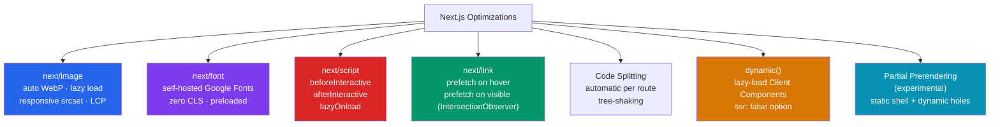

# Next.js Optimization

> [!abstract] TL;DR
> Next.js ships four built-in optimization primitives: `next/image` for automatic WebP conversion and responsive srcsets, `next/font` for zero-layout-shift font loading with self-hosted Google Fonts, `next/link` for prefetching on hover/visible, and `next/script` for controlled third-party script loading order. Code splitting is automatic per-route. `dynamic()` adds lazy loading for heavy client components. Partial Prerendering (PPR, experimental) lets a single route mix static shells with streamed dynamic holes.

## Intuition — analogy FIRST

Optimizing a Next.js app is like preparing a restaurant for a rush: `next/image` is the smart dishwasher that always serves plates in the right size for the table — no wasted large plates, no shrinking; `next/font` reserves the table layout before the menu arrives so guests aren't surprised by moving furniture; `next/script` decides which kitchen equipment arrives during setup (`beforeInteractive`), after the first course (`afterInteractive`), or between orders (`lazyOnload`). `next/link` is the waiter who starts carrying dishes to the table as soon as the order is placed, not when you ring the bell.

---

## How It Works



---

## Key Concepts / Details

### Image Optimization — `next/image`

```tsx
import Image from 'next/image';

// Remote image — must be whitelisted in next.config.js
export function HeroSection() {
  return (
    <Image
      src="https://images.unsplash.com/photo-abc"
      alt="Team working together"
      width={1200}          // intrinsic size (layout hints)
      height={600}
      priority              // LCP image — disable lazy load, preload it
      quality={85}          // 0-100 (default: 75)
      sizes="(max-width: 768px) 100vw, 50vw"  // responsive hints for srcset
    />
  );
}

// Local image — import for automatic width/height inference
import teamPhoto from '@/public/team.jpg';

export function TeamCard() {
  return (
    <Image
      src={teamPhoto}
      alt="Our team"
      placeholder="blur"    // blurred placeholder while loading (auto for local)
      className="rounded-lg"
    />
  );
}

// Fill mode — fills the container, use with position: relative parent
export function BackgroundImage() {
  return (
    <div className="relative h-64 w-full">
      <Image
        src="/hero.jpg"
        alt="Background"
        fill
        style={{ objectFit: 'cover' }}
        sizes="100vw"
      />
    </div>
  );
}
```

### Font Optimization — `next/font`

```tsx
// app/layout.tsx — zero layout shift, self-hosted
import { Inter, Roboto_Mono } from 'next/font/google';
import localFont from 'next/font/local';

// Google Font — downloaded and self-hosted at build time (no Google request at runtime)
const inter = Inter({
  subsets: ['latin'],
  display: 'swap',          // font-display: swap (shows system font while loading)
  variable: '--font-inter', // CSS variable for Tailwind integration
});

const robotoMono = Roboto_Mono({
  subsets: ['latin'],
  weight: ['400', '700'],
  variable: '--font-mono',
});

// Local font
const brandFont = localFont({
  src: [
    { path: '../fonts/Brand-Regular.woff2', weight: '400' },
    { path: '../fonts/Brand-Bold.woff2', weight: '700' },
  ],
  variable: '--font-brand',
});

export default function RootLayout({ children }: { children: React.ReactNode }) {
  return (
    // Apply CSS variables — use with Tailwind fontFamily config
    <html lang="en" className={`${inter.variable} ${robotoMono.variable} ${brandFont.variable}`}>
      <body className="font-sans">{children}</body>
    </html>
  );
}
```

### Script Optimization — `next/script`

```tsx
import Script from 'next/script';

export default function RootLayout({ children }: { children: React.ReactNode }) {
  return (
    <html>
      <body>
        {children}

        {/* beforeInteractive — injected into HTML before any Next.js JS
            Use for: polyfills, critical third-party scripts
            Warning: blocks hydration — use sparingly */}
        <Script src="/polyfills.js" strategy="beforeInteractive" />

        {/* afterInteractive (default) — loads after hydration
            Use for: analytics, tag managers */}
        <Script
          src="https://www.googletagmanager.com/gtag/js?id=GA-XXXXX"
          strategy="afterInteractive"
        />
        <Script id="gtag-init" strategy="afterInteractive">
          {`
            window.dataLayer = window.dataLayer || [];
            function gtag(){dataLayer.push(arguments);}
            gtag('js', new Date());
            gtag('config', 'GA-XXXXX');
          `}
        </Script>

        {/* lazyOnload — loads during idle time (requestIdleCallback)
            Use for: chat widgets, non-critical integrations */}
        <Script
          src="https://widget.intercom.io/widget/APP_ID"
          strategy="lazyOnload"
          onLoad={() => console.log('Intercom loaded')}
        />
      </body>
    </html>
  );
}
```

### Link Prefetching — `next/link`

```tsx
import Link from 'next/link';

// Automatic prefetching: when the link enters viewport → prefetch (production only)
// On hover → prefetch the route (also in dev with explicit prefetch={true})
export function Nav() {
  return (
    <nav>
      <Link href="/dashboard">Dashboard</Link>                  {/* prefetched on visible */}
      <Link href="/settings" prefetch={false}>Settings</Link>  {/* disable prefetch */}
      <Link href="/heavy-page" prefetch>Heavy Page</Link>      {/* force prefetch */}

      {/* External links — use regular <a> tag */}
      <a href="https://external.com" target="_blank" rel="noopener noreferrer">
        External
      </a>
    </nav>
  );
}
```

### Dynamic Imports — `dynamic()`

```tsx
import dynamic from 'next/dynamic';

// Lazy-load a heavy Client Component (code-split, loaded only when rendered)
const RichTextEditor = dynamic(() => import('@/components/RichTextEditor'), {
  loading: () => <Textarea placeholder="Loading editor..." />,
  ssr: false, // don't server-render — avoids SSR incompatibility issues
});

// Lazy-load a Server Component (less common but valid)
const HeavyChart = dynamic(() => import('@/components/HeavyChart'), {
  loading: () => <ChartSkeleton />,
});

export default function PostEditor() {
  return (
    <div>
      <h1>Create Post</h1>
      <RichTextEditor />  {/* loaded only when this page renders */}
    </div>
  );
}
```

### Bundle Analyzer

```bash
npm install @next/bundle-analyzer
```

```javascript
// next.config.js
const withBundleAnalyzer = require('@next/bundle-analyzer')({
  enabled: process.env.ANALYZE === 'true',
});

module.exports = withBundleAnalyzer({
  reactStrictMode: true,
});
```

```bash
ANALYZE=true next build   # opens treemap in browser showing bundle composition
```

### Middleware for Edge Optimization

```typescript
// middleware.ts — runs at the edge (Vercel Edge Network / CloudFlare Workers)
import { NextResponse } from 'next/server';
import type { NextRequest } from 'next/server';

export function middleware(request: NextRequest) {
  const { pathname } = request.nextUrl;

  // A/B testing — assign variant cookie deterministically
  const variant = request.cookies.get('ab-variant')?.value
    ?? (Math.random() > 0.5 ? 'b' : 'a');

  const response = NextResponse.next();
  response.cookies.set('ab-variant', variant, { maxAge: 60 * 60 * 24 * 7 });

  // Rewrite to variant-specific page without changing the URL
  if (variant === 'b' && pathname === '/landing') {
    return NextResponse.rewrite(new URL('/landing-b', request.url));
  }

  return response;
}

export const config = {
  matcher: ['/landing', '/dashboard/:path*'],
};
```

---

## Real-World Notes

- **`priority` on above-the-fold images** — the LCP element should always have `priority`. Without it, `next/image` lazy-loads it, which tanks your LCP score.
- **`next/font` eliminates Google Fonts network request** — fonts are downloaded at build time and served from your domain. This removes a render-blocking cross-origin request and improves privacy.
- **`sizes` prop is critical for responsive images** — without it, the browser always downloads the largest srcset variant. A correct `sizes` value reduces bandwidth significantly on mobile.
- **`ssr: false` in `dynamic()` for browser-only APIs** — components using `window`, `document`, or `localStorage` must be dynamically imported with `ssr: false` to avoid hydration errors.

---

## Common Pitfalls

1. **Missing `alt` on `next/image`** — required for accessibility and SEO. Empty string `alt=""` is valid for decorative images; never omit the prop.
2. **Not setting `width`/`height` or `fill` on `next/image`** — the component requires one or the other to prevent layout shift (CLS).
3. **Using `` instead of `next/image`** — loses all optimization (WebP conversion, responsive srcset, lazy loading). ESLint rule `@next/next/no-img-element` catches this.
4. **`strategy="beforeInteractive"` on non-critical scripts** — this blocks the main thread before React hydrates, harming TTI. Reserve it only for polyfills that must exist before JS runs.
5. **Importing dynamic components inside render** — `dynamic()` calls must be at module level, not inside the component function, or the component re-creates on every render.

---

## Related Concepts

- [[_MOC_NextJS|↑ Section MOC]]
- [[NextJS_Data_Fetching]] — Rendering strategy choices affect bundle size and TTFB
- [[React_Performance]] — React Profiler, memoization, and Web Vitals at the component level
- [[NextJS_Authentication_and_Deployment]] — Production build and deployment optimization

---

## Review Questions

1. What Core Web Vitals metric does `next/image`'s `priority` prop most directly improve?
2. How does `next/font` eliminate the need for Google Fonts CSS imports? What happens at build time?
3. What is the difference between `strategy="afterInteractive"` and `strategy="lazyOnload"` for third-party scripts?
4. When would you set `ssr: false` in a `dynamic()` import? Give a concrete example.
5. How does `next/link` prefetching work in production vs development?

---

## Sources

- Next.js docs: Image Optimization — https://nextjs.org/docs/app/building-your-application/optimizing/images
- Next.js docs: Font Optimization — https://nextjs.org/docs/app/building-your-application/optimizing/fonts
- Next.js docs: Script Optimization — https://nextjs.org/docs/app/building-your-application/optimizing/scripts
- Next.js docs: Lazy Loading — https://nextjs.org/docs/app/building-your-application/optimizing/lazy-loading

#NextJS #React #WebDevelopment #optimization #performance #WebVitals #images #fonts
