# Next.js Server Actions

> [!abstract] TL;DR
> Server Actions are async functions marked with `"use server"` that execute on the server but can be called directly from Client Components — eliminating the need for API routes for form mutations. They integrate with React's `<form action={serverAction}>` API, `useFormState` (to access action return values on the client), and `useFormStatus` (to track pending state inside a form). After mutation, `revalidatePath()` or `revalidateTag()` invalidates the Next.js cache so fresh data is fetched on next render. For instant perceived performance, pair with `useOptimistic`.

## Intuition — analogy FIRST

Traditional web development requires a relay race: the client hands a baton (form POST) to an API endpoint, which runs the logic and hands back a response, which the client then processes. Server Actions collapse the relay into a single runner — you call a function that looks local but executes on the server. There is no separate API route to define, no fetch call to write, no JSON serialization to manage. The framework handles the cross-boundary call invisibly, and the cache invalidation system refreshes your UI automatically after the mutation completes.

---

## How It Works

```mermaid
graph TD
    Form["<form action={createPost}>"]
    ClientComp["Client Component\nuseFormState / useFormStatus"]
    ServerAction["Server Action\n'use server'\nasync function createPost()"]
    DB["Database / External API"]
    Cache["Next.js Cache"]
    UI["Re-rendered UI\n(fresh data)"]

    Form -->|"POST (encoded form data)"| ServerAction
    ClientComp -->|"calls action directly"| ServerAction
    ServerAction -->|"write"| DB
    ServerAction -->|"revalidatePath / revalidateTag"| Cache
    Cache -->|"invalidated → re-fetch"| UI

    style Form fill:#0891b2,color:#fff
    style ServerAction fill:#7c3aed,color:#fff
    style DB fill:#059669,color:#fff
    style Cache fill:#d97706,color:#fff
    style UI fill:#2563eb,color:#fff
```



---

## Key Concepts / Details

### Defining and Using Server Actions

```ts
// app/actions/posts.ts
'use server'  // marks ALL exports in this file as Server Actions

import { revalidatePath, revalidateTag } from 'next/cache'
import { redirect } from 'next/navigation'
import { z } from 'zod'

const CreatePostSchema = z.object({
  title: z.string().min(1, 'Title required'),
  content: z.string().min(10, 'Content too short'),
})

// Server Action — runs on server, callable from client
export async function createPost(prevState: ActionState, formData: FormData) {
  // FormData is automatically provided when used as <form action>
  const raw = {
    title: formData.get('title'),
    content: formData.get('content'),
  }

  const parsed = CreatePostSchema.safeParse(raw)
  if (!parsed.success) {
    return { errors: parsed.error.flatten().fieldErrors, message: null }
  }

  try {
    await db.post.create({ data: parsed.data })
  } catch {
    return { errors: {}, message: 'Database error. Post not saved.' }
  }

  // Invalidate the cached page so the list shows the new post
  revalidatePath('/posts')
  // OR invalidate by tag: revalidateTag('posts')

  redirect('/posts')   // navigate after success
}

export type ActionState = {
  errors: Record<string, string[] | undefined>
  message: string | null
}
```

### useFormState — Access Action Return Value

```tsx
// app/posts/new/page.tsx (Client Component)
'use client'
import { useFormState } from 'react-dom'
import { useFormStatus } from 'react-dom'
import { createPost, type ActionState } from '@/app/actions/posts'

const initialState: ActionState = { errors: {}, message: null }

export default function NewPostForm() {
  // useFormState(action, initialState) → [state, formAction]
  const [state, formAction] = useFormState(createPost, initialState)

  return (
    <form action={formAction}>
      <div>
        <label htmlFor="title">Title</label>
        <input id="title" name="title" type="text" />
        {state.errors.title && (
          <p className="error">{state.errors.title[0]}</p>
        )}
      </div>
      <div>
        <label htmlFor="content">Content</label>
        <textarea id="content" name="content" />
        {state.errors.content && (
          <p className="error">{state.errors.content[0]}</p>
        )}
      </div>
      {state.message && <p className="error">{state.message}</p>}
      <SubmitButton />
    </form>
  )
}

// Separate component so useFormStatus works (must be inside the <form>)
function SubmitButton() {
  const { pending } = useFormStatus()  // tracks the enclosing form's submission
  return (
    <button type="submit" disabled={pending} aria-disabled={pending}>
      {pending ? 'Creating…' : 'Create Post'}
    </button>
  )
}
```

### Optimistic Updates with useOptimistic

```tsx
'use client'
import { useOptimistic } from 'react'
import { toggleLike } from '@/app/actions/posts'

interface Post { id: string; likes: number; likedByUser: boolean }

export function LikeButton({ post }: { post: Post }) {
  const [optimisticPost, addOptimistic] = useOptimistic(
    post,
    (currentPost, liked: boolean) => ({
      ...currentPost,
      likes: liked ? currentPost.likes + 1 : currentPost.likes - 1,
      likedByUser: liked,
    })
  )

  async function handleLike() {
    // Instantly update UI — no waiting for server
    addOptimistic(!optimisticPost.likedByUser)
    // Server action runs in background; reverts optimistic state if it throws
    await toggleLike(post.id)
  }

  return (
    <button onClick={handleLike} aria-pressed={optimisticPost.likedByUser}>
      {optimisticPost.likedByUser ? '❤️' : '🤍'} {optimisticPost.likes}
    </button>
  )
}
```

### Calling Server Actions Imperatively (Not Via Form)

```tsx
'use client'
import { deletePost } from '@/app/actions/posts'
import { useState } from 'react'

export function DeleteButton({ postId }: { postId: string }) {
  const [loading, setLoading] = useState(false)

  async function handleDelete() {
    setLoading(true)
    try {
      await deletePost(postId)   // direct function call — no fetch() needed
    } finally {
      setLoading(false)
    }
  }

  return (
    <button onClick={handleDelete} disabled={loading}>
      {loading ? 'Deleting…' : 'Delete'}
    </button>
  )
}
```

### revalidatePath vs revalidateTag

```ts
// revalidatePath: invalidate a specific URL path
revalidatePath('/posts')          // revalidate the /posts page
revalidatePath('/posts/[slug]', 'page')  // all dynamic [slug] pages

// revalidateTag: invalidate all cached fetches with a given tag
// Tagged at fetch time:
const posts = await fetch('/api/posts', { next: { tags: ['posts'] } })
// Invalidated after mutation:
revalidateTag('posts')  // all fetches tagged 'posts' are re-fetched next request
```

### Server Actions vs API Routes

| Concern | Server Actions | API Routes (`route.ts`) |
|---------|---------------|------------------------|
| Use case | Mutations from forms/Client Components | REST/JSON APIs for external clients |
| Auth | Use `auth()` from Auth.js in the action | Middleware or handler checks |
| Return type | Any serializable value (or `void`) | `Response` / `NextResponse` |
| Caching | `revalidatePath`/`revalidateTag` | `revalidateTag` or `cache-control` headers |
| Client call | Direct function import | `fetch('/api/...')` |
| Progressive enhancement | Yes — works without JS | No |
| External consumers | No — bundle-coupled | Yes — public HTTP endpoint |

---

## Common Pitfalls

1. **Calling Server Actions conditionally**: Server Actions cannot be called inside conditionals at the module level — only from event handlers or `<form action>`. Calling one inside `useEffect` is also an anti-pattern.
2. **Forgetting `'use server'` at the top**: Without the directive, the function runs on the client. Sensitive logic (database writes, API secrets) is exposed to the browser bundle.
3. **`useFormStatus` outside the form**: `useFormStatus` only tracks the nearest enclosing `<form>`. If your submit button is in a parent component, it will always report `pending: false`. The submit button must be a child component rendered inside the form.
4. **Returning non-serializable values**: Server Actions serialize return values across the server/client boundary. Returning class instances, `Date` objects, or `undefined` in unexpected places can cause silent bugs.
5. **Race conditions with optimistic updates**: `useOptimistic` reverts on error, but if two optimistic updates race, the revert may be out of order. Disable the button while an action is pending to prevent double-submission.

---

## Related Concepts

- [[_MOC_NextJS|↑ Next.js Section MOC]]
- [[NextJS_App_Router]] — Server vs Client Component model that makes Server Actions possible
- [[NextJS_Data_Fetching]] — `revalidatePath`/`revalidateTag` and the cache layer
- [[NextJS_Fullstack_Patterns]] — tRPC and other mutation patterns compared to Server Actions

---

## Review Questions

1. What is the difference between a Server Action and a Route Handler (`route.ts`)? When would you choose each?
2. Why must `useFormStatus` be in a child component of the `<form>`, not in the same component that renders the `<form>`?
3. Explain the difference between `revalidatePath('/posts')` and `revalidateTag('posts')`. When would you use each?
4. A Server Action makes a database write but the UI shows stale data after the action completes. What is missing?
5. What happens to `useOptimistic` state if the Server Action throws an error?

---

## Sources

- Next.js docs: Server Actions and Mutations — https://nextjs.org/docs/app/building-your-application/data-fetching/server-actions-and-mutations
- Next.js docs: Forms and Mutations — https://nextjs.org/docs/app/building-your-application/data-fetching/forms-and-mutations
- React docs: useFormStatus — https://react.dev/reference/react-dom/hooks/useFormStatus
- React docs: useOptimistic — https://react.dev/reference/react/useOptimistic

#NextJS #React #ServerActions #mutations #forms #useFormState #useFormStatus
