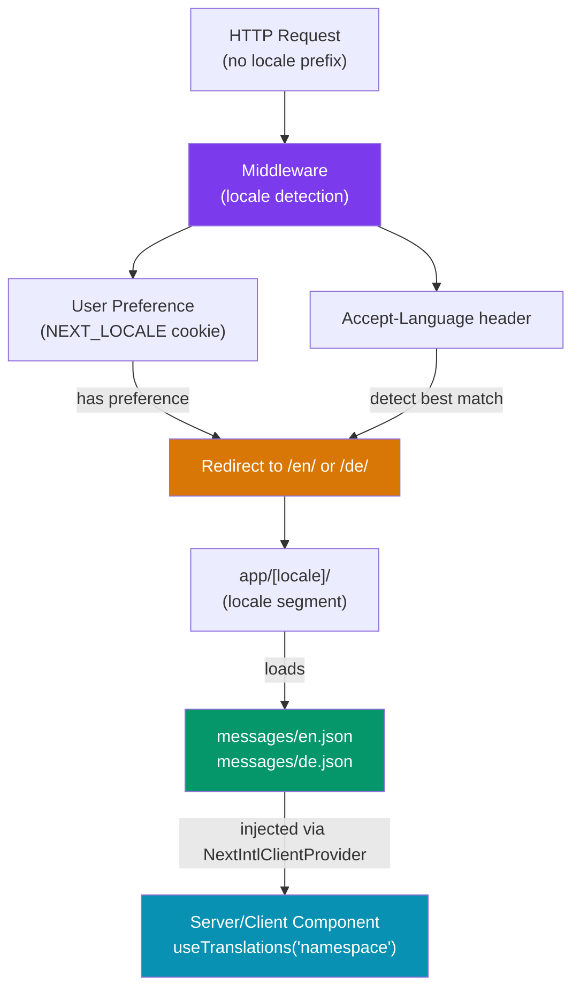

# Next.js Internationalization (i18n)

> [!abstract] TL;DR
> Next.js App Router has no built-in i18n routing (unlike Pages Router) — it delegates to libraries. **next-intl** is the community standard for App Router: it uses locale-prefixed URL segments (`/en/about`, `/de/about`), a Middleware-based locale detector, typed message catalogs, and ICU message format for pluralization/interpolation. **next-i18next** targets Pages Router. Key concerns: locale detection (Accept-Language header + cookie), message formatting, pluralization, number/date formatting, and RTL layout support. Zod-based message type inference eliminates runtime translation-key typos.

## Intuition — analogy FIRST

Internationalization is like publishing a book in multiple languages. The content (messages) lives in separate language editions (JSON catalogs). The router is the bookshelf — it organizes editions by language prefix (`/en/`, `/de/`). The locale detector is the librarian who looks at your library card (Accept-Language header) and hands you the right edition automatically. Message formatting is the typographer who handles pluralization ("1 item" vs "5 items"), date formats (MM/DD vs DD.MM.YYYY), and text direction (LTR vs RTL) correctly for each language.

---

## How It Works



---

## Key Concepts / Details

### next-intl Setup — App Router

```bash
npm install next-intl
```

```
app/
├── [locale]/                   ← all routes under locale prefix
│   ├── layout.tsx              ← provides NextIntlClientProvider
│   ├── page.tsx                ← /en, /de, /ja
│   └── about/
│       └── page.tsx            ← /en/about, /de/about
├── middleware.ts               ← locale detection + redirect
messages/
├── en.json
├── de.json
└── ja.json
next.config.js
```

### Message Catalogs

```json
// messages/en.json
{
  "home": {
    "title": "Welcome, {name}!",
    "subtitle": "You have {count, plural, =0 {no items} one {# item} other {# items}}.",
    "greeting": "Good {timeOfDay, select, morning {morning} afternoon {afternoon} other {day}}!"
  },
  "nav": {
    "home": "Home",
    "about": "About",
    "contact": "Contact"
  }
}
```

```json
// messages/de.json
{
  "home": {
    "title": "Willkommen, {name}!",
    "subtitle": "Sie haben {count, plural, =0 {keine Elemente} one {# Element} other {# Elemente}}.",
    "greeting": "Guten {timeOfDay, select, morning {Morgen} afternoon {Tag} other {Tag}}!"
  },
  "nav": {
    "home": "Startseite",
    "about": "Über uns",
    "contact": "Kontakt"
  }
}
```

### Middleware — Locale Detection

```ts
// middleware.ts
import createMiddleware from 'next-intl/middleware'

export default createMiddleware({
  locales: ['en', 'de', 'ja', 'ar'],  // supported locales
  defaultLocale: 'en',
  localePrefix: 'always',             // 'always' | 'as-needed' | 'never'
  // localeDetection: true (default) — uses Accept-Language header
})

export const config = {
  // Run on all paths except static files and Next.js internals
  matcher: ['/((?!_next|.*\\..*).*)'],
}
```

### next.config.js

```js
const withNextIntl = require('next-intl/plugin')(
  './i18n.ts'  // path to your request config
)

module.exports = withNextIntl({
  // other next config options
})
```

```ts
// i18n.ts — loads messages per request (Server Components)
import { getRequestConfig } from 'next-intl/server'

export default getRequestConfig(async ({ locale }) => ({
  messages: (await import(`./messages/${locale}.json`)).default,
}))
```

### Layout and Provider

```tsx
// app/[locale]/layout.tsx
import { NextIntlClientProvider } from 'next-intl'
import { getMessages } from 'next-intl/server'
import { notFound } from 'next/navigation'

const SUPPORTED_LOCALES = ['en', 'de', 'ja', 'ar']

export default async function LocaleLayout({
  children,
  params: { locale },
}: {
  children: React.ReactNode
  params: { locale: string }
}) {
  if (!SUPPORTED_LOCALES.includes(locale)) notFound()

  // Messages are loaded server-side and passed to the client provider
  const messages = await getMessages()

  return (
    <html
      lang={locale}
      dir={locale === 'ar' ? 'rtl' : 'ltr'}  // RTL support
    >
      <body>
        <NextIntlClientProvider messages={messages}>
          {children}
        </NextIntlClientProvider>
      </body>
    </html>
  )
}

// Generate static params for SSG
export function generateStaticParams() {
  return SUPPORTED_LOCALES.map((locale) => ({ locale }))
}
```

### Using Translations in Components

```tsx
// Server Component (no 'use client' needed)
import { useTranslations } from 'next-intl'

export default function HomePage() {
  const t = useTranslations('home')

  return (
    <main>
      {/* Simple interpolation */}
      <h1>{t('title', { name: 'Alice' })}</h1>

      {/* Pluralization via ICU format */}
      <p>{t('subtitle', { count: 3 })}</p>
      {/* Output: "You have 3 items." */}

      {/* Select format */}
      <p>{t('greeting', { timeOfDay: 'morning' })}</p>
    </main>
  )
}

// Client Component — same API
'use client'
import { useTranslations } from 'next-intl'

export function NavBar() {
  const t = useTranslations('nav')
  return (
    <nav>
      <a href="/">{t('home')}</a>
      <a href="/about">{t('about')}</a>
    </nav>
  )
}
```

### Number, Date, and Currency Formatting

```tsx
import { useFormatter, useNow, useTimeZone } from 'next-intl'

export function PriceTag({ amount }: { amount: number }) {
  const format = useFormatter()
  const now = useNow({ updateInterval: 1000 * 60 })  // updates every minute

  return (
    <div>
      {/* Currency — uses locale-appropriate formatting */}
      <p>{format.number(amount, { style: 'currency', currency: 'USD' })}</p>
      {/* en: $1,234.56 | de: 1.234,56 $ | ja: $1,234.56 */}

      {/* Relative time */}
      <p>{format.relativeTime(new Date('2025-01-01'), now)}</p>
      {/* en: "last year" | de: "letztes Jahr" */}

      {/* Date */}
      <p>{format.dateTime(new Date(), { dateStyle: 'long' })}</p>
      {/* en: "July 30, 2026" | de: "30. Juli 2026" */}
    </div>
  )
}
```

### Locale Switcher

```tsx
'use client'
import { useLocale } from 'next-intl'
import { useRouter, usePathname } from 'next/navigation'

const LOCALES = [
  { code: 'en', label: 'English' },
  { code: 'de', label: 'Deutsch' },
  { code: 'ja', label: '日本語' },
  { code: 'ar', label: 'العربية' },
]

export function LocaleSwitcher() {
  const locale = useLocale()
  const router = useRouter()
  const pathname = usePathname()

  function switchLocale(newLocale: string) {
    // Replace the current locale prefix in the path
    const newPath = pathname.replace(`/${locale}`, `/${newLocale}`)
    router.push(newPath)
    // Persist preference in cookie
    document.cookie = `NEXT_LOCALE=${newLocale}; path=/; max-age=31536000`
  }

  return (
    <select value={locale} onChange={(e) => switchLocale(e.target.value)}>
      {LOCALES.map(({ code, label }) => (
        <option key={code} value={code}>{label}</option>
      ))}
    </select>
  )
}
```

### RTL Support

```tsx
// app/[locale]/layout.tsx — dir attribute switches text direction
<html lang={locale} dir={['ar', 'he', 'fa'].includes(locale) ? 'rtl' : 'ltr'}>

// CSS — use logical properties for RTL-safe layouts
// ❌ Don't: margin-left, padding-right, text-align: left
// ✅ Do:    margin-inline-start, padding-inline-end, text-align: start
```

```css
/* Tailwind v3 — RTL variant */
.nav-item {
  @apply ms-4;  /* margin-inline-start — works for both LTR and RTL */
  @apply ps-2;  /* padding-inline-start */
}

/* Custom RTL overrides */
[dir="rtl"] .icon { transform: scaleX(-1); }
```

### next-intl vs next-i18next

| Feature | next-intl | next-i18next |
|---------|-----------|-------------|
| Router support | App Router (primary) | Pages Router |
| Server Components | Yes | No |
| Message format | ICU (powerful plurals) | i18next format |
| Type safety | Excellent (TS inference) | Good |
| Bundle | Server-rendered messages | Client bundle included |
| Locale detection | Middleware-based | Built-in middleware |
| Learning curve | Moderate | Low (if familiar with i18next) |

---

## Common Pitfalls

1. **Hardcoding locale in links**: `<a href="/about">` bypasses the locale prefix. Use `useRouter().push('/about')` from next-intl or the `Link` component with locale-aware `href` helpers.
2. **Missing `notFound()` for unsupported locales**: Without the locale validation check in `layout.tsx`, requests for `/xyz/page` (invalid locale) render with the default locale silently, causing SEO duplicate content issues.
3. **Using `useTranslations` in Server Components without `getMessages`**: Server Components can call `useTranslations` directly, but only if you've configured the `getRequestConfig` and the `withNextIntl` wrapper in `next.config.js`. Missing the plugin causes runtime errors.
4. **RTL forgetting `dir` on `<html>`**: Setting `dir` on a `<div>` is insufficient — screen readers and browser text-shaping algorithms read `dir` from `<html>`. Always set it on the root element.
5. **Stale translation keys after refactoring**: Renaming keys in the JSON catalog without updating all component usages causes silent fallbacks. Use next-intl's TypeScript inference or a linting plugin to catch mismatches at compile time.

---

## Related Concepts

- [[_MOC_NextJS|↑ Next.js Section MOC]]
- [[NextJS_Middleware]] — Locale detection and redirect logic lives in middleware
- [[NextJS_App_Router]] — The `[locale]` dynamic segment and layout hierarchy
- [[NextJS_Fullstack_Patterns]] — Previous coverage of next-intl integration patterns

---

## Review Questions

1. Why does the App Router require the `[locale]` directory segment approach rather than using `next.config.js` i18n config like the Pages Router?
2. What is ICU message format? Write the ICU syntax for "You have N unread messages" that handles 0, 1, and many correctly.
3. Trace the full request lifecycle for a user visiting `example.com/about` (no locale) for the first time with an `Accept-Language: de-DE` header. What does middleware do step by step?
4. Why must the `dir` attribute for RTL support be set on the `<html>` element rather than a wrapper `<div>`?
5. Explain the difference between `useTranslations` used in a Server Component vs a Client Component in a next-intl setup.

---

## Sources

- next-intl docs — https://next-intl-docs.vercel.app/
- Next.js docs: Internationalization — https://nextjs.org/docs/app/building-your-application/routing/internationalization
- ICU Message Format guide — https://unicode-org.github.io/icu/userguide/format_parse/messages/
- MDN: dir attribute — https://developer.mozilla.org/en-US/docs/Web/HTML/Global_attributes/dir

#NextJS #i18n #internationalization #next-intl #localization #RTL #pluralization
