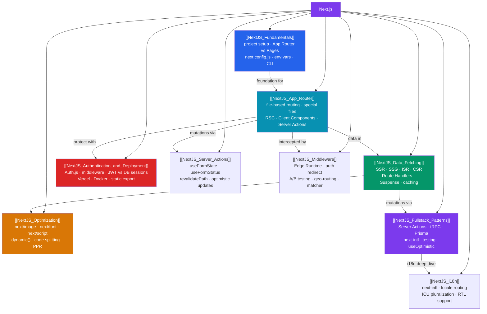

# Next.js — Map of Content

> [!abstract] What This Section Covers
> 9 notes covering Next.js App Router, rendering strategies, optimization, authentication, fullstack patterns, Server Actions, Edge Middleware, and internationalization. Next.js is the production-ready React framework that solves routing, rendering strategy (SSR/SSG/ISR/CSR), data fetching, and build-time optimization. This section covers the App Router (Next.js 13+) as the primary paradigm — from project setup through Server Actions (mutations without API routes), Edge Middleware (auth, A/B testing, geo-routing), and i18n with next-intl.

## Concept Map

## Learning Path

1. [[NextJS_Fundamentals]] — What Next.js is, project structure, App vs Pages Router, `next.config.js`, and CLI commands.
2. [[NextJS_App_Router]] — File-based routing, special files (`layout.tsx`, `loading.tsx`, `error.tsx`), Server vs Client Components, and Server Actions.
3. [[NextJS_Data_Fetching]] — The four rendering strategies (SSG/ISR/SSR/CSR), Route Handlers, Suspense streaming, and cache invalidation.
4. [[NextJS_Optimization]] — `next/image`, `next/font`, `next/script`, `dynamic()` lazy loading, and bundle analysis.
5. [[NextJS_Authentication_and_Deployment]] — Auth.js setup, route protection with middleware, Vercel zero-config deploy, and Docker standalone output.
6. [[NextJS_Fullstack_Patterns]] — Server Actions with form state, optimistic updates, tRPC, Prisma with Server Components, i18n, and E2E testing.
7. [[NextJS_Server_Actions]] — Deep dive: `"use server"`, `useFormState`/`useFormStatus`, `revalidatePath`/`revalidateTag`, optimistic updates with `useOptimistic`, Server Actions vs API routes.
8. [[NextJS_Middleware]] — Edge Runtime, `NextResponse.redirect`/`rewrite`, auth middleware, A/B testing, geolocation routing, matcher config, security headers.
9. [[NextJS_i18n]] — next-intl setup, locale-prefixed routing, ICU message format, pluralization, number/date formatting, RTL support, locale switcher.

## All Notes at a Glance

| Note | Difficulty | What You'll Learn |
|------|------------|-------------------|
| [[NextJS_Fundamentals]] | Intermediate | Framework overview, project structure, App vs Pages Router, env vars, CLI |
| [[NextJS_App_Router]] | Intermediate | File-based routing, special files, RSC vs Client Components, Server Actions |
| [[NextJS_Data_Fetching]] | Intermediate | SSG/ISR/SSR/CSR, Route Handlers, Suspense streaming, revalidation |
| [[NextJS_Optimization]] | Intermediate | next/image, next/font, next/script, dynamic imports, Middleware |
| [[NextJS_Authentication_and_Deployment]] | Advanced | Auth.js, JWT/DB sessions, middleware auth, Vercel, Docker, static export |
| [[NextJS_Fullstack_Patterns]] | Advanced | Server Actions, useOptimistic, tRPC, Prisma patterns, testing, i18n |
| [[NextJS_Server_Actions]] | Advanced | "use server", useFormState/useFormStatus, revalidatePath, optimistic updates |
| [[NextJS_Middleware]] | Advanced | Edge Runtime, auth redirect, A/B testing, geo-routing, matcher config |
| [[NextJS_i18n]] | Advanced | next-intl, locale routing, ICU pluralization, number/date format, RTL |

## Key Questions This Section Answers

- When should you use SSG vs ISR vs SSR vs CSR for a given route?
- What is the component composition rule between Server Components and Client Components?
- How does `next/image` improve Core Web Vitals vs a plain `` tag?
- How do you protect routes at the edge without a server-side check on every component?
- What is the end-to-end type safety benefit of tRPC over a REST API?
- How do Server Actions eliminate the need for API routes for form mutations?

## Related Sections

- [[_MOC_WebDev_Master|↑ Web Dev Master MOC]]
- [[_MOC_React|← React]] — React fundamentals, hooks, and state management that Next.js builds on
- [[Next_js]] — Overview note in the React section (entry point to App Router concepts)
- [[_MOC_TypeScript|← TypeScript]] — Next.js is TypeScript-first; generics and utility types used throughout

#MOC #WebDevelopment #NextJS #React
