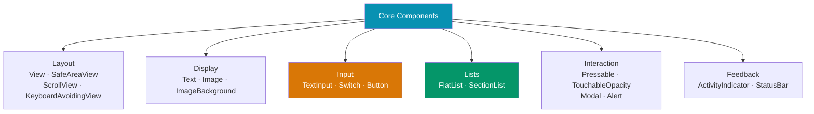

# React Native Core Components

> [!abstract] TL;DR
> React Native's core components map directly to native iOS/Android views. `View` is the flex container (like `<div>`), `Text` is mandatory for all text, `Image` handles local and remote assets, `TextInput` manages keyboard input, `ScrollView` renders all children at once while `FlatList` virtualizes long lists. For press handling, prefer `Pressable` over the deprecated `TouchableOpacity`. `SafeAreaView` handles notches and home indicators. Every component accepts a `style` prop but no CSS classes.

## Component Reference



## Key Components

### View — The Flex Container

`View` renders as `UIView` on iOS and `android.view.View` on Android. It's a flex container by default (column direction).

```typescript
import { View, StyleSheet } from 'react-native';

// Views are flex containers — column direction by default
function Card({ children }: { children: React.ReactNode }) {
  return <View style={styles.card}>{children}</View>;
}

const styles = StyleSheet.create({
  card: {
    backgroundColor: '#fff',
    borderRadius: 8,
    padding: 16,
    margin: 8,
    // iOS shadow
    shadowColor: '#000',
    shadowOffset: { width: 0, height: 2 },
    shadowOpacity: 0.1,
    shadowRadius: 4,
    // Android shadow
    elevation: 3,
  },
});
```

### Text — All Text Must Be Wrapped

Any string rendered outside `<Text>` causes a runtime error. `Text` components can be nested for mixed styling.

```typescript
import { Text, StyleSheet } from 'react-native';

function Article() {
  return (
    <Text style={styles.body}>
      This is{' '}
      <Text style={styles.bold}>bold</Text>
      {' '}and this is{' '}
      <Text style={styles.italic}>italic</Text>.
    </Text>
  );
}

const styles = StyleSheet.create({
  body: { fontSize: 16, lineHeight: 24, color: '#333' },
  bold: { fontWeight: '700' },
  italic: { fontStyle: 'italic', color: '#666' },
});
```

### Image — Local and Remote

```typescript
import { Image, StyleSheet } from 'react-native';

function Avatar({ uri }: { uri: string }) {
  return (
    <>
      {/* Local asset — size inferred from file */}
      <Image source={require('./assets/logo.png')} style={styles.logo} />

      {/* Remote — must specify dimensions */}
      <Image
        source={{ uri }}
        style={styles.avatar}
        resizeMode="cover"         // cover | contain | stretch | center
        defaultSource={require('./assets/placeholder.png')}
        onError={({ nativeEvent }) => console.log(nativeEvent.error)}
      />
    </>
  );
}

const styles = StyleSheet.create({
  logo: { width: 100, height: 40 },
  avatar: { width: 64, height: 64, borderRadius: 32 },
});
```

### TextInput — Keyboard Input

```typescript
import { useState } from 'react';
import { TextInput, View, Text, StyleSheet } from 'react-native';

function LoginForm() {
  const [email, setEmail] = useState('');
  const [password, setPassword] = useState('');

  return (
    <View>
      <TextInput
        style={styles.input}
        placeholder="Email"
        placeholderTextColor="#999"
        keyboardType="email-address"   // email-address | numeric | phone-pad | url
        autoCapitalize="none"
        autoCorrect={false}
        value={email}
        onChangeText={setEmail}        // called on every keystroke
        returnKeyType="next"
        onSubmitEditing={() => {/* focus next field */}}
      />
      <TextInput
        style={styles.input}
        placeholder="Password"
        secureTextEntry              // hides text, disables autocomplete
        value={password}
        onChangeText={setPassword}
        returnKeyType="done"
      />
    </View>
  );
}

const styles = StyleSheet.create({
  input: {
    height: 48,
    borderWidth: 1,
    borderColor: '#ddd',
    borderRadius: 8,
    paddingHorizontal: 12,
    marginBottom: 12,
    fontSize: 16,
  },
});
```

### ScrollView vs FlatList vs SectionList

| Component | Renders | Use When |
|-----------|---------|----------|
| `ScrollView` | All children at once | Small fixed lists, forms, mixed content |
| `FlatList` | Only visible items (virtualized) | Long homogeneous lists (>20 items) |
| `SectionList` | Virtualized with section headers | Contacts, grouped data |

```typescript
import { FlatList, SectionList, Text, View, StyleSheet } from 'react-native';

interface Item {
  id: string;
  title: string;
}

// FlatList — virtualized, best for long lists
function ItemList({ items }: { items: Item[] }) {
  return (
    <FlatList
      data={items}
      keyExtractor={(item) => item.id}    // required for efficient re-renders
      renderItem={({ item, index }) => (
        <View style={styles.row}>
          <Text>{item.title}</Text>
        </View>
      )}
      // Performance props
      windowSize={5}                      // render 2 viewports above/below visible area
      initialNumToRender={10}
      maxToRenderPerBatch={10}
      removeClippedSubviews               // unmount off-screen views (Android)
      getItemLayout={(_, index) => ({     // skip layout measurement if rows are fixed height
        length: 60, offset: 60 * index, index,
      })}
      // UX props
      ListEmptyComponent={<Text style={styles.empty}>No items</Text>}
      ListHeaderComponent={<Text style={styles.header}>Results</Text>}
      onEndReached={() => {/* load more */}}
      onEndReachedThreshold={0.3}         // trigger at 30% from bottom
      refreshing={false}
      onRefresh={() => {/* pull to refresh */}}
    />
  );
}

// SectionList — for grouped data
const sections = [
  { title: 'A', data: [{ id: '1', name: 'Alice' }] },
  { title: 'B', data: [{ id: '2', name: 'Bob' }] },
];

function ContactList() {
  return (
    <SectionList
      sections={sections}
      keyExtractor={(item) => item.id}
      renderItem={({ item }) => <Text>{item.name}</Text>}
      renderSectionHeader={({ section: { title } }) => (
        <Text style={styles.sectionHeader}>{title}</Text>
      )}
    />
  );
}

const styles = StyleSheet.create({
  row: { height: 60, justifyContent: 'center', paddingHorizontal: 16 },
  empty: { textAlign: 'center', padding: 32, color: '#999' },
  header: { fontSize: 18, fontWeight: '700', padding: 16 },
  sectionHeader: { backgroundColor: '#f5f5f5', paddingHorizontal: 16, paddingVertical: 4 },
});
```

### Pressable — Modern Press Handling

```typescript
import { Pressable, Text, StyleSheet } from 'react-native';

function Button({ label, onPress }: { label: string; onPress: () => void }) {
  return (
    <Pressable
      onPress={onPress}
      onLongPress={() => console.log('long press')}
      // Receives pressed state for visual feedback
      style={({ pressed }) => [
        styles.button,
        pressed && styles.buttonPressed,   // darken while pressed
      ]}
      // Android ripple effect
      android_ripple={{ color: 'rgba(255,255,255,0.3)', borderless: false }}
      hitSlop={8}    // expand touch target by 8pt on all sides
    >
      {({ pressed }) => (
        <Text style={[styles.label, pressed && styles.labelPressed]}>
          {label}
        </Text>
      )}
    </Pressable>
  );
}

const styles = StyleSheet.create({
  button: {
    backgroundColor: '#6366f1',
    paddingVertical: 12,
    paddingHorizontal: 24,
    borderRadius: 8,
    alignItems: 'center',
  },
  buttonPressed: { backgroundColor: '#4f46e5', transform: [{ scale: 0.97 }] },
  label: { color: '#fff', fontSize: 16, fontWeight: '600' },
  labelPressed: { opacity: 0.9 },
});
```

### Modal and SafeAreaView

```typescript
import { useState } from 'react';
import { Modal, SafeAreaView, View, Text, Pressable, StyleSheet } from 'react-native';

function ConfirmDialog({ visible, onConfirm, onCancel }: {
  visible: boolean;
  onConfirm: () => void;
  onCancel: () => void;
}) {
  return (
    <Modal
      visible={visible}
      transparent           // renders over existing content
      animationType="fade"  // none | slide | fade
      onRequestClose={onCancel}   // Android back button
    >
      <View style={styles.overlay}>
        <View style={styles.dialog}>
          <Text style={styles.title}>Confirm action?</Text>
          <View style={styles.actions}>
            <Pressable onPress={onCancel} style={styles.cancelBtn}>
              <Text>Cancel</Text>
            </Pressable>
            <Pressable onPress={onConfirm} style={styles.confirmBtn}>
              <Text style={{ color: '#fff' }}>Confirm</Text>
            </Pressable>
          </View>
        </View>
      </View>
    </Modal>
  );
}

// SafeAreaView — avoids notch, Dynamic Island, home indicator
function Screen({ children }: { children: React.ReactNode }) {
  return (
    <SafeAreaView style={styles.safe}>
      {children}
    </SafeAreaView>
  );
}

const styles = StyleSheet.create({
  safe: { flex: 1, backgroundColor: '#fff' },
  overlay: { flex: 1, backgroundColor: 'rgba(0,0,0,0.5)', justifyContent: 'center', alignItems: 'center' },
  dialog: { backgroundColor: '#fff', borderRadius: 12, padding: 24, width: '80%' },
  title: { fontSize: 18, fontWeight: '600', marginBottom: 16 },
  actions: { flexDirection: 'row', justifyContent: 'flex-end', gap: 12 },
  cancelBtn: { paddingVertical: 8, paddingHorizontal: 16 },
  confirmBtn: { backgroundColor: '#6366f1', paddingVertical: 8, paddingHorizontal: 16, borderRadius: 6 },
});
```

## Real-World Notes

- **`FlatList` over `ScrollView` for any list that can grow** — `ScrollView` renders all items eagerly; 100 rows means 100 native views instantiated. `FlatList` renders only ~15 at a time.
- **`keyExtractor` must return a unique stable string** — using array index causes incorrect animation and re-render behavior when items are added/removed.
- **`Pressable` is the current standard** — `TouchableOpacity`, `TouchableHighlight`, `TouchableNativeFeedback` are legacy. `Pressable` supports `android_ripple` and exposes pressed state.
- **`SafeAreaView` must wrap the root screen** — without it, content slides under the iPhone notch/Dynamic Island or the Android status bar.

## Common Pitfalls

- **Bare strings in JSX** — `<View>Hello</View>` throws at runtime. Always wrap: `<View><Text>Hello</Text></View>`.
- **Missing `key` or `keyExtractor` in lists** — React requires a unique stable key per list item for efficient reconciliation. Never use the array index for dynamic lists.
- **`ScrollView` + `FlatList` nesting** — `FlatList` inside `ScrollView` disables FlatList's virtualization because the parent scroll view constrains height measurement. Use `FlatList` as the outer scroll container with `ListHeaderComponent` instead.
- **Not handling `ActivityIndicator` color on Android** — the default color is transparent on some Android versions. Always set `color` prop explicitly.

## Review Questions

1. Why should you use `FlatList` instead of `ScrollView` for a list of 100+ items? What is virtualization?
2. What does `keyExtractor` do and why is using the array index a bad choice?
3. What is the difference between `Pressable` and `TouchableOpacity`? Why is `Pressable` preferred?
4. When would you use `SectionList` instead of `FlatList`?
5. What does `SafeAreaView` protect against? What happens if you omit it on iPhone 14?

## Sources

- React Native docs: Core components — https://reactnative.dev/docs/components-and-apis
- React Native docs: FlatList — https://reactnative.dev/docs/flatlist
- React Native docs: Pressable — https://reactnative.dev/docs/pressable

#ReactNative #React #Mobile #Components
